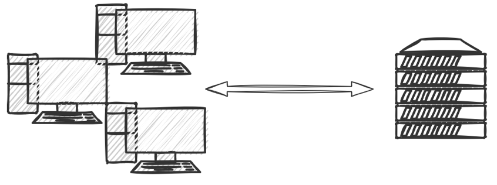
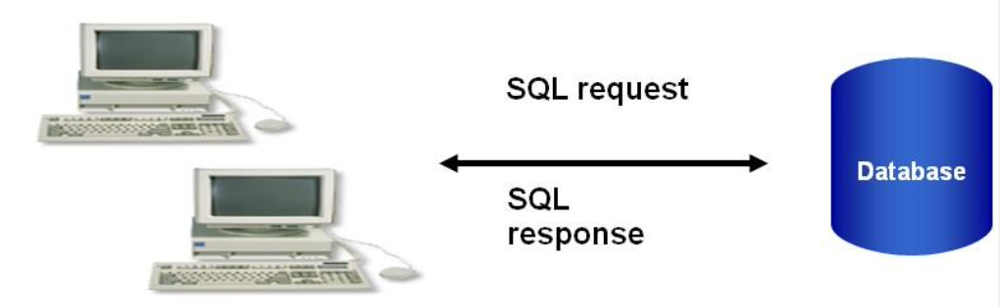
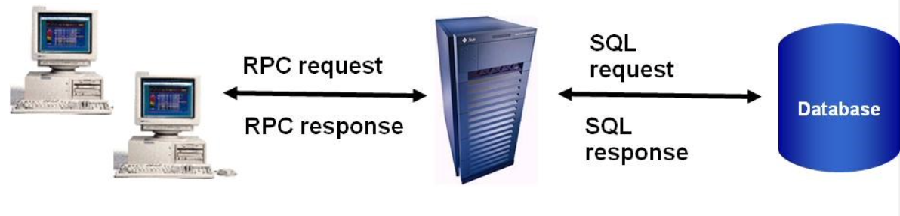
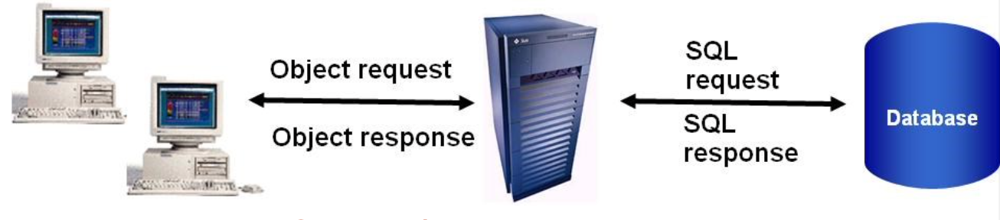
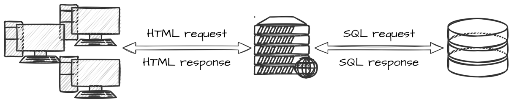
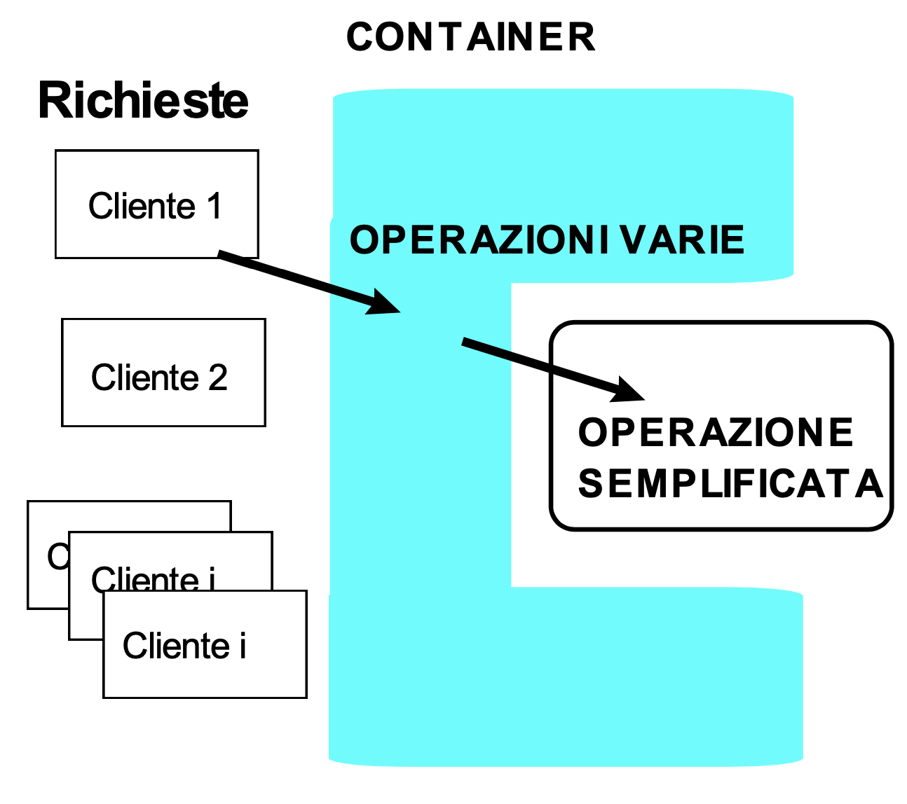
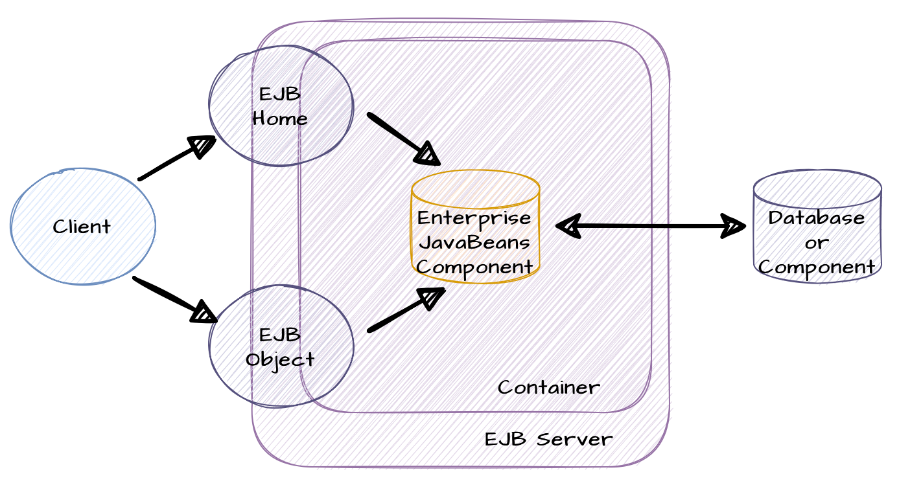
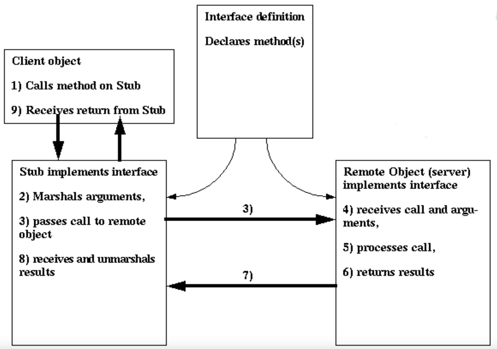
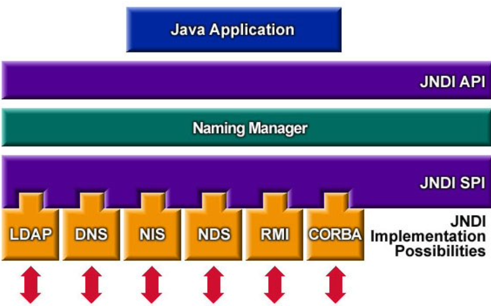

# Sistemi Distribuiti M - 2021/2022

Corso tenuto dal _Prof. Foschini_

## 01.Modelli

Nella vita professione, è molto difficile che si scriva un software da zero per diversi motivi:
- Un'azienda/cliente sta già usando determinate tecnologie e non vuole cambiarle;
- Si vuole interoperare fra diversi ambienti (anche _legacy_);
- Il tempo di sviluppo è molto limitato e ci sono vincoli nella consegna dell'applicazione finale.

Per questo motivo è fondamentale usare un approccio basato su componenti e il trand attuale si sposta verso questo tipo di soluzione.

### Componente

Un componente è un _pezzo di software_ che viene scritto dallo sviluppatore ed ha le seguenti caratteristiche:

- Contiene stato, metodi etc. ma espone verso l'esterno solo quei metodi che si decidono che siano visibili all'esterno grazie all'uso di un'interfaccia;
- Viene eseguito all'interno di un ambiente di esecuzione detto _container_/_engine_/_middleware_.

Esempi di componenti sono quelli che si usano per creare le interfacce grafiche con **JavaFX**: _textBox_, _label_, _comboBox_ etc. Quando si clicca su un bottone non si verifica se effettivamente il _mouse_ è sopra al tasto e lo si schiaccia ma si scrive solo il codice che deve essere eseguito se quel determinato evento si verifica.

Tuttavia, il componente del distribuito assume un concetto più ampio rispetto a quello del concentrato:

- **Componente nel concentrato**: un componente che fa parte di un'applicazione che viene messa in esecuzione su una **sola** macchina;
- **Componente nel distribuito**: un concetto più ampio rispetto a quello del concentrato. Il componente non è vincolato a trovarsi su una sola macchina proprio per la definizione intrinseca di sistema distribuito. E' possibile spostarlo in qualsiasi momento da un nodo ad un altro. Per questo motivo il componente nel concentrato viene visto come se appartenesse ad un'applicazione "monolitica".

Il corso si focalizza sui sistemi distribuiti quindi verranno trattati i componenti del secondo punto.

#### Differenza tra un componente ed un oggetto

A questo punto ci si domanda che differenza c'è tra un componente ed un oggetto perchè sembrano molto simili tra di loro:

- **Uguale all'oggetto**: mantiene dettagli di come è implementato: stato, metodi etc ed espone solo alcuni dei suoi dettagli tramite l'interfaccia;
- **Diverso dall'oggetto**:
    - Il componente viene eseguito all'interno di un _container_/_engine_/_middleware_ altrimenti non verrebbe eseguita la _funzione di callback_. Se si eseguisse il codice di un componente su una qualsiasi JVM non funzionerebbe. Riprendendo l'esempio di prima: chi è che controlla che effettivamente il mouse è posizionato sopra al bottone? Nessuno quindi il codice non potrebbe funzionare;
    - Il componente è di dimensioni più grande di un oggetto  in termini di codice, perchè il costo di overhead tra un'interazione e l'altra è maggiore. Si ipotizzi che due componenti A e B interagiscano tra di loro. A per comunicare con B deve instaurare una connessione, scambiare i dati e alla fine chiuderla. Nel concentrato, invece, gli oggetti anche se sono piccoli e interagiscono spesso fra di loro non hanno questo problema di overhead. Ovviamente bisogna stare attenti a creare un componente non troppo grande per evitare di andare incontro a tutti quei problemi affrontati durante il corso di Ingegneria del Software T (riusabilità etc).

### Modelli

Ogni problema presenta una soluzione diversa. Per capire meglio come risolverli è importante capire il funzionamento dei modelli.
I modelli che possono essere usati sono ad esempio:

- **Statici/dinamici**: sicuramente un sistema dinamico consente di adeguarsi a fronte di variazioni mentre un sistema statico no;
- **Preventivi/reattivi**: un sistema preventivo è più costoso di un sistema reattivo perchè non è detto che un evento si verifichi. Ad esempio, i sistemi operativi non utilizzano sistemi preventivi. Se avviene un deadlock tra processi lo si sblocca dall’esterno tramite linea di comando.

E' meglio una soluzione statica o dinamica? Meglio una soluzione preventiva o reattiva? La risposta in generale che deve fornire un ingegnere è sempre: _dipende_. Ogni problema ha una storia diversa. Questo perchè **non** esistono formule precise nei sistemi distribuiti dato che ci sono troppi parametri da prendere in considerazione: famiglia del processore, sistema operativo, linguaggio di programmazione etc.

### Deployment

Nei sistemi distribuiti si è interessati alle performance e ad eventuali colli di bottiglia. Per poterli evitare è necessario osservare le performance dell'applicazione e solo in seguito si capisce che cosa andare a modificare. Ad esempio, aprire troppe connessioni con un DB può introdurre un potenziale _bottleneck_.

Le modifiche non si effettuano sul codice stesso ma attraverso l'operazione di _deployment_ (dispiegamento). Ad esempio, installare tutte le librerie necessarie che servono all'applicazione, copiare i file che devono essere locali all’applicazione, distribuire i componenti su uno o più nodi e mettere davanti un bilanciatore di carico etc.
Quando faccio _deployment_ occorre decidere dove fare eseguire il componente e quali risorse ha bisogno per funzionare correttamente. Ad esempio, quando devo fare una Web App, ho un file che descrive queste scelte.

Ci sono diversi approcci per effettuare il deployment:
- **Manuale**: l’utente determina ogni singolo oggetto/componente su quale è il nodo più appropriato;
- **File Script**: si devono eseguire alcuni file di script che racchiudono la sequenza dei comandi per arrivare alla configurazione che presenta le dipendenze;
- **Linguaggi dichiarativi**: supporto automatico alla configurazione attraverso linguaggi dichiarativi o modelli di funzionamento della configurazione da ottenere. Ad esempio, tramite il _file di deployment_ e annotazioni.

### Architetture applicazioni Enterprise

Le architetture si sono evolute sempre di più verso architetture N-tier perchè l'obiettivo è quello di separare logicamente le funzionalità in modo da ridurre la complessità degli strati:

- **Single-Tier**: c'è un singolo super calcolatore a cui sono connessi i clienti perchè quest'ultimi non hanno abbastanza risorse per fare elaborazione. I clienti (o meglio terminali) inviano solo le richieste al mainfraime. E' la soluzione adottata negli anni '50.
    
    - **Vantaggi**: nessuna gestione client-side e consistenza dei dati perchè tutti i dati sono solo sul calcolatore;
    - **Svantaggi**: no scalabilità.

- **Two-Tier**: i clienti interagiscono con il DB, inviano query SQL e ricevono dati raw. La logica di presentazione, di business e di processamento del modello dei dati si trova tutta nell’applicazione cliente. Per questo motivo il cliente viene detto _fat_.

    - **Vantaggi**: indipendenza dallo specifico DB (rispetto a single-tier);
    - **Svantaggi**: sono molteplici:
        - difficoltà di aggiornamento, maintenance e riutilizzo di codice perchè tutto si trova installato sul lato cliente;
        - Raw data trasferiti verso il cliente (responsabile del loro processamento) e ciò produce overhead di rete perchè possono essere anche molti i dati;
        - Connessione al DB per ogni cliente e questo ha un forte impatto perchè i DB relazionali non sono scalabili.

- **Three-Tier**: ci sono diversi modelli:
    - Three Tier (basato su RPC): logica di business e modello dati separati dalla logica di presentazione
    
        - **Vantaggi**: logica di business modificabile in modo più flessibile;
        - **Svantaggi**:
            - Accoppiamento stretto fra clienti e middle-tier server perchè basato su RPC.
    - Three Tier (basato su Remote Object):
    
        - **Vantaggi**: meno strettamente accoppiato del modello di RPC
        - **Svantaggi**:
    - Three Tier (Web Server): si ha un browser per il livello presentazione mentre la logica di business e modello dei dati gestiti sono gestite tramite tecnologie come CGI, Servlet/JSP, ASP etc.
    
        - **Vantaggi**: cliente disponibile ovunque
        - **Svantaggi**:

### J2EE

E' un insieme di specifiche le cui implementazioni vengono principalmente sviluppate in linguaggio di programmazione Java e ampiamente utilizzata nella programmazione Web. Viene scritta solo la specifica non l’implementazione, diversi produttori di software hanno fatto diverse implementazioni; purché siano JEE compliant basta che rispettino la specifica. Alcune implementazioni si limitano alla specifica altre aggiungono funzionalità.

Esistono diversi _software open source_, che vengono spesso usati anche in ambiente di produzione come:
- **GlassFish**: è l'implementazione di riferimento mantenuta da Oracle;
- **WildFly**: precedentemente noto come JBoss.

### Modelli a contenimento

Sono modelli che si basano sull'uso di un _container/engine/middleware_ (parte azzurra) che forniscono "automaticamente" molte delle funzioni per supportare il servizio applicativo verso l’utente togliendo l'onere al programmatore. Ad esempio, la gestione della concorrenza.



Le chiamate dei clienti sono intercettate dal _container/engine/middleware_ prima che questo le "deleghi" ai componenti veri e propri.

---

## 02.EJB 2.x

E' una tecnologia a componenti lato _server-side_ che consente di creare applicazioni distribuite che siano multi-tier, 
transazionali, portabili, scalabili, sicure, etc.

EJB è stata una delle prime tecnologie a componenti e al giorno d'oggi, sebbene c'è ne siano molte altre, non è da considerarsi completamente in disuso.

### Principi di design

I principi che sono alla base di questa tecnologia sono i seguenti:

- Le applicazioni EJB e i loro componenti devono essere debolmente accoppiati (_loosely coupled_). Ad esempio, se si hanno due componenti A e B, A deve chiamare un metodo di B non molte volte. Questo perchè nel distribuito si paga un costo di _overhead_ piuttosto alto. Dall'altra parte, i componenti devono essere portabili da un'applicazione altra, quindi bisogna stare attenti a come si scrive il software altrimenti diventa difficile ricostruire le sue dipendenze quando si decide di usare quel codice in un altro progetto;
- Il comportamento dei componenti EJB è definito tramite interfacce. Questo concetto non è assolutamente nuovo perchè basti pensare alla normale programmazione ad oggetti;
- Lo sviluppatore **non** deve pensare a come gestire le risorse. Ci pensa tutto il container;
- Le applicazioni EJB sono N-tier.

### EJB container

Come è stato detto in precedenza, lo sviluppatore si occupa solo di scrivere la logica di business mentre il container si occupa di: 

- Generare automaticamente le classi concrete delle interfaccia EJBHome e EJBObject;
- Effettuare il _binding_ dell’oggetto Home presso il
servizio di naming;
- Persistenza;
- Transazionalità;
- Gestione _lifecycle_ componenti;
- _Connection pooling_;
- _Threading_;
- Sicurezza.

### Tipologie di componenti Bean

I componenti possono essere classificati in due categorie:

- **Sincroni**: l'utente si blocca e aspetta la risposta da parte del _server_. Si classificano ulteriormente in:
    - **Session Bean**: a sua volta esistono due tipi di Session Bean:
        - **Stateful**;
        - **Stateless**;
    - **Entity Bean**: a sua volta esistono due tipi di Entity Bean:
        - **Container Managed Persistence (CMP)**;
        - **Bean Managed Persistence (BMP)**.
- **Asincroni**: l'utente non si blocca e non aspetta la risposta. Esiste un solo tipo di componente che fa parte di questa categoria:
    - **Message Driven Bean**.

### Session Bean

Un Session Bean ha le seguenti caratteristiche:

- Viene usato quando bisogna effettuare calcoli computazionali;
- Ogni cliente ha un'istanza logica dedicata: se un cliente fa due interazioni in momenti diversi con il server, non è detto che abbia la stessa istanza fisica ma viene garantito lo stesso il corretto funzionamento;
- _Short-lived_: la vita del Bean è pari alla vita del cliente o al massimo alla durata della sessione;
- Transient;
- No _fault-tollerant_: lo stato non sopravvive a crash da parte del server;
- Può avere proprietà transazionali: dipende se il codice fa accesso a un database oppure no;
- Implementa l’interfaccia _javax.ejb.SessionBean_.

I Session Bean che esistono sono di due tipi:

- **Stateless**: il componente è privo di stato. Ad esempio, quando un'azione deve essere idempotente;
- **Statefull**: il componente è con stato. Ad esempio, quando si aggiungono i prodotti in un carrello di un sito e-commerce.

### Entity Bean

Un Entity Bean ha le seguenti caratteristiche:

- Rappresenta dati che sono memorizzati in un DB;
- L'stanza è condivisa fra clienti diversi: bisogna immaginare le istanze come una sorta di cache ad oggetti;
- Long-lived: la vita del Bean è pari a quella dei dati nel database;
- Persistente;
- Fault-tollerant: il componente sopravvive a crash del server, quindi, se i campi sono cambiati, si può effettuare lo stesso l'allineamento con il db;
- Sempre transazionale;
- implementa l’interfaccia _javax.ejb.EntityBean_.

Gli Entity Bean che esistono sono di due tipi:

- **Container Managed Persistence (CMP)**: persistenza gestita completamente dal container. I requisiti di persistenza specificati interamente nel descrittore di deployment;
- **Bean Managed Persistence (BMP)**: è responsabilità dello sviluppatore la gestione della persistenza. Di conseguenza, il codice diventa molto più complesso.

### Message Driven Bean

Questo Bean verrà approfondito in un capitolo a parte.

### Architettura

L'immagine di seguito riportata, fa riferimento ad un'architettura three-tier: c'è un cliente, un server e un database.



È bene ricordare che la macchina server non è "pura" perché è necessario installarci sopra anche un container per far girare l'applicazione costituita da componenti.

Sul'EJB Container non si troveranno solo le istanze che il programmatore ha scritto ma anche altri due oggetti che vengono automaticamente generati:

- **Oggetto EJB Home**: implementa l’interfaccia EJBHome. È un _proxy_ che intercetta la chiamata del cliente (la prima volta) e decide quale istanza logica gli deve restituire (una già creata, nuova etc.);
- **Oggetto EJB Object**: implementa l’interfaccia EJBObject. È un _proxy_ che ha la stessa interfaccia del componente EJB creato dallo sviluppatore. Quando si invoca un metodo, si chiama l'EJBObject che invoca poi a sua volta il metodo del componente scritto dal programmatore.

Ad esempio, si consideri un'applicazione riguardante una banca dove un utente può solo prelevare e depositare soldi:

- **Sviluppatore**: crea solo una classe che chiama _Account_. Al suo interno ci sono i metodi _preleva_ e _deposita_. Non bisogna occuparsi dell'allocazione/deallocazione delle istanze, della concorrenza etc ma si scrive il codice come se si avesse solo un cliente. A tutto il resto ci pensa il container. In EJB 2.x ad ogni classe creata, bisogna anche creare due interfacce: EJBHome e EJBObject;
- **Cliente**: si ipotizzi di avere tre clienti: C1, C2 e C3 che richiedono tutti di eseguire il metodo _preleva_. Per conoscere EJBHome è importante che sia disponibile nel sistema dei nomi:
    - C1 fa richiesta di prelievo, dovrà per prima cosa tramite il servizio di nomi ottenere EJBHome (in realtà si ottiene l'oggetto _stub_). Dopo ,invoca su EJBHome _create()_/_find()_. La richiesta arriva a EJBHome che crea un oggetto O1 ed è l’istanza logica dedicata per C1. EJBHome restituisce al cliente il riferimento di EJB Object (più precisamente il riferimento all'oggetto _stub_);
    - L’invocazione del metodo prelievo verrà fatta su EJBObject che a sua volta potrà invocare l’oggetto O1;
    - C3 fa una richiesta. EJBHome potrà creare un nuovo oggetto O2 oppure dare il riferimento di O1. Non è detto che debba essere lo stesso.

### Interfacce EJBHome ed EJBObject

- **Interfaccia EJBHome**: è un _proxy_ che intercetta la chiamata del cliente (la prima volta) e decide quale istanza logica gli deve restituire (una già creata, nuova etc.). Al suo interno ci sono i metodi per la creazione, il ritrovamento e la distruzione del Bean. Ad esempio, _create()_, _find()_, _remove()_ etc. Tuttavia, il programmatore definisce solo l'interfaccia mentre l'oggetto è implementato dal container. L'interfaccia può essere remota e/o locale.
Il cliente ottiene il riferimento all’oggetto _stub_ EJBHome tramite JNDI;
- **Interfaccia EJBObject**: È un _proxy_ che ha la stessa interfaccia del componente EJB creato dallo sviluppatore. Quando si invoca un metodo, si chiama l'EJBObject che invoca poi a sua volta il Java Bean. Il programmatore definisce solo l'interfaccia mentre l'oggetto è implementato dal container. L'interfaccia può essere remota o locale.
Il cliente ottiene il riferimento all’oggetto _stub_ di EJBObject attraverso i metodi create() o find() dell’interfaccia EJB Home.

### Contratti

Esistono due tipi di contratto:

- **Client view contract**: contratto tra cliente e container. Un contratto _client view_ è costituito da:
    - **Home interface**: _proxy_ che funge da vera e propria factory;
    - **Object interface**: _proxy_ che ha gli stessi metodi di business della classe sviluppata dal programmatore;
    - **Identità dell'oggetto**? per arrivare alla home interface è necessario un servizio di nomi che consente di recuperare la home interface.
- **Component contract**: contratto tra componente e container. Il contratto serve a:
    - Abilitare le invocazioni dei metodi dei clienti;
    - Implementare le interfacce EJBHome e EJBObject per ridurre il carico di lavoro da parte dello sviluppatore;
    - Gestisce la persistenza (solo in EJB 2.x, da EJB 3.x la gestione è diversa);
    - Gestisce tutti i servizi di sistema: sicurezza, transazionalità etc.;
    - Implementa il meccanismo delle callback. Ci sono i Message Driven Bean che vengono attivati quando si riceve un determinato messaggio.

### Invocazione remota

Per prima cosa bisogna implementare le interfacce EJBHome e EJBObject. Di seguito viene riportato un esempio di come si dovrebbe scrivere un'interfaccia EJBHome e EJBObject:

```
// EJBHome
package com.ejb_book.interest;

import javax.ejb.*;
import java.rmi.*;

public interface InterestHome extends EJBHome{
    public Interest create()
}
```

```
// EJBObject
package com.ejb_book.interest;

import javax.ejb.*;
import java.rmi.*;

public interface Interest extends EJBObject {

    // Calcola l’interesse da pagarsi ad un dato proprietario, ad uno specifico tasso di interesse (percentuale per term)
    public double getInterestOnPrincipal (double principal, double interestPerTerm, int terms) throws RemoteException;
```

Ovviamente gli oggetti che cooperano, in questo caso, si trovano su JVM differenti. Dal lato cliente vengono invocati i metodi di oggetti che si trovano lato server e necessariamente ci deve essere un meccanismo di comunicazione tra cliente e server.

RMI è utilizzato per la comunicazione fra cliente e server EJB. Le operazioni RMI sono costose perchè bisogna effettuare la serializzazione/deserializzazione dei parametri, aprire, trasferire e chiudere una connessione RMI.



I passaggi sono i seguenti:

- **Cliente**:
    - Invoca un metodo dell’oggetto remoto
    - Lo _stub_ dell’oggetto remoto:
        - "Intercetta" l’invocazione di metodo;
        - Effettua il _marshalling_ dei parametri;
        - Effettua la chiamata vera e propria all’oggetto remoto;
- **Oggetto remoto**:
    - Riceve l’invocazione tramite il suo _skeleton_;
    - Effettua l’_unmarshalling_ dei parametri;
    - Esegue l’invocazione localmente;
    - Effettua il _marshalling_ dei risultati e li invia al cliente;
- Lo _stub_ dell’oggetto remoto:
    - Riceve i risultati,effettua un marshalling e li restituisce al cliente.

In realtà, la comunicazione avviene con RMI basato su IIOP e 
IIOP è un protocollo di comunicazione del mondo CORBA.
C'è una visione in RMI del mondo CORBA. Si paga, quindi un ulteriore overhead dovuto a CORBA.

### Invocazione locale

Per prima cosa bisogna ricordarsi di implementare le interfacce EJBLocalHome e EJBLocalObject. Ovviamente, in questo caso, i metodi non producono *RemoteException*.
Le interfacce locali, si usano quando il cliente esegue nella stessa JVM del componente EJB di interesse (e del suo container). Ad esempio, quando lo sviluppatore deve testare il codice. Non avrebbe senso pagare i costi di overhead sulla stessa macchina. In questo caso il passaggio dei parametri può avvenire tramite riferimento proprio perchè ci si trova sullo stesso nodo.

Inoltre, c'è un altro possibile uso delle interfacce locali. Un Session Bean può svolgere a sua volta il ruolo di "cliente locale" verso altri Bean in modo da non pagare ulteriori costi di overhead.

Questa possibilità è stata introdotta a partire da EJB2.0 anche se alcune implementazioni avevano già delle ottimizzazioni senza che fosse inserito ufficialmente nello standard. Anche guardando lo _skeleton_ di RMI si ha un'idea di ottimizzazione.

```
// EJBHome
package com.ejb_book.interest;

import javax.ejb.*;
import java.rmi.*;

public interface InterestLocalHome extends EJBLocalHome {

    public InterestLocal create() throws CreateException;
}
```

```
// EJBObject
package com.ejb_book.interest;

import javax.ejb.*;
import java.rmi.*;

public interface InterestLocal extends EJBLocalObject {

    public double getInterestOnPrincipal (double principal, double interestPerTerm, int terms);

}
```

E' bene ricordare che non è trasparente passare da EJBHome a EJBLocalHome perchè l'interfaccia locale non ha la RemoteException.

### Cliente

Per interagire con un componente EJB il cliente deve:

- Ottenere l’oggetto EJBHome (in realtà un oggetto _stub_) via JNDI perchè la comunicazione tra client e server avviene tramite RMI;
    - Creare l'oggetto InitialContext. Questo oggetto serve per poter cercare sul servizio di nomi;
    - Effettuare la lookup sul servizio di nomi;
    - Effettuare il narrowing;
- Dall’oggetto EJBHome, si invoca la _create()_ in modo da ottenere l'istanza logica dedicata dell'oggetto EJB desiderato. In realtà, si ottiene un oggetto _stub_ di EJBObject per lo stesso motivo di prima;
- Invocare i metodi di business tramite l’oggetto EJB;
- Effettuare il clean up finale per liberare le risorse. Perchè occupare un'istanza che non si usa?

```
public class InterestClient {

    public static void main (String[] args) throws CreateException, RemoteException, NamingException {
    
        // passo 1: ottenere un’istanza di EJBHome (in realtà un oggetto
        // stub per l’oggetto EJBHome) via JNDI
        InitialContext initialContext = new InitialContext()
        Object o = initialContext.lookup ("Interest"); InterestHome interest = (InterestHome) PortableRemoteObject.narrow (o, InterestHome.class);

        // passo 2: creare un oggetto EJBObject remoto (in realtà uno stub all’oggetto EJBObject remoto
        interest.create();

        double principal=10000.0;
        double rate=10.0;
        int terms=10;
        
        System.out.println ("Principal = $" + principal); System.out.println ("Rate(%) = " + rate); System.out.println ("Terms = " + terms);

        // passo 3: invocazione metodi di business
        System.out.println ("Interest = $" + interest.getInterestOnPrincipal(principal, rate, terms));
    
        System.out.println ("Total = $" + interest.getTotalRepayment(principal, rate, terms));

        // passo 4: clean up
        interest.remove();
    }
}
```

### Deployment di un'applicazione

Per effettuare il deployment di un'applicazione EJB sono necessari i seguenti file:

- ***.EAR (Enterprise ARchive)**: è tutta l'applicazione EJB che si trova lato server. Al suo interno ci sono i seguenti file:
    - ***.WAR (Web ARchive)**: modulo Web (Servlet, JSP etc. ). E' facoltativo perchè non è detto che lo si debba inserire;
    - **EJB-JAR (*.jar)**: modulo EJB al cui interno è possibile inserire uno o più componenti. In un .EAR ci possono essere uno o più moduli. Il file ejb-jar deve contenere almeno i seguenti file:

        - **Classe bean**: classe scritta dallo sviluppatore;
        - **Interfaccia EJBHome**: nel modulo verrà inserita solo l'interfaccia. A tempo di esecuzione poi è il container ad implementare la classe concreta;
        - **Interfaccia EJBObject**: nel modulo verrà inserita solo l'interfaccia. A tempo di esecuzione poi è il container ad implementare la classe concreta;
        - **application.xml**: descrittore di deployment. La visibilità è "locale" perchè si limita solo all'interno del modulo.

        Per effettuare il deployment di una applicazione EJB, è sempre necessario creare un file *.EAR anche se l’applicazione prevede un solo file EJB-JAR e nessun modulo Web. Tuttavia, alcuni container permettono il deployment diretto del solo modulo EJB-JAR senza dover creare il file *.EAR.

    - **application.xml**: descrittore di deployment. La visibilità è "globale" paragonato a quello che si trova all'interno di ogni modulo.
- ***.JAR**: cliente EJB. Questo archivio consiste di tutte le classi necessarie per il corretto funzionamento del programma cliente.

### Problemi riscontrati

La comunità di sviluppatori ha riscrontrato una serie di problemi che sono emersi durante l'uso di questa tecnologia:

- **Il modello di programmazione non sempre naturale**: oltre alla logica di business bisogna anche implementare due interfacce. L'obiettivo è quello di scrivere in modo molto più simile un componente a come si fa con gli oggetti. Inoltre, bisogna ricordare di configurare il file descriptor che è un file diverso rispetto a quello in cui si scrive il codice della classe;
- **La lookup dei componenti è sempre basata su JNDI**;
- **Difficoltà di uso corretto degli Entity Bean (anti-pattern)**: gli oggetti contengono al loro interno sia lo stato che le operazioni su di esso. Gli Entity Bean hanno solo lo stato e non sono orientati a un mondo object oriented. E' vero che alcune volte negli oggetti si inserisce solo lo stato ma non è detto che sia sempre così.

Tuttavia, prima di passare a spiegare EJB 3.X, bisogna introdurre prima alcuni concetti. Nei prossimi due capitoli, si parlerà di annotazioni e di sistema di nomi.

---

## 03.Annotazioni

Le annotazioni sono state già viste sicuramente in altri corsi anche se non si sapeva che si chiamassero in questo modo. Di seguito vengono riportati alcuni esempi:
- **@Overrided**
    ```
    @Override
    public String toString() {
        ...
    }
    ```
- **@Deprecated**
    ```
    @Deprecated
    public class ExampleClass { ... }
    ```
- **@SuppressWarnings**
    ```
    @SuppressWarnings("unchecked")
    public void aMethod() { ... }
    ```

### Definizione

Sono metadati con cui si decorano i metodi, le classi, le interfacce etc. Non modificano il comportamento del codice che lo sviluppatore scrive ma aggiungono solo informazioni che possono essere utili:
- Al compilatore;
- Alla _Javadoc_;
- A _runtime_.

### Esempi

Riprendendo le annotazioni scritte all'inizio del capitolo:

- **@Overrided**: serve al compilatore. Se non si mettesse questa annotazione, il codice verrebbe generato lo stesso però bisogna stare attenti a come si scrive il nome del metodo sia nella classe padre che in quella figlia perchè se si sbagliasse a scrivere il nome, il metodo non verrebbe sostituito ma aggiunto;
- **@Deprecated**: serve a livello di documentazione per indicare che quel metodo, classe etc. è in disuso;
- **@SuppressWarnings**: serve al compilatore. Se la compilazione presenta dei _warning_ questi vengono trascurati e non mostrati all’utente.

### Sintassi

Le annotazioni sono strutturate nel seguente modo: ci può essere solo il nome dell'annotazione o in caso ci fossero dei membri vengono scritti come un insieme di coppie _nome=valore_. Se il membro è solo uno, il nome si può omettere.

Con **membro** si intende il _parametro di ingresso_ dell'annotazione.

Nel paragrafo della definizione, è stata usata la parola _decora_ proprio perchè vengono aggiunte all'esterno del metodo, classe, interfaccia. Ad esempio:

```
@Override
public String toString() {
    ...
}
```

### Categorie di annotazioni

Le annotazioni si possono classificare nel seguente modo:

- **Marker annotation**: non hanno membri. Ad esempio: @Override;
- **Single-value annotation**: hanno un solo membro. Ad esempio: @SuppressWarnings("unchecked");
- **Full annotation**: l'annotazione è formata da più di un membro;
- **Custom annotation**: i programmatori possono crearsi le proprie annotazioni.

### Annotazioni personalizzate

Di seguito viene riportato un esempio di come scrivere un'annotazione personalizzata:

```
public @interface GroupTODO {
    public enum Severity {CRITICAL, IMPORTANT, TRIVIAL} ;
    Severity severity() default Severity.IMPORTANT;
    String item();
    String assignedTo();
}
```

Si noti che le annotazioni personalizzate sono di tipo @interface.

Adesso, la si può aggiungere ad esempio ad un metodo:

```
@GroupTODO (
    severity = GroupTODO.Severity.CRITICAL;
    item = "Figure out the amount of interest per month"
    assignedTo = "Luca Foschini";
)
public void calculateInterest(float amount, float rate) { ... }
```

Questa annotazione fa parte della categoria delle annotazioni personalizzate e presenta tre membri. Se non fosse stato specificato il membro _severity_ il suo valore sarebbe stato IMPORTANT.

#### Limiti delle annotazioni personalizzate

- **Non** si possono avere relazioni di estensione (_extends_) fra tipi di annotazioni;
- I tipi di ritorno degli eventuali metodi di una annotazioni devono essere: tipi primitivi, String, Class, enum, tipi di annotation o array dei tipi appena elencati;
- Una annotation **non** può lanciare eccezioni ovvero non può avere una _throws clause_;
- **Non** sono permessi _self-reference_. Ad esempio: AnnotationA non può contenere un membro di tipo AnnotationA;
- **Non** sono permessi _circular-reference_. Ad esempio: AnnotationA non può contenere un membro di tipo AnnotationB e quest'ultimo di AnnotationA.

### Meta-annotazioni

Sono annotazioni che si specificano sulle annotazioni che vengono create. Le meta-annotazioni sono:

- **@Target**: specifica il tipo di elemento al quale si può allegare tale tipo di annotazione (campo, metodo, classe, interfaccia etc.);

    ```
    @Target ( { ElementType.METHOD,ElementType.PACKAGE } ) public @interface ExampleAnnotation { ... }
    ```

- **@Documented**: specifica che le annotazioni di tale tipo faranno parte della Javadoc;

    ```
    @Documented
    public @interface ExampleAnnotation { ... }
    ```

- **@Inherited**: questo tipo di annotazione funziona **solo** se apposta ad una classe. Il tipo di annotazione verrà automaticamente ereditato dalle sottoclassi della classe alla quale viene allegata;

    ```
    @Target ( { ElementType.METHOD,ElementType.PACKAGE } ) public @interface ExampleAnnotation { ... }
    ```

- **@Retention**: politica di mantenimento in memoria con cui il compilatore e JVM devono gestire le annotazioni.

    ```
    @Inherited
    public @interface ExampleAnnotation { ... }
    ```

#### Politiche di retention

- **@Retention(RetentionPolicy.SOURCE)**: l'annotazione permane solo a livello di codice sorgente. Dunque, non viene memorizzata nel bytecode cioè nel file .class. Viene utilizzata solo a tempo di sviluppo da parte del compilatore. Ad esempio, l'annotazione @Override. Se confrontassi la dimensione del file in cui l'annotazione è stata scritta e quello in cui l'annotazione non è stata scritta, potremmo vedere che è la stessa;
- **@Retention(RetentionPolicy.CLASS)(default)**: l'annotazione verrà registrata nel bytecode ma non verrà mantenuta dalla JVM a runtime. Dunque, non si può usare la reflection ma solo a tempo di caricamento. Ad esempio, si può decidere come trattare il caricamento tramite il class loader del bytecode ma poi le annotazioni non si possono sono usate a run-time
- **@Retention(RetentionPolicy.RUNTIME)**: l'annotazione verrà registrata nel bytecode e potrà essere letta a runtime tramite reflection anche dopo il caricamento della classe da parte della JVM. E' utilizzabile anche all’interno del codice di supporto/applicativo a tempo di esecuzione, con proprietà eventualmente modificabili a runtime.

### Perchè usarle

Le annotazioni arricchiscono lo spazio concettuale di un linguaggio di programmazione. Consentono di fare programmazione dichiarativa oltre che a quella imperativa perchè permettono di associare delle informazioni in modo dichiarativo al codice non andando a modificare il comportamento dei metodi, delle classi etc. Ad esempio, quello che viene specificato nel di *file di deployment* si può fare benissimo tramite le annotazioni.

In poche parole, si aggiunge una "parola" al codice della classe senza combiare la logica di business.

## 04.Sistemi di Nomi

In ogni sistema distribuito di medie dimensioni si usa sistemi di nomi perchè non si vuole inserire nell'implementazione dove si trova una determinata risorsa.

### Servizio di naming

Un servizio di naming è un sistema che consente di associare ad un nome logico una risorsa (nome fisico, riferimento, oggetto).

Esempi di sistemi di nomi:
- DNS;
- RMI Registry (RMI);
- Portmapper (RPC).

### Sistemi di Discovery

E' una famiglia di sistemi di nomi. Questo sistema viene usato quando un cliente non conosce l'ambiente (piccole dimensioni) per cui viene inviata una richiesta in broadcast in modo da trovare le "unità" che sono presenti nella rete.
Questo servizio gestisce una piccola quantità di nomi e il numero di scritture è molto alto.

Ad esempio, il Bluetooth usa un protocollo di Discovery.

### Sistemi di Directory

E' una famiglia di sistemi di nomi in cui oltre al nome logico vengono memorizzate una serie di attributi (simili ai record di un DB). Gli attributi devono essere accessibili efficientemente in lettura e devono scalare molto bene su numeri grandi.

Ad esempio, LDAP consente di accedere ai laboratori di UNIBO, X500.

#### Directory vs DB

A questo punto, ci si può chiedere se le Directory sono dei DB ma la risposta è no:
- Gli schemi nelle Directory sono prefissati mentre nei DB si devono creare con la progettazione concettuale e logica;
- Nelle Directory, le operazioni sono molto più ottimizzate rispetto al DB perchè sono pensati come strumenti da usare in ambiente distribuiti.

### JNDI

JNDI è un'interfaccia standard che consente di accedere in modo uniforme a servizi di naming già esistenti. Dunque, non è un servizio di nomi ma un'interfaccia!
In questo modo si può cambiare servizio di nomi senza preoccuparsi del codice che viene scritto lato client. Basta solo modificare la parte di setting.




### Interfaccia Context

Context è l'interfaccia che contiene metodi per aggiungere, cancellare, cercare, ridenominare oggetti. Invece, l'implementazione di Context è InitialContext. I metodi che si trovano nell'interfaccia sono i seguenti:

- **bind**: Consente di associare ad un nome logico un oggetto. E' importante che il nome non deve essere associato già ad alcun oggetto
    ```
    void bind(String stringName, Object object)
    ```
- **rebind**: consente di riassegnare al nome logico un nuovo oggetto
    ```
    void rebind(String stringName, Object object)
    ```
- **lookup**: consente di cercare l'oggetto che corrisponde al nome logico dato come parametro di ingresso.
    ```
    Object lookup(String stringName)
    ```
- **unbind**: Consente di togliere dalla tabella la riga che corrisponde
    ```
    void unbind(String stringName)
    ```
- **rename**: Consente di cambiare nome logico 
    ```
    void rename(String stringOldName, String stringNewName)
    ```
- **listBindings**: Restituisce tutti i nomi del context specificato, insieme a oggetti associati e loro classi. In RMI non è possibile avere due entry con lo stesso nome logico ma ci potrebbero essere dei sistemi di nomi che lo consentono
    ```
    NamingEnumeration listBindings(String stringName)
    ```

### Interfaccia DirContext

Per quanto riguarda i servizi di nomi di tipo Directory non è possibile usare Context perchè per come è fatto questo naming service manca la parte relativa agli attributi.
DirContext è sottoclasse di Context ed estende le funzionalità standard di naming con altre relative a attributi e ricerche su entry di directory.

### Esempio di uso di JNDI

- Per prima cosa, serve scegliere un naming service provider (ad es. OpenLDAP o un’altra implementazione di LDAP). Dopo, bisogna aggiungere il nome del provider all’insieme di proprietà di ambiente (in un oggetto Hashtable):

    ```
    Hashtable hashtableEnvironment = new Hashtable();
    hashtableEnvironment.put(Context.INITIAL_CONTEXT_FACTORY, "com.sun.jndi.ldap.LdapCtxFactory");
    ```

- Dopo, bisogna aggiungere ogni informazioni addizionale necessaria al naming provider (ad es. per LDAP, URL che identifica il servizio, context radice, nome e password per connessione):

```
hashtableEnvironment.put(Context.PROVIDER_URL, "ldap://localhost:389/dc=etcee,dc=com");
hashtableEnvironment.put(Context.SECURITY_PRINCIPAL, "name");
hashtableEnvironment.put(Context.SECURITY_CREDENTIALS, "password");
```

- Si crea l'oggetto InitialContext:

    ```
    Context context = new InitialContext(hashtableEnvironment);
    ```

    Se il servizio di naming è una Directory si crea un oggetto InitialDirContext:

    ```
    DirContext context = new InitialDirContext(hashtableEnvironment);
    ```

### Memorizzare i dati in JNDI

La specifica JNDI non impone ai naming service provider la semantica dell’operazione di memorizzazione di un binding: questo dipende dal servizio di nomi specifico che si sta utilizzando. Per momorizzare le risorse un servizio di nomi può usare le seguenti semantiche:
- Serializzazione
- Riferimento
- Attributi

#### Serializzazione

La semantica serialized data la si usa per salvare tutto il contenuto dell’oggetto. Quando si effettua l'operazione di lookup si recupera il contenuto dell’oggetto per copia.

Tuttavia, non sempre una risorsa può essere serializabile. Ad esempio, database, file, stampante etc.

#### Riferimento

In altri casi quello che viene salvato è solo il riferimento ad un oggetto. Quando il cliente fa la lookup viene restituito il riferimento a quella risorsa. Spesso, questo è l’unico comportamento supportabile dal sistema di nomi.

#### Attributi

Non tutti i linguaggi di programmazione conoscono il concetto di oggetto. Per questo motivo, utilizzare la semantica per attributi consente eliminare il mismatch tra linguaggi differenti perchè il programma userebbe una collezione di attributi.

### Configurazione di JNDI

Per accedere a uno specifico naming/directory service, occorre specificare quale service provider utilizzare, quale server etc.

- **Standard**: sono proprietà indipendenti dal service provider che accomunano tutti i servizi di nomi. Ad esempio, LDAP, RMI etc. Si trovano nel package "java.naming.". Ad esempio, "java.naming.provider.url" o "java.naming.factory.initial";
- **Service-specific**: proprietà comuni per tutti i naming service provider a prescindere dall'implementazione specifica, Ad esempio, LDAP. Hanno prefisso "java.naming.service.". Ad esempio, "java.naming.ldap.";
- **Feature-specific**: comuni per tutti naming service provider che implementano una specifica feature, ad es. SASL per autenticazione. Una proprietà più trasversale che interessa più sistemi di nomi. Hanno prefisso "java.naming.feature.". Ad esempio, "java.naming.security.sasl.";
- **Provider-specific**: specifiche per un determinato naming service provider. Ad esempio, il servizio Sun LDAP ha una proprietà per abilitare tracing. Ovviamente ha un prefisso unico. Ad esempio, "com.sun.jndi.ldap.trace.ber".

Come specificare proprietà di ambiente:

- Attraverso parametro environment passato al costruttore di InitialContext
- **File application resource**: si modifica il file jndi.properties che contiene una lista di coppie attributo/valore.
- **Proprietà di sistema**: una proprietà di sistema è una coppia attributo/valore che la Java runtime definisce/usa per descrivere utenti, ambiente di sistema e JVM. Per modificare/aggiungere queste proprietà si usa la linea di comando;
- **Parametri di applet**: le applet ormai sono in disuso.

Nel caso di proprietà presenti in più sorgenti, generalmente i valori delle proprietà sono concatenati in una lista separata da virgole; per alcune proprietà viene preso solo primo valore assegnato.

## 05.EJB3

Perchè sono importanti componenti asincroni?
Svolgono operazioni molto onerose in modo asincrono. La VM è asincrona perchè ci vuole tempo.

Perchè non ci piace l'intercettore?
Cambiare stati, spargere il codice su più metodi e diventa difficile controllare il codice. perchè mettere il codice di un bean dentro all'intercettore?

## 06.JPA

### Cos’è JPA e cosa fa? Perché JPA e non DAO?

JPA è la specifica Java standard che consente il supporto al mapping O/R.

Astrarre: usiamo le annotazioni semplificando il modello della programmazione
Vista performance: nel 2.1 la connessione era da gestire esplicitamente dallo sviluppatore. Nella 3 la gestione è demandata al container in modo da ottimizzare le risorse.

Ho un unico framework che può essere usato nel mondo Java (standard ed enterprise edition)

DAO: bisogna aprire la connessione, inviare la query, ottenere i risultati. Programmazione molto meno intuitiva.
Svantaggi:
- No POJO
- Ogni oggetto apre una connessione
- Tutto dipende dal Data Source

### Cos’è un’entità in JPA? Che caratteristiche ha? Come può essere la chiave primaria?

- annatazione javafx.persistence.Entity
- cotruttore senza argomenti public o protected
- nessun metodo deve essere final perchè i valori devono essere modificati

### Come funziona l’ereditarietà per le entity? Quali sono le strategie di mapping possibili per gli ORM? Che performance comportano?

MappedSuperclass: integrare con codice non scritto da noi


### Come vengono gestite le molteplicità nelle relazioni? E la direzionalità?

- **SINGLE_TABLE**: tutte i campi in un'unica tabella con un attributo chiamato discriminator che consente di stabilire il tipo di Entity. Questo può servire per risalire alla tipologia dell'oggetto che ci interessa. Scarsa efficienza se abbiamo molti NULL nella tabella
- **TABLE_PER_CLASS**: ogni tabella ha colonne per ogni proprietà comprese quelle ereditatte dalle superclassi. Non c'è bisogno del discriminator e non è uno schema normalizzato
- **JOINED**: ogni tabella ha le colonne con valore con le sole proprietà definite nella classe specifica ma lo schema è normalizzato (schema non ridondante). Se bisogna normalizzare i dati non c'è ridondanza ma dobbiamo effettuare le join. Se la gerarchia è estesa il costo diventa molto alto.

### Cos’è e di che tipi può essere l’EntityManager?


### Qual è il ciclo di vita di una entity? Approfondire persist, remove, ecc


### Come si possono creare le query?


### Cos’è una unità di persistenza e come si differenzia dal contesto di persistenza?


### Come può essere gestito il loading?


### Esempi delle operazioni + esempi di listener


### Cos’è Hibernate? Quali sono i principali oggetti di questo framework? Quale può essere lo stato degli oggetti persistenti?


### Come funziona il caching in Hibernate? Che tipo di cache esistono?


### Come funziona il concurrency control in Hibernate? Ed il version checking?