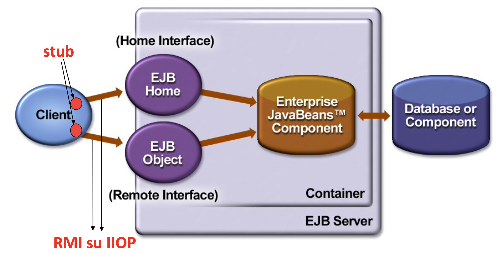

# Sistemi Distribuiti M - 2021/2022

## 01.Modelli

###  (domanda provocatoria) Che cosa fa un laureato magistrale in ingegneria informatica in azienda oggi?

Comanda 😎

### Che cosa è un componente?

E' un _pezzo di software_ che viene scritto dallo sviluppatore ed ha le seguenti caratteristiche:
- Contiene stato, metodi etc ma espone verso l'esterno solo quei metodi che si decidono che siano visibili all'esterno grazie all'uso di un'interfaccia;
- Viene eseguito all'interno di un _container_/_engine_/_middleware_.

Esempi di componenti sono quelli che si usano per creare le interfacce grafiche con **JavaFX**: _textBox_, _label_, _comboBox_ etc. Quando si clicca su un bottone non si verifica se effettivamente il _mouse_ è sopra al tasto e lo si schiaccia ma si scrive solo il codice che deve essere eseguito se quel determinato evento si verifica.

- **Componente nel concentrato**: un componente che fa parte di un'applicazione che viene messa in esecuzione su una **sola** macchina;
- **Componente nel distribuito**: un concetto più ampio rispetto a quello del concentrato. Il componente non è vincolato a trovarsi su una sola macchina proprio per la definizione intrinseca di sistema distribuito. E' possibile spostarlo in qualsiasi momento da un nodo ad un altro. Per questo motivo il componente nel concentrato viene visto come se appartenesse ad un'applicazione "monolitica".

### Che differenza c'è tra un componente ed un oggetto?
**Uguale all'oggetto**:

- Mantiene dettagli di come è implementato: stato, metodi etc ed espone solo alcuni dei suoi dettagli tramite l'interfaccia;

**Diverso dall'oggetto**:
- Il componente viene eseguito all'interno di un _container_/_engine_/_middleware_ altrimenti non verrebbe eseguita la _funzione di callback_. Se si eseguisse il codice di un componente su una qualsiasi JVM non funzionerebbe. Riprendendo l'esempio di prima: chi è che controlla che effettivamente il mouse è posizionato sopra al bottone? Nessuno quindi il codice non potrebbe funzionare;
- Il componente è di dimensioni più grande di un oggetto  in termini di codice, perchè il costo di overhead tra un'interazione e l'altra è maggiore. Ipotizziamo che due componenti A e B interagiscano tra di loro. A per comunicare con B deve instaurare una connessione, scambiare i dati e alla fine chiuderla. Nel concentrato, invece, gli oggetti anche se sono piccoli e interagiscono spesso fra di loro non hanno questo problema di overhead.

Ovviamente bisogna stare attenti a creare un componente non troppo grande per evitare di andare incontro a tutti quei problemi affrontati durante il corso di Ingegneria del Software T (riusabilità etc).

### Che tipi di modelli possiamo utilizzare?

Ogni problema presenta una soluzione diversa. Per capire meglio come risolverli è importante capire il funzionamento dei modelli.
I modelli che possono essere usati sono ad esempio:
- **Statici/dinamici**: sicuramente un sistema dinamico consente di adeguarsi a fronte di variazioni mentre un sistema statico no;
- **Preventivi/reattivi**: un sistema preventivo è più costoso di un sistema reattivo perchè non è detto che un evento si verifichi. Ad esempio, i sistemi operativi non utilizzano sistemi preventivi. Se avviene un deadlock tra processi lo si sblocca dall’esterno tramite linea di comando.

E' meglio una soluzione statica o dinamica? Meglio una soluzione preventiva o reattiva? La risposta in generale che deve fornire un ingegnere è sempre: _dipende_. Ogni problema ha una storia diversa. Questo perchè **non** esistono formule precise nei sistemi distribuiti dato che ci sono troppi parametri da prendere in considerazione: famiglia del processore, sistema operativo, linguaggio di programmazione etc.

### A cosa siamo interessati nei sistemi distribuiti?

Siamo interessati alle performance e ad eventuali colli di bottiglia. Per poterli evitare è necessario osservare le performance dell'applicazione e solo in seguito si capisce che cosa andare a modificare. Ad esempio, aprire troppe connessioni con un DB può introdurre un potenziale _bottleneck_.

Le modifiche non si effettuano sul codice stesso ma attraverso l'operazione di _deployment_ (dispiegamento). Ad esempio, installare tutte le librerie necessarie che servono all'applicazione, copiare i file che devono essere locali all’applicazione, distribuire i componenti su uno o più nodi e mettere davanti un bilanciatore di carico etc.
Quando faccio _deployment_ occorre decidere dove fare eseguire il componente e quali risorse ha bisogno per funzionare correttamente. Ad esempio, quando devo fare una Web App, ho un file che descrive queste scelte.

Come lo faccio? Ci sono diversi approcci:
- **Manuale**: l’utente determina ogni singolo oggetto/componente su quale è il nodo più appropriato;
- **File Script**: si devono eseguire alcuni file di script che racchiudono la sequenza dei comandi per arrivare alla configurazione che presenta le dipendenze;
- **Linguaggi dichiarativi**: supporto automatico alla configurazione attraverso linguaggi dichiarativi o modelli di funzionamento della configurazione da ottenere. Ad esempio, tramite il _file di deployment_ e annotazioni.

### Quali sono le sfide dell’enterprise computing?

- Portabilità;
- Interoperabilità fra diversi ambienti (anche _legacy_);
- Supporto e gestione runtime: scalabilità, efficienza, tolleranza ai guasti, resilienza, affidabilità, qualità, etc;
- Time-to-market: sviluppare componenti nel minor tempo possibile;
- Integrazione.

### Come sono evolute le architetture per le applicazioni enterprise?

Le architetture si sono evolute sempre di più verso architettura N-tier perchè l'obiettivo è quello di separare logicamente le funzionalità in modo da ridurre la complessità degli strati:
- **Single-Tier**: c'è un singolo calcolatore a cui sono connessi i clienti
    - **Vantaggi**: nessun aggiornamento dei clienti, una sola copia dei dati che si trova nel server;
    - **Svantaggi**: no scalabilità.
- **Two-Tier**:
- **Three-Tier**:

### Cos’è J2EE?

E' un insieme di specifiche le cui implementazioni vengono principalmente sviluppate in linguaggio di programmazione Java e ampiamente utilizzata nella programmazione Web. Viene scritta solo la specifica non l’implementazione, diversi produttori di software hanno fatto diverse implementazioni; purché siano JEE compliant basta che rispettino la specifica. Alcune implementazioni si limitano alla specifica altre aggiungono funzionalità.

Esistono diversi _software open source_, che vengono spesso usati anche in ambiente di produzione come:
- **GlassFish**: è l'implementazione di riferimento mantenuta da Oracle;
- **WildFly**: precedentemente noto come JBoss.

### Come funzionano i modelli a contenimento?

Le chiamate clienti verso i metodi EJB sono intercettate dal container prima che questo le “deleghi” ai componenti EJB veri e propri.

---

## 02.EJB 2.x

### Che cos’è EJB? Che caratteristiche offre? Che benefici offre EJB?

E' una tecnologia a componenti lato _server-side_ che consente di creare applicazioni distribuite che siano multi-tier, transazionali, portabili, scalabili, sicure, etc.

Permette di programmare tramite l'uso di componenti e di conseguenza porta tutti quei benefici che derivano da essi, si possono sfruttare tutti i servizi di sistema messi a disposizione dal container e lo si configura semplicemente grazie a un file .xml, detto _file descriptor_, in modo da non modificare nessuna riga di codice.

E' stata una delle prime tecnologie a componenti e al giorno d'oggi, sebbene c'è ne siano molte altre, non è da considerarsi completamente in disuso.

### Quali sono i principi di design di EJB?

- Le applicazioni EJB e i loro componenti devono essere debolmente accoppiati (_loosely coupled_). Ad esempio, se abbiamo due componenti A e B, A deve chiamare un metodo di B non molte volte. Questo perchè nel distribuito abbiamo un costo di _overhead_ piuttosto alto. Dall'altra parte, i componenti devono essere portabili quindi bisogna stare attenti a come scrivere il software altrimenti diventa difficile ricostruire le sue dipendenze quando si decide di usare quel codice in un altro progetto;
- Il comportamento dei componenti EJB è definito tramite interfacce. Aspetto assolutamente non nuovo perchè basta pensare agli oggetti;
- Lo sviluppatore **non** deve pensare a come gestire le risorse. Ci pensa tutto il container;
- Le applicazioni EJB sono N-tier.

### Che problemi ha EJB 2.X?

- E' un container "pesante". Attualmente le tecnologie si sono spostate verso altre soluzioni;
- Modello di programmazione non tanto simile a quello che si usa per sviluppare oggetti classici;
- Difficoltà di testing(?) In che senso? EJB 2.x o proprio di EJB in generale?.

### Quale è la sua architettura?



Sul'EJB Container non avrò solo le istanze che il programmatore ha scritto ma anche altri due oggetti che vengono automaticamente generati:
- **Oggetto EJB Home**: implementa l’interfaccia EJBHome. In terminologia J2EE si dice che il cliente implementa la Home Interface. È un _proxy_ che intercetta la chiamata del cliente (la prima volta) e decide quale istanza logica gli deve restituire (una già creata, nuova etc.);
- **Oggetto EJB Object**: implementa l’interfaccia EJBObject. In terminologia J2EE si dice che il cliente implementa la Remote Interface. È un _proxy_ che ha la stessa interfaccia del componente EJB creato dallo sviluppatore. Quando invoco un metodo chiamo l'EJBObject che invoca poi a sua volta il Java Bean.

E' bene ricordare che la macchina server non è "pura" perché mi serve installarci sopra anche un container per far girare la mia applicazione.

Pensiamo di sviluppare un'applicazione riguardante una banca dove un utente può solo prelevare e depositare soldi:
- **Sviluppatore**: creo solo una classe che chiamiamo Account. Al suo interno ci sono i metodi preleva e deposita. Non mi interessa niente riguardo le istanze, allocazione/deallocazione e thread. Scrivo il codice come se avessi solo un cliente. A tutto il resto ci pensa il container. In EJB 2.x ad ogni classe creata, dobbiamo anche creare due interfacce EJBHome e EJBObject perché così che è il contratto del cliente;
- **Cliente**: ipotizziamo di avere tre clienti: C1, C2 e C3 che richiedono tutti un prelievo. Per conoscere EJBHome è importante che sia disponibile nel sistema dei nomi:
    - C1 fa richiesta di prelievo, dovrà per prima cosa tramite il servizio di nomi ottenere EJBHome (in realtà si ottiene lo _stub_). Dopo invoca su EJBHome _create()_/_find()_. La richiesta arriva a EJBHome (estensione di rmi.remote) che crea un oggetto O1 ed è l’istanza logica dedicata per C1. EJBHome restituisce al cliente il riferimento di EJB Object (riferimento allo _stub_);
    - L’invocazione del metodo prelievo verrà fatta su EJBObject che a sua volta potrà invocare l’oggetto O1;
    - C3 fa una richiesta. EJBHome potrà creare un nuovo oggetto O2 oppure dare il riferimento di O1. Non è detto che debba essere lo stesso.

### Quali contratti esistono?
Esistono due tipi di contratto:
- **Client view contract**: contratto tra cliente e container. Un contratto _client view_ è costituito da:
    - **Home interface**: _proxy_ che funge da vera e propria factory;
    - **Object interface**: _proxy_ che ha gli stessi metodi di business;
    - **Identità dell'oggetto**? per arrivare alla home interface è necessario un servizio di nomi che mi consente di recuperare la home interface
- **Component contract**: contratto tra componente e container. Il contratto serve a:
    - Abilitare le invocazioni dei metodi dei clienti;
    - Implementare le interfacce EJBHome e EJBObject per ridurre il carico di lavoro da parte dello sviluppatore;
    - Gestisce la persistenza (solo in EJB 2.x, da EJB 3.x la gestione cambia);
    - Gestisce tutti i servizi di sistema: sicurezza, transazionalità etc.;
    - Implementa il meccanismo delle callback. Ci sono i Message Driven Bean che vengono attivati quando si riceve un determinato messaggio.

### Di cosa si occupa l'EJB container?

- Genera automaticamente le classi concrete delle interfaccia EJBHome e EJBObject;
- Effettua il _binding_ dell’oggetto Home presso il
servizio di naming;
- Persistenza;
- Transazionalità;
- Gestione _lifecycle_ componenti;
- _Connection pooling_;
- _Threading_;
- Sicurezza.

### Quali sono le tipologie di componenti Bean?
I Bean possono essere classificati in due categorie:
- **Sincroni**: l'utente si blocca e aspetta la risposta da parte del _server_. Esistono due tipi di Bean:
    - **Session Bean**: a sua volta possiamo avere due tipi di Session Bean:
        - **Stateful**;
        - **Stateless**.
    - **Entity Bean**: a sua volta possiamo avere due tipi di Entity Bean:
        - **Container Managed Persistence (CMP)**;
        - **Bean Managed Persistence (BMP)**.
- **Asincroni**: l'utente non si blocca e non aspetta la risposta. Esiste un tipo di componente che fa parte di questa categoria:
    - **Message Driven Bean**.

### Cos’è un Session Bean? Quando va usato? Che tipi di Session Bean esistono?

Un Session Bean ha le seguenti caratteristiche:
- Rappresenta un processo di business;
- Ogni cliente ha un'istanza;
- _Short-lived_: la vita del bean è pari alla vita cliente o al massimo alla durata della sessione;
- Transient;
- No _fault-tollerant_: non sopravvive a crash del server;
- Può avere proprietà transazionali;
- Implementa l’interfaccia _javax.ejb.SessionBean_.

Questo componente viene usato quando bisogna effettuare calcoli computazionali

I Session Bean che esistono sono di due tipi:
- **Stateless**: il componente è privo di stato. Ad esempio, quando un'azione deve essere idempotente;
- **Statefull**: il componente è con stato. Ad esempio, quando si aggiungono i prodotti in un carrello di e-commerce.

### Cos’è un Entity Bean? Come si usano? Come può essere gestita la persistenza?

Un Entity Bean ha le seguenti caratteristiche:
- Rappresenta i dati di business;
- L'stanza è condivisa fra clienti diversi;
- Long-lived: la vita del bean è pari a quella dei dati nel database;
- Persistente;
- Fault-tollerant: sopravvive a crash del server;
- Sempre transazionale;
- implementa l’interfaccia _javax.ejb.EntityBean_.

Gli Entity Bean che esistono sono di due tipi:
- **Container Managed Persistence (CMP)**: persistenza gestita completamente dal container. Requisiti di persistenza specificati interamente nel descrittore di deployment;
- **Bean Managed Persistence (BMP)**: è responsabilità dello sviluppatore la gestione della persistenza.

### Cosa sono e come funzionano i Message Driven Bean?

- Svolgono il ruolo di consumatori di messaggi asincroni;
- Non possono essere invocati direttamente dai clienti;
- Attivati in seguito all’arrivo di un messaggio;
- Non hanno interfacce EJBHome e EJBObject;
- I clienti possono interagire con i Message Driven Bean tramite l’invio di messaggi verso le code o i topic per i quali questi componenti sono in ascolto (listener);
- Privi di stato.

### Che cosa sono le interfacce EJBHome ed EJBObject?

- **Interfaccia EJBHome**: è un _proxy_ che intercetta la chiamata del cliente (la prima volta) e decide quale istanza logica gli deve restituire (una già creata, nuova etc.). Al suo interno avremo i metodi per la creazione, il ritrovamento e la distruzione del bean. Tuttavia, il programmatore definisce solo l'interfaccia mentre l'oggetto è implementato dal container. L'interfaccia può essere remota e/o locale (vedi domande successive del perchè).
Il cliente ottiene il riferimento all’oggetto _stub_
dell’oggetto EJBHome tramite JNDI;

- **Interfaccia EJBObject**: È un _proxy_ che ha la stessa interfaccia del componente EJB creato dallo sviluppatore. Quando invoco un metodo chiamo l'EJBObject che invoca poi a sua volta il Java Bean. Il programmatore definisce solo l'interfaccia mentre l'oggetto è implementato dal container. L'interfaccia può essere remota o locale (vedi domande successive del perchè).
Il cliente ottiene il riferimento all’oggetto _stub_ di EJBObject attraverso i metodi create() o find() dell’interfaccia EJB Home.

### Come agisce un cliente in EJB 2.X?

Per interagire con un componente EJB il cliente deve:
- Ottenere l’oggetto EJBHome (in realtà un oggetto _stub_ per l’oggetto EJBHome) via JNDI perchè la comunicazione tra client e server avviene tramite RMI;
    - Creare l'oggetto InitialContext. Questo oggetto serve per poter cercare sul servizio di nomi;
    - Effettuare la lookup sul servizio di nomi;
    - Effettuare il narrowing;
- Dall’oggetto EJBHome, si invoca la _create()_ in modo da ottenere l'istanza logica dedicata dell'oggetto EJB desiderato. In realtà, si ottiene un oggetto _stub_ per l’oggetto EJBObject per lo stesso motivo di prima;
- Invocare i metodi di business tramite l’oggetto EJB;
- Effettuare il clean up finale per liberare le risorse. Perchè occupare un'istanza che non si usa?

### Come avviene l’invocazione remota in EJB 2.X? Quali sono gli oggetti in gioco?

Per prima cosa bisogna implementare le interfacce EJBHome e EJBObject. Ovviamente gli oggetti che cooperano, in questo caso, si trovano su JVM differenti. Dal lato cliente vengono invocati i metodi di oggetti lato server e necessariamente ci deve essere un meccanismo di comunicazione tra cliente e server.

RMI è utilizzato per la comunicazione fra cliente e server EJB. Le operazioni RMI sono costose perchè bisogna effettuare la serializzazione/deserializzazione dei parametri, aprire, trasferire e chiudere una connessione RMI bastato su IIOP

In più nello specifico dato che la comunicazione avviene con RMI su IIOP i passaggi sono i seguenti:

- Cliente:
    - Invoca un metodo dell’oggetto remoto
    - Lo _stub_ dell’oggetto remoto
        - “Intercetta” l’invocazione di metodo
        - Effettua il _marshalling_ dei parametri
        - Effettua la chiamata vera e propria all’oggetto remoto
- Oggetto remoto:
    - Riceve l’invocazione tramite il suo _skeleton_
    - Effettua l’_unmarshalling_ dei parametri
    - Esegue l’invocazione localmente
    - Effettua il _marshalling_ dei risultati e li invia al cliente
- Lo _stub_ dell’oggetto remoto:
    - Riceve i risultati,effettua un marshalling e li restituisce al cliente

IIOP è un protocollo di comunicazione del mondo CORBA.
c'è una visione in RMI del mondo CORBA. Tuttavia, CORBA ha un suo standard.

### Come funziona l’uso locale di EJB?

Per prima cosa bisogna ricordarsi di implementare le interfacce EJBLocalHome e EJBLocalObject. Ovviamente, in questo caso i metodi non producono *RemoteException*.
Le interfacce locali, si usano quando il cliente esegue nella stessa JVM del componente EJB di interesse (e del suo container). Ad esempio, quando lo sviluppatore deve scrivere il codice. Non avrebbe senso pagare i costi di overhead sulla stessa macchina. In questo caso il passaggio dei parametri può avvenire tramite riferimento proprio perchè ci troviamo sulla stessa macchina

Inoltre, c'è un'altro possibile uso per rendere più efficiente il funzionamento di un Session Bean. Esso può svolgere a sua volta il ruolo di "cliente local" verso altri bean.

Questa possibilità è stata introdotta a partire da EJB2.0 anche se alcune implementazioni avevano già delle ottimizzazioni senza che fosse inserito ufficialmente nello standard. Anche guardando lo _skeleton_ di RMI ha un'idea di ottimizzazione. Se è locale evito di comunicare remotamente.

E' bene ricordare anche che non è trasparente passare da EJBHome a EJBLocalHome perchè l'interfaccia locale non ha la RemoteException

### Come avviene il deployment di una applicazione EJB?

Per effettuare il deployment di un'applicazione EJB sonno necessari i seguenti file:
- ***.EAR (Enterprise ARchive)**: è tutta l'applicazione EJB che si troverà lato server. Al suo interno abbiamo:
    - ***.WAR (Web ARchive)**: modulo Web (Servlet, JSP etc. ). E' facoltativo perchè non è detto che lo vogliamo inserire
    - **EJB-JAR (*.jar)**: modulo EJB. Per ogni componente EJB, il file ejb-jar deve contenere almeno i seguenti file:
        - **Classe bean**: classe scritta dallo sviluppatore
        - **Interfaccia EJBHome**:  a tempo di compilazione servono le interfacce mentre a tempo di esecuzione poi è necessario che il container implementi lo _stub_
        - **Interfaccia EJBObject**: a tempo di compilazione servono le interfacce mentre a tempo di esecuzione poi è necessario che il container implementi lo _stub_
        - **application.xml**: descrittore di deployment. La visibilità è "locale" perchè si limita all'interno del modulo

        Per effettuare il deployment di una applicazione EJB, è sempre necessario creare un file *.EAR anche se l’applicazione prevede un solo file EJB-JAR e nessun modulo Web. Tuttavia, alcuni container permettono il deployment diretto del solo modulo EJB-JAR senza dover creare il file *.EAR.

    - **application.xml**: descrittore di deployment. La visibilità è "globale" paragonato a quello che si trova all'interno di ogni modulo.
- ***.JAR**: cliente EJB

---

## 03.Annotazioni

### Cosa sono le annotazioni? Esempi di annotazioni? Come sono strutturate?

Sono metadati con cui decoro i metodi, le classi, le interfacce etc. Non modificano il codice che lo sviluppatore scrive ma aggiungono solo informazioni che possono essere utili:
- Al compilatore;
- Alla _Javadoc_;
- A _runtime_.

Le annotazioni che sono state già viste sicuramente in altri corsi sono le seguenti:
- **@Overrided**: serve a livello di compilazione. Se non mettessi questa annotazione, il codice verrebbe generato lo stesso però devo stare attento a come scrivo il nome del metodo sia nella classe padre che in quella figlia;
- **@Deprecated**: serve a livello di documentazione per indicare che quel metodo è in disuso;
- **@SuppressWarnings**: serve a livello di compilazione. Se la compilazione presenta dei _warning_ questi vengono trascurati e non vengono mostrati all’utente.

Le annotazioni sono strutturate nel seguente modo: ci può essere solo il nome dell'annotazione o in caso ci fossero dei membri vengono scritti come un insiemi di coppie nome=valore. Se il membro è solo uno, il nome si può omettere.

Con **membro** si intende il "parametro di ingresso" dell'annotazione.

### Perchè si usano le annotazioni?

Le annotazioni consentono di arricchire lo spazio concettuale del linguaggio. Consente di fare programmazione dichiarativa oltre che a quella imperativa perchè consente di associare delle informazioni in modo dichiarativo al codice non andando a modificare il comportamento dei metodi, delle classi etc. Ad esempio, quello che viene specificato con il *file di deployment* si può fare benissimo tramite le annotazioni.

Sicuramente viene aggiunta una "parola" al codice però la logica di business non cambia.

### Quali categorie di annotazioni esistono?

- **Marker annotation**: non hanno membri. Ad esempio: @Override;
- **Single-value annotation**: hanno un solo membro. Ad esempio: @SuppressWarnings("unchecked");
- **Full annotation**: l'annotazione è formata da più di un membro;
- **Custom annotation**: i programmatori possono crearsi le proprie annotazioni.

### Che limiti hanno le annotazioni personalizzate?

- **Non** si possono avere relazioni di estensione (_extends_) fra tipi di annotazioni;
- I tipi di ritorno degli eventuali metodi di una annotazioni devono essere: tipi primitivi, String, Class, enum, tipi di annotation o array dei tipi appena elencati;
- Una annotation **non** può lanciare eccezioni ovvero non può avere una _throws clause_;
- **Non** sono permessi _self-reference_. Ad esempio: AnnotationA non può contenere un membro di tipo AnnotationA;
- **Non** sono permessi _circular-reference_. Ad esempio: AnnotationA non può contenere un membro di tipo AnnotationB e quest'ultimo di AnnotationA.

### Cosa sono le meta-annotazioni? Quali sono?

Sono annotazioni che si specificano sulle annotazioni che vengono create. Le meta-annotazioni sono:

- **@Target**: specifica il tipo di elemento al quale si può allegare tale tipo di annotazione (campo, metodo, classe, interfaccia etc.);
- **@Documented**: specifica che le annotazioni di tale tipo faranno parte della Javadoc;
- **@Inherited**: questo tipo di annotazione funziona **solo** se apposta ad una classe. Il tipo di annotazione verrà automaticamente ereditato dalle sottoclassi della classe alla quale viene allegata;
- **@Retention**: politica di mantenimento in memoria con cui il compilatore e JVM devono gestire le annotazioni.

### Che valori possono avere le politiche di retention?

- **@Retention(RetentionPolicy.SOURCE)**: l'annotazione permane solo a livello di codice sorgente. Dunque, non viene memorizzata nel bytecode cioè nel file .class. Viene utilizzata solo a tempo di sviluppo da parte del compilatore. Ad esempio, l'annotazione @Override. Se confrontassi la dimensione del file in cui l'annotazione è stata scritta e quello in cui l'annotazione non è stata scritta, potremmo vedere che è la stessa;
- **@Retention(RetentionPolicy.CLASS)(default)**: l'annotazione verrà registrata nel bytecode ma non verrà mantenuta dalla JVM a runtime. Dunque, non si può usare la reflection ma solo a tempo di caricamento. Ad esempio, si può decidere come trattare il caricamento tramite il class loader del bytecode ma poi le annotazioni non si possono sono usate a run-time
- **@Retention(RetentionPolicy.RUNTIME)**: l'annotazione verrà registrata nel bytecode e potrà essere letta a runtime tramite reflection anche dopo il caricamento della classe da parte della JVM. E' utilizzabile anche all’interno del codice di supporto/applicativo a tempo di esecuzione, con proprietà eventualmente modificabili a runtime.

## 04.Sistemi di Nomi

### Cos’è un servizio di naming? Cos’è e cosa fa JNDI?

Sistema di nomi: RMI Registry (RMI), DNS, Port Mapper (RPC)

Nome logico, numero di programma, numero di protocollo -> porta

### Cos’è un protocollo di discovery? Fornire un esempio

Discovery: es. bluetooth protocollo di discovery. mando dei broadcast ma non so se gli altri dispositivi hanno il bluetooth

### Cosa sono le directory? Come sono fatte? Fornire un esempio

Directory: LDAP, es. accesso ai laboratori di UNIBO

### Quali sono i concetti fondamentali in JNDI?
### Cos’è un provider JNDI? Cos’è l’interfaccia Context e che metodi ha? Esempi di sotto-
interfacce di Context?
### Esempio di uso di JNDI? Come si possono memorizzare i dati in JNDI?
### Configurazione di JNDI?

```
@Target ( {ElementType.METHOD,ElementType.PACKAGE} )
public @interface ExampleAnnotation { ... }
```