<div align="center">

# Sistemi Distribuiti M - 2021/2022

Corso tenuto dal _Prof. Foschini_

Appunti scritti da _Dario De Nardi_, _Sofia Montebugnoli_ 

Si ringrazia _Enrico Valastro_ per aver fornito molte immagini e spiegato come realizzarle

[](https://github.com/settings/appearance)
[](http://creativecommons.org/publicdomain/zero/1.0/)
</div>

<!-- INDICE -->
<details href="indice" open="open">
  <summary><h2 style="display: inline-block">Indice</h2></summary>
  <ol>
    <li>
      <a href="#modelli">Modelli</a>
      <ul>
        <li><a href="#componente">Componente</a></li>
        <li><a href="#differenza-tra-un-componente-ed-un-oggetto">Differenza tra un componente ed un oggetto</a></li>
        <li><a href="#modelli-1">Modelli</a></li>
        <li><a href="#deployment">Deployment</a></li>
        <li><a href="#architetture-applicazioni-enterprise-1">Architetture applicazioni Enterprise (1)</a></li>
        <li><a href="#modelli-a-contenimento">Modelli a contenimento</a></li>
        <li><a href="#j2ee">J2EE</a></li>
        <li><a href="#architetture-applicazioni-enterprise-2">Architetture applicazioni Enterprise (2)</a></li>
      </ul>
    </li>
    <li>
      <a href="#ejb-2x">EJB 2.X</a>
      <ul>
        <li><a href="#scenari-applicativi">Scenari applicativi</a></li>
        <li><a href="#principi-di-design">Principi di design</a></li>
        <li><a href="#architettura">Architettura</a></li>
        <li><a href="#jndi">JNDI</a></li>
        <li><a href="#contratti">Contratti</a></li>
        <li><a href="#ejb-container">EJB container</a></li>
        <li><a href="#tipologie-di-componenti-bean">Tipologie di componenti Bean</a></li>
        <li><a href="#session-bean">Session Bean</a></li>
        <li><a href="#entity-bean">Entity Bean</a></li>
        <li><a href="#message-driven-bean">Message Driven Bean</a></li>
        <li><a href="#interazioni-tra-bean">Interazioni tra Bean</a></li>
        <li><a href="#deployment-1">Deployment</a></li>
        <li><a href="#ciclo-di-sviluppo">Ciclo di sviluppo</a></li>
        <li><a href="#interfacce-ejbhome-ed-ejbobject">Interfacce EJBHome ed EJBObject</a></li>
        <li><a href="#invocazione-remota">Invocazione remota</a></li>
        <li><a href="#invocazione-locale">Invocazione locale</a></li>
        <li><a href="#cliente">Cliente</a></li>
        <li><a href="#deployment-di-unapplicazione">Deployment di un'applicazione</a></li>
        <li><a href="#problemi-riscontrati">Problemi riscontrati</a></li>
      </ul>
    </li>
    <li>
      <a href="#annotazioni">Annotazioni</a>
      <ul>
        <li><a href="#definizione">Definizione</a></li>
        <li><a href="#sintassi">Sintassi</a></li>
        <li><a href="#categorie-di-annotazioni">Categorie di annotazioni</a></li>
        <li><a href="#annotazioni-personalizzate">Annotazioni personalizzate</a></li>
        <li><a href="#limiti-delle-annotazioni-personalizzate">Limiti delle annotazioni personalizzate</a></li>
        <li><a href="#meta-annotazioni">Meta-annotazioni</a></li>
        <li><a href="#politiche-di-retention">Politiche di retention</a></li>
        <li><a href="#perchè-usarle">Perchè usarle</a></li>
      </ul>
    </li>
    <li>
      <a href="#sistemi-di-nomi">Servizio di nomi</a>
      <ul>
        <li><a href="#sistemi-di-discovery">Sistemi di Discovery</a></li>
        <li><a href="#sistemi-di-directory">Sistemi di Directory</a></li>
        <li><a href="#directory-vs-db">Directory vs DB</a></li>
        <li><a href="#jndi-1">JNDI</a></li>
        <li><a href="#interfaccia-context">Interfaccia Context</a></li>
        <li><a href="#interfaccia-dircontext">Interfaccia DirContext</a></li>
        <li><a href="#uso-di-jndi">Uso di JNDI</a></li>
        <li><a href="#memorizzare-i-dati-in-un-servizio-nomi">Memorizzare i dati in un servizio nomi</a></li>
        <li><a href="#serializzazione">Serializzazione</a></li>
        <li><a href="#riferimento">Riferimento</a></li>
        <li><a href="#attributi">Attributi</a></li>
        <li><a href="#configurazione-di-jndi">Configurazione di JNDI</a></li>
      </ul>
    </li>
  </ol>
</details>

## Modelli

Nella vita professione, è molto difficile che si scriva un software da zero per diversi motivi:

- Un'azienda/cliente sta già usando determinate tecnologie e non vuole cambiarle.
- Si vuole interoperare fra diversi ambienti (anche legacy).
- Il tempo di sviluppo è molto limitato e ci sono vincoli nella consegna dell'applicazione finale.

Per questo motivo è fondamentale usare un approccio basato su componenti e il trand attuale si sposta verso questo tipo di soluzione.

### Componente

Un componente è un _pezzo di software_ che viene scritto dallo sviluppatore ed ha le seguenti caratteristiche:

- Contiene stato, metodi etc. ma espone verso l'esterno solo quei metodi che si decidono che siano visibili all'esterno grazie all'uso di un'interfaccia.
- Viene eseguito all'interno di un ambiente di esecuzione detto _container_/_engine_/_middleware_.

Esempi di componenti sono quelli che si usano per creare le interfacce grafiche con JavaFX: textBox, label, comboBox etc. Quando si clicca su un bottone non si verifica se effettivamente il mouse è sopra al tasto e lo si schiaccia ma si scrive solo il codice che deve essere eseguito se quel determinato evento si verifica.

Tuttavia, il componente del distribuito assume un concetto più ampio rispetto a quello del concentrato:

- **Componente nel concentrato**: un componente che fa parte di un'applicazione che viene messa in esecuzione su una **sola** macchina.
- **Componente nel distribuito**: il componente non è vincolato a trovarsi su una sola macchina proprio per la definizione intrinseca di sistema distribuito. È possibile spostarlo in qualsiasi momento da un nodo ad un altro. Per questo motivo il componente nel concentrato viene visto come se appartenesse ad un'applicazione _monolitica_.

Il corso si focalizza sui sistemi distribuiti quindi verranno trattati i componenti del secondo punto.

<a href="#indice">Torna all'indice</a>

### Differenza tra un componente ed un oggetto

A questo punto ci si domanda che differenza c'è tra un componente ed un oggetto perchè sembrano molto simili tra di loro:

- **Uguale all'oggetto**: mantiene dettagli di come è implementato: stato, metodi etc ed espone solo alcuni dei suoi dettagli tramite l'interfaccia.
- **Diverso dall'oggetto**:
    - Il componente viene eseguito all'interno di un _container_/_engine_/_middleware_ altrimenti non verrebbe eseguita la funzione di callback. Se si eseguisse il codice di un componente su una qualsiasi JVM non funzionerebbe. Riprendendo l'esempio di prima: chi è che controlla che effettivamente il mouse è posizionato sopra al bottone? Nessuno, quindi il codice non potrebbe funzionare.
    - Il componente è di dimensioni più grande di un oggetto  in termini di codice, perchè il costo di overhead tra un'interazione e l'altra è maggiore. Si ipotizzi che due componenti `A` e `B` interagiscano tra di loro. `A` per comunicare con `B` deve instaurare una connessione, scambiare i dati e alla fine chiuderla. Nel concentrato, invece, gli oggetti anche se sono piccoli e interagiscono spesso fra di loro non hanno questo problema di overhead. Ovviamente bisogna stare attenti a creare un componente non troppo grande per evitare di andare incontro a tutti quei problemi affrontati durante il corso di Ingegneria del Software T (riusabilità etc).

<a href="#indice">Torna all'indice</a>

### Modelli

Ogni problema presenta una soluzione diversa. Per capire meglio come risolverli è importante studiare i modelli. Quelli che possono essere usati sono ad esempio:

- **Statici/dinamici**: l’uso di modelli statici non permette di adeguare il sistema a fronte di variazioni. I modelli dinamici invece permettono di fare evolvere il sistema a fronte di variazioni ma hanno costi più elevati.
- **Preventivi/reattivi**: un sistema preventivo è più costoso di un sistema reattivo perchè non è detto che un evento si verifichi. Ad esempio, i sistemi operativi non utilizzano sistemi preventivi: se avviene un deadlock tra processi lo si sblocca dall’esterno tramite linea di comando.

È meglio una soluzione statica o dinamica? Meglio una soluzione preventiva o reattiva? La risposta in generale che deve fornire un ingegnere è sempre: _dipende_. Ogni problema ha una storia diversa. Questo perchè **non** esistono formule precise nei sistemi distribuiti dato che ci sono troppi parametri da prendere in considerazione: famiglia del processore, sistema operativo, linguaggio di programmazione etc.

<a href="#indice">Torna all'indice</a>

### Deployment

Nei sistemi distribuiti si è interessati ad eventuali colli di bottiglia, come si comporta l'applicazione quando arrivano molte richieste etc. È importante, quindi, osservare le performance e per far ciò bisogna mettere in esecuzione l'applicazione. In questo modo si capisce che cosa andare a modificare.

Le modifiche non si effettuano sul codice stesso ma attraverso l'operazione di _deployment_. Quando si fa questa operazione, occorre decidere dove far eseguire il componente e di quali risorse ha bisogno per funzionare correttamente. Ad esempio, installare tutte le librerie necessarie, copiare i file che devono essere locali, distribuire i componenti su uno o più nodi, mettere davanti un bilanciatore di carico etc.

Ci sono diversi approcci per effettuare il deployment:

- **Manuale**: l’utente determina ogni singolo oggetto/componente su quale è il nodo più appropriato.
- **File Script**: si devono eseguire alcuni file di script che racchiudono la sequenza dei comandi per arrivare alla configurazione che presenta le dipendenze.
- **Linguaggi dichiarativi**: supporto automatico alla configurazione attraverso linguaggi dichiarativi o modelli di funzionamento della configurazione da ottenere. Ad esempio, tramite un file .XML e annotazioni.

<a href="#indice">Torna all'indice</a>

### Architetture applicazioni Enterprise (1)

Le architetture si sono evolute sempre di più verso architetture a più livelli perchè l'obiettivo è quello di separare logicamente le funzionalità in modo da ridurre la complessità degli strati:

- **Single-Tier**: c'è un singolo super calcolatore a cui sono connessi i clienti perchè quest'ultimi non hanno abbastanza risorse per fare elaborazione. I clienti (o meglio terminali) inviano solo le richieste al mainfraime il quale le elabora e restituisce al cliente la risposta. È la soluzione adottata negli anni '50.


    - **Vantaggi**:
        - Nessuna gestione client-side.
        - Consistenza dei dati perchè tutti i dati sono solo sul calcolatore.
    - **Svantaggi**: no scalabilità.

- **Two-Tier**: i clienti interagiscono con il DB, inviano query SQL e ricevono dati raw (dati _grezzi_ cioè i dati come vengono presi dal DB così vengono inviati). La logica di presentazione, di business e di processamento del modello dei dati si trova tutta nell’applicazione cliente. Per questo motivo il cliente viene detto _fat_.


    - **Vantaggi**: indipendenza dallo specifico DB (rispetto a single-tier).
    - **Svantaggi**:
        - Difficoltà di aggiornamento, maintenance e riutilizzo di codice perchè tutto si trova installato sul lato cliente.
        - Raw data trasferiti verso il cliente (responsabile del loro processamento) e ciò produce overhead di rete perchè possono essere anche molti i dati.
        - Connessione al DB per ogni cliente e questo ha un forte impatto perchè i DB relazionali non sono scalabili.

- **Three-Tier**: ci sono diversi modelli:
    - **Three Tier (basato su RPC)**: il cliente, detto _thin client_, ospita solamente la logica di presentazione. Per quanto riguarda le logiche di business e di processamento dei dati sono delegate ad un livello intermedio. La logica di accesso ai dati è contenuta nel terzo livello rappresentato dal database. Il middle tier, si occupa di tutti i servi di sistema (gestione della concorrenza, multithreading, transazioni, sicurezza, persistenza).
    
    
        - **Vantaggi**: logica di business modificabile in modo più flessibile.
        - **Svantaggi**: accoppiamento stretto fra clienti e middle-tier server. Il cliente deve conoscere IP fisico del server.
    - **Three Tier (basato su Remote Object)**:
    
    
        - **Vantaggi**: meno accoppiato del modello RPC.
        - **Svantaggi**: gli stessi di quello basato su RPC.
    - **Three Tier (Web Server)**: si ha un browser per il livello presentazione mentre la logica di business sono gestite tramite tecnologie come CGI, Servlet/JSP, ASP etc.
    
    
        - **Vantaggi**:
            - Cliente disponibile ovunque.
            - Nessun problema di aggiornamento del software sul client.
        - **Svantaggi**: Il middle tier resta ancora molto complesso, la logica di business deve far fronte alle problematiche specifiche dell’applicazione e di tutti i servizi di sistema (transazioni, concorrenza, sicurezza etc) in un’unica base di codice. Non c’è quindi una separazione netta tra la parte funzionale e quella non funzionale.

Attualmente il trend vede una transazione verso un mondo multi tier che disaccoppia sempre di più i livelli. Come visto in precedenza il middle tier rimane molto complesso in quanto la parte di logica dell’applicazione non è ancora nettamente separata dalla parte di logica di tutti i servizi di sistema non funzionali, questo implica che essi vengano duplicati per ogni applicazione. La soluzione a questa grande problematica consiste nell’introduzione di uno strato software ulteriore, il _container/engine/middleware_, che si faccia carico di tutti servizi non funzionali cioè non legati alla logica applicativa.

<a href="#indice">Torna all'indice</a>

### Modelli a contenimento

Sono modelli che si basano sull'uso di un _container/engine/middleware_ che forniscono automaticamente molte delle funzioni per supportare il servizio applicativo verso l’utente togliendo l'onere al programmatore. Ad esempio, la gestione della concorrenza.


L’idea che sta dietro al modello a contenimento è quella in cui i client non interagiscano direttamente con il componente di interesse ma che passino prima attraverso il _container/engine/middleware_ che in qualche modo standardizza e facilità le operazioni di sistema. Il container al suo interno ospiterà il componente.

Il container può essere implementato in due modi:

- **Soluzioni proprietarie**: questo tipo di soluzione viene implementata in modo proprietario fornendo delle API proprietarie per richiedere le funzionalità di sistema. Tra gli esempi più notevoli ci sono Tuxedo e .NET.
- **Soluzioni basate su standar aperti**: a differenza del caso precedente, i servizi di sistema vengono forniti in maniera ben definita in accordo a standard industriali tramite delle API standard. L’esempio più notevole è JEE o J2EE (Java Enterprise Edition) che definisce questi standard, li implementa e abilita quindi questa interazione tra il componente (sviluppato in Java) e un container che realizza queste API standard.

<a href="#indice">Torna all'indice</a>

### J2EE

È un insieme di specifiche le cui implementazioni vengono principalmente sviluppate in linguaggio di programmazione Java. Viene scritta solo la specifica non l’implementazione, diversi produttori di software hanno fatto diverse implementazioni; purché siano JEE compliant basta che rispettino la specifica. Alcune implementazioni si limitano alla specifica altre aggiungono funzionalità.

Esistono diversi software open source, che vengono spesso usati anche in ambiente di produzione come:

- **GlassFish**: è l'implementazione di riferimento mantenuta da Oracle;
- **WildFly**: precedentemente noto come JBoss.

<a href="#indice">Torna all'indice</a>

### Architetture applicazioni Enterprise (2)

Le soluzioni attuali come scritto anche in precedenza, si spostano verso questo tipo di architetture:

- **N-tier**: il middle-tier viene spacchettato in due parti:
    - **Server-side presentation**: si occupa della logica di presentazione, fa uso delle JSP (Java Server Pages) e/o delle Servlet.
    - **Server-side business logic**: si occupa della logica applicativa, cioè al suo interno ci sono i componenti.


Una delle tecnologie che fa uso di componenti è EJB. Nei prossimi capitoli verrà approfondita.

<a href="#indice">Torna all'indice</a>

## EJB 2.X

È una tecnologia a componenti lato server-side che consente di creare applicazioni distribuite che siano multi-tier, transazionali, portabili, scalabili, sicure, etc.

### Scenari applicativi

I componenti EJB possono essere utilizzati in diverse architetture.


Le architetture possibili sono:

- **Modello 2-tier**: il cliente stand-alone, scritto in Java, interagisce direttamente con il database o con un componente EJB.
- **Modello 3-tier**: il client comunica tramite HTML con il server web che comunica a sua volta direttamente con il database oppure, delle applicazioni stand-alone EJB che comunicano direttamente con l’EJB server e in ultima istanza con il database.
- **Modello 4-tier**: il client comunica tramite HTML con una parte di presentazione web basata su JSP e Servlet, con il componente EJB e il database con le connessioni al database.


Più nel dettaglio, la figura precedente può essere rappresentata nel seguente modo: ci sono i vari container, i componenti che vivono all’interno di quel container, le parti di supporto cioè il _run-time environment_ al cui interno ci sono tutte le API standardizzate per gestire per esempio la parte di naming e discovery, per gestire la parte di transazionalità, di messaggistica, di accesso ai database etc. Infine, le frecce rappresentano i protocolli per gestire le interazioni (HTTP, RMI).

Sebbene gli EJB portino lato server tutti i benefici del modello a componenti, separando la logica di business e il codice di sistema, offrendo un framework di supporto per componenti portabili, facilitando la configurazione a deployment-time, non sempre essi si prestano ad essere la soluzione migliore. Gli EJB sono interessanti dal punto di vista tecnologico quando il sistema che si progetta ha dei requisiti che sono di tipo enterprise, cioè è un sistema che deve necessariamente scalare in maniera automatica, deve semplificare l’integrazione con dei software preesistenti, consentire la modifica delle politiche in maniera veloce e flessibile. In altre situazioni, per esempio, quando si ha che fare con delle semplici applicazioni low-cost o delle pagine Web dinamiche l’utilizzo degli EJB è esagerato.

<a href="#indice">Torna all'indice</a>

### Principi di design

I principi di progettazione che sono alla base di questa tecnologia sono i seguenti:

- Le applicazioni EJB e i loro componenti devono essere debolmente accoppiati (loosely coupled). Ad esempio, se si hanno due componenti `A` e `B`, `A` deve chiamare un metodo di `B` non molte volte. Questo perchè nel distribuito si paga un costo di overhead piuttosto alto. Dall'altra parte, i componenti devono essere portabili da un'applicazione altra, quindi bisogna stare attenti a come si scrive il software altrimenti diventa difficile ricostruire le sue dipendenze quando si decide di usare quel codice in un altro progetto.
- Il comportamento dei componenti EJB è definito tramite interfacce. Questo concetto non è assolutamente nuovo perchè basti pensare alla normale programmazione con gli oggetti.
- Lo sviluppatore **non** deve pensare a come gestire le risorse. Ci pensa tutto il container.
- Le applicazioni EJB sono N-tier.

<a href="#indice">Torna all'indice</a>

### Architettura

L'immagine di seguito riportata, fa riferimento ad un'architettura three-tier: c'è un cliente, un server e un database.


È bene ricordare che la macchina server non è _pura_ perché è necessario installarci sopra anche un container per far girare l'applicazione costituita da componenti.

Sul'EJB Container non si troveranno solo le istanze che il programmatore ha scritto ma anche altri due oggetti che vengono automaticamente generati dal container:

- **Oggetto EJB Home**: implementa l’interfaccia EJBHome. È un proxy che intercetta la chiamata del cliente (la prima volta) e decide quale istanza logica gli deve restituire (una già creata, nuova etc).
- **Oggetto EJB Object**: implementa l’interfaccia EJBObject. È un proxy che ha la stessa interfaccia del componente EJB creato dallo sviluppatore. Quando si invoca un metodo, si chiama l'EJB Object che invoca poi a sua volta il metodo del componente scritto dal programmatore.

Ad esempio, si consideri un'applicazione riguardante una banca dove un utente può solo prelevare e depositare soldi:

- **Sviluppatore**: crea solo una classe che chiama _Account_. Al suo interno ci sono i metodi _prelievo()_ e _deposito()_. Non bisogna occuparsi dell'allocazione/deallocazione delle istanze, della concorrenza etc ma si scrive il codice come se si avesse solo un cliente. A tutto il resto ci pensa il container. In EJB 2.x ad ogni classe creata, bisogna anche creare due interfacce: EJBHome e EJBObject.
- **Cliente**: si ipotizzi di avere tre clienti: C1 e C2 che richiedono tutti di eseguire il metodo _prelievo()_:
    - Quando C1 fa richiesta, essa passa prima da EJB Home il quale crea un oggetto O1 che è l’istanza logica dedicata per C1. EJB Home restituisce al cliente il riferimento di EJB Object.
    - Adesso, C1 può invocare il metodo _prelievo()_ che verrà fatto su EJB Object che a sua volta potrà invocare il metodo dell’oggetto O1.
    - C2 fa una richiesta. L'oggetto EJB Home potrà creare un nuovo oggetto O2 oppure dare il riferimento di O1 se l'interazione tra C1 è terminata. Dipende dalla politica adottata dal container.

<a href="#indice">Torna all'indice</a>

### JNDI

I clienti, ovviamente la prima volta non sanno dove si trova l'oggetto EJB Home. Serve, quindi, un servizio di nomi che svolge appunto questo compito. Ogni sistema di nomi può avere delle API diverse per effettuare le operazioni. Per questo motivo, esse sono state standardizzate: in Java viene usata la libreria JNDI che consente di collegarsi a un qualunque servizio di nomi con API standardizzate in modo che se il servizio di nomi cambia, non si modifica il codice sorgente.

<a href="#indice">Torna all'indice</a>

### Contratti

Esistono due tipi di contratto:

- **Client view contract**: contratto tra cliente e container. Un contratto client view è costituito da:
    - **Home interface**: proxy che funge da vera e propria factory dato che assegna un'istanza logica dedicata al cliente. Con Home Interface si intende la EJB Home, è il nome tecnico usato nella documentazione J2EE.
    - **Object interface**: proxy che ha gli stessi metodi di business della classe sviluppata dal programmatore. Con Object Interface si intende la EJB Object, è il nome tecnico usato nella documentazione J2EE.
    - **Identità dell'oggetto**: l’identificativo è di fondamentale importanza per il servizio di nomi in modo da poter recuperare EJB Home.
- **Component contract**: contratto tra componente e container. Il contratto serve a:
    - Abilitare le invocazioni dei metodi dei clienti.
    - Implementare le interfacce EJBHome e EJBObject per ridurre il carico di lavoro da parte dello sviluppatore.
    - Gestisce la persistenza (solo in EJB 2.x, da EJB 3.x la gestione è diversa).
    - Gestisce tutti i servizi di sistema: sicurezza, transazionalità etc.
    - Implementa il meccanismo delle callback: ci sono dei componenti asincroni chiamati Message Driven Bean che vengono attivati solo quando ricevono un determinato messaggio.

<a href="#indice">Torna all'indice</a>

### EJB container

Come è stato detto in precedenza, lo sviluppatore si occupa solo di scrivere la logica di business mentre il container si occupa di:

- Generare automaticamente le classi concrete delle interfaccia EJBHome e EJBObject scritte dallo sviluppatore che deve creare **solo** interfacce.
- Effettuare il binding dell’oggetto Home presso il servizio di nomi.
- Persistenza.
- Transazionalità.
- Gestione lifecycle componenti.
- Connection pooling.
- Threading.
- Sicurezza.

<a href="#indice">Torna all'indice</a>

### Tipologie di componenti Bean

I componenti possono essere classificati in due categorie:

- **Sincroni**: l'utente si blocca e aspetta la risposta da parte del server. Si classificano ulteriormente in:
    - **Session Bean**: a sua volta esistono due tipi di Session Bean:
        - **Stateful**.
        - **Stateless**.
    - **Entity Bean**: a sua volta esistono due tipi di Entity Bean:
        - **Container Managed Persistence (CMP)**.
        - **Bean Managed Persistence (BMP)**.
- **Asincroni**: l'utente non si blocca e non aspetta la risposta. Esiste un solo tipo di componente che fa parte di questa categoria:
    - **Message Driven Bean**.


<a href="#indice">Torna all'indice</a>

### Session Bean

Un Session Bean ha le seguenti caratteristiche:

- Viene usato quando bisogna effettuare calcoli computazionali.
- Ogni cliente ha un'istanza logica dedicata: se un cliente fa due interazioni in due momenti diversi con il server, non è detto che abbia la stessa istanza fisica ma viene garantito, lo stesso, il corretto funzionamento.
- Short-lived: la vita del Bean è pari alla vita del cliente o al massimo alla durata della sessione.
- Transient.
- No fault-tollerant: lo stato non sopravvive a crash da parte del server.
- Può avere proprietà transazionali: dipende se il codice fa accesso a un database oppure no.
- Implementa l’interfaccia _javax.ejb.SessionBean_.

I Session Bean che esistono sono di due tipi:

- **Stateless**: il componente è privo di stato. Ad esempio, quando un'azione deve essere idempotente.
- **Statefull**: il componente è con stato. Ad esempio, quando si aggiungono i prodotti in un carrello di un sito e-commerce.

<a href="#indice">Torna all'indice</a>

### Entity Bean

Un Entity Bean ha le seguenti caratteristiche:

- Rappresenta dati che sono memorizzati in un DB.
- L'stanza è condivisa fra clienti diversi: bisogna immaginare le istanze come una sorta di cache ad oggetti dove esiste solo una copia del dato.
- Long-lived: la vita del Bean è pari a quella dei dati nel database.
- Persistente.
- Fault-tollerant: il componente sopravvive a crash del server, quindi, se i campi che si trovano all'interno del componente sono cambiati, viene effettuato lo stesso l'allineamento con il DB.
- Sempre transazionale.
- implementa l’interfaccia _javax.ejb.EntityBean_.

Gli Entity Bean che esistono sono di due tipi:

- **Container Managed Persistence (CMP)**: persistenza gestita completamente dal container. I requisiti di persistenza specificati interamente nel file di deployment.
- **Bean Managed Persistence (BMP)**: è responsabilità dello sviluppatore la gestione della persistenza. Di conseguenza, il codice diventa molto più complesso.

<a href="#indice">Torna all'indice</a>

### Message Driven Bean

Questo Bean verrà approfondito nel `Capitolo 7`.

<a href="#indice">Torna all'indice</a>

### Interazioni tra Bean

L’immagine seguente mostra come interagiscono i client con i Bean e come i Bean stessi interagiscono tra loro.


L’immagine mette in evidenza l’interazione con e tra componenti senza considerare gli aspetti legati al container come, per esempio, la presenza dell'interfaccia EJB Home e dell'interfaccia EJB Object.
Agli estremi della catena di interazione vi sono, ovviamente, da un lato i client Java e dall’altro il database, in mezzo si pongono i componenti che danno vita all’applicazione. Il cliente interagisce con i Session Bean che realizzano la logica di controllo della sessione (con stato/senza stato). Se fosse necessario persistere uno stato i Session Bean possono interagire con gli Entity Bean.

<a href="#indice">Torna all'indice</a>

### Deployment

Il deployment descriptor fornisce istruzioni al container su come gestire e controllare il comportamento di componenti J2EE, essendo scritto in un linguaggio dichiarativo si possono modificare le politiche rispetto alle funzionalità di sistema senza dover ricompilare il tutto. Queste decisioni vengono scritte in modo dichiarativo in un file .XML.

<a href="#indice">Torna all'indice</a>

### Ciclo di sviluppo

Il ciclo di sviluppo di un’applicazione enterprise parte dalla creazione dei Bean da parte del _Component Developer_ che si può occupare anche di scrivere il deployment descriptor (o lo farà un'altra figura professionale dedicata) che in maniera dichiarativa istruirà il container sui comportamenti da assumere rispetto a tutte quelle funzionalità viste in precedenza (sicurezza, concorrenza, scalabilità etc). Il _Component Developer_ rilascia, quindi, moduli EJB. I moduli, provvenienti anche da applicazioni diverse, posso essere assemblati insieme dall’_Application Assembler_ che rilascia un’applicazione EJB a cui il _Deployer_ aggiunge il deployment descriptor e poi effettua il deploy in un container EJB.


J2EE è un’architettura pensata per velocizzare e industrializzare lo sviluppo di applicazioni. Gli standard e l’architettura di riferimento hanno il grosso vantaggio, oltre a semplificare il lavoro dello sviluppatore, di abilitare sempre di più la standardizzazione della produzione del software aprendo le porte alla possibilità di assemblare applicazioni utilizzando e facendo coesistere moduli sviluppati da _vendor_ diversi. Ad esempio:


Si supponga di avere un produttore di software A (vendor A) specializzato nella modellazione e creazione di componenti busta paga che quindi sviluppa il componente _EJB Payroll_, un secondo produttore di software B sviluppa altri componenti _Self Service_ ed _Employee_, può utilizzare il modulo sviluppato dal vendor A per assemblare un’applicazione in cui il modulo _Payroll_ sviluppato da A coesista con i moduli sviluppati dal vendor B.


<a href="#indice">Torna all'indice</a>

### Interfacce EJBHome ed EJBObject

Come detto in precedenza, lo sviluppatore, oltre al componente Java Bean, deve anche creare due tipi di interfacce:

- **Interfaccia EJBHome**: è un proxy che intercetta la chiamata del cliente (solo la prima volta) e decide quale istanza logica gli deve restituire (una già creata, nuova etc). Al suo interno ci sono i metodi per la creazione, il ritrovamento e la distruzione del Bean. Ad esempio, _create()_, _find()_, _remove()_ etc. Tuttavia, il programmatore definisce solo l'interfaccia mentre l'oggetto è implementato dal container. L'interfaccia può essere remota e/o locale.
- **Interfaccia EJBObject**: È un proxy che ha la stessa interfaccia del componente EJB creato dallo sviluppatore. Quando si invoca un metodo, si chiama l'EJB Object che invoca poi a sua volta il Java Bean. Il programmatore definisce solo l'interfaccia mentre l'oggetto è implementato dal container. L'interfaccia può essere remota o locale.
Il cliente ottiene il riferimento di EJB Object attraverso i metodi _create()_ o _find()_ dell’interfaccia EJB Home.

Le interfacce possono essere remote o locali a seconda se la comunicazione del cliente avviene in locale o in remoto.

<a href="#indice">Torna all'indice</a>

### Invocazione remota

Per prima cosa bisogna implementare le interfacce EJBHome e EJBObject. Di seguito viene riportato un esempio di come si dovrebbe scrivere un'interfaccia EJB Home e EJB Object:

```
// EJBHome
package com.ejb_book.interest;

import javax.ejb.*;
import java.rmi.*;

public interface InterestHome extends EJBHome{
    public Interest create() throws CreateException, RemoteException;
}
```

```
// EJBObject
package com.ejb_book.interest;

import javax.ejb.*;
import java.rmi.*;

public interface Interest extends EJBObject {

    // Calcola l’interesse da pagarsi ad un dato proprietario, ad uno  specifico tasso di interesse (percentuale per term)
    public double getInterestOnPrincipal (double principal, double interestPerTerm, int terms) throws RemoteException;
}
```

Dal lato cliente, vengono invocati i metodi di oggetti che si trovano su nodi differenti e necessariamente ci deve essere un meccanismo di comunicazione tra cliente e server.

RMI è utilizzato per la comunicazione fra cliente e server EJB. Quindi, l'utente non otterrà l'oggetto EJB Home dal sistema di nomi ma lo stub di EJB Home. Stesso discorso vale per l'EJB Object. In generale, le operazioni RMI sono costose perchè bisogna effettuare la serializzazione/deserializzazione dei parametri, aprire, trasferire e chiudere una connessione etc


I passaggi sono i seguenti:

- **Cliente**:
    - Invoca un metodo dell’oggetto remoto.
    - Lo stub lato cliente:
        - Intercetta l’invocazione di metodo.
        - Effettua il marshalling dei parametri.
        - Effettua la chiamata vera e propria all’oggetto remoto.
- **Oggetto remoto**:
    - Riceve l’invocazione tramite il suo skeleton.
    - Effettua l’unmarshalling dei parametri.
    - Esegue l’invocazione localmente.
    - Effettua il marshalling dei risultati e li invia al cliente.
- **Lo stub lato cliente**:
    - Riceve i risultati.
    - Effettua un marshalling.
    - Restituisce il risultato al programma cliente.

In realtà, la comunicazione avviene con RMI basato su IIOP e IIOP è un protocollo di comunicazione del mondo CORBA. C'è una visione in RMI del mondo CORBA. CORBA consente di comunicare fra client e server scritti in due linguaggi completamente diversi. Idealmente si tiene aperta la possibilità di comunicare con mondi che appartengono a linguaggi diversi ma in realtà è tutto Java based.

<a href="#indice">Torna all'indice</a>

### Invocazione locale

Per prima cosa bisogna ricordarsi di implementare le interfacce EJBLocalHome e EJBLocalObject. Le interfacce locali, si usano quando il cliente esegue nella stessa JVM del componente EJB di interesse (e del suo container). Ad esempio, quando lo sviluppatore deve testare il codice. Non avrebbe senso pagare i costi di overhead sulla stessa macchina. In questo caso il passaggio dei parametri può avvenire tramite riferimento proprio perchè ci si trova sullo stesso nodo.

Inoltre, c'è un altro possibile uso delle interfacce locali. Un Session Bean può svolgere a sua volta il ruolo di _cliente locale_ verso altri Bean in modo da non pagare ulteriori costi di overhead.

Questa possibilità è stata introdotta a partire da EJB2.0 anche se alcune implementazioni avevano già delle ottimizzazioni senza che fosse inserito ufficialmente nello standard. Anche guardando lo skeleton di RMI si ha un'idea di ottimizzazione.

```
// EJBHome
package com.ejb_book.interest;

import javax.ejb.*;
import java.rmi.*;

public interface InterestLocalHome extends EJBLocalHome {

    public InterestLocal create() throws CreateException;
}
```

```
// EJBObject
package com.ejb_book.interest;

import javax.ejb.*;
import java.rmi.*;

public interface InterestLocal extends EJBLocalObject {

    // Calcola l’interesse da pagarsi ad un dato proprietario, ad uno  specifico tasso di interesse (percentuale per term)
    public double getInterestOnPrincipal (double principal, double interestPerTerm, int terms);

}
```

È bene ricordare che non è trasparente passare da EJBHome a EJBLocalHome perchè l'interfaccia locale non ha la _RemoteException_.

<a href="#indice">Torna all'indice</a>

### Cliente

Per interagire con un componente EJB il cliente deve:

- Ottenere l’oggetto EJBHome (in realtà un oggetto stub) via JNDI perchè la comunicazione tra client e server avviene tramite RMI. Quindi, deve:
    - Creare l'oggetto InitialContext. Questo oggetto serve per poter cercare sul servizio di nomi.
    - Effettuare la lookup sul servizio di nomi tramite JNDI.
    - Effettuare il narrowing: dato che si è nel mondo Java, si potrebbe usare anche un normale cast ma dato che Java ha la visione del mondo CORBA, si è deciso di rendere l'uso più generale possibile.
- Dall’oggetto EJBHome, si invoca la _create()_ in modo da ottenere l'istanza logica dedicata dell'oggetto EJB desiderato. In realtà, si ottiene un oggetto _stub_ di EJBObject per lo stesso motivo di prima.
- Invocare i metodi di business tramite l’oggetto EJB.
- Effettuare il clean up finale per liberare le risorse. Perchè occupare un'istanza che non si usa?

```
public class InterestClient {

    public static void main (String[] args) throws CreateException, RemoteException, NamingException {
    
        // passo 1: ottenere un’istanza di EJBHome (in realtà un oggetto
        // stub per l’oggetto EJBHome) via JNDI
        InitialContext initialContext = new InitialContext()
        Object o = initialContext.lookup ("Interest");
        InterestHome interest = (InterestHome) PortableRemoteObject.narrow (o, InterestHome.class);

        // passo 2: creare un oggetto EJBObject remoto (in realtà uno stub all’oggetto EJBObject remoto
        interest.create();

        double principal=10000.0;
        double rate=10.0;
        int terms=10;
        
        System.out.println ("Principal = $" + principal); System.out.println ("Rate(%) = " + rate); System.out.println ("Terms = " + terms);

        // passo 3: invocazione metodi di business
        System.out.println ("Interest = $" + interest.getInterestOnPrincipal(principal, rate, terms));
    
        System.out.println ("Total = $" + interest.getTotalRepayment(principal, rate, terms));

        // passo 4: clean up
        interest.remove();
    }
}
```

<a href="#indice">Torna all'indice</a>

### Deployment di un'applicazione

Per effettuare il deployment di un'applicazione EJB sono necessari i seguenti file:

- ***.EAR (Enterprise ARchive)**: è tutta l'applicazione EJB che si trova lato server. Al suo interno ci sono i seguenti file:
    - ***.WAR (Web ARchive)**: modulo Web (Servlet, JSP etc ). È facoltativo perchè non è detto che lo si debba inserire.
    - **EJB-JAR (*.jar)**: modulo EJB al cui interno è possibile inserire uno o più componenti. In un .EAR ci possono esserci uno o più moduli (dipende da come si organizza il progetto, se provvengono da altri progetti etc). Il file ejb-jar deve contenere almeno i seguenti file:

        - **Classe Bean**: classe scritta dallo sviluppatore.
        - **Interfaccia EJBHome**: nel modulo verrà inserita solo l'interfaccia. A tempo di esecuzione poi è il container ad implementare la classe concreta.
        - **Interfaccia EJBObject**: nel modulo verrà inserita solo l'interfaccia. A tempo di esecuzione poi è il container ad implementare la classe concreta.
        - **application.xml**: descrittore di deployment. La visibilità è _locale_ perchè si limita solo all'interno del modulo.

        Per effettuare il deployment di una applicazione EJB, è sempre necessario creare un file *.EAR anche se l’applicazione prevede un solo modulo EJB-JAR e nessun modulo Web. Tuttavia, alcuni container permettono il deployment diretto del solo modulo EJB-JAR senza dover creare il file *.EAR.

    - **application.xml**: descrittore di deployment. La visibilità è _globale_ paragonato a quello che si trova all'interno di ogni modulo.
- ***.JAR**: cliente EJB. Questo archivio consiste di tutte le classi necessarie per il corretto funzionamento del programma cliente.

<a href="#indice">Torna all'indice</a>

### Problemi riscontrati

La comunità di sviluppatori ha riscrontrato una serie di problemi che sono emersi durante l'uso di questa versione:

- **Il modello di programmazione non sempre naturale**: oltre alla logica di business bisogna anche implementare due interfacce. L'obiettivo è quello di scrivere in modo molto più simile un componente a come si fa con gli oggetti. Inoltre, bisogna ricordare di configurare il file descriptor che è un file diverso rispetto a quello in cui si scrive il codice della classe.
- **La lookup dei componenti è sempre basata su JNDI**: bisogna scrivere codice per cercare il componente prima di poterlo usare. Se non si facesse questa operazione sarebbe più facile la scrittura di codice.
- **Difficoltà di uso corretto degli Entity Bean (anti-pattern)**: gli oggetti contengono al loro interno sia lo stato che le operazioni su di esso. Gli Entity Bean hanno solo lo stato e non sono orientati a un mondo object oriented. È vero che alcune volte negli oggetti si inserisce solo lo stato ma non è detto che sia sempre così.

Tuttavia, prima di passare a spiegare EJB 3.X, bisogna introdurre prima alcuni concetti. Nei prossimi due capitoli, si parlerà di annotazioni e di sistema di nomi.

<a href="#indice">Torna all'indice</a>

## Annotazioni

Le annotazioni sono state già viste sicuramente in altri corsi anche se non si sapeva che si chiamassero in questo modo. Di seguito vengono riportati alcuni esempi:

- **@Overrided**:
    ```
    @Override
    public String toString() {
        ...
    }
    ```
- **@Deprecated**:
    ```
    @Deprecated
    public class ExampleClass { ... }
    ```
- **@SuppressWarnings**:
    ```
    @SuppressWarnings("unchecked")
    public void aMethod() { ... }
    ```

<a href="#indice">Torna all'indice</a>

### Definizione

Sono metadati con cui si decorano i metodi, le classi, le interfacce etc. Non modificano il comportamento del codice che lo sviluppatore scrive ma aggiungono solo informazioni che possono essere utili:

- Al compilatore.
- Alla Javadoc.
- A runtime.

Riprendendo le annotazioni scritte all'inizio del capitolo:

- **@Overrided**: serve al compilatore. Se non si mettesse questa annotazione, il codice verrebbe generato lo stesso però bisogna stare attenti a come si scrive il nome del metodo sia nella classe padre che in quella figlia perchè se si sbagliasse a scrivere il nome, il metodo non verrebbe sostituito ma aggiunto.
- **@Deprecated**: serve a livello di documentazione per indicare che quel metodo, classe etc è in disuso.
- **@SuppressWarnings**: serve al compilatore. Se la compilazione presenta dei warning questi vengono trascurati e non mostrati all’utente.

<a href="#indice">Torna all'indice</a>

### Sintassi

Le annotazioni sono strutturate nel seguente modo: ci può essere solo il nome dell'annotazione o in caso ci fossero dei membri vengono scritti come un insieme di coppie _nome=valore_. Se il membro è solo uno, il nome si può omettere.

Con **membro** si intende il _parametro di ingresso_ dell'annotazione.

Nel paragrafo della definizione, è stata usata la parola _decora_ proprio perchè vengono aggiunte all'esterno del metodo, classe, interfaccia. Ad esempio:

```
@Override
public String toString() {
    ...
}
```

<a href="#indice">Torna all'indice</a>

### Categorie di annotazioni

Le annotazioni si possono classificare nel seguente modo:

- **Marker annotation**: non hanno membri. Ad esempio: @Override.
- **Single-value annotation**: hanno un solo membro. Ad esempio: @SuppressWarnings("unchecked").
- **Full annotation**: l'annotazione è formata da più di un membro.
- **Custom annotation**: i programmatori possono crearsi le proprie annotazioni.

<a href="#indice">Torna all'indice</a>

### Annotazioni personalizzate

Di seguito viene riportato un esempio di come scrivere un'annotazione personalizzata:

```
public @interface GroupTODO {
    public enum Severity {CRITICAL, IMPORTANT, TRIVIAL} ;
    Severity severity() default Severity.IMPORTANT;
    String item();
    String assignedTo();
}
```

Si noti che le annotazioni personalizzate sono di tipo @interface.

Adesso, la si può aggiungere ad esempio ad un metodo:

```
@GroupTODO (
    severity = GroupTODO.Severity.CRITICAL;
    item = "Figure out the amount of interest per month"
    assignedTo = "Luca Foschini";
)
public void calculateInterest(float amount, float rate) { ... }
```

Questa annotazione fa parte della categoria delle annotazioni personalizzate e presenta tre membri. Se non fosse stato specificato il membro _severity_ il suo valore sarebbe stato IMPORTANT.

<a href="#indice">Torna all'indice</a>

### Limiti delle annotazioni personalizzate

- **Non** si possono avere relazioni di estensione (_extends_) fra tipi di annotazioni.
- I tipi di ritorno degli eventuali metodi di una annotazioni devono essere: tipi primitivi, String, Class, enum, tipi di annotation o array dei tipi appena elencati.
- Una annotation **non** può lanciare eccezioni ovvero non può avere una _throws clause_.
- **Non** sono permessi _self-reference_. Ad esempio: `AnnotationA` non può contenere un membro di tipo `AnnotationA`.
- **Non** sono permessi _circular-reference_. Ad esempio: `AnnotationA` non può contenere un membro di tipo `AnnotationB` e quest'ultimo di `AnnotationA`.

<a href="#indice">Torna all'indice</a>

### Meta-annotazioni

Sono annotazioni che si specificano sulle annotazioni che vengono create. Le meta-annotazioni sono:

- **@Target**: specifica il tipo di elemento al quale si può allegare tale tipo di annotazione (campo, metodo, classe, interfaccia etc):

    ```
    @Target ( { ElementType.METHOD,ElementType.PACKAGE } ) public @interface ExampleAnnotation { ... }
    ```

- **@Documented**: specifica che le annotazioni di tale tipo faranno parte della Javadoc:

    ```
    @Documented
    public @interface ExampleAnnotation { ... }
    ```

- **@Inherited**: questo tipo di annotazione funziona **solo** se apposta ad una classe. Il tipo di annotazione verrà automaticamente ereditato dalle sottoclassi della classe alla quale viene allegata:

    ```
    @Target ( { ElementType.METHOD,ElementType.PACKAGE } ) public @interface ExampleAnnotation { ... }
    ```

- **@Retention**: politica di mantenimento in memoria con cui il compilatore e JVM devono gestire le annotazioni:

    ```
    @Inherited
    public @interface ExampleAnnotation { ... }
    ```

<a href="#indice">Torna all'indice</a>

### Politiche di retention

- **@Retention(RetentionPolicy.SOURCE)**: l'annotazione permane solo a livello di codice sorgente. Dunque, non viene memorizzata nel bytecode cioè nel file .class. Viene utilizzata solo a tempo di sviluppo da parte del compilatore. Ad esempio, l'annotazione @Override. Se si confrontasse la dimensione del file in cui l'annotazione è stata scritta e quello in cui l'annotazione non è stata scritta, si potrebbe vedere che è la stessa.
- **@Retention(RetentionPolicy.CLASS)(default)**: l'annotazione verrà registrata nel bytecode ma non verrà mantenuta dalla JVM a runtime. Dunque, non si può usare la reflection ma solo a tempo di caricamento. Ad esempio, si può decidere come trattare il caricamento tramite il class loader del bytecode ma poi le annotazioni non si possono sono usate a run-time.
- **@Retention(RetentionPolicy.RUNTIME)**: l'annotazione verrà registrata nel bytecode e potrà essere letta a runtime tramite reflection anche dopo il caricamento della classe da parte della JVM. È utilizzabile anche all’interno del codice di supporto/applicativo a tempo di esecuzione, con proprietà eventualmente modificabili a runtime.

<a href="#indice">Torna all'indice</a>

### Perchè usarle

Le annotazioni arricchiscono lo spazio concettuale di un linguaggio di programmazione. Consentono di fare programmazione dichiarativa oltre che a quella imperativa perchè permettono di associare delle informazioni in modo dichiarativo al codice non andando a modificare il comportamento dei metodi, delle classi etc. Ad esempio, quello che viene specificato nel di file di deployment si può fare benissimo tramite le annotazioni.

In poche parole, si aggiunge una _parola_ al codice della classe senza combiare la logica di business.

<a href="#indice">Torna all'indice</a>

## Sistemi di Nomi

In ogni sistema distribuito di medie dimensioni si usa sistemi di nomi perchè non si vuole inserire nell'implementazione dove si trova una determinata risorsa.

Un servizio di naming è un sistema che consente di associare ad un nome logico una risorsa (nome fisico, riferimento, oggetto).

Esempi di sistemi di nomi:

- DNS.
- RMI Registry (RMI).
- Portmapper (RPC).

<a href="#indice">Torna all'indice</a>

### Sistemi di Discovery

È una famiglia di sistemi di nomi. Questo sistema viene usato quando un cliente non conosce l'ambiente (piccole dimensioni) per cui viene inviata una richiesta in broadcast in modo da trovare le _unità_ che sono presenti nella rete.
Questo servizio gestisce una piccola quantità di nomi e il numero di scritture nella tabella è molto alto proprio perchè la ricerca avviene in broadcast.


Ad esempio, il Bluetooth usa un protocollo di Discovery.

<a href="#indice">Torna all'indice</a>

### Sistemi di Directory

È una famiglia di sistemi di nomi in cui oltre al nome logico vengono memorizzate una serie di attributi (simili ai record di un DB). Gli attributi devono essere accessibili efficientemente in lettura e scalare molto bene su numeri grandi.


Ad esempio, il protocollo LDAP consente di accedere ai laboratori di UNIBO, X.500.

<a href="#indice">Torna all'indice</a>

### Directory vs DB

A questo punto, ci si può chiedere se le Directory sono dei DB ma la risposta è no:

- Gli schemi nelle Directory sono prefissati mentre nei DB si devono creare con la progettazione concettuale e logica.
- Nelle Directory, le operazioni sono molto più ottimizzate rispetto al DB perchè sono pensati come strumenti da usare in ambiente distribuiti.

<a href="#indice">Torna all'indice</a>

### JNDI

JNDI è un'interfaccia standard che consente di accedere in modo uniforme a servizi di naming già esistenti. Dunque, non è un servizio di nomi ma un'**interfaccia**!


In questo modo si può cambiare servizio di nomi senza preoccuparsi del codice che viene scritto lato client perchè basta solo modificare la parte in cui si specifica quale servizio di nomi si sta usando.

<a href="#indice">Torna all'indice</a>

### Interfaccia Context

Context è l'interfaccia che contiene metodi per aggiungere, cancellare, cercare, ridenominare oggetti. Invece, l'implementazione di Context è InitialContext. I metodi che si trovano nell'interfaccia sono i seguenti:

- **bind**: consente di associare ad un nome logico un oggetto. È importante che il nome non deve essere associato già ad alcun oggetto:

    ```
    void bind(String stringName, Object object)
    ```

- **rebind**: consente di riassegnare al nome logico un nuovo oggetto:

    ```
    void rebind(String stringName, Object object)
    ```

- **lookup**: consente di cercare l'oggetto che corrisponde al nome logico dato come parametro di ingresso:

    ```
    Object lookup(String stringName)
    ```
- **unbind**: Consente di togliere dalla tabella la riga che corrisponde:

    ```
    void unbind(String stringName)
    ```
- **rename**: Consente di cambiare nome logico:

    ```
    void rename(String stringOldName, String stringNewName)
    ```

- **listBindings**: restituisce tutte le entry che si trovano nel sistema nome che fanno matching con la stringa di ingresso. In RMI non è possibile avere due entry con lo stesso nome logico ma ci potrebbero essere dei sistemi di nomi che lo consentono:

    ```
    NamingEnumeration listBindings(String stringName)
    ```

Non a caso, in EJB 2.X prima di trovare un componente sul servizio di nomi, bisogna creare un oggetto InitialContext.

<a href="#indice">Torna all'indice</a>

### Interfaccia DirContext

Per quanto riguarda i servizi di nomi di tipo Directory, non è possibile usare Context perchè per come è fatto questo naming service manca la parte relativa agli attributi.
DirContext è la sottoclasse di Context ed estende le funzionalità standard di naming con altre relative a attributi e ricerche su entry di directory. I metodi che si trovano nell'interfaccia sono i seguenti:

- **bind**: associa un nome a un oggetto e memorizza gli attributi specificati nella entry corrispondente. È importante che il nome non deve essere associato già ad alcun oggetto:

    ```
    void bind(String stringName, Object object, Attributes attributes)
    ```

- **rebind**: consente di riassegnare al nome logico un nuovo oggetto:

    ```
    void rebind(String stringName, Object object, Attributes attributes)
    ```

- **createSubcontext**: crea un sottocontesto, eventualmente con attributi. Bisogna immaginarsi come una cartella del file system. Al suo interno si possono creare altre cartelle:

    ```
    DirContext createSubcontext(String stringName, Attributes attributes)
    ```

- **getAttributes**: restituisce gli attributi associati con l’entry specificata:

    ```
    Attributes getAttributes(String stringName)
    ```

- **getAttributes**: restituisce gli attributi specificati nell’array fornito:

    ```
    Attributes getAttributes(String stringName, String [] rgstringAttributeNames)
    ```

- **modifyAttributes**: modifica gli attributi associati all’entry specificata. Viene effettuata la stessa operazione su diversi attributi. Operazioni consentite: ADD_ATTRIBUTE, REPLACE_ATTRIBUTE e REMOVE_ATTRIBUTE:

    ```
    void modifyAttributes(String stringName, int nOperation, Attributes attributes)
    ```

- **modifyAttributes**: modifica gli attributi associati all’entry specificata. vengono effettuate una serie di operazioni su uno o più attributi. Operazioni consentite: ADD_ATTRIBUTE, REPLACE_ATTRIBUTE e REMOVE_ATTRIBUTE:

    ```
    void modifyAttributes(String stringName, ModificationItem [] rgmodificationitem)
    ```

<a href="#indice">Torna all'indice</a>

### Uso di JNDI

- Per prima cosa, serve scegliere un naming service provider. Ad esempio, OpenLDAP o un’altra implementazione di LDAP. Dopo, bisogna aggiungere il nome del provider all’insieme di proprietà di ambiente in un oggetto Hashtable:

    ```
    Hashtable hashtableEnvironment = new Hashtable();
    hashtableEnvironment.put(Context.INITIAL_CONTEXT_FACTORY, "com.sun.jndi.ldap.LdapCtxFactory");
    ```

- Dopo, bisogna aggiungere ogni informazioni addizionale necessaria al naming provider. Ad esempio, per LDAP, l'URL che identifica il servizio, context radice, nome e password per connessione:

```
hashtableEnvironment.put(Context.PROVIDER_URL, "ldap://localhost:389/dc=etcee,dc=com");
hashtableEnvironment.put(Context.SECURITY_PRINCIPAL, "name");
hashtableEnvironment.put(Context.SECURITY_CREDENTIALS, "password");
```

- Si crea l'oggetto InitialContext:

    ```
    Context context = new InitialContext(hashtableEnvironment);
    ```

    Invece, se il servizio di naming è una Directory si crea un oggetto InitialDirContext:

    ```
    DirContext context = new InitialDirContext(hashtableEnvironment);
    ```

<a href="#indice">Torna all'indice</a>

### Memorizzare i dati in un servizio nomi

La specifica JNDI non impone ai naming service provider la semantica dell’operazione di memorizzazione di un binding: questo dipende dal servizio di nomi specifico che si sta utilizzando. Per momorizzare le risorse un servizio di nomi può usare le seguenti semantiche:

- Serializzazione.
- Riferimento.
- Attributi.

<a href="#indice">Torna all'indice</a>

### Serializzazione

La semantica serialized data la si usa per salvare tutto il contenuto dell’oggetto. Quando si effettua l'operazione di lookup si recupera il contenuto dell’oggetto per copia.

Tuttavia, non sempre una risorsa può essere serializabile. Ad esempio, database, file, stampante etc.

<a href="#indice">Torna all'indice</a>

### Riferimento

In altri casi quello che viene salvato è solo il riferimento ad un oggetto. Quando il cliente fa la lookup viene restituito il riferimento a quella risorsa. Spesso, questo è l’unico comportamento supportabile dal sistema di nomi.

<a href="#indice">Torna all'indice</a>

### Attributi

Non tutti i linguaggi di programmazione conoscono il concetto di oggetto. Per questo motivo, utilizzare la semantica per attributi consente eliminare il mismatch tra linguaggi differenti perchè il programma userebbe una collezione di attributi.

<a href="#indice">Torna all'indice</a>

### Configurazione di JNDI

Per accedere a uno specifico naming/directory service, occorre specificare quale service provider utilizzare, quale server etc:

- **Standard**: sono proprietà indipendenti dal service provider che accomunano tutti i servizi di nomi. Ad esempio, LDAP, RMI etc. Si trovano nel package _java.naming_. Ad esempio, _java.naming.provider.url_ o _java.naming.factory.initial_.
- **Service-specific**: proprietà comuni per tutti i naming service provider a prescindere dall'implementazione specifica, Ad esempio, LDAP. Hanno prefisso _java.naming.service_. Ad esempio, _java.naming.ldap_.
- **Feature-specific**: comuni per tutti naming service provider che implementano una specifica feature. Ad esempio, SASL per autenticazione. Una proprietà più trasversale che interessa più sistemi di nomi. Hanno prefisso _java.naming.feature_. Ad esempio, _java.naming.security.sasl_.
- **Provider-specific**: specifiche per un determinato naming service provider. Ad esempio, il servizio Sun LDAP ha una proprietà per abilitare tracing. Ovviamente ha un prefisso unico. Ad esempio, _com.sun.jndi.ldap.trace.ber_.

Come specificare proprietà di ambiente:

- Attraverso i parametri di environment passati al costruttore di InitialContext. Ad esempio, si crea un oggetto HashTable.
- **File application resource**: si modifica il file jndi.properties che contiene una lista di coppie attributo/valore.
- **Proprietà di sistema**: una proprietà di sistema è una coppia attributo/valore che la Java runtime definisce/usa per descrivere utenti, ambiente di sistema e JVM. Per modificare/aggiungere queste proprietà si usa la linea di comando.
- **Parametri di applet**: le applet ormai sono in disuso.

Nel caso di proprietà presenti in più sorgenti, generalmente i valori delle proprietà sono concatenati in una lista separata da virgole. Se sono presenti più valori per una proprietà ma ci deve essere solo un valore, viene preso solo primo della lista.

<a href="#indice">Torna all'indice</a>

## EJB 3.X

A seguito dei problemi elencati nel `Capitolo 2`, è stata rilasciata una nuova versione di questa tecnologia.

### Annotation vs Descrittori di Deployment

A partire da EJB 3.X si possono usare le annotazioni al posto del file descriptor e gli sviluppatori le preferiscono decisamente.

Tuttavia, i descrittori possono essere anche parziali e incompleti (_sparse descriptor_) cioè si possono specificare una parte tramite annotazioni e l'altra tramite file descriptor. Lo si può usare anche per fare override di annotazioni. I descrittori sono prioritari sulle annotazioni.

### Tipologie di componenti

In EJB 3.X i componenti sono solo di tipo Session Bean e Message Driven Bean. Gli Entity Bean non sono più gestiti dal container e per gestire la persistenza si usa lo standard JPA. Ciò verrà approfondito nel `Capitolo 6`.

Per specificare che tipo di componente si vuole usare, si aggiungono al codice le annotazioni @Stateless, @Stateful e @MessageDriven che devono essere specificate all'interno della classe.

### Session Bean

Grazie all'uso delle annotazioni è possibile riscrivere le interfacce in modo POJI (Plain Old Java Interface) cioè l'interfaccia viene riscritta in un modo più simile a quello di come viene scritta un'interfaccia _normale_.

```

@Remote
public interface Payroll {
    public void setTaxDeductions(int empId, int deductions);
}

```

Le annotazioni che si usano sono: @Remote, @Local, @WebService. Come suggeriscono i nomi, @Remote viene usata quando il Session Bean è remoto mentre @Local indica che il Session Bean è locale. I Web Service verranno accennati nel `Capitolo 7`.

Si possono specificare a livello di classe o di interfaccia. Nell'esempio di sopra, viene inserita a livello di interfaccia mentre di seguito la stessa interfaccia viene scritta senza annotazione perchè verrà specificata nella classe che lo sviluppatore andrà a scrivere:

```

public interface Payroll {
    public void setTaxDeductions(int empId, int deductions);
}

```

Invece, di seguito è riportato come un pezzo di codice che mostra come venivano scritte le interfacce in EJB 2.X:

```
// interfaccia locale di EJBHome
public interface PayrollHome extends javax.ejb.EJBLocalHome {
    public Payroll create() throws CreateException;
}

// interfaccia locale di EJBObject
public interface Payroll extends javax.ejb.EJBLocalObject {
    public void setTaxDeductions(int empId, int deductions);
}
```

Si può notare la differenza di scrittura di codice nelle due versioni.

Anche la classe che deve scrivere lo sviluppatore con la logica di Business con l'uso delle annotazioni è diventata molto più semplice:

```

@Stateless
public class PayrollBean implements Payroll {

    public void setTaxDeductions(int empId,int deductions) {
        ...
    }

}

```

Si noti la differenza di codice rispetto a EJB 2.X:

```
public class PayrollBean implements javax.ejb.SessionBean {
    SessionContext cxt;
        
    public void setSessionContext(SessionContext cxt) {
        this.cxt = cxt;
    }

    public void ejbCreate() {...}
    public void ejbActivate() {...}
    public void ejbPassivate() {...}
    public void ejbRemove() {...}
        
    public void setTaxDeductions(int empId, int deductions) {
        ...
    }

}
```

Per definire che tipo di componente si sta usando lo si deve inserire a livello di file descryptor mentre in EJB 3.X basta usare un'annotazione.

### Message Driven Bean

Per quanto riguarda il Message Driven Bean, si deve implementare lo stesso l'interfaccia jms.MessageListener e usare l'annotazione @MessageDriven come in EJB 2.X:

```

@MessageDriven
public class PayrollMDB implements javax.jms.MessageListener {
    public void onMessage(Message msg) {
        ...
    }
}

```

### Dependency Injection

Le risorse di un bean sono _iniettate_ dal container. In questo modo lo sviluppatore non ha più visibilità delle API JNDI.

Di seguito è riportato un pezzo di codice di EJB 3.X:

```

@EJB
ShoppingCart myCart;

...

Collection widgets = myCart.startToShop(“widgets”);

...

```

Qui è riportato come bisognava ottenere una risorsa in EJB 2.X:

```

Context initialContext = new InitialContext();
ShoppingCartHome myCartHome = (ShoppingCartHome)
initialContext.lookup("java:comp/env/ejb/cart");
ShoppingCart myCart= myCartHome.create();
// utilizzo del bean
Collection widgets = myCart.startToShop("widgets")

...

// necessario anche il codice per gestire esplicitamente
// l’eccezione javax.ejb.CreateException

```

La dependency injection viene realizzata sempre tramite annotazioni:

- **@EJB**: utilizzata per indicare interfacce che sono EJB o per integrare interfacce EJBHome di versioni precedenti.
- **@PersistenceContext, @PersistenceUnit**: utilizzate per l'EntityManager. Si veda `Capitolo 6`.
- **@Resource:** utilizzata per qualsiasi altro riferimento come factory di connessioni, topic/queque, EJBContext, UserTransaction etc.

L'annotazione @Resource può essere specificata a livello di classe,
metodo o campo.

@Resource ha i seguenti membri:

- **name**: nome JNDI della risorsa. L’elemento name è opzionale per la injection a livello di campo o metodo:
    - **Livello di campo**: nome di default è il nome del campo qualificato dal nome della classe.
    - **Livello di metodo**: nome di default è il nome della proprietà basato sul metodo indicato dal nome della classe.
- **type**: tipo (Java language type) della risorsa. È determinato da:
    - **Livello di campo**: tipo del campo che l’annotazione @Resource sta decorando.
    - **Livello di metodo**: tipo della proprietà del componente che l’annotazione @Resource sta decorando.
    - Dall’elemento type di @Resource.
- **authenticationType**: solo per risorse di tipo connection factory. Può avere valore CONTAINER (default) o APPLICATION.
- **shareable**: possibilità di condividere la risorsa. Usato solo per risorse che sono istanze di ORB o connection factory.
- **mappedName**: nome non portabile e implementation-specific a cui
associare la risorsa description. Usato tipicamente per riferire la risorsa al di fuori dell’application server.

Più precisamente, il container si occupa dell’injection della risorsa nel componente o a runtime o quando esso è inizializzato in base se l'annotazione viene specificata a livello di campo/metodo o di classe:

- **Campo**: all’inizializzazione del componente:

    ```
        public class SomeClass {
            @Resource
            private javax.sql.DataSource myDB;
        }

    ```

- **Metodo**: all’inizializzazione del componente:

    ```
        public class SomeClass {
            private javax.sql.DataSource myDB;
            
            ...
            
            @Resource(name="customerDB")
            private void setmyDB(javax.sql.DataSource ds) {
                myDB = ds;
            }
            
            ... 
            
        }

    ```

- **Classe**: a runtime, by need cioè solo quando si ha necessità di
accedere alla risorsa iniettata:

    ```
        @Resource(name="myMessageQueue", type="javax.jms.ConnectionFactory")
        public class SomeMessageBean { ... }

    ```

    In questo caso è obbligatorio utilizzare gli elementi name e type perchè altrimenti non si saprebbe a quale campo l'annotazione @Resource viene associata.

I vantaggi e gli svantaggi di usare un modo rispetto altro sono:

- **A tempo di all’inizializzazione**: la risorsa viene istanziata quando viene creata l'istanza, minor tempo ma si occupa più spazio in memoria.
- **A tempo di caricamento**: la risorsa viene iniettata quando l'utente fa la richiesta di ottenere l'istanza logica dedicata. Ovviamente bisogna aspettare che si risolvano le dipendenze e ci vuole più tempo.

Nel caso di risorse multiple si usa l'annotazione @Resources a livello classe:

```

@Resources({
    @Resource(name="myMessageQueue", type="javax.jms.ConnectionFactory"),
    @Resource(name="myMailSession", type="javax.mail.Session")
})
public class SomeMessageBean { ... }

```

### Interoperabilità tra EJB 3.X e EJB 2.X

Ovviamente il codice deve essere riutilizzabile per non perdere tutto quello che è stato prodotto nelle versioni precedenti.

Le nuove applicazioni EJB 3.X possono essere clienti di vecchi bean:

```

// Vista cliente da EJB 3.X di un bean EJB 2.X

@EJB
ShoppingCartHome cartHome;

Cart cart = cartHome.create();
cart.addItem(...);
cart.remove();

```

Come si può notare dal codice, nell'annotazione EJB è stato specificato EJBHome del componente scritto in EJB 2.X.

Anche i nuovi bean conformi a EJB 3.X possono essere utilizzati sulle vecchie applicazioni:

```

// Vista cliente da EJB 2.X di un bean conforme a EJB 3.X

Context initialContext = new InitialContext();
ShoppingCartHome myCartHome = (ShoppingCartHome) initialContext.lookup(“java:comp/env/ejb/cart”);
ShoppingCart cart = myCartHome.create();
cart.addItem(...);
cart.remove();

```

Le interfacce EJBHome e EJBObject vengono automaticamente mappate sulla classe del bean di tipo EJB 3.X.

### Servizi di sistema

I servizi di sistema che sono messi a disposizione dell'EJB come visto nel `Capitolo 2` sono molteplici. Di seguito vengono spiegati ad uno ad uno.

### Pooling e concorrenza

La concorrenza viene gestita a seconda se il Session Bean è di tipo statefull o stateless:

- **Resource Pooling:** l'idea di base è di evitare di mantenere una
istanza separata di ogni EJB per ogni cliente. Ogni EJB container mantiene un insieme di istanze del bean (cardinalità non definita in specifica) pronte per servire richieste cliente meglio se create prima dell'arrivo delle richieste. Non esiste stato di sessione da mantenere fra richieste successive; ogni invocazione di metodo è indipendente dalle precedenti. Un'idea è quella di mantenere una tabella con scritto se un'istanza è assegnata oppure o no.

Il ciclo di vita di uno Session Bean stateless viene riassunto nei seguenti stati:

- **No state**: non istanziato; stato iniziale e terminale del ciclo di vita.
- **Pooled state**: istanziato ma non ancora associato ad alcuna
richiesta cliente.
- **Ready state**: già associato con una richiesta EJB e pronto a
rispondere ad una invocazione di metodo.

Questa politica si applica anche ai Message-Driven Bean:

Strategie di pooling analoghe alle precedenti per SB SL.
Unica differenza che ogni EJB container contiene molti
pool, ciascuno dei quali è composto di istanze
(eventualmente di classi MDB diverse) con stessa destination
JMS

- **Activation**: utilizzata da Session Bean di tipo stateful per risparmiare risorse. La gestione avviene in due fasi:

    - **Passivation**: disassociazione fra l'istanza stateful bean e suo oggetto EJB, con salvataggio dell’istanza su memoria (serializzazione). Il processo è del tutto trasparente al cliente.
    - **Activation**: recupero dalla memoria (deserializzazione) dello stato dell’istanza e riassociazione con oggetto EJB.

    Nella specifica J2EE, non è richiesto che la classe di uno stateful SB sia serializzabile. Quindi?
Dipendenza dall’implementazione dello specifico vendor e attenzione al
trattamento dei transient...

In queste due fasi si possono associare anche metodi di callback sui cambi di stato nel ciclo di vita di un Session Bean di tipo stateful. Ad esempio, l’annotation @javax.ejb.PostActivate associa l’invocazione del metodo a cui si applica immediatamente dopo l’attivazione di un’istanza.
Similmente, @javax.ejb.PrePassivate viene attivata prima dell’azione di passivation. Ad esempio, vengono utilizzati spesso per la chiusura/apertura di connessioni a risorse per gestione più efficiente (a default vengono mantenuti e serializzati nello stato solo i riferimenti remoti ad altri bean, a SessionContext, al servizio EntityManager e all’oggetto
UserTransaction, alcuni dei quali descritti in seguito)

### Transazionalità

Una transazione è un insieme di operazioni logiche (query) a cui corrispondono operazioni fisiche di lettura e scrittura sul DB. Le proprietà che una transazione deve rispettare sono quelle ACID (Atomicity, Consistency, Isolation e Durability) quindi la transazione è un'unità indivisibile di processamento: può terminare correttamente (commit) oppure no (rollback).

Le transazioni possono essere gestite dal container (Container-Managed Transaction) o manualmente dal programmatore (Bean-Managed Transaction).

Le transazioni gestite dal container sono:

- Sono la tipologia di default
- Transazione associata con l’intera esecuzione di un
metodo (demarcazione automatica della transazione: inizio
immediatamente prima dell’inizio dell’esecuzione del metodo e
commit immediatamente prima della terminazione del metodo)
- NON si possono utilizzare metodi per gestione delle
transazioni che interferiscano con gestione
automatica del container (ad esempio, proibito l’uso di commit
o rollback di java.sql.Connection, di rollback di javax.jms.Session
o dell’intera interfaccia javax.Transaction.UserTransaction)

Annotation: @TransactionManagement
Valore uguale a container (default) oppure a bean

I cosiddetti attributi di transazione permettono di controllare lo scope di una transazione.

I Valori possibili sono: REQUIRED (implicito a default), REQUIRES_NEW, MANDATORY, NOT_SUPPORTED, SUPPORTS, NEVER

NotSupported
```
import static TransactionAtributeType.*;
@Stateless
@TransactionAttribute(NOT_SUPPORTED)
public class TravelAgentBean implements TravelAgentRemote {
public void setCustormer(Customer cust) { ... }
@TransactionAttribute(REQUIRED)
public TicketDO bookPassage(CreditCard card, double price) { ... }
}
```


### Gestione delle connessioni a risorse

Un componente può avere bisogno di utilizzare altri componenti e risorse come database e sistemi di messaging. In JEE il ritrovamento delle risorse desiderate è basato su un sistema di nomi ad alta portabilità come JNDI. Se un componente usa l'injection, sarà il container a utilizzare JNDI per ritrovare la risorsa desiderata e non il componente stesso com’era prima di EJB 3.X.

In particolare, relativamente a risorse a database si usa la connection pooling: connessioni sono riutilizzabili per ridurre latenza e incrementare prestazioni nell’accesso a DB. Si veda l'annotazione @Resource.

### Persistenza

Questo Bean verrà approfondito nel `Capitolo 6`.

### Messaggistica

Questo Bean verrà approfondito nel `Capitolo 7`.

### Sicurezza

Il container EJB è anche responsabile per svolgere azioni
di controllo dell’accesso sui metodi del bean

Il container EJB basa le sue decisioni di sicurezza sui
concetti di Realm, Utenti, Gruppi e Ruoli:

Realm come collezione di utenti di una singola applicazione (o di
un loro insieme), controllati dalla stessa policy di autenticazione.
Possono o meno essere parte dello stesso gruppo.

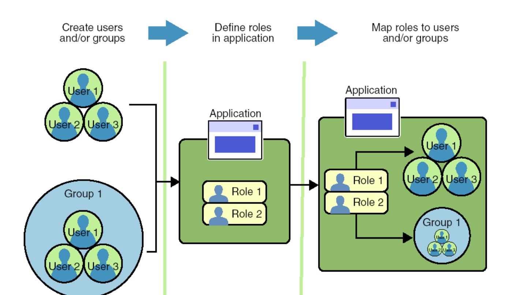

Consulta policy di sicurezza da applicare (derivanti da deployment
descriptor + annotation) per determinare i differenti ruoli di accesso

```

@Stateless public PayrollBean implements Payroll {
public void setBenefitsDeduction(int empId, double deduction) {...}
public double getBenefitsDeduction(int empId) {...}
public double getSalary(int empid) {...}
// setting del salario ha un accesso più restrittivo
@RolesAllowed(“HR_PayrollAdministrator”)
public void setSalary(int empId, double salary) {...}
}

```

Annotation:

- @RolesAllowed (valore è una lista di nomi di ruoli)
- @PermitAll,
- @DenyAll (applicabile solo a livello di singolo metodo)

### Intercettori

Perchè sono importanti componenti asincroni?
Svolgono operazioni molto onerose in modo asincrono. Ad esempio, richiedere la VM è asincrona perchè ci vuole tempo.

Perchè non ci piace l'intercettore?
Cambiare stati, spargere il codice su più metodi e diventa difficile controllare il codice. perchè mettere il codice di un bean dentro all'intercettore?

## JPA

### Cos’è JPA e cosa fa? Perché JPA e non DAO?

JPA è la specifica Java standard che consente il supporto al mapping O/R.

Astrarre: usiamo le annotazioni semplificando il modello della programmazione
Vista performance: nel 2.1 la connessione era da gestire esplicitamente dallo sviluppatore. Nella 3 la gestione è demandata al container in modo da ottimizzare le risorse.

Ho un unico framework che può essere usato nel mondo Java (standard ed enterprise edition)

DAO: bisogna aprire la connessione, inviare la query, ottenere i risultati. Programmazione molto meno intuitiva.
Svantaggi:
- No POJO
- Ogni oggetto apre una connessione
- Tutto dipende dal Data Source

### Cos’è un’entità in JPA? Che caratteristiche ha? Come può essere la chiave primaria?

- annatazione javafx.persistence.Entity
- cotruttore senza argomenti public o protected
- nessun metodo deve essere final perchè i valori devono essere modificati

### Come funziona l’ereditarietà per le entity? Quali sono le strategie di mapping possibili per gli ORM? Che performance comportano?

MappedSuperclass: integrare con codice non scritto da noi


### Come vengono gestite le molteplicità nelle relazioni? E la direzionalità?

- **SINGLE_TABLE**: tutte i campi in un'unica tabella con un attributo chiamato discriminator che consente di stabilire il tipo di Entity. Questo può servire per risalire alla tipologia dell'oggetto che ci interessa. Scarsa efficienza se abbiamo molti NULL nella tabella
- **TABLE_PER_CLASS**: ogni tabella ha colonne per ogni proprietà comprese quelle ereditatte dalle superclassi. Non c'è bisogno del discriminator e non è uno schema normalizzato
- **JOINED**: ogni tabella ha le colonne con valore con le sole proprietà definite nella classe specifica ma lo schema è normalizzato (schema non ridondante). Se bisogna normalizzare i dati non c'è ridondanza ma dobbiamo effettuare le join. Se la gerarchia è estesa il costo diventa molto alto.

Molteplicità delle relazioni: 1-1 N-1 N-M

### ORM Direzionalià delle relazioni.

Le relazion i possono essere mono o bidirezionali possiamo avere relazioni tra le varie entità un uno o in più sensi. Questo tipo di relazioni sono utili in caso di gestione di query da parte del container, per capire se le query possono passsare da un’entità all’altra.  Inoltre si possono utilizzzare per navigare tra le varie entità e capire Quali relazioni cancellare.

### Gestione a runtime di Entity

Cosa vaviene a runitme e come il container riesce a gestire tutte le info per la gestione della ersistenza. A livvelo di container abbiamo un Entity Manager che si occupa della persistenza. All’interno di tale contesto è come se entity vivessero con il loro cilo di vita. Il constesto di persistenza è quindi il luogo dove esistono tutte le istanze di entity. L’entity manager può essere utilizzato demandando completamente la gestione al container o gestendolo a livello applicativo. Come per le transazioni.

### Container managed entity manager

Tutto è interallaciato con la gestione delle transazioni, il conttesto è automaticamnete propagato dal container ai servizi applicativi. Oltre ad essere nello stesso container devono essere nello stesso contesto di persistenza quindi con l’annotazione @PErsistenceContext viene passtao Entity MAnger. In questo senso l’entity manager è container managed poiché è direttamnete passato. In vece se il contesto di persistenza non propagato ai servizi applicativi l’entity manager non è passato e questo contesto è utilizzato quando l’applicazione necessita di più contesti di persistena contemporaneamente.

Le enitiy vivvono all’interno di contesti di persistenza ciascuna di esse può avere 4 diversi stati. New/transient Entity sono instanze non associate, MAnaged sono associate Detached sono mo,mentaneamnete non asssociate a un contesto, Removed sono istanze er cui è stato avviato il processo di eliminazione dal datastore.

### Ciclo di Vita

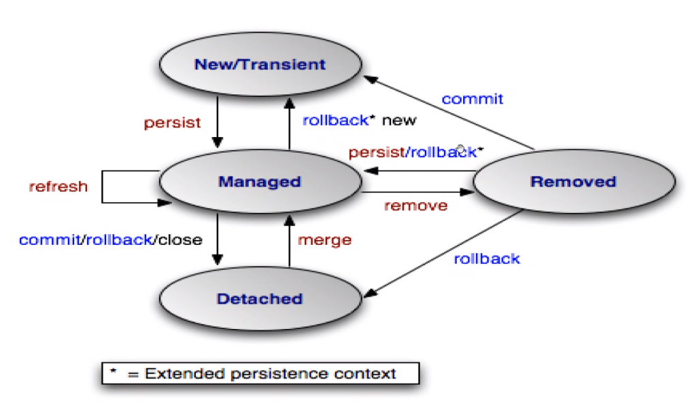

La refresh nello stato managed serve quando abbiamo necessita di aggiornarne lo stato. Soprattutto in caso di transazioni non ACID esempio nel caso della mandatory.

Le nuove istanze diventano gestitee con l’invocazione del metodo persist dell’entity manager, oppuere il metodo persist viene chiamato da un’entity correlata e a cascata sono persistiti anche gli oggetti in rrelazione con quello su cui stiamo agendo. I dati sono memorizzati nel DB quando le transazioni associati alla perist sono state completate.

Per propagare le perisst usiamo le annotazioni one to many e le mandiamo a molti. Le istanze di entity possono essere rimosse e quando invochiamo la remove fallisce solo in caso che sia detached viene isgnorata se lo stato è new entity e se è gia stata rimossa.

Per sincronizzarsi con il DB bisogna effetuare il commit della transazione a quel punto viene salvata nel db. Se abbiamo cascading attivata o comunque relazioni bisdirezionali la commit crea una reazione a catena. Ossiamo forzare la commit con l’operazione di flush.

Creazione di query che devono essere conformi allla specifica java peristence e la specifica consete la definizione di query all’interno della logia di business. Tutto ciò è scritto con un liguaggio SQL like di JAVA.

Questo serve per costruire query dinamiche popolabili con i valori che le variabili assumono. Le query statiche invece vengono create con l’annotazione name o query.

I parametri con nome sonom parametri di query preceduti da : sono legati al valore dal metodo javax.persistence.Query.setParameter()

### Unità di Persistenza

Insieme di tutte le classi gestite dall’entity manager in un’applicazione. Rappresenta l’insieme di dati che sono significativi e sui quali vogliamo agire per una certa applicazione e che sono contenuti in un unico data store. L’entità di persistenza è un concetto legato al deployment e dato un datastore sappiamo quali sono tutti i componenti su cui lavorare per arrivare a quello store. Nel caso del contesto di persitenza ragioniamo in termini di transazioni da effettuare e nel senso degli oggeti che devono essere persistiti,  non in termini di deployment delle classi,. Queste due cose sono ortogonali. 

Per le unità di persistenza possiamo definire un data source e poi tutti i vari componenti coinvolti- JTA data source specifica il nome JNDI globale della sorgente dati che deve essere utilizzata dal container. 

Controllare il caricamento dei dati:

il caricamento è lazy o eager. In caso di caricamento lazy le entità sono caricate solo nel momento in cui andiamo a usarle.  Se invece utilizziamo il caricamento eager l’entità viene caricata quando è caricata l’entità padre. In generale usiamo eager per realtà ristrette e lazy in tutti gli altri casi in alcune applicazioni non ci interessa portarci dietro tutte le relazioni in cascata. Utile se usiamo sotto-parti e utilizziamo il resto dello stato solo in alcuni casi per le entità in relazione. 

JPA definisce una specifica e un linguaggio di Query che ha l’obiettivo di essere indipendenti dal data store. Che vuole essere indipendente dal data store che siano relazionali o meno.  PORTABILITA’ e INDIPENDENZA.

Le annotazioni iniettano nel container degli schemi per le relazioni tra entità. Possiamo definire query che lavorano su un contesto di persistenza definito da tutte queste annotazioni. 

Entity manager svolge funzionalità svolge un’attività di controllo dei data object e di data transfer verso il data store. Gestisce il ciclo di vita degli oggetti con la sincronizzazione tra contesto di persistenza e DB. 

Il contesto di persistenza è uno stato che è gestito in modo transazionale e su questo vengono invocate localmente tutte le operazioni di persistenza ma il momento esatto in cui verranno fatte flush e commit non lo conosciamo poichè è tutto demandato al container. 

Find e remove degli ordini sono anche esse effetuate con flush e commit in caso di remove o find di un entità già rimossa o non disponibile una entity gia rimossa restituisce i risultati non definiti.

Merge nel caso in cui si voglia lavorare su entity detached che non sitrovano ancora nel contesto di persitenza tutte le modifiche fatte all’entity detached vengono applicate con la merge facendo diventare l’istanza manage. 

Listener di Entity, invocati dal provider della persistenza con metodo di call back si occupano diaggiurnare gli stati e di relazionarsi con il DB. Il listener serve per effettuare controlli quando si cambia lo stato. Quindi è un controllo uteriore per controllare che sia possibile effettuare la persist e cambiare lo stato. L’obiettivo è quello di effettuare controlli e aggiornamenti prima o dopo le operazioni che riguardano la persistenza dei dati. 

Il contesto ersistenza è una sorta di cache del databease che mantiene lo stato.

Singolo entity manager utile per la gestione semplifica le transazioni e il contesto di prsistenza.

Molte enity e molti db con una relazione un entity un db.

Entity manager multipli veros lo stesso db per gestire tabelle diverse dello stesso db e avere diversi contesti di peristenza per gestirli in modo diverso e separare i contesti e le diverse transazioni collegate. 

La propagazione del contesto di persistenza è possibile e può essere fatto su più transazioni. Quando lo stato viene persistito con la commit verso il database stacchiamo l’oggetto dal contesto di persistenza che entra nello stato di detached. Questo può portare a stati non significativi. 

Quando lavoriamo con le entity dobbiamo verificare che le entity siano ancora collegate e attive.

### Hibernate

Ha l’obiettivo di realizzare la persistenza di oggetti POJO. Passando dal mondo object oriented al mondo relazionale. Facilita la gestione di oggetti persistenza. La gestione del cahing è ancora più esplicita, di jpa, ha un supporto alla scrittura di query. 

SessionFactory consente di creare oggetti Session e mantenere le risorse necessarie per cache di primo e secondo livello. L session di hibernate è un contesto di persistenza che viene gestito dall’inizio alla fine dalle transazioni. Va a gestire anche il ciclo di vita degli oggetti persistenti e operaa da factori per gli oggetti transaction. Gli oggetti peristenti sono oggetti per cui vogliamo mantenere uno stato persistente e devono essere inseriti in un contesto di persitenza con una session che operae lavora come una cache. Quado si chiude una sessione gli oggetti diventano detached e possono essere usati sapendo che non c’è iù un collegamento con il db. Gli oggetti transient o detached hanno istanze non legate alla session. Modificando gli oggetti no modificihiamo il db ciò avvine solo con la perist o la merge. Le transazioi sono oggetti single therad che servono a specificare unità atomiche di lavoro astraendo dai dettagli delle librerie e dei framework che usiamo. Unsa session può essere usata più transaction.

Abbiamo 3 possibili stati, transient non appartiene al contesto di persistenza persistent appartiene al  contesto di persistenza detached è un istanza che non è al momento nel contestio di persistenza poiché è stat scollegata.

Stato transient non è mai associato a un contesto di persistenza e quetso accacde quando definiamo un’istanza fuori da una sessione. Nello stato persistent l’stanza è associata a una sessione e il suo stato corrisponde a una riga del db. Detached quando un’istanza che corrisponde a uno stato di persistenza viene staccata, questo però non vuol dire che sia aggiornata.

Le transizioni di stato al momento della delete di un oggetto quell’oggetto diventa transient.

### Il caching in hibernate

In genrale migliora la performance dei sistemi che consente un miglioramento delle prestazioni accedendo al database solo se lo stato necessario non è presente in cache. In caso in cui tutti gli oggetti siano nella sessione faccio tutte le operazioni posticipando l’accesso  al db solo per la flush e non per le varie parti della tnsazione. Ovviamente essendo delle cache quindi una trnsazione può avere necessità di svuotare l cache se sappiamo che quancuno esternamente sta modificando il db e quindi dobbiamo ripopolare i valori per riallinearlial db.

Esistono due livelli di cache uno associata alal sessione  e una associata alla session factory ovvero legata alla getsion edel supporto al cahing. Le cache di primo livello hanno i confini della transazioni e sono legati alla sessione ci consnete di fare meno uery sul db quindi ci sono solo statement inziiali e finali senza stati intermedi. Le cache di secondo livello mantendgono informazioni utilizzabili da diverse transazioni.

Per l’invalidazione della cache usiamo una strategia ottimistica poiché si assume che la maggiorarte delle transazioni verso il db non siano in conflitto con le altre. Se ciò è vero riusciamo ad avere un throughput molto alto. Le modifiche da fare in caso di collisioni sono possibili con un versioning dei dati che consente di cìfare dei check e controllare i dati. 

Il version checking non sono sempre automatici però abbiamo una proprietà @Version che viene salvata e mantiene la versione dell’entità. Lanciando un’eccezione se gli stati di sono diversi ci rendiamo conto se ci sono stati conflitti. In caso di conflitti effettueremo refresh e update. 

### Hibernate Fetching dei dati

Per fare fetching (caricare dati dal db alla memoria) possiamo usare varie stretegie che si possono indicare a priori nel file di mapping o successivamente nelle query con override. Le modalità di fetching sono Default, Join Select. La seconda select avviene solo quando accediamo i dati. Simile a eager o lazy

Ricerche di tipo associativo il programmatore definisce i Criterion, con una interafccia che li relaizza e definendo il criterio di interesse. Si va quindi a costruire i criteri riempiendoli con elementi che rendono la ricerca associativa in modo trasparente cercando nel dtabase tuple che facciano match il programmatore in questo modo non deve conoscere il linguaggio sql e può effettuare ricerche in modo trasparente attraverso il framwork stesso.

Nelle ultime versioni di JPA c’è la possibilità di versioning.

Su hibernate la cache di secondo livello serve per la trasversalità tra diverse applicazioni.

## JMS

### Perchè usare un servizio di messagistica

L’importanza dei sistemi di messaging è dovuto principalmente alla comunicazione disaccoppiata (o loosely coupled) e asincrona ( = sincrono non bloccante). I messaggi sono lo strumento principale di comunicazione fra applicazioni (modello a scambio di messaggi). Il software di supporto allo scambio di messaggi fornisce tutte le funzionalità necessarie e prende il nome di Message Oriented Middleware (MOM)/Messaging system/ Messaging server/Messaging provider/JMS provider.

I vantaggi del MOM sono l’indipendenza rispetto al dove si sta lavorando e rispetto alla locazione di rete. In particolare, non c’è più l’assunzione che il cliente conosca la locazione del servitore. Nel modello client-server, il client conosce la locazione del servitore ma questo non avviene nei MOM: è il sistema di messaggistica che si occupa di smistare i messaggi verso il destinatario consentendo il completo disaccoppiamento. Il disaccoppiamento avviene sia nello spazio, ovvero non bisogna più conoscere la locazione del destinatario, sia nel tempo, ovvero non devono essere online entrambe le entità contemporaneamente.

I vantaggi dal punto di vista architetturale in un’applicazione distribuita di grandi dimensioni sono:

- La scalabilità ovvero la capacità di gestire un numero elevato di clienti senza cambiamenti nella logica applicativa, senza cambiamenti nell’architettura e senza (grosso) degrado nello throughput di sistema. Infatti, si tendono a incrementare le capacità hardware del sistema di messaging se si desidera una maggiore scalabilità complessiva.
- La robustezza ovvero i consumatori, i produttori e la rete possono avere un fault senza problemi per il sistema di messaging. Da la possibilità di scalare le entità nel modo giusto nel caso dei MOM riusciamo a lavorare in modo non più monolitico ma a microservizi, divindedolo in varie funzionalità, quindi il servizio di messaggistica ci supporta la scalabilità con il disaccoppiamento. A sua volta il MOM deve essere robusto. Con la robustezza si può garantire la transazionalità delle comunicazioni. Quindi, grazie al MOM se avvengono dei fault in diversi punti del sistema, nelle altre isole del sistema il resto può continuare a funzionare.

Tra gli esempi di sistemi di messaging ci sono le transazioni commerciali che usano carte di credito, i report con previsioni del tempo, i workflow, la gestione di dispositivi di rete, la gestione di supply chain, il customer care, ma soprattutto vengono usati nelle architetture distribuite e cloud a tutti i livelli (dai livelli più bassi fino al livello applicativo).

Si possono avere due modelli di messaging:

- point to point;
- publish subscribe.

Le principali caratteristiche sono:

- affidabilità;
- operazioni con logica transazionale, ovvero trattano lo scambio di messaggi come transazione con la possibilità eventuale di persistere i messaggi;
- messaging può essere distribuito;
- sicurezza.

I MOM poi possono supportare altre funzionalità: come la qualità dei canali, transazioni sicure, auditing, load balacing.

### Modello point-to-point 

La comunicazione è un collegamento tra sole due entità. Questo modello viene utilizzato quando il produttore vuole contattare solo il proprio consumatore, questo serve per far parlare dei dispositivi mobili, con molte disconnessioni che appaiano e scompaiono, nel servizio, ovvero quando vi è la necessità di disaccoppiare molto, il MOM si comporta come proxy che mantiene i messaggi. Un messaggio è consumato da un singolo ricevente, ci possono essere produttori multipli, ovviamente, la _destinazione_ di un messaggio è una coda con nome (named queue). Le code sono FIFO (per lo stesso livello di priorità), i produttori inviano messaggi a named queue specificando un livello di priorità desiderato. Questo ovviamente introduce attese ma consente la priorità. Possono essere anche organizzate a tuple (argomenti) o guardando il payload dei messaggi con l’utilizzo di filtri per smistare i messaggi.

In un caso mobile se si ipotizza la disconnessione dei destinatari si dovrebbe avere persistenza dei messaggi.

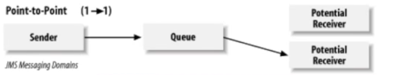

### Modello publish/subscriber

Il modello publish/subscriber è un modello 1-N dove il messaggio viene consumato n volte. Il consumatore deve dire al MOM che è interessato a quella comunicazione. Un messaggio è consumato da riceventi multipli, la _destinazione_ di un messagggio è un argomento con nome (named topic), i produttori pubblicano su una coda chiamata topic, mentre i consumatori si _abbonano_ al topic.

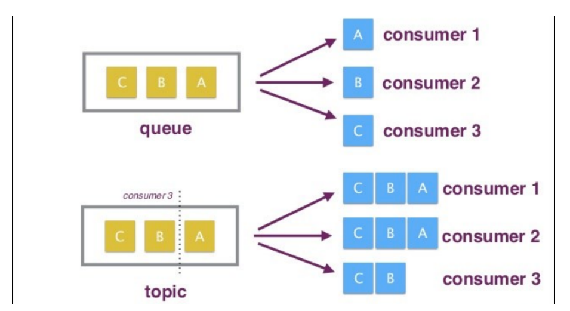

Sono possibili diverse configurazioni del MOM per cui si può ipotizzare che non ci sia persistenza e quindi i messaggi che sono stati inviati quando un consumatore non era presente sono stati persi.

### Affidabilità nello scambio di messaggi

Più la semantica di affidabilità è stringente più il throughput del sistema si abbassa. Tutti i sistemi di messaging moderni supportano la persistenza dei messaggi, che eleva il livello di affidabilità stessa.

### Transazionalità

Produzione transazionale, il produttore può raggruppare una serie di messaggi in un’unica transazione, o tutti i messaggi sono accodati con successo o nessuno. Nel consumo transazionale, invece, il consumatore riceve un gruppo di messaggi come serie di oggetti con proprietà transazionale, fino a che tutti i messaggi non sono stati consegnati e ricevuti con successo, i messaggi sono mantenuti permanentemente nella loro queue o topic. Per garantire transazionalità il MOM deve utilizzare un reository persistente.

Lo scope della transazionalità è di due tipi:

- scope client-to-messaging system in cui le proprietà di transazionalità riguardano l’interazione fra ogni cliente e il sistema di messaging.Questo è lo scope supportato da JMS:
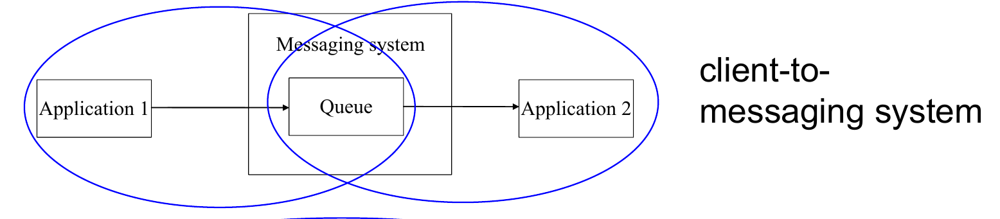
- scope client-to-client dove le proprietà di transazionalità riguardano l’insieme delle applicazioni produttore consumatore per quel gruppo di messaggi, questo non è supportato da JMS:
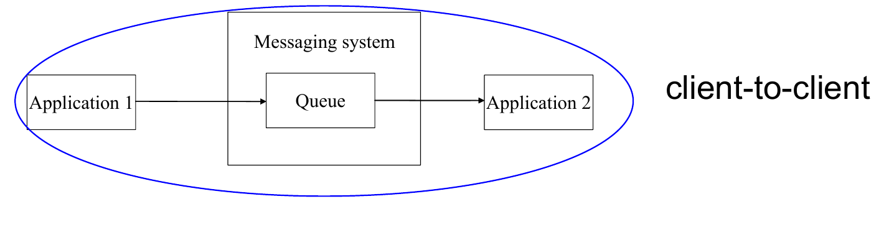

La seconda opzione è molto complessa e non viene garantita da molti MOM. Inoltre il sistema di messaggistica può essere distribuito e questo può rendere complicata la transazionalità.

Ovviamente il sistema di messaging può essere distribuito a sua volta. I sistemi di messaging possono realizzare un'infrastruttura in cui i messaggi sono scambiati fra server nel distribuito ma questo complica la transazionalità.

### Sicurezza

Il supporto alla sicurezza del MOM è dato da autenticazione confidenzialità e integrità:

- L’**autenticazione** consente l’utilizzo di certificati.
- La **confidenzialità** è garantita dall'encription effettuata sui messaggi in particolare sul payload.
- L’**integrità** con l’utilizzo di un'impronta (digest) dei messaggi.

La sicurezza e la sua gestione è dipendente dal vendor del sistema di messaging. Con JMS non si offre un servizio diretto di sicurezza ma esistono API che consentono di implementare varie politiche di sicurezza. JMS consente unicamente di definire il servizio.

### JMS

JMS è un insieme di interfacce Java (e associata definizione di semantica) che specificano come un cliente JMS possa accedere alle funzionalità di un sistema di messaging generico. JMS fornisce il supporto alla produzione, distribuzione e consegna di messaggi, alle diverse semantiche per message delivery, ovvero Sincrona/asincrona (bloccante/non-bloccante), con proprietà transazionali, il supporto sia a modello Point-to-Point (reliable queue) che Publish/Subscribe con selettori di messaggio lato ricevente, e cinque tipologie di messaggi possibili.  JMS è un supporto che fornisce interfacce generiche non è la specifica le varie semantiche possono essere implementate.

JMS è parte della piattaforma J2EE, ma non necessita di EJB container per essere usato, è solo fortemente integrato. Gli obiettivi sono di avere dei JMS provider generici che dietro le quinte lavorano con sistemi di messaggistica preesistenti, con consistenza con le API dei sistemi di messaging esistenti, indipendenza dal vendor del sistema di messaging, copertura della maggior parte delle funzionalità comuni nei sistemi di messaging e infine la promozione della tecnologia Java per sistemi messaging.

Architettura: Clienti JMS e non-JMS, Messaggi, Provider JMS (sistema di messaging dipendenti dal specifico vendor), gli oggetti sono amministrati tramite JNDI per recuerare Destination e ConnectionFactory

### Tipi di comunicazioni

Nella comunicazione point-to-point i messaggi in una queue possono essere persistenti o non persistenti. Nella comunicazione Pub/Sub, i messaggi non durevoli sono disponibili solo durante l’intervallo di tempo in cui il ricevente è attivo, se il ricevente non è connesso, la semantica consente la perdita di ogni messaggio prodotto in sua assenza. I messaggi durevoli, invece, sono mantenuti dal sistema, che fa le veci dei riceventi non connessi al tempo della produzione dei messaggi, il ricevente non perde mai messaggi quando disconnesso.

### Formato del messaggio 

JMS definisce formati di messaggi e payload possibili. I messaggi sono  una modalità di comunicazione disaccoppiata fra le applicazioni. I veri formati che attualmente sono utilizzati per l’encoding dei messaggi sono fortemente dipendenti dal vendor del sistema di messaging. Un sistema di messaging può interoperare completamente solo al suo interno, JMS fornisce quindi solo un modello astratto e unificato per la rappresentazione interoperabile dei messaggi attraverso le sue interfacce, i sicngoli vendor personalizzano i formati e questi sono fortemente dipendenti da essi, i vari vendor spesso non riescono a comunicare, vi è una perdita di interoperabilità dovuta al fatto che Java lascia libertà nella definizione dei protocolli.

Header utilizzato per l’identificazione del messaggio e il suo routing, include la destination e la modalità di consegna (persistente, non persistente), timestamp, priorità, campo ReplyTo che serve al ricevente per risondere. JMS aggiunge gradi di libertà strutturati per aggiungere nuove feature che sono le proprietà dei messaggi  (coppie nome/valore) personalizzate dai vendor tali proprietà possono essere: campi application-specific, campi dipendenti da e specifici di un particolare sistema di messaging, campi opzionali Elenco delle proprietà: JMSDestination, JMSDeliveryMode (persistente o no), JMSMessageID, JMSTimeStamp, JMSRedelivered, JMSExpiration, JMSPriority, JMSCorrelationID, JMSReplyTo (destinazione fornita dal produttore, dove inviare la risposta), JMSType (tipo del corpo del messaggio). L’idea di dividere l’header dalla propiretà è dovuta la fatto che i Mom possono scegliere di guardare o meno alle proprietà e può farlo senza aprire il payload. 

Il payload ovviamente, il contenuto del messaggio, supporta diversi tipi di contenuto, ogni tipo definito da una interfaccia: StreamMessage, MapMessage, TextMessage, ObjectMessage, BytesMessage Ad esempio: StreamMessage contiene valori primitivi e supporta lettura sequenziale, MapMessage contiene coppie nome/valore e supporta lettura sequenziale o by name, BytesMessage contiene byte “non interpretati” e viene utilizzato di solito per fare match con formati preesistenti.  Queste sono interfacce locali per interrogare i payload. 

L’interfaccia destination rappresenta l’astrazione di un topic o di una queue (non di un ricevitore di messaggi) le interfacce figlie per Queue e Topic.. astrazione di una destinazione punto punto o pub sub. Per aggangiarsi al sistema MOM.

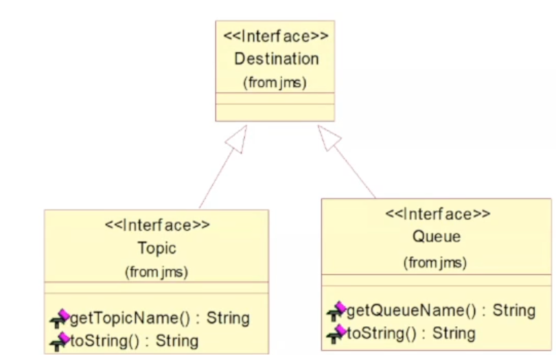

L’interfaccia ConnectionFactory implementata dalla classe factory per creare una connessione provider-specific verso il server JMS, è simile al gestore di driver (java.sql.DriverManager) in JDBC. Le interfacce figlie per QueueConnectionFactory e TopicConnectionFactory.

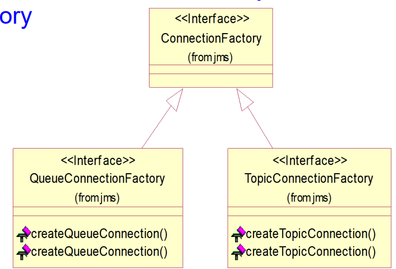

Interfaccia connection factory è un’astrazione che rappresenta un singolo canale di comunicazione verso il provider JMS. La connessione viene creata da un oggetto ConnectionFactory, la connessione dovrebbe essere chiusa quando si è terminato di utilizzare la risorsa.

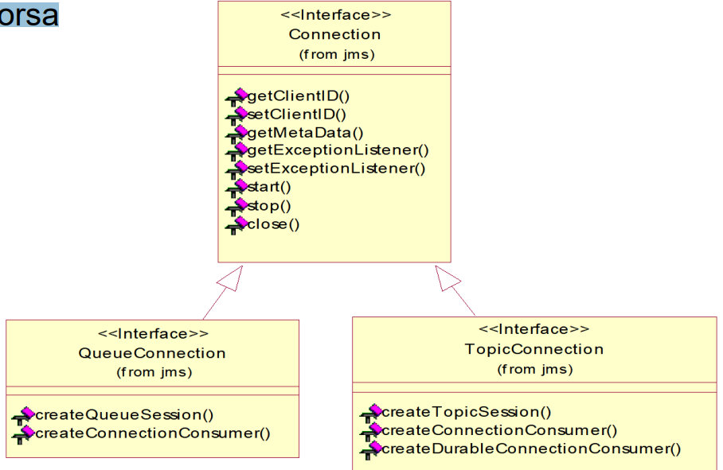

L’interfaccia Session è creata da un oggetto Connection. Una volta connessi al JMS provider attraverso una Connection, tutte le operazioni si svolgono nel contesto di una Session attiva, ogni sessione è singlethreaded, ovvero ogni operazione di invio e ricezione di messaggio avviene in modo serializzato. Le sessioni realizzano un contesto "limitato" con "proprietà transazionali"

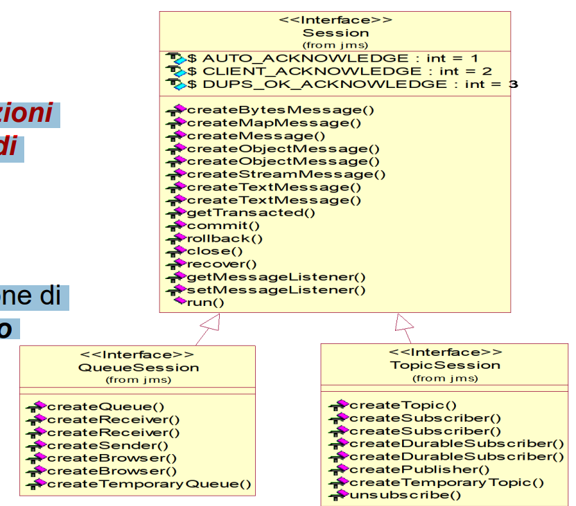

Le interfacce Message Consumer e Message Producer. Per inviare un messaggio verso una Destination, il cliente deve richiedere esplicitamente all’oggetto Session di creare un oggetto MessageProducer Analogamente per l’interfaccia MessageConsumer i clienti che vogliono ricevere messaggi creano un oggetto MessageConsumer (collegato ad un oggetto Destination) attraverso Session. Vi sono due modalità di ricezione dei messaggi: blocking, nonblocking

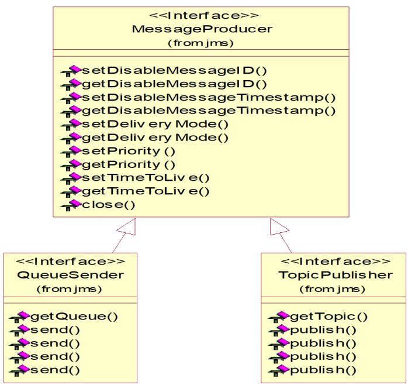

Modalità blocking: solito metodo receive() bloccante. Modalità non blocking: il cliente registra un oggetto MessageListener, quando un messaggio è disponibile, il provider JMS richiama il metodo onMessage() di MessageListener (callback).

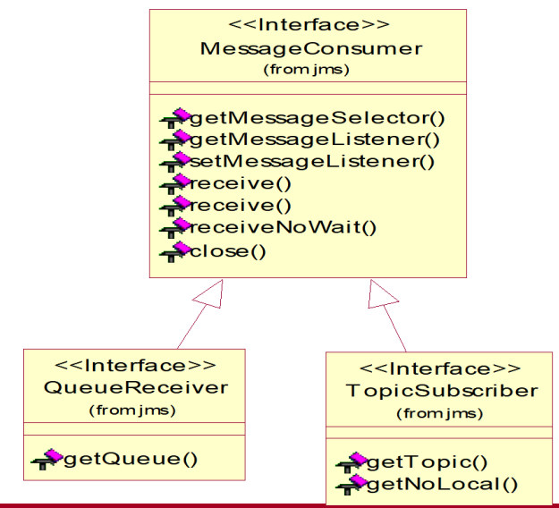

In questa slide dall’alto verso il basso abbiamo tutte le astrazioni per le due parti 1-1 e 1-N ci sono diverse tipologie di messaggi dovuti alle diverse persistenze


Diagramma di flusso con tutte le operazioni necessarie ad abilitare le comunicazione.

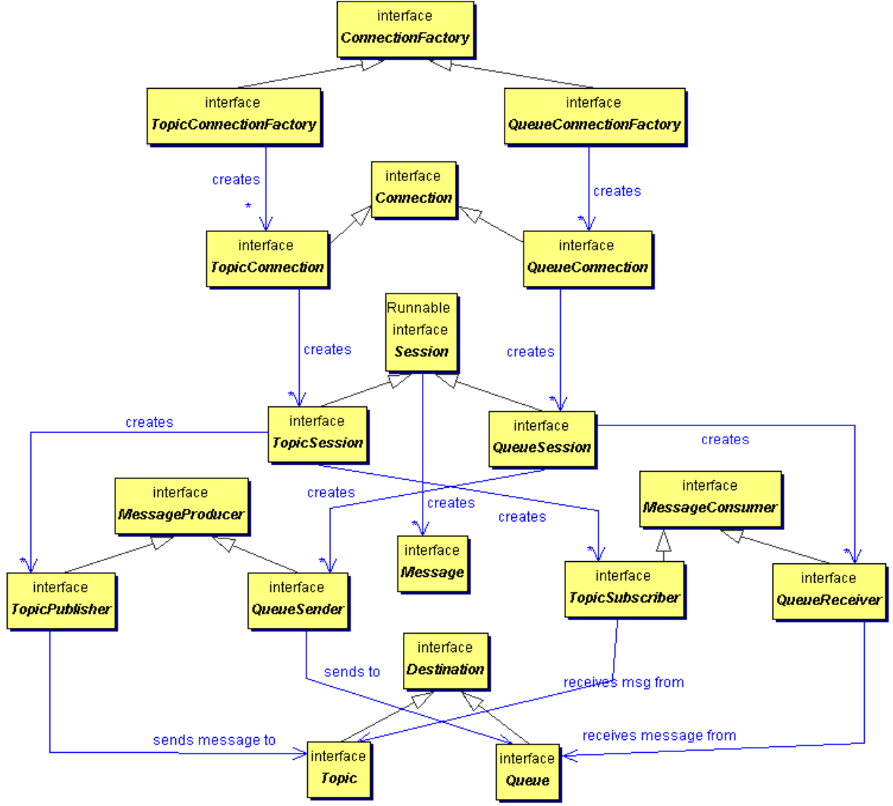

### Affidabilità dei messaggi

JMS offre diversi livelli di affidabilità dei messaggi. Il livello più alto si ottiene quando abbiamo la persistenza dei messaggi, fattibile con la subscription durevole a un certo topic o con la ricezione da queue avendo la persistenza del messaggio spedito o ricevuto se il ricevente si è assentato per un certo tempo con l’utilizzo di transazioni.

Nell’affidabilità di base(Basic reliability) vi è l’utilizzo di messaggi ACK, l’utilizzo di messaggi peristenti, la possibilità di definire dei time to live, la configurazione dei livelli di priorità e l possibilità di consentire l’expiration dei messaggi.

Nell’affidabilità avanzata (advanced reliability) possiamo avere abbonamenti durevoli e l’utilizzo di transazioni locali, ovvero transazioni che non possono essere garantire in tutto il percorso end to end ma solo tra consumatore e provider e/o tra provider e produttore.

### ACK

Alla ricezione di un messaggio si possono effettuare varie operazioni, prima di tutto vi è il processamento, dopo di che, se necessario vi è lo scambio di ack con varie modalità associate a ciascuna sessione. Se ci sono sessioni con transazionalità, vi è un ack automatico al commitment, poi per la proprietà del tutto o niente in caso di rollback vi è il rinvio di tutti i messaggi. In sessioni senza transazionalità il numero di ack scambiati dipende dall’attributo specificato in createSession().

I vari tipi di ack dipendono da chi stimola l’ack:
- Auto acknowledgment ack generato automaticamente dai metodi MessageConsumer.receive() o MessageListener.onMessage() se la return ha successo e inviato dal supporto.
- Client acknowledgment il cliente a livello applicativo si fa carico di inviare l’ack con la chiamata al metodo acknowledgement(), questo è cumulativo quindi conferma tutti i messaggi inviati nell’intervallo che è passato dal penultimo ack a quello corrente.
- Lazy acknowledgment viene inviato saltuariamente senza limiti nel numero di messaggi, sempre in modo cumulativo. Questo tipo di ack è inviato dal supporto ovvero da JMS stesso.

Tutti i tipi di messaggi ack hanno la possibilità di essere duplicati e quindi ritrasmessi. Nel caso di auto_ack vi sono  differenze tra caso con persistent e non persistent. Nel caso persistent (supponendo il non fallimento dello storage dove sono salvati i messaggi) possiamo avere duplicazione del messaggio perchè in caso di crash del server, quando questo torna in modalità up and running si rende conto che l’ack precedente non è stato inviato e lo rimanda a l consumer. Questo grazie allo storage persistente. In caso di client_ack ci possono essere duplicati perché ci possono essere situazioni simili a quella precedenti con più ritrasmissioni se più messaggi sono stati persi a causa della politica cumulativa. In caso di lazy_ack abbiamo duplicazione ma i messaggi da rinviare potrebbero essere ancora di più di quelli delle modalità precedenti poiché la decisione di mandare ack e presa dal supporto a piacere. In generale è meglio che le applicazioni siano idempotenti e quindi che implementino la ritrasmissione.

In produzione posso avere una semantica bloccante per la send() che risulta in generale essere più semplice della receive(). Il client manda il messaggio il server lo persiste e manda l’ack solo dopo questa operazione, a questo punto la publish ritorna, tutto è molto più sincronizzato. L’ack è bloccante per la send() localmente al produttore. Anche in questo caso vi è la ritrasmissione dei messaggi.

Nell’invio dei messaggi vi sono due diversi modi di gestire la persistenza che si differenziano per la modalità di consegna. La modalità persistent richiede la persistenza quindi il provider ha la responsabilità di non perdere il messaggio e questo grazie allo storage è possibile. Il non persistent non dà garanzie rispetto al fault ma non ha problemi relativi al collo di bottiglia generato dallo storage quindi è possibile sostenere un high rate nell’invio con migliori performance.

Vi è un trade-off tra il numero di ack che possiamo inviare l’overhead che introduciamo e il livello generale di affidabilità che vogliamo raggiungere. Quanto bisogna coinvolgere la parte applicativa nella gestione degli ack, coinvolgere molto il client nella gestione degli ack può aiutare a diminuire l’overhead legato al gfatto di non inviare più un ack per ogni messaggio dall’altra parte però il livello applicativo che si prende in carico l’invio dei messaggi deve essere ben fatto e con maggiore cura. L’API permette quidi di gestire diversamente l’invio dei messaggi.  

### Priorità

Attributo che fa parte dell’header del messaggio (JMSPriority), a livello di API, quindi è una parte funzionale che tutti devono trattare, sono attributi che sono sempre visibili dall’API, questa è una decisione forte a livello di supporto presa al momento della progettazione.

La priorità e impostabile sia a livello di produttore del messaggio sia per il singolo messaggio, funziona allo stesso modo anche il TimeToLive, la priorità ha una scala di importanza da 0 a 9 e a default è impostato a 4, per il TTL bisogna invece impostare il valore in secondi. La priorità si imposta con il metodo setPriority() e il TTl si imposta con setTimeToLive() dell’interfaccia MessageProducer.

La configurazione dei livelli di affidabilità è spesso determinata da scelte di default o prese alla creazione di Destination. Per la basic reliability:
- Persistenza scelta a livello di singolo messaggio, ad es. interfaccia MessageProducer 
- Controllo degli ACK  scelta a livello di sessione, interfaccia Session 
- Livelli di priorità scelti a livello di singolo messaggio, ad es. interfaccia MessageProducer 
- Expiration time scelto a livello di singolo messaggio, ad es. interfaccia MessageProducer Advanced Reliability 
- Sottoscrizione durevole scelto a livello di sessione, interfaccia Session 
- Transazionalità scelto a livello di sessione, interfaccia Session

### Durable Subscription

Il durable subscriber si va a registrare con una identità univoca, perché un subscriber durevole potrebbe non essere sempre presente, quindi bhobisogno di un naming durevole per ricondurre sempre i messaggi allo stesso subscriber. Se un durable subscriber non ha clienti attivi il provider JMs mantiene questi messaggi fino a quando non vengono effettivamente consegnati oppure non avviene expiration. All’interno di una singola  applicazione, una sola session può avere durable subscription a un deteminato named topic ad un determinato istante.

### Gestione delle transazioni di JMS

Lo scope delle transazioni in JMS è solo fra clienti e sistema di messaging, non fra produttori e consumatori. Quindi un gruppo di messaggi all’interno di una singola transazione è consegnato come un’unica unità lato produttore e un gruppo di messaggi in una transazione è ricevuto come un’unica unità lato consumatore.  Le Transazioni possono essere gestite localmente e sono controllate dall’oggetto Session. La transazione inizia implicitamente quando l’oggetto di sessione è creato e termina all’invocazione di Session.commit() o Session.abort(). La sessione è transazionale se si specifica il flag appropriato all’atto della creazione. Ad esempio: QueueConnection.createQueueSession(true, …). Eventualmente le transazioni possono essere anche essere gestite in modo distribuito, in tal caso devono essere coordinate da un transactional manager esterno, ovvero Java Transactions API (JTA). Le applicazioni possono controllare la transazione attraverso metodi JTA, tuttavia l’utilizzo di Session.commit() e Session.rollback() è non consentito. In questo modo,c con l’utilizzo di JTA, le operazioni di messaging possono essere combinate con transazioni salvate su DB in una singola transazione complessiva.

### Selettori di messaggi

I selettori sono filtri la cui logica di filtraggio è specificabile con stringe SQL like (SQL92) che possono lavorare sui messaggi in arrivo per estrarne solo alcuni. Lato receiver, le applicazioni JMS possono utilizzare selettori per scegliere i soli messaggi che sono potenzialmente di loro interesse, non possono riferire il contenuto dei messaggi, ma solo proprietà e header, non possono leggere il payload. I selettori consentono una gestione più semplice e rimuovono overhead dal provider e dal supporto. Il fatto che non sia content base è dovuto al fatto della retrocompatibilità con i precedenti MOM. 

### JMS e MDB

I MDB vengono istanziati e prelevati da un poll di istanze quando il messaggio viene ricevuto, vi è un JMS provider che invia i messaggi a istanze di MDB che si sono registrati per la ricezione. Il tutto è asincrono con l’idea che ci sia un produttore che immette i messaggi in una queue o in un topic con una semantica uno a molti, a questo punto il messaggio da qui arriva a un listener che lo recapita al MDB con metodo di callback tipicamente, a questo punto vi è un applicazione con un EJB client legato all’applicazione che interagisce con una parte di business dell’applicazione stessa un Business Logic Bean (un session bean con dietro entity bean per esempio), che va a interagire con con il DB, il bean in questione può poi persistere dei dati su DB oppure diventare lui stesso un altro produttore verso un'altra destinazione JMS. 

L’applicazione può per parti lavorare in modo sincrono e per altre lavorare in modo asincrono sfruttando le potenzialità di JMS.

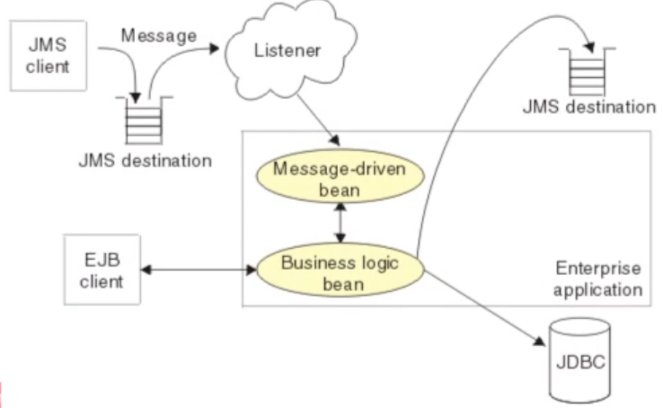

### ENTERPRISE SERVICE BUS

Il tema principale su cui si soffermano gli Enterpise Service Bus è l’integrazione di sistemi di grandi dimensioni. In particolare per la possibilità di mettere insieme  parti di questi sistemi che sono legacy preesitsenti e parti nuove sviluppate di recente. In qeusta direzione dsi sono sviluppati gli ESB infrastrutture molto large con principi di integrazione che sono condivisi. L’idea è di avere disaccopiamento forte e quindi MOM a supporto della comunicazione, l’utilizzo di SOA con l’obiettivo di avere servizi che lavorano molto e comunicano poco, solo quando vi sono riposte complete.  Mettiamo insieme sistemi losely coupled con servizi a grana grossa. La parola bus significa facilitare la presentazione ovvero mettere insieme dei servizi molto eterogenei attraverso una funzionalità di trasformation e routing intelligence. Questo servizio garantisce anche la standardizzazione. Middleware che disaccoppia molto la comunicazione. Modello asincrono e pubsub con in mezzo un intermediario ovvero l’enterprise service bus che offre molte più funzionalità di un mom, ma comunque garantisce lo scambio di messaggi che porta a un’elevata asincronicità e conseguente disaccoppiamento. Le principali caratteristiche sono:
- Disaccoppiamento  
- Gestione dei “topic”  
- Controllo degli accessi  
- Struttura messaggi  
- QoS configurabile

### Service Oriented Architecture SOA

Un SOA mette a disposizione servizi a grana grossa completi e autonomi, interfacce astratte ben fatte che definiscono contratti tra Consumer e Provider, scambio di messaggi che compongono le operazioni invocabili sui servizi di input e output, registri dei servizi con naming e trading, possibilità di comporre i servizi in processi di business, ovvero molti servizi messi insieme seguendo le linee guide SOA, tutto questo ha  l’obiettivo di ottenere  accoppiamento debole, e quindi flessibilità di business, interoperabilità tra le applicazioni, indipendenza rispetto alle tecnologie di implementazione, grazie alle interfacce molto astratte.

Azure espone api con interfacce rest.

### WEB SERVICES

Infrastrutture che soddisfano le caratteristiche SOA per l’interazione tra applicazioni basata sul concetto di “servizio”, che utilizzano interfacce web, in particolare operano sulla porta 80. Tali Web services sfruttano essenzialmente tre tecnologie, o API al mondo esterno: WSDL è un file contenente la descrizione del web service, descrizione scritta in xml che contiene le funzionalità offerte da quel servizio, SOAP è la descrizione di un protocollo per lo scambio di messaggi si cambiano “buste soap” che contengono file xml (indipendenti dal linguaggio) con diversi contenuti che vengono scambiati, le buste soap possono essere trasmesse con http per garantire massima interoperabilità. UDDI è un servizio di trading che consente la discovery dei servizi, restituisce un file WSDL che contiene la descrizione di quel servizio cosa si aspetta in termini di input e output e come collegarsi con quel servizio.

La differenza tra un web service un servizio di distributed object computing è la standardizzazione e come implementiamo i vari servizi, nel caso dei web service non c’è dipendenza dall’implementazione.

WSDL è suddiviso in due parti, chiara separazione fra livello astratto (interfaccia) che contiene la definizione di operazioni di servizio come ingresso e uscita di documenti e struttura messaggi, e livello concreto che implementa l’interfaccia presenta una serie di endpoint con indirizzo di rete e protocollo per definire i servizi (binding – per ogni interfaccia), tipico di tutte le soluzioni SOA.

Nell’architettura SOA non ci importa la tecnologia utilizzata si possono esporre più modi di comunicazione.

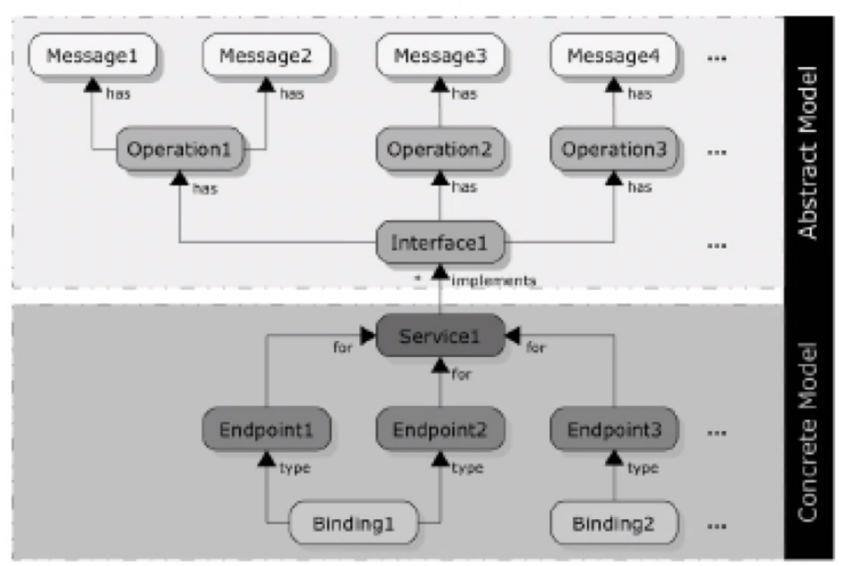

L’integrazione è un grosso problema, solo 10% delle applicazioni è integrato (dati Gartner Inc.) e solo 15% di queste sfruttano middleware ad hoc. Perché le tecnologie passate si sono rivelate inadeguate? A causa di un’architettura “casuale” che è il risultato della composizione di diverse soluzioni adottate per i diversi sistemi nel corso degli anni, e col tempo presenta: alti costi di mantenimento, rigidità (applicazioni tightly-coupled), prestazioni insoddisfacenti (scarsa scalabilità). Sono poche le applicazioni che nascono con la volontà di un’integrazione forte.

L’Enterprise Application Integration si occupa dell’integrazione di queste applicazioni, costruendo intorno a queste applicazioni degli strumenti che le integrano.

Enterprise Application Integration permette di sfruttare con operazioni extract transform and load. Si passa quindi per processi batch tra un app e un’altra trasmettiamo i dati con ftp li trasformiamo i dati in un formato utile per la seconda app e le passiamo con ftp e batch. Questo è il funzionamneto di molti servizi bancari. 

Questa soluzione ha alte latenze al momento delle batch, ci possono essere fault al momento delle trasnform, questa è una soluzione con diversi problemi ESB vuole andare oltre rispetto a questa soluzione cercando di automatizzare al più possibile il processo di trasmissione e trasformazione, renedendolo il più possibile pulito.

La soluzione è avere dei broker e dei orchestration engine come facilitatori della comunicazione, non più provider ma entità intelligenti tra le due applicazioni. Le due architetture di riferimento sono hub -and-spoke e una a bus. Hub and spoke è un’architettura a stella, in cui l’hub è il nodo centrale e con le applicazioni che hanno un adapter a un formato comune e una central automation engine un motore che consuma i messaggi guarda dentro i messaggi e facendo routing intelligente tra le applicazioni e mandandolo dove deve arrivare, inoltre vi sono tutti i servizi di sistema, tra cui persistenza e transazioni. L’altra architettura di riferimento è quella a bus, l’automation engine risiede con l’applicazione non abbiamo il collo di bottiglia dell’hub dell’architettura a stella. Il servizio a bus è punto a punto. 

I pro dell’architettura a stella sono la facilità di gestione (centralizzata) il principale contro è che l’hub è punto critico di centralizzazione, inoltre ha ridotta scalabilità. I pro dell’architettura a bus sono la maggiore scalabilità (architettura meno centralizzata) mentre il contro è la maggiore difficoltà di gestione.

Enterprise Service bus è la realizzazione della seconda architettura, l’idea principale è quella di avere una lingua franca con cui poter far comunicare i servizi, orchestra l’integrazione, fa da registro dei servizi, e da punto centralizzato della gestione di tutti i servizi che si affacciano sull’enterprise service bus stesso. 

### Orchestrazione ESB concetti chiavi

Qui l’orchestrazione avviene per le interazioni tra i servizi a grana grossa e per il routing intelligente. Asptteto di descrizione astratta del servizio e realizzazione concreta dei diversi binding, l’ESB risolve entrambi i problemi. Consente di utilizzare tanti e diversi protocolli per scambiare l’informazione, senza imporre un protocollo unico. La descrizione astratta delle informazioni scambiate avviene nella parte astratta del WSDL, descriverò con un biding concreto le interazioni con il mondo esterno con la parte concreta del WSDL, e ESB fa da orchestratore nel mezzo risparmiando al programmatore di fare l’integrazione poiché il supporto lo fa già. L’orchestrazione è sia astratta che concreta specialmente nei routing intelligenti e nei vari servizi come auditing e logging. 

ESB è un architettura altamente distribuita con integrazione basata su standard, mette a disposizione servizi di orchestration, mantiene l’autonomia delle singole applicazioni, consente un real-time throughput,  mette in atto servizi di auditing e logging, consente l’adozione incrementale. Nell’invocazione dei servizi, invece rende i servizi completamente disaccoppiati, utilizza pattern “find-bind-invoke” è gestito automaticamente dall’infrastruttura, il progettista deve solo definire l’itinerario logico che i messaggi devono seguire, mentre i servizi si “limitano” a inviare e ricevere messaggi.

Nel mondo Java a supporto di tutto questo abbiamo JBI, java business integration. In JBI ci sono servizi interni e esterni, i servizi esterni non riescono a parlare direttamente con l’orchestratore per questi servizi ci sono dei biding componenent che fungono da proxy verso i servizi esterni tra orchestratore e servizi esterni, sono degli adatatori per passare dal protocollo A al B . Poi vi sono i servizi interni e con questi abbiamo la possibilità di utilizzare il Normalized Message Router che si occupa dell’interazione tra componenti, nel routing delle informazioni. Sopra abbiamo la parte di servizi offerta dal framework tra cui l’orchestrazione dei servizi stessi offerta da BPEL che orchestra i servizi a grana grossa, con diagrammi di flusso che gestiscono le integrazioni. Sono offerti anche servizi grafici al programmatore per l’integrazione più facile dei servizi.  

La comunicazione tra componenti all’interno del bus NON è diretta. NMR che agisce da mediatore fra i vari componenti, ha il compito di fare routing dei messaggi tra 2 o più componenti, è distribuito e quindi consente di disaccoppiare Service Consumer da Service Provider garantendo un basso accoppiamento tra i componenti JBI, i messaggi sono scambiati in formato XML per cui la comunicazione è "technology-neutral" tra endpoint. Normalized Message scambiati sono definiti in formato indipendente e neutrale da qualsiasi specifica applicazione, tecnologia o protocollo di comunicazione, le  trasformazioni di formato sono trasformazioni XSLT.

Scambio di messaggi funzionamento:

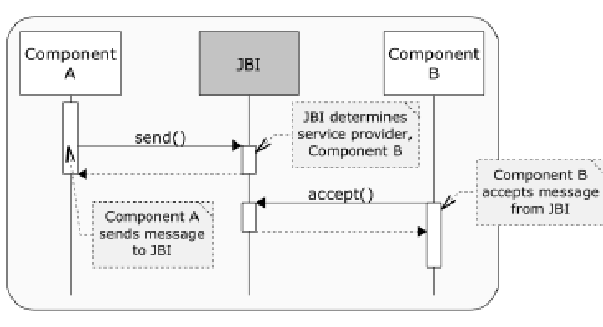

Per rispondere a ciascuna richiesta JBI è in grado di capire quale sia il provider migliore per il componente B a quel punto B accetta il messaggio e continua l’interazione, da notare come A non conosca B si è solo registrato a JBI.  Componenti SOA e modello a scambio di messaggi basato su interposizione:  Elevato grado di disaccoppiamento tra componenti con la possibilità di operare su messaggi (trasformazioni) in modo trasparente.

JBI supporta 4 possibili pattern di scambio messaggi: 
- In-Only per interazione/trasferimenti one-way, spesso molte integrazioni sono soddisfabili con questo pattern, prevede una conferma che tutto sia andato a buon fine
- Robust In-Only per possibilità di segnalare fault a livello applicativo, simile a un handshake a tre vie con la conferma che le cose siano andate bene nelle due parti semantica per gli errori o danni 
- In-Out per interazione request-response con possibilità fault lato provider ha unsa sola conferma da parte del consumatore.
- In Optional-Out per provider con risposta opzionale e possibilità di segnalare fault da provider/consumer (interazione completa).

## CORBA

Corba offre una soluzione per il distributed object computing che definisce un modello a container per oggetti distribuiti, aggiungendo componenti e funzioni. Questo ha portato a una ridefinizione dello standard nel Corba Component Model CCM.

Distributed object compunting (DOC middleware) utilizza sempre un pattern broker con un servizio un proxy che facilita la comunicazione tra il client e il servizio, inoltre non definisce solo API locali ma anche i protocolli da utilizzare in mezzo per facilitare la comunicazione delle due entità, si fa carico anche della parte di comunicazione. Perché il service access point offerto a livello applicativo prescinde dal linguaggio di programmazione. In Corba la cosa è molto simile grazie all’utilizzo di un IDL che non dipende da nessun linguaggio o piattaforma in termini di interfacce applicative, poi per ogni singolo linguaggio possiamo andare a definire un pattern broker che definirà il protocollo che segue le specifiche dello standard Corba. Quindi Corba facilita di integrazione, non solo tra mondi object oriented ma anche tra mondi che non lo sono, rendendoli a oggetti nella loro interfaccia con il mondo esterno.

Obiettivo corba è lavorare per dispositivi molto leggeri e con poche risorse quindi GIOP è messo a disposizione per comunicare a byte. Corba è talmente standard de facto che persino EJB utilizza RMI sopra al protocollo Corba.

Corba automatizza una serie di funzionalità e servizi di sistema, tra cui Object location, connection e memory management, parameter marshaling e demarshalling, request demultiplexing, error handling e fault tolerance, Object/server activation, concurrency e synchronization.

L’object adapter è un antenato del container. Tutto è molto integrato con i vari linguaggi in Corba.

Uno dei problemi aperti di Corba è il fatto che non c’è nulla per la gestione dell’impacchettamento e del deployment del software, tutto questo deve essere fatto a mano, quindi una volta fatta l’interfaccia poi bisogna a mano mettere insieme tutti i vari pacchetti. Questo causa molti problemi per le infrastrutture perché dobbiamo lavorare in modo diverso ogni volta e non ci sono tool automatici, nella specifica Corba non ci sono strumenti per gestire tutti componenti e metterli nel punto giusto.

Tra gli esempi delle limitazioni di Corba Requisiti non-trivial di Distributed Runtime Environment (DRE): collaborazione e coordinamento di oggetti e servizi multipli su diverse piattaforme. CORBA 2.x ha limiti come la mancanza di standard per: server/node configuration, object/service configuration, application assembly, object/service deployment. Le principali conseguenze sono la scarsa adattabilità e manutenibilità, una crescita time-to-market e costi integrazione. Per applicazioni anche di poco più complesse che richiedono l’utilizzo di alcuni oggetti e di servizi Corba bisogna scrivere strumenti per il continuos integration e deployment.

Per andare oltre a questi limiti è stato proposto il Corba Component Model per far si, che sia possibile creare dei component server che possano ospitare container e componenti, ovvero un’interfaccia home e una parte di componente che permette l’esecuzione.

I container definiscono operazioni che abilitano i component executor ad accedere a servizi comuni di middleware & politiche runtime associate, e i servizi di supporto e la composizione di servizi a grana grossa.


Quindi agli strumenti classici si affiancano dei nuovi strumenti ovvero un Component IDL compiler che aggiunge la parte di executor e la realizzazione dei container e facilita attraverso i xml component descriptor il deployment del software ovvero l’assembly e il packaging dei vari componenti. Il Component Packaging mette insieme metadati di implementation e configuration in assembly pronti per deployment, mentre gli strumenti per component deployment automatizzano il deployment di component assembly verso component server


Prima si definiscono i componenti che possono richiedere l’utilizzo di vari oggetti, poi possiamo assemblarli insieme e farli diventare componenti a grana grossa e sua volta assemblare componenti a grana grossa, e infine abbiamo strumenti per facilitare l’assembly, e per facilitarne il deployment e verso i component servant (anche nel distribuito). Con questi strumenti si può andare a gestire il deployment attraverso un deloyment plan, di codice che si trova nel Component Repository su una rete di nodi distribuiti. La gestione è molto completa e ben pensata per ambienti distribuiti che coinvolgono molti nodi e ambienti molto larghi.

Le tecnologie Corba sono datate, Corba ha avuto grande successo negli anni 80 e 90 e ha trovato applicazione nei dipartimenti militari e nelle banche. I sistemi Corba non hanno avuto successo perché Microsoft non ha mai voluto tale standardizzazione ma ha preferito i web services, quindi per motivi commerciali.

Le principali standardizzazioni sono le seguenti


Rispetto ad altri framework le principali caratteristiche: 

CORBA

Enterprise Java Beans (EJB):
- Componenti CORBA creati e gestiti da interfaccia home 
- I componenti Eseguono in container che gestiscono trasparentemente servizi di sistema 
- Ospitati da Application Component Server generici 
- MA possono essere realizzati in diversi linguaggi di implementazione . 

Microsoft Component Object Model (COM): 
- Possono avere diverse interfacce input e output per ogni componente 
- Sia operazioni point-topoint sync/async che eventi publish/subscribe 
- Capacità di component navigation e introspection 
- MA supporto più efficace e flessibile proprietà di distribuzione e QoS, meno multi-linguaggio e non lavora solo su microsoft

Come Microsoft .NET Framework: 
- Possono essere realizzati in diversi linguaggi programmazione 
- Possono essere packaged per facilitare distribuzione 
- MA possono eseguire su piattaforme multiple (non solo Microsoft Windows) e supportano il multi-linguaggio 


Rate Generator: Invia eventi Pulse periodici ai consumatori, per info sul veicolo.

Positioning Sensor (GPS): Riceve eventi di Refresh dai pubs, rinfresca le coordinate cached disponibili via MyLocation facet, notifica subs via eventi Ready events.

Display Device (NavDisplay) : Riceve eventi Refresh da pubs, legge coordinate correnti via GPSLocation receptacle, aggiorna il display.

Le freccette sono (verdi e rosa) servono per scambio di eventi e quindi gestione di scambio a eventi tipicamente sincrona non bloccante, sono detti facet, ovvero rappresentano le comunicazioni sincrone non bloccanti. Il cerchio giallo rappresenta un’interfaccia con cui lavorare, la mezzaluna rappresenta il fatto che il componente si aspetti di interagire con un altro componente che esponga la stessa tipologia di servizio/dato. Il navigator si aspetta da una parte di ricevere eventi dall’altra si aspetta ti poter interagire con il Gps andando a richiedere la location, queste sono comunicazioni tra componenti a eventi.  Il cerchio bianco invece dà la possibilità di configurare il componente.

Il Corba Component Model è molto largo e completo, rispetto al mondo Corba 2 consente di aggiungere una parte sull’integrazione di componenti, la parte per il packaging, fino ad arrivare all’assemblaggio dei vari componenti e infine facilitarne il deployment anche su reti di nodi distribuiti, vi è poi la parte di esecuzione in questi ambienti distribuiti.

Il componente è l’unità di composizione, di utilizzo e implementazione, è l’unità base di software utilizzabile in parti diverse.  Per utilizzare il componente è possibile, grazie la mondo a oggetti, ereditare da un altro componente e supportare diverse interfacce preesistenti. Il componente offre una facet e questa dà modo di attivare o disattivare il RateGen con il metodo di start() e stop() , vi è poi l’interfaccia rate_control() per controllare il Rate.


Definizione delle porte che sono i punti di contatto tra i vari componenti. In particolare vi sono le Facet che sono rappresentate dai cerchi gialli che offrono interfacce e quindi metodi offerti da quelle interfacce, vi sono Receptacle che chiamano Facet di altri, soddisfando la necessità di combinare più Facet, poi ci sono Sorgenti e Sink per eventi in entrata e in uscita e infine vi sono attributi per la configurazione dell’oggetto. La maggiore innovazione è la Facet che consente di mettere insieme molte cose avendo sia comunicazioni sincrone bloccanti che a scambio di messaggi e a eventi. Vi sono poi una Component Reference e una Component Home per creare nuovi componenti.


Il Corba Component Model si occupa di gestire il ciclo di vita dei componenti, tale gestione è integrata e standardizzata nel supporto. Possiamo definire diverse Home per definire diverse strategie di management. Grazie all’interfaccia Home possiamo definire varie strategie e applicare diversi tipi di strategie per il lifecycle management dei componenti, questa interfaccia Home è un metatype che ha riferimenti a interfacce e oggetti e va a gestire una famiglia di componenti attraverso quel tipo di lifecycle management, ogni istanza di un oggetto è gestita da una sola istanza di Home, l’operazione base che si trova sempre nella Home è quella per la creazione dell’oggetto ovvero create(), il tutto in IDL 3 può essere riassunto con questa chiamata. Inoltre, tale interfaccia Home può ospitare operazioni addizionali user-defined.

I diversi componenti possono avere la necessita di collaborare fra loro, per questo ciascun componente offre viste diverse. Con Corba 2 era difficile fare una gestione avanzata del componente e la parte relativa di gestione dinamica, con il Corba Component Model, il tutto è strutturato in un modello ben fatto, anche grazie alle Facet, che sono chiamate “top of the lego”, che significa che le funzionalità che offre al mondo esterno e la gestione di eventi stanno sopra e sotto “bottom of the lego” si trova ciò che ci si aspetta per legarsi al mondo sottostante, ovvero i Receptable e i Sink. Le Facet sono le interfacce delle operazioni che i componenti offrono. Dal punto di vista logico, sono i servizi che il componente offre e il tutto da modo di avere internamente componenti che realizzano diverse possibili interfacce. Le Facet definiscono interfacce con operazioni offerte che sono specificate tramite keyword provides() e rappresentano logicamente il componente stesso, non è un’entità separata contenuta nel componente. Le Facet hanno riferimenti a oggetti indipendenti ottenuti tramite operazione provide_*() da una Factory e possono essere usati per implementare Extension Interface pattern. In IDL 2 il tutto deve essere fatto ragionando solo sui componenti di base.

Per quanto riguarda la definizione dei Receptable attraverso l’uso della keyword uses() viene definito il Receptable che si aspetta una Facet, si può connettere il componente con un altro componente, grazie alle parole chiave uses. Le connessioni sono effettuate staticamente durante la fase di deployment o dinamicamente gestite dai container che supportano interazione con clienti o altri componenti via callback. Inoltre, CCM supporta connection establishment a runtime.

Per quanto riguarda lo scambio di messaggi CCM mette a disposizione lo scambio di eventi e le interazioni sincrone non bloccanti con l’idea di definire dei collegamenti per consentire lo scambio di eventi, può essere basato su tipi statici oppure basato su EventType.  Lo standard prevede una interazione di tipo push, perché in Corba il servizio di scambio di eventi può usare sia push che pull, ma per i componenti vi sono solo interazioni push. Per questo all’interno dei componenti sono presenti delle configurazioni che emettono Tick con l’unica differenza che la parola chiave publishes prevede molti consumatori ed emit prevede un solo consumatore.

Per connettersi al Sink di eventi può essere realizzata una comunicazione diretta o una comunicazione con intermediari. Si possono usare event-service del mondo Corba, oppure IDS standard per la distribuzione di eventi, con qualità e vincoli real-time anche in senso stretto. Dal punto di vista del componente questo emette sempre con interazioni push verso l’altro componente o verso la coda di eventi, questo facilita le cose soprattutto se l’altro componente non ha la pull.

Il Sink Refresh, definito con la parola consumes, riceve i tick.  Si possono avere connessioni named a cui inviare eventi solo di specifiche tipologie.  Event sink multipli dello stesso tipo possono essere subscriber della stessa sorgente, non vi è distinzione fra emitter & publisher, rende possibile connessi a sorgenti via object reference ottenuta tramite operazione get_consumer_*() su factory.

Componenti hanno bisogno di essere “aggregati” per formare applicazioni complete, vi sono però alcuni problemi: i componenti possono avere porte multiple con diversi nomi e tipi, diventa dispendioso scrivere manualmente il codice necessario per collegare un insieme di componenti per una applicazione specifica. Per cui in CCM è stata implementata tale soluzione: vi sono interfacce per l’introspezione che consentono la scoperta dinamica delle capacità dei componenti, e generiche operazioni sulle porte per connettere componenti tramite strumenti esterni di deployment e configuration, questo rappresenta la capacità di mettere insieme i lego.

Capacità di navigation e introspection realizzate da CCMObject, che offre le seguenti interfacce: interfaccia Navigation per facet, interfaccia Receptacles per receptacle e interfaccia Events per porte per eventi Navigation da modo dal riferimento base di un componente a ogni sua facet via operazioni facet-specific automaticamente generate e supportate di richiedere tali facet. Con il metodo provide si può restringere la visibilità (narrowing) all’interfaccia che ci interessa e restituirà poi il riferimento a cui si è interessati, ad es. Components::CCMObject::get_all_facets() & Components::CCMObject::provide(). Navigation opposta da ogni facet al riferimento base di un componente tramite CORBA::Object::_get_component().

Uso delle interfacce di navigazione di un componente.

Sin questo esempio si vuole andare a recuperare una certa facet e invocare un metodo di tale interfaccia. Si parte dall’ORB che è un servizio di nomi che dà la possibilità di recuperare i servizi di base come il servizio di naming (come RMI Registry). Una volta recuperato il servizio di nomi si possono andare ad invocare dei servizi di lookup, in particolare in questo caso si fa il lookup della ComponentHome registrata come MyHelloHome, attraverso il narrowing si può recuperare un oggetto tipato Home, su quell’oggetto si applica la create che crea il componente, a questo punto è interrogabile e può restituire una descrizione di tutte le facet offerte da quel compente, si può poi con il receptable effettuare l’introspezione, con il metodo provide possiamo chiedere il recupero del riferimento all’implementazione di quella interfaccia, una volta ottenuto si può fare il narrowing e a quel punto effettuare la chiamata a un metodo che ci interessa. Le interfacce in corba non vengono mantenute insieme alle implementazioni ma in un repository che si chiama Interface Repository. Quindi le informazioni dell’interfaccia non sono insieme agli altri dati questo genera overhead quando bisogna recuperare molte interfacce diverse.

Riassumendo le principali caratteristiche di CCM per il supporto cliente si può dire che CCM definisce operazioni per life-cycle management (home), definisce che cosa un componente offre agli altri componenti, definisce che cosa un componente richiede da altri componenti, definisce quali modalità di collaborazione sono usate fra componenti. Le operazioni possono essere di tipo Point-to-point via operation invocation o Publish/subscribe via event notification, definisce quali attributi dei componenti sono configurabili.

Implementazione dinamica dei componenti e supporto runtime

Per rendere le implementazioni dei componenti più adattabili e flessibili, le proprietà dei componenti dovrebbero essere ri-configurabili. Questo presenta diversi problemi: le applicazioni non dovrebbero legarsi a una specifica configurazione troppo presto,  non ci sono  standard per specificare parametri configurabili per componenti in CORBA 2.x, vi è il bisogno di meccanismi standard per configurazione. La soluzione CCM è quella di configurare componenti con attributi di assembly/deployment, via home o nella fase di inizializzazione.

Il supporto run-time dei componenti è possibile grazie al Component Server che facilita il deployment della configurazione delle applicazioni. Questo avviene perché Corba mette a punto astrazioni di alto livello per la gestione del Servant e una serie di tool che facilitano la configurazione attraverso tecniche di meta-programming con anche la possibilità di effettuare l’introspezione, ma anche grazie all’introduzione di una serie di parole chiave gestite dall’IDL compiler.  Questo supporto a runtime facilita la gestione del ciclo di vita di questi componenti.

Il CCM attraverso questa definizione del container va ad estendere l’object adapter di base di Corba ( che si occupa della gestione del ciclo di vita degli oggetti), il container va oltre l’object adapter nella gestione del loro ciclo di vita, indirizzandosi verso l’obiettivo della facilitazione dell’uso delle risorse. Ci sono poi i naming services la gestione della sicurezza, delle transazioni eccetera. Questi servizi esistevano ma dovevano essere utilizzati solo con oggetti a grana fine quindi oggetti che facevano molto poco, invece con l’introduzione dei container abbiamo servizi di più alto livello che con file di configurazione e deployment, automatizzano molti servizi che prima erano programmatici. Inoltre, vi è una gestione a call back su cui si può lavorare per capire come funzionano le cose e prendere misure dove necessario.

Anche nel modello CCM si possono definire categorie di componenti a seconda del tipo di implementazione di container, vi sono i Service che sono componenti senza stato, per la rappresentazione di una sessione si può avere un componente Session con una stato di tipo soft (stateful sessione bean), poi vi  sono Process  e Entity entrambi durable con la possibilità di essere invocati dall’esterno con chiavi o per riferimento.  Queste categorie ossono essere specificate dichiarativamente tramite il CIDL file oppure programmate imperativamente.


Il container offre interfacce verso l’interno e verso l’esterno, le interfacce verso l’esterno sono invocabili dai clienti, per interagire e configurare il container, quelle rivolte verso l’interno invece sono interfacce con il quale il container può offrire ai componenti possibilità di dialogo con il contesto del container stesso, e per le quali attraverso l’implementazione delle callback è possibile l’interazione con il container.

Ci sono diverse politiche di gestione, le strategie container managed cercano di disaccoppiare in modo forte la parte di gestione dalla parte di implementazione del container, il container si fa carico della gestione dei servizi di sistema, ciò avviene preparando metadati xml o direttive da dare al Component IDL Compiler che dichiara la gestione dei servizi di sistema come transazioni eventi eccetera.  In particolare, lato server ci sono degli excecutor che possono andare a realizzare la business logic, vi è una suddivisione tra Component del business model e Home che realizza la gestione e la creazione dei componenti con la possibilità di avere lifecycle diversi. Le Home Executor sono monolitiche mentre i Component Executor possono essere sia monolitici con tutte le porte implementate dalla stessa classe, oppure le porte sono suddivise tra le varie classi che lo implementano. Lo sviluppatore partendo da file definiti dell’IDL nel Component IDL di CCM genera una serie di scatole vuote pronte ad accogliere la logica applicativa. Il programmatore deve solo aggiungere la propria logica applicativa.

Nel mondo Corba quando parliamo di tutte queste funzionalità siamo nel mondo delle interfacce, Corba predispone tutto per il linguaggio target per sollevarci dalla gestione di tutti i problemi legati alla gestione dei servizi di sistema, poi il programmatore si deve occupare di implementare le varie cose.  Ma tutto si riferisce a interfacce in prima battuta. Gli Executor vanno a eseguire nel container, il modello è un container pesante EJB con differenze, ma con un’idea di container pesante in cui i vari Executor vanno a interagire. Gli Executor dei componenti devono implementare un’interfaccia locale per callback lifecycle ad uso del container, vi sono SessionComponent per componenti transienti, ed EntityComponent per componenti persistenti. Gli Executor dei componenti possono interagire con container e componenti connessi via context interface. L’interazione avvien attraverso un contesto che viene esposto attraverso un container.

## 09.Spring

Soluzione a container leggero utile per applicazioni Java Standard Edition, sia per POJO sia per evoluzioni dell’EE java. Ha avuto un forte impatto con idee rivoluzionarie che hanno portato ad evolvere anche EJB.

Caratteristiche principali: invertion of control, dependency injection, iniezioni di dipendenza nei componenti con Invertion of control, supporto alla persistenza, integrazione di una parte di presentazione o web tier, supporto all’aspect oriented programming in modo pervasivo. Programmazione orientata agli aspetti ovvero una serie di funzionalità che sono ortogonali rispetto al core della logica di business, tale tecnologia vuole mantenere la logica di business pura senza doverla allacciare ad aspetti esterni, quindi separare, il tutto è gestito esternamente, ogni funzionalità è un aspetto che viene integrata nella logica di business.

La Dependency injection è utilizzata per facilitare i binding tra component. Esiste una factory globale che si può utilizzare per ritrovare e gestire le relazioni, cercando di parcelizzare meno il sistema della gestione rispetto a EJB. Integrazione con il web framework MVC. Web flow a grana fine.

Spring non è solo un altro framework, rappresenta un approccio piuttosto unico, che ha fortemente influenzato i container successivi, verso tecnologie a microcontainer. Le principali proprietà originali sono:   la modularità,  architettura a layer, possibilità di utilizzare anche solo alcune parti (i container)  in isolamento, si può introdurre Spring incrementalmente in progetti esistenti e di imparare ad utilizzare la tecnologia “pezzo per pezzo”, supporta  importanti aree non coperte da altri framework diffusi, come il management degli oggetti di business, una tecnologia di integrazione di soluzioni esistenti, maggiore facilità di testing, e infin un progetto e una community attivi.

Le motivazioni per cui scegliere spring sono diverse. Spring consente l’integrazione e la cooperazione fra componenti (secondo il semplice modello JavaBean) via dependency Injection, pone molta importanza al disaccoppiamento, mette a disposizione Test-Driven Development (TDD), ovvero la possibilità di effettuare testing delle classi (POJO) senza essere legati al framework, ha un uso semplificato di tecnologie diffuse e di successo utilizzando astrazioni che isolano il codice applicativo, con eliminazione di codice ridondante, e gestione di comuni condizioni di errore (caso delle unchecked exception), lascia una parziale visibilità quindi non vi è totale trasparenza. La progettazione avviene per interfacce, con ottimo isolamento delle funzionalità dai dettagli implementativi, inoltre integra la programmazione dichiarativa via AOP che consente una facile configurazione degli aspetti, come ad esempio il supporto alle transazioni.

Spring non è una soluzione “all-or-nothing”, ma pone l’accento su un’estrema modularità e flessibilità, ed è progettata per essere facile da estendere e con molte classi riutilizzabili, ed integrabile con altre tecnologie tra le quali: EJB per J2EE, Hibernate, iBates, JDBC per l’accesso a dati e O/RM, Java Persistence API per la persistenza, Struts e WebWork per Web tier.

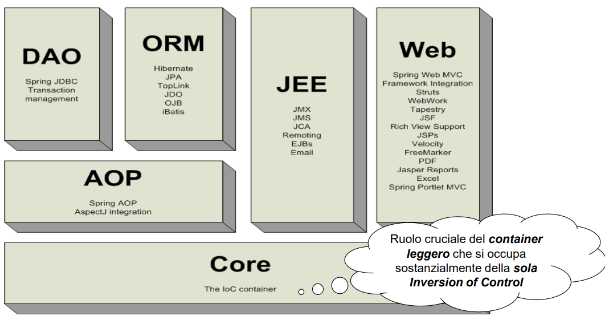

Il core è un container leggero basato sull’inversion of control, una parte che di questo è il collante che consente l’interazione tra le varie parti dell’architettura Spring. JEE  si occupa della gestione di tutti i servizi enterpise. Web Tier contiene tutti i framework web che possono essere integrati con il core. Dao e Orm sono la parte rivolta verso il backend dati che riguarda la parte di persistenza tra mondo oggetti e relazionale sia la parte di gestione di transazione tutto realizzato anche grazie all’utilizzo di AOP che si pone come intermediario tra il core, Dao e Orm.

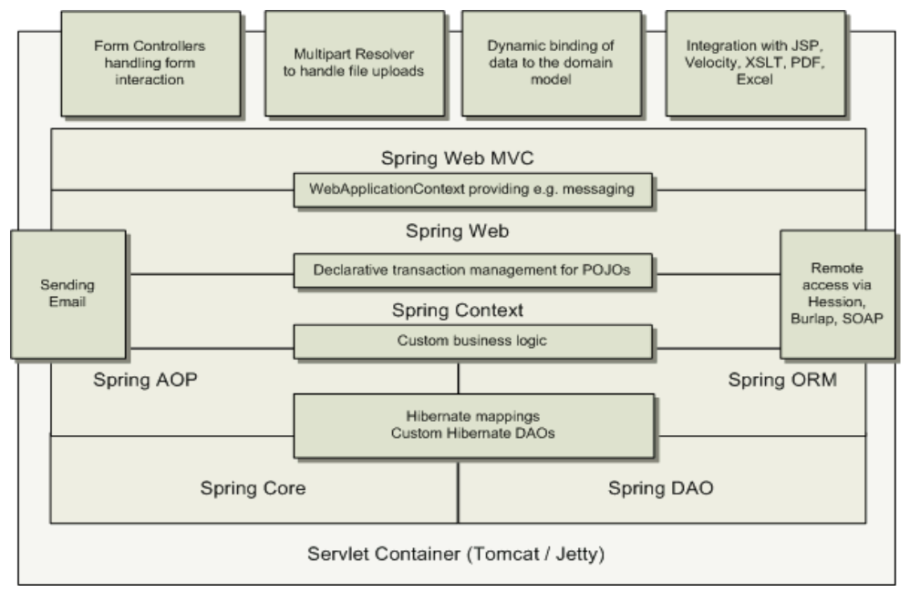

Nel dettaglio dell’architettura a livelli. Dal basso abbiamo il core, la parte di accesso all’oggetto che astrae l’accesso alle varie entità, puoi vi è il mapping tra oggetti e modello relazionale, a questo livello vi sono parti di business logic, parte di gestione delle transazioni, dichiarativa, che è applicabile ai POJO, al di sopra di questo tutte le parti che vanno nel senso del web tier e supporto a framework evoluti. Al livello più alto troviamo ponti verso mondi esterni, per l’integrazione con strumenti molto diffusi e tutta la parte di binding con il domain model applicativo e tutte le parti per la gestione delle risorse esterne, ad esempio dei file e per la gestione dell’interazione attraverso controller.

Possiamo sempre pensare di specializzare il framework e utilizzare le parti che ci servono, quindi possiamo creare diversi scenari Spring in base alle nostre esigenze.

Il Core Package è una parte fondamentale del framework. Consiste in un container leggero che si occupa di Inversion of Control o Dependency Injection. L’elemento fondamentale è BeanFactory, che fornisce una implementazione estesa del pattern factory ed elimina la necessità di gestione di singleton a livello di programmazione, permettendo di disaccoppiare configurazione e dipendenze dalla logica applicativa.

DAO Package, livello di astrazione che non rende più necessario boilerplate code per connessioni JDBC, eliminando parsing di codici di errore database-specific. La gestione delle transazioni avviene sia da codice che in modo dichiarativo, non solo per classi che implementano interfacce speciali, ma la possibilità è aperta a tutti i POJO.

ORM Package è il livello di integrazione per il mapping da mondo relazionale a mondo a oggetti, con soluzioni diffuse per ORM, come JPA, JDO, Hibernate, iBatis. Le varie soluzioni ORM possono essere usate in combinazione con le altre funzionalità di Spring, come la gestione dichiarativa delle transazioni, tutte queste possono essere combinate con le altre funzionalità Spring, come tecnologia di integrazione.

MVC Package, implementazione di Model-View-Controller (MVC) per applicazioni Web, con buona separazione e indipendenza fra codice del modello di dominio e form Web ovvero la parte di presentazione e la logica applicativa a livello di control.

AOP Package implementazione di aspect-oriented programming conforme allo standard AOP Alliance. Permette di definire, ad esempio, degli intercettori di metodo e pointcut per la logica disaccoppiamento degli aspetti in modo pulito, inoltre dà la possibilità di utilizzare metadati a livello sorgente per incorporare informazioni aggiuntive di comportamento all’interno del codice.

### Aspect Oriented Programming AOP

Aspect Oriented programming (AOP) è un approccio di design e una tecnica per semplificare la gestione di aspetti trasversali e non strettamente legati alla logica di business con l’applicazione di cross-cutting concern, per problematiche trasversali alla logica applicativa. Degli esempi di cross-cutting concern sono il logging, il locking, la gestione degli eventi, la gestione delle transazioni, sicurezza e auditing. AOP introduce anche nuovi strumenti che facilitano la gestione di questi aspetti tra cui: Joinpoint, Advice, Pointcut e Aspect, Weaving e Target, Introduction. L’idea di base è quella di intercettare le chiamate da remoto.

Joinpoint è un punto ben definito all’interno del codice applicativo, anche determinabile a runtime, dove può essere inserita logica addizionale, alcuni esempi di joinpoint sono: l’Invocazione di metodi, l’Inizializzazione di classi, l’inizializzazione di oggetti, ovvero la creazione di istanze.

Advice è una parte di codice che aggiunge logica addizionale al programma, deve essere aggiunto ed eseguito ad un determinato joinpoint. I diversi tipi di Advice sono: i before advice che eseguono prima del joinpoint, after advice eseguono dopo il joinpoint, around advice eseguono attorno (around) al joinpoint.

Pointcut è un Insieme di joinpoint che vengono verificati per definire quando eseguire un advice, il pointcut è l’insieme di tutte le invocazioni di quel metodo in una determinata classe, i pointcut possono essere messi in relazione tra di loro per decidere quando eseguirli insieme al collegato advice, con controllo fine e flessibile su come applicare advice al codice applicativo. La differenza tra pointcut e jointpoit è la seguente: il pointcut è l’insieme di tutte le invocazioni di metodo in una determinata classe mentre l’invocazione di un metodo è un tipico joinpoint. I pointcut possono essere composti in relazioni anche complesse per vincolare il momento di esecuzione dell’advice corrispondente.

Aspect definisce quando e come gestire la logica per quell’aspetto, Aspect è la combinazione di advice e pointcut.

Weaving è il processo dell’effettivo inserimento di aspect dentro il codice applicativo nel punto appropriato (la traduzione di weaving è cucire il codice nel punto appropriato), ci sono due possibilità per effettuare il weaving a tempo di compilazione, o a runtime ritardiamo il più possibile l’inserimento dell’aspetto.

Target è un oggetto il cui flusso di esecuzione viene modificato da qualche processo AOP attraverso il weaving, in alcuni casi viene anche indicato come oggetto con advice (advised object).

Nell’AOP statico il processo di weaving viene realizzato a tempo di compilazione, come passo ulteriore del processo di sviluppo, durante la build dell’applicazione, vengono aggiunti opportunamente in alcuni punti gli advice, in questo caso il weaving incide sul codice dell’applicazione che viene eseguito e sul suo footprint, può avvenire in diversi modi anche andando a modificare i BYTECODE. Ad esempio, in un programma Java, si può avere weaving attraverso la modifica del bytecode di una applicazione, senza la modifica del codice sorgente, intervenendo direttamente sul bytecode stesso, i file bytecode possono essere modificati prima della messa in esecuzione questo richiede che durante la compilazione ci sia questo passaggio di modifica.

Nell’AOP dinamico il Processo di weaving è realizzato dinamicamente a runtime, vi è la possibilità di cambiare weaving senza bisogno di ricompilazione. Bisogna intercettare il punto in cui cambiare il weaving e inserire gli advice, con un continuo monitoraggio e iniezione durante l’esecuzione, questo rappresenta uno svantaggio perché causa un overhead durante l’esecuzione.

Spring realizza AOP sulla base dell’utilizzo di proxy, infatti se si desidera creare una classe advised, occorre utilizzare la classe ProxyFactory per creare un proxy per un’istanza di quella classe, fornendo a ProxyFactory tutti gli aspect con cui si desidera informare il proxy.

La Dependency Injection è l’applicazione più nota e di maggiore successo del principio di Inversion of Control e l’Hollywood Principle, che si traduce in “Don't call me, I'll call you”. L’idea è che il container leggero si occupi di risolvere (injection) le dipendenze dei componenti attraverso l’opportuna configurazione dell’implementazione dell’oggetto (push), per questo fu chiamato dependency injection, questa idea è opposta ai pattern più classici di istanziazione di componenti o service locator, dove è il componente che deve determinare l’implementazione della risorsa desiderata (pull), questo consente di mantenere il più possibile l’implementazione leggera.

Un esempio di dependency injection è presente anche in EJB 3.0 attraverso le annotazioni per aggiungere tutte le informazioni utili che servono a esprimere tutte le dipendenze tra i vari compoennti, con il vantaggio della flessibilità con l’eliminazione del codice di lookup nella logica di business, in caso di cambio delle risorse esterne non vi è la necessità di cambiare il codice, la possibilità e facilità di testing con nessun bisogno di dipendere da risorse esterne o da container in fase di testing, vi è la possibilità di abilitare testing automatico, ed un’elevata manutenibilità del codice che permette riutilizzo in diversi ambienti applicativi cambiando semplicemente i file di configurazione (o in generale le specifiche di dependency injection) e non il codice, dividendo nettamente la parte di programma da quella di configurazione.

Dependency injection possono essere effettuate a livello di costruttore, in cui le dipendenze sono fornite attraverso i costruttori dei componenti.

```
public class ConstructorInjection { 
    private Dependency dep; 
    public ConstructorInjection(Dependency dep) { this.dep = dep; } 
}
```

Dependency injection è possibile anche a livello di metodi “setter” in cui le dipendenze sono fornite attraverso i metodi di configurazione (metodi setter in stile JavaBean) dei componenti. Questa modalità è più frequentemente utilizzata nella comunità degli sviluppatori.

```
public class SetterInjection { 
    private Dependency dep; 
    public void setMyDependency(Dependency dep) { this.dep = dep; } 
}
```

L’oggetto BeanFactory è responsabile della gestione dei bean che usano Spring e delle loro dipendenze. Ogni applicazione interagisce con la dependency injection di Spring (IoC container) tramite l’interfaccia BeanFactory, che viene realizzata da un oggetto BeanFactory che viene creato dall’applicazione, tipicamente nella forma di XmlBeanFactory, questo oggetto BeanFactory una volta creato legge un file di configurazione XML e si occupa di fare l’injection, detto anche wiring della configurazione. XmlBeanFactory è estensione di DefaultListableBeanFactory per leggere definizioni di Bean da un documento XML. La xml BeanFactory legge la configurazione da un file e attraverso il metodo getBean() è possibile specificare il nome del Bean e crearlo, le informazioni sono invece contenute tutte nel file XML.

```
public class XmlConfigWithBeanFactory { 
    public static void main(String[] args) { 
        XmlBeanFactory factory = new XmlBeanFactory(new FileSystemResource("beans.xml")); 
        SomeBeanInterface b = (SomeBeanInterface) factory.getBean(“nameOftheBean”); 
    } 
}
```

File di configurazione:

```
<!DOCTYPE beans PUBLIC "-//SPRING//DTD BEAN//EN"
"http://www.springframework.org/dtd/spring-beans.dtd">
<beans>
<bean id="renderer" class="StandardOutMessageRenderer">
<property name="messageProvider">
<ref local="provider"/>
</property>
</bean>
<bean id="provider" class="HelloWorldMessageProvider"/> 
</beans>
```

Oppure a livello di costruttore:

```
<beans>
<bean id="provider" class="ConfigurableMessageProvider">
<constructor-arg>
<value> Questo è il messaggio configurabile</value>
</constructor-arg>
</bean>
</beans>
```

Uso della dependency injection:

```
public class ConfigurableMessageProvider implements MessageProvider { 
private String message; // usa dependency injection per config. del messaggio public ConfigurableMessageProvider(String message) { this.message = message; } 
public String getMessage() { return message; } 
}
```

Spring supporta diversi tipi di parametri iniettabili con cui fare injection:

- Valori semplici;
- Bean all’interno della stessa factory (stesso file di configurazione XML);
- Bean anche in diverse factory;
- Collezioni (collection);
- Proprietà definite esternamente.

Tutti questi tipi possono essere usati sia per injection sui costruttori che sui metodi setter:

Injection di valori semplici esempio:

```
<beans>
<bean id="injectSimple" class="InjectSimple">
<property name="name"> <value>John Smith</value>
</property>
<property name="age"> <value>35</value>
</property>
<property name="height"> <value>1.78</value>
</property>
</bean> </beans>
```

L’Injection di Bean della stessa Factory è usata quando è necessario fare injection di un bean all’interno di un altro target bean.  Uso del tag in o del target bean. Controllo lasco sul tipo del bean “iniettato” rispetto a quanto definito nel target, se il tipo definito nel target è un’interfaccia, il bean injected deve essere un’implementazione di tale interfaccia, se il tipo definito nel target è una classe, il bean injected deve essere della stessa classe o di una sottoclasse.

Il ritrovamento dei Bean avviene attraverso il naming dei componenti Spring, ogni bean deve avere un nome unico all’interno della BeanFactory che lo contiene, la procedura di risoluzione dei nomi avviene seguendo le seguenti regole: se un tag ha un attributo di nome id, il valore di questo attributo viene usato come nome, se non c’è attributo id, Spring cerca un attributo di nome name, se non è definito né id né name, Spring usa il nome della classe del Bean come suo nome. Spring è un buon esempio di tecnologia a container leggeri perché facilita molto la gestione delle dipendenze con Dependency Injection.

```
public class HelloWorld { 
public static void main(String[] args) { System.out.println("Hello World!"); } 
}
```

Un programma come questo si porta dietro alcuni problemi, se vi è la necessità di cambiare il codice (e di ricompilare) per imporre una modifica del messaggio, dobbiamo modificare e ricompilare, il codice non è estensibile o modificabile. Per risolvere dobbiamo effettuare alcune operazioni quali il disaccoppiamento dell’implementazione della logica del Message Provider rispetto al resto del codice tramite creazione di una classe separata.

```
public class HelloWorldMessageProvider { 
public String getMessage() { return "Hello World!"; } 
}
```

Poi il disaccoppiamento dell’implementazione della logica di Message Rendering dal resto del codice. La logica di Message Rendering è data all’oggetto HelloWorldMessageProvider questa la andiamo ad esternalizzare, questo è ciò che si intende con Dependency Injection.  Avendo una classe StandardOutMessageRender che ha come campo il messaggio e ha un metodo render() che consente di andare emettere un messaggio di errore se non è stato configurato correttamente il MessageProvider o altrimenti invocare il metodo getMessage() che permette di andare a stampare il messaggio di HelloWorld ,quindi rendiamo indipendente il renderer dal Message Provider. La dependency è realizzata attraverso il metodo setter.

```
public class StandardOutMessageRenderer { 
private HelloWorldMessageProvider messageProvider = null; 
public void render() { 
if (messageProvider == null) { 
throw new RuntimeException("You must set the property messageProvider of class:“ + StandardOutMessageRenderer.class. getName()); 
}
System.out.println(messageProvider.getMessage()); 
} // dependency injection tramite metodo setter public void setMessageProvider(HelloWorldMessageProvider provider) { this.messageProvider = provider; } public HelloWorldMessageProvider getMessageProvider() { return this.messageProvider; } 
}
```

```
public class HelloWorldDecoupled { 
public static void main(String[] args) { 
StandardOutMessageRenderer mr = new StandardOutMessageRenderer(); 
HelloWorldMessageProvider mp = new HelloWorldMessageProvider(); 
mr.setMessageProvider(mp); mr.render(); 
} 
}
```

Ma ci sono ancora dei problemi aperti in particolare le Implementazioni specifiche di MessageRenderer e di MessageProvider sono hard-coded nella logica applicativa, per rendere il tutto ancora più disaccoppiato possiamo usare interfacce.

```
public interface MessageProvider { public String getMessage(); } 
```

```
public class HelloWorldMessageProvider implements MessageProvider { 
public String getMessage() { return "Hello World!"; } 
}
```

```
public interface MessageRenderer { 
public void render(); 
public void setMessageProvider(MessageProvider provider); 
public MessageProvider getMessageProvider(); 
}
```

```
ublic class StandardOutMessageRenderer implements MessageRenderer { 
// MessageProvider è una interfaccia Java ora 
private MessageProvider messageProvider = null; 
public void render() { 
if (messageProvider == null) {
throw new RuntimeException( "You must set the property messageProvider of class:“ + StandardOutMessageRenderer.class. getName()); 
} 
System.out.println(messageProvider.getMessage()); 
}
public void setMessageProvider(MessageProvider provider) { 
this.messageProvider = provider; 
} 
public MessageProvider getMessageProvider() { return this.messageProvider; } 
}
```

Scompare la dipendenza dalla classe, anche se dietro le quinte si dovrà andare a creare le opportune classi, ora però non vi è più dipendenza da quelle classi. Rimane la responsabilità del launcher di effettuare la _dependency injection_.

HelloWorld con Disaccoppiamento: Interfacce

```
public class HelloWorldDecoupled { 
public static void main(String[] args) { 
MessageRenderer mr = new StandardOutMessageRenderer(); 
MessageProvider mp = new HelloWorldMessageProvider(); 
mr.setMessageProvider(mp); 
mr.render(); 
} 
}
```

Ora è possibile modificare la logica di message rendering senza alcun impatto sulla logica di message provider. Allo stesso modo, è possibile cambiare la logica di message provider senza bisogno di modificare la logica di message rendering.

Vi sono ancora dei problemi ovvero l’uso di differenti implementazioni delle interfacce MessageRenderer o MessageProvider necessita comunque di una modifica (limitata) del codice della logica di business (launcher). Per risolvere bisogna creare una semplice classe factory che legga i nomi delle classi desiderate per le implementazioni delle interfacce da un file (property file) e le istanzi a runtime, facendo le veci dell’applicazione.

```
public class MessageSupportFactory { 
private static MessageSupportFactory instance = null; 
private Properties props = null; 
private MessageRenderer renderer = null; 
private MessageProvider provider = null; 
private MessageSupportFactory() { 
props = new Properties(); 
try { 
props.load(new FileInputStream("msf.properties")); // ottiene i nomi delle classi per le interfacce 
String rendererClass = props.getProperty("renderer.class"); 
String providerClass = props.getProperty("provider.class"); 
renderer = (MessageRenderer) Class.forName(rendererClass). newInstance(); 
provider = (MessageProvider) Class.forName(providerClass). newInstance(); 
} 
catch (Exception ex) { ex.printStackTrace(); 
} 
}
```

File di proprietà:

```
# msf.properties

renderer.class=StandardOutMessageRenderer provider.class=HelloWorldMessageProvider
```

Ora le implementazioni di message provider e message renderer possono essere modificate tramite semplice modifica del file di proprietà, non ha più dipendenze dagli oggetti. Questa soluzione necessita di scrivere molto “glue code” per mettere insieme l’applicazione, bisogna scrivere una classe MessageSupportFactory, inoltre, l ’istanza di MessageProvider deve essere ancora iniettata manualmente nell’implementazione di MessageRenderer.

HelloWord usando Spring

```
public class HelloWorldSpring { 
public static void main(String[] args) throws Exception { 
// ottiene il riferimento a bean factory 
BeanFactory factory = getBeanFactory(); 
MessageRenderer mr = (MessageRenderer) factory. getBean("renderer"); 
MessageProvider mp = (MessageProvider) factory. getBean("provider"); 
mr.setMessageProvider(mp); mr.render(); 
}

// Possibilità di scrivere il proprio metodo getBeanFactory() a partire da Spring 
DefaultListableBeanFactoryclass private static BeanFactory getBeanFactory() throws Exception { 
DefaultListableBeanFactory factory = new DefaultListableBeanFactory(); 
// creare un proprio lettore delle definizioni 
PropertiesBeanDefinitionReader rdr = new PropertiesBeanDefinitionReader(factory); 
// caricare le opzioni di configurazione 
Properties props = new Properties(); 
props.load(new FileInputStream("beans.properties")); 
rdr.registerBeanDefinitions(props); return factory; 
} 
}
```

I vantaggi raggiunti con questa soluzione sono l’eliminazione di glue code (MessageSupportFactory), una migliore gestione degli errori e meccanismo di configurazione completamente disaccoppiato, sparisce la dipendenza dalla classe, helloworld non dipende più dalle classi. Rimangono dei problemi, infatti, il codice di startup deve avere conoscenza delle dipendenze di MessageRenderer, deve ottenerle e deve passarle a MessageRenderer. In questo caso Spring agirebbe come non più di una classe factory sofisticata, rimarrebbe al programmatore il compito di fornire il proprio metodo getBeanFactory() usando le API di basso livello del framework Spring.

Esempio dependency Injection Spring

La svolta è lavorare nel file di configurazione, dichiarando il riferimento a un altro Bean che ci serve, così si chiede a Spring di assegnare il HelloWorldMessageProvider come Provider del Renderer, si realizza così la dipendenza tra le due, semplicemente dichiarando il tutto nel file xml di configurazione. Finalmente, si utilizza la Dependency Injection (DI) del framework Spring.

File di configurazione:

```
#Message renderer 
renderer.class=StandardOutMessageRenderer 
# Chiede a Spring di assegnare l’effettivo provider alla 
# proprietà MessageProvider del bean Message renderer 
renderer.messageProvider(ref)=provider #Message provider provider.class=HelloWorldMessageProvider
```

```
public class HelloWorldSpringWithDI { 
public static void main(String[] args) throws Exception { 
BeanFactory factory = getBeanFactory(); 
MessageRenderer mr = (MessageRenderer) factory. getBean("renderer"); 
// Nota che non è più necessaria nessuna injection manuale 
// del message provider al message renderer 
mr.render(); 
} 
private static BeanFactory getBeanFactory() throws Exception { 
DefaultListableBeanFactory factory = new DefaultListableBeanFactory(); PropertiesBeanDefinitionReader rdr = new PropertiesBeanDefinitionReader(factory); 
Properties props = new Properties(); 
props.load(new FileInputStream("beans.properties")); 
rdr.registerBeanDefinitions(props); 
return factory; 
} 
}
```

l metodo main() deve semplicemente ottenere il Bean MessageRenderer e richiamare render(), non deve ottenere prima il MessageProvider e configurare la proprietà MessageProvider del bean MessageRenderer. Il “wiring” è realizzato automaticamente dalla Dependency Injection di Spring, non serve nessuna modifica alle classi da collegare insieme, queste classi NON fanno alcun riferimento a Spring e quindi il programmatore non deve conoscere queste cose. Nessun bisogno di implementare interfacce del framework Spring. Nessun bisogno di estendere classi del framework Spring. Classi come POJO puri che possono essere sottoposte a testing senza alcuna dipendenza da Spring.

Più usualmente, dipendenze dei bean sono specificate tramite un file XML.

```
<beans>
<bean id="renderer"
class="StandardOutMessageRenderer">
<property name="messageProvider">
<ref local="provider"/>
</property>
</bean>
<bean id="provider"
class="HelloWorldMessageProvider"/>
</beans>
```

Riferimento al Provider in cui riportiamo la classe.Codice rielaborato dopo l’aggiunta dei riferimenti nell’xml

```
public class HelloWorldSpringWithDIXMLFile { 
public static void main(String[] args) throws Exception { 
BeanFactory factory = getBeanFactory(); 
MessageRenderer mr = (MessageRenderer) factory.getBean("renderer");
mr.render(); 
} 
private static BeanFactory getBeanFactory() throws Exception { 
BeanFactory factory = new XmlBeanFactory(new FileSystemResource("beans.xml")); 
return factory; 
} 
}
```

La factory viene creata attraverso il fileXML.

Dependency Injection in Spring con costruttore

Uso di un costruttore per MessageProvider

```
<beans>
<bean id="renderer" class="StandardOutMessageRenderer">
<property name="messageProvider">
<ref local="provider"/>
</property>
</bean>
<bean id="provider" class="ConfigurableMessageProvider">
<constructor-arg>
<value>Questo è il messaggio configurabile</value>
</constructor-arg>
</bean>
</beans>
```

A livello di codice il ConfigurableMessageProvider esporrà un campo nel costruttore che consentirà di modificare il messaggio, il renderer continuerà a usare il provider. Il ConfigurableMessageProvider sarà una delle possibili implementazioni del MessageProvider, a differenza della precedente ha la stringa configurabile e non embedded.

```
public class ConfigurableMessageProvider implements MessageProvider { 
private String message; 
public ConfigurableMessageProvider(String message) { this.message = message; } 
public String getMessage() { return message; } 
}
```

HelloWorld con Spring focus on AOP

Aggiunta di logica per rispettare i principi di Aspect Oriented Programming. Ipotizziamo di avere il MessageWriter che scrive “Hello World!” e avremmo bisogno di un around advice per inserire prima e dopo “ World”, “Hello” e “!, mentre con il  joinpoint avremo l’invocazione del metodo writeMessage() dovendo intervenire prima e dopo l’invocazione di questo metodo

```
public class MessageWriter implements IMessageWriter{ public void writeMessage() { System.out.print("World"); } } 
```

Gli advice Spring sono scritti in Java (nessun linguaggio AOPspecific). Pointcut tipicamente specificati in file XML di configurazione. Spring supporta solo joinpoint a livello di metodo (ad esempio, impossibile associare advice alla modifica di un campo di un oggetto). Con l’idea di definire come decorator queste parti cdi codice, dal punto di vista dell’esecuzione questi lavorano come intercettori che consentono di cambiare il codice.

```
public class MessageDecorator implements MethodInterceptor { 
public Object invoke(MethodInvocation invocation) throws Throwable { 
System.out.print("Hello "); 
Object retVal = invocation.proceed(); 
System.out.println("!"); 
return retVal; 
} 
}
```

I pointcut lavorano come intercettori e consentono se adeguatamente settati di cambiare la logica applicativa. Uso della classe ProxyFactory per creare il proxy dell’oggetto target, anche modalità più di base, tramite uso di possibilità predeterminate e file XML, senza istanziare uno specifico proxy per AOP.

```
public static void main(String[] args) { 
MessageWriter target = new MessageWriter(); 
ProxyFactory pf = new ProxyFactory(); 
// aggiunge advice alla coda della catena dell’advice pf.addAdvice(new //MessageDecorator()); 
// configura l’oggetto dato come target 
pf.setTarget(target); 
// crea un nuovo proxy in accordo con le configurazioni 
// della factory MessageWriter 
proxy = (MessageWriter) pf.getProxy(); 
proxy.writeMessage(); 
// Come farei invece a supportare lo stesso comportamento // con chiamata diretta al //metodo dell’oggetto target?...
}
}
```

Guarda caso, anche in Spring possiamo definire intercettori, ma questa volta in modo molto diverso e meno trasparente rispetto a un modello a container pesante, sfruttando i concetti di AOP e gli oggetti con proxy. Intercettore Spring può eseguire immediatamente prima o dopo l’invocazione della richiesta corrispondente. Implementa l’interfaccia MethodInterceptor o estende HandlerInterceptorAdaptor

Interceptor

```
public class MyService { 
public void doSomething() { 
for (int i = 1; i < 10000; i++) { System.out.println("i=" + i); } 
} 
} 
```

```
public class ServiceMethodInterceptor implements MethodInterceptor { 
public Object invoke(MethodInvocation methodInvocation) throws Throwable { 
long startTime = System.currentTimeMillis(); 
Object result = methodInvocation.proceed(); 
long duration = System.currentTimeMillis() - startTime;
Method method = methodInvocation.getMethod(); 
String methodName = method.getDeclaringClass().getName() + "." + method.getName(); System.out.println("Method '" + methodName + "' took " + duration + " milliseconds to run"); return null; 
} 
} 
```

Nel file di configurazione si definiscono i componenti, l’intercettore e quali sono i vari target e nei vari target si definiscono gli intercettori da utilizzare.

```
<beans>
<bean id="myService" class="com.test.MyService"> </bean>
<bean id="interceptor" class="com.test.ServiceMethodInterceptor">
</bean>
<bean id="interceptedService"
class="org.springframework.aop.framework.ProxyFactoryBean">
<property name="target">
<ref bean="myService"/> </property>
<property name="interceptorNames">
<list> <value>interceptor</value> </list> </property>
</bean> </beans>
```

Ripasso Transazioni verso DB Sistemi Informativi:

Una transazione è un’unità logica di elaborazione che, nel caso generale, si compone di molte operazioni fisiche elementari che agiscono sul DB. Le proprietà di cui deve godere una transazione si riassumono nell’acronimo ACID (Atomicity, Consistency, Isolation, Durability). Isolation richiede che venga correttamente gestita l’esecuzione concorrente delle transazioni. Consistency è garantita dal DBMS verificando che le transazioni rispettino i vincoli definiti a livello di schema del DB.

Date due transazioni queste possono essere: seriali e quindi la somma del tempo di esecuzione delle due transazioni è il tempo totale di esecuzione, oppure concorrenti in questo caso riduciamo il tempo di risposta, con interleaving di circa la metà. La concorrenza però va gestita, se le varie transazioni interferiscono tra di loro possiamo avere problemi in lettura e in scrittura.

- Tra i problemi di lettura troviamo Lost Update: due persone entrano sulla stessa riga e con la perdita di stato, per esempio entrambe comprano l’ultimo biglietto rimasto.
- Nel caso della dirtyread, qualora si voglia acquistare un biglietto per una certa data questa data è cambiata nel frattempo. 
- Unrepeatable read, letto il prezzo di un biglietto dopo qualche minuto il prezzo cambia.
- Phantom row nel caso in cui si vogliano comprare i biglietti di due tappe nel momento il cui si va a verificare l’acquisto le tappe sono cambiate di numero. 

### Lost Update

Il seguente schedule mostra un caso tipico di lost update, in cui per comodità si evidenziano anche le operazioni che modificano il valore del dato X e si mostra come varia il valore di X nel DB. Il problema nasce perché T2 legge il valore di X prima che T1 (che lo ha già letto) lo modifichi (“entrambe vedono l’ultimo biglietto disponibile”).

### Dirty read

In questo caso il problema è che una transazione legge un dato “che non c’è”: quanto svolto da T2 si basa su un valore di X “intermedio”, e quindi non stabile (“la data definitiva non è il 15/07/10”). Le conseguenze sono impredicibili (dipende cosa fa T2) e si presenterebbero anche se T1 non abortisse

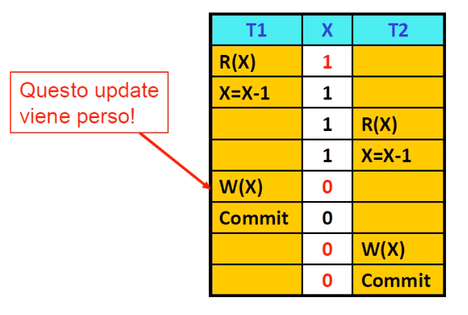

### Unrepeatble read

Ora il problema è che una transazione legge due volte un dato e trova valori diversi (“il prezzo nel frattempo è aumentato”):

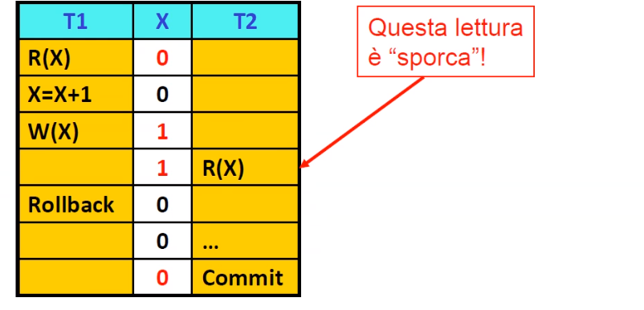

Anche in questo caso si possono avere gravi conseguenze. Lo stesso problema si presenta per transazioni di “analisi”. Ad esempio T1 somma l’importo di 2 conti correnti mentre T2 esegue un trasferimento di fondi dall’uno all’altro (T1 potrebbe quindi riportare un totale errato).

### Phantom row

Questo caso si può presentare quando vengono inserite o cancellate tuple che un’altra transazione dovrebbe logicamente considerare. Nell’esempio la tupla t4 è un “phantom”, in quanto T1 “non la vede”.


Scegliere di operare a un livello di isolamento in cui si possono presentare dei problemi ha il vantaggio di aumentare il grado di concorrenza raggiungibile, e quindi di migliorare le prestazioni. Lo standard SQL definisce 4 livelli di isolamento, che sono Serializable, repeatable read, read committed, uncommitted read.

### Transazionalità verso DB

Con scarsa sorpresa in Spring chiamiamo transazione locale, una transazione specifica per una singola risorsa transazionale, ad esempio unica risorsa JDBC, mentre chiamiamo transazione globale, una transazione gestita dal container, questa può includere risorse transazionali multiple e distribuite. Il programmatore può specificare in modo dichiarativo che un metodo di bean deve avere proprietà transazionali. Anche l’implementazione delle transazioni è basata su AOP, infatti avviene l’intercettazione di chiamate a metodi per la gestione transazioni. Nessuna necessità di modificare la logica di business, né al cambio della transazionalità desiderata né al cambio del provider di transazionalità.

Livelli di isolamento, da letture sporche a letture pulite
- ISOLATION_DEFAULT 
- ISOLATION_READ_UNCOMMITTED, possono accadere letture “sporche” (dirty read), non ripetibili e fantasma (phantom read)
- ISOLATION_READ_COMMITTED, letture sporche rese impossibili, possibilità di accadimento di letture non ripetibili e fantasma 
- ISOLATION_REPEATABLE_READ, possibilità delle sole letture fantasma, dirty e non-repeatable rese non possibili 
- ISOLATION_SERIALIZABLE, tutte le possibilità “spiacevoli” sopra per la lettura sono rese impossibili.

Phantom read avviene quando, nel corso di una transazione, vengono eseguite due query identiche e i risultati restituiti dalla seconda query sono differenti da quelli per la prima. Causa: “lock di range” non acquisiti (solo acquisizione di read lock) in fase di SELECT. Arriva una riga fantasma.

```
Transaction 1 /* Query 1 */ 
SELECT * 
FROM users 

WHERE age BETWEEN 10 AND 30;
 /* più tardi, dopo l’esecuzione di Query 2 */ 
SELECT * 
FROM users 
WHERE age BETWEEN 10 AND 30; 
Transaction 2 /* Query 2 */ 
INSERT INTO users VALUES ( 3, 'Bob', 27 ); 
COMMIT;
```

Non-repeatable read accade quando i lock in lettura non vengono rispettati, i dati vengono rilasciati prima della fine della transazione totale. In soluzioni di controllo della concorrenza basate su lock, letture non-repeatable possono avvenire quando i lock in lettura non sono acquisiti durante una SELECT. In soluzioni di controllo della concorrenza multiversion, letture non-repeatable possono avvenire quando si rilassa il vincolo che una transazione con conflitto di commit debba effettuare rollback.

```
Transaction 1
 /* Query 1 */
 SELECT * 

 FROM users 
WHERE id = 1; 
/* Dopo Query 2 e suo commit parziale */ 
SELECT * 
FROM users 
WHERE id = 1; 
Transaction 2 /* Query 2 */ 
UPDATE users 
SET age = 21 
WHERE id = 1; 
COMMIT; 
/* ad es. per read-committed isolation: read lock rilasciati prima della fine della transazione totale */ COMMIT; 
/* fine della transazione totale, anche write lock rilasciati */
```

Dirty read  avviene quando una transazione legge dati che sono stati modificati da un’altra transazione non ancora committed. Letture dirty sono simili a letture non-repeatable, ma la seconda transazione non necessita di commit per la prima query per restituire un risultato diverso.

```
Transaction 1 
/* Query 1 */ 
SELECT * 
FROM users 
WHERE id = 1; 
/* Dopo Query 2 */
 SELECT * 
FROM users 
WHERE id = 1; 
Transaction 2 
/* Query 2 */
 UPDATE users 
SET age = 21 
WHERE id = 1;
 /* Nessun commit immediato, solo alla fine della transazione */ 
COMMIT;
```

Propagazione delle transazioni in spring
- PROPAGATION_REQUIRED supporto alla propagazione della transazione di partenza; crea una nuova transazione se non era transazionale il contesto di partenza,
- PROPAGATION_SUPPORTS Supporto alla propagazione della transazione di partenza, esegue non transazionalmente se la partenza non era transazionale ,
- PROPAGATION_MANDATORY  Supporto alla propagazione della transazione di partenza; lancia un’eccezione se la partenza non era transazionale, 
- PROPAGATION_REQUIRES_NEW Crea una nuova transazione, sospendendo quella di partenza, se esistente PROPAGATION_NOT_SUPPORTED 
- PROPAGATION_NEVER 
- PROPAGATION_NESTED

Questi vincoli sono modificabili in modo atomico senza cambiamenti in altre parti.

Alla base dell’architettura Spring c’è l’idea di Inversion of Control (prima che in EJB3.0) e di container leggeri per factory  per l’istanziazione, il ritrovamento e la gestione delle relazioni fra oggetti Factory supportano due modalità di oggetto:  Singleton (default) unica istanza condivisa dell’oggetto con nome specificato, ideale per oggetti stateless, questo riduce la proliferazione di istanze nel codice applicativo, oppure prototype  ogni operazione di ritrovamento di un oggetto produrrà la creazione di una nuova istanza,

questo è utile per far avere ad ogni invocante una istanza distinta, aggiunge un nuovo livello di indirettezza. Un Bean Spring può essere anche un FactoryBean (implementazione dell’interfaccia corrispondente), questo aggiunge un livello di indirettezza e viene solitamente usato per creare oggetti con proxy utilizzando ad es. AOP (concettualmente simile a interception in EJB, ma di più semplice utilizzo).

La possibilità di semplice Dependency Injection tramite costruttori o metodi semplifica il testing delle applicazioni Spring, per esempio è semplice scrivere un test JUnit che crea l’oggetto Spring e configura le sue proprietà a fini di testing. Il container IoC non è invasivo: molti oggetti di business non dipendono dalle API di invocazione del container, queste possono essere portabili verso altre implementazioni di container (PicoContainer, HiveMind, …) ed è facile “introdurre” vecchi POJO in ambiente Spring.  Le factory Spring sono leggere, esistono anche implementazioni all’interno di singole applet o come applicazioni Swing standalone. Un antro importante aspetto, secondario ma comunque rilevante è la possibilità di avere di avere unchecked runtime exception.

### Autowiring

Spring può occuparsi automaticamente di risolvere dipendenze tramite introspezione delle classi bean, in questo modo il programmatore non si deve preoccupare di specificare esplicitamente le proprietà del bean o gli argomenti del costruttore nel xml file. Le proprietà del bean sono “autowired” attraverso matching basato su nome o su tipo, autowire=“name” (configurazione di default). L’autowiring può essere effettuato anche su sui nomi delle proprietà (metodi di nome set() del bean), autowire=“type”. Infine può essere applicato anche ai tipi di proprietà del bean (set(ArgumentType arg)) autowire=”constructor”, il match viene fatto sui tipi degli argomenti del costruttore. Anche in EJB esiste la stessa risoluzione delle dipendenze attraverso JNDI.

### Dependency checking

Il dependecy checking è utilizzabile per controllare l’esistenza di dipendenze non risolte quando abbiamo già fatto il deployment di un bean all’interno di un container Spring, è utile per tutte le proprietà che non hanno valori configurati all’interno della definizione del bean, per i quali anche l’autowiring non ha prodotto alcun setting. Questa è una caratteristica utile quando ci si vuole assicurare che tutte le proprietà (o tutte le proprietà di un determinato tipo) siano state configurate su un bean. Vi sono diverse modalità possibili e configurabili: 
- none, nessun check;
- simple, dependency checking effettuato solo per tipi primitivi e collection;
- object, dependency checking effettuato solo per altri bean associati all’interno della stessa factory (collaborator);
- all, dependency checking effettuato per collaborator, tipi primitivi e collection.

### ApplicationContext

In realtà, per accedere ad alcune funzionalità avanzate di Spring, non è sufficiente l’uso della semplice interfaccia BeanFactory, l’ApplicationContext è l’estensione dell’interfaccia BeanFactory, questo oltre a fornire tutte le funzionalità base, integra la gestione delle transazioni e di AOP, ad esempio non supportate dalla BeanFactory di base.  ApplicationContext si utilizza in modalità più “tradizionale” e framework-oriented. Le funzionalità aggiuntive dell’ApplicationContext non sono supportante di base dal BeanFactory perché in un’ottica di container leggeri questo appesantirebbe tale interfaccia, tra le funzionalità aggiuntive di ApplicationContext vi sono:

- Interfacce per la gestione del ciclo di vita;
- Propagazione di eventi a bean che implementano l’interfaccia ApplicationListener;
- Accesso a risorse come URL e file;

La gestione del ciclo di vita di un ApplicationContext si basa sull’implementazione di interfacce standardizzate; quindi, è possibile avere un metodo che consente di aggiungere l’ApplicationContext e collegarlo alla gestione del ciclo di vita. Ad esempio: presa l’interfaccia ApplicationContextAware un bean che implementa questa interfaccia avrà il suo metodo di interfaccia setApplicationContext() automaticamente invocato alla creazione del bean stesso, riceverà così un riferimento al contesto su cui poter effettuare invocazioni nel seguito

```
public class Publisher implements ApplicationContextAware {
 private ApplicationContext ctx; 
// Questo metodo sarà automaticamente invocato da IoC container 
public void setApplicationContext( ApplicationContext applicationContext) throws BeansException { 
this.ctx = applicationContext; 
}
```

La gestione degli eventi in ApplicationContext è realizzata tramite la classe ApplicationEvent e l’interfaccia ApplicationListener. Se un bean implementa l’interfaccia ApplicationListener di cui si è fatto il deployment in un ApplicationContext ac1, quel bean viene notificato ogni volta che un ApplicationEvent viene pubblicato in ac1, essenzialmente, si tratta del design pattern Observer. Tre tipologie di eventi built-in oltre a quelli applicativi che si possono definire: ContextRefreshEvent, che consente l’inizializzazione o refresh di ApplicationContext,  ContextClosedEvent per la  chiusura di un ApplicationContext,  RequestHandleEvent evento specifico per il Web, significa che una richiesta HTTP è stata appena servita.

Ad esempio, qui si mostra la configurazione in ApplicationContext.xml del comportamento “ad ogni ricezione di un email da un indirizzo in black list, invia un email di notifica a spam@list.org” black@list.org white@list.org john@doe.org Facilita attraverso il pattern observer la gestione degli eventi. L’aggiunta di queste funzionalità riporta su un container pesante Spring non più leggero.

```
<bean id="emailer" class="example.EmailBean">
<property name="blackList">
<list>
<value>black@list.org</value>
<value>white@list.org</value>
<value>john@doe.org</value>
</list>
</property> </bean>
<bean id="blackListListener"
class="example.BlackListNotifier">
<property name="notificationAddress"
value="spam@list.org"/>
</bean>
```

Classe bean che pubblica eventi tramite l’oggetto ApplicationContext:

```
public class EmailBean implements ApplicationContextAware { 
private List blackList; 
public void setBlackList(List blackList) { 
this.blackList = blackList; 
} 
public void setApplicationContext(ApplicationContext ctx) { 
this.ctx = ctx; 
} 
public void sendEmail(String address, String text) { 
if (blackList.contains(address)) {
 		BlackListEvent evt = new BlackListEvent(address, text); 
ctx.publishEvent(evt); return; 
} 
} 
}
```

Classe Notifier, che riceve le notifiche degli eventi generati.

```
public class BlackListNotifier implement ApplicationListener { 
private String notificationAddress; 
public void setNotificationAddress(String notificationAddress) { 
this.notificationAddress = notificationAddress; 
} 
public void onApplicationEvent(ApplicationEvent evt) { 
if (evt instanceof BlackListEvent) { 
// invio dell’email di notifica all’indirizzo appropriato 
} 
} 
}
```

Spring Boot è una tecnologia di recente successo per accelerare lo sviluppo di nuove applicazioni Spring Sostanzialmente supporto a configurazione e integrazione con DevOps. Principali package di Spring Boot, anche con integrazione parte Web.

### Pattern MVC

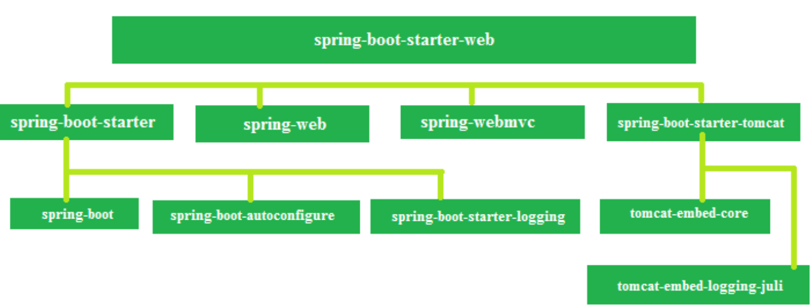

## JMX

## Big Data

real time: rispettare vincolo temporale. Per processare il dato ho un periodo di tempo che può essere molto lungo.
interactive: interazione con l'utente durante l'analisi
batch:

variability: stressare l'aspetto di varietà del dato
