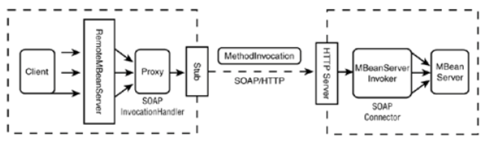

<div align="center">

# Sistemi Distribuiti M - 2021/2022

Corso tenuto dal _Prof. Foschini_

Appunti scritti da _Dario De Nardi_, _Sofia Montebugnoli_ 

Si ringrazia _Enrico Valastro_ per aver fornito molte immagini e spiegato come realizzarle

[](https://github.com/settings/appearance)
[](http://creativecommons.org/publicdomain/zero/1.0/)
</div>

<!-- INDICE -->
<details href="indice" open="open">
  <summary><h2 style="display: inline-block">Indice</h2></summary>
  <ol>
    <li>
      <a href="#modelli">Modelli</a>
      <ul>
        <li><a href="#componente">Componente</a></li>
        <li><a href="#differenza-tra-un-componente-ed-un-oggetto">Differenza tra un componente ed un oggetto</a></li>
        <li><a href="#modelli-1">Modelli</a></li>
        <li><a href="#deployment">Deployment</a></li>
        <li><a href="#architetture-applicazioni-enterprise-1">Architetture applicazioni Enterprise (1)</a></li>
        <li><a href="#modelli-a-contenimento">Modelli a contenimento</a></li>
        <li><a href="#j2ee">J2EE</a></li>
        <li><a href="#architetture-applicazioni-enterprise-2">Architetture applicazioni Enterprise (2)</a></li>
      </ul>
    </li>
    <li>
      <a href="#ejb-2x">EJB 2.X</a>
      <ul>
        <li><a href="#scenari-applicativi">Scenari applicativi</a></li>
        <li><a href="#principi-di-design">Principi di design</a></li>
        <li><a href="#architettura">Architettura</a></li>
        <li><a href="#jndi">JNDI</a></li>
        <li><a href="#contratti">Contratti</a></li>
        <li><a href="#ejb-container">EJB container</a></li>
        <li><a href="#tipologie-di-componenti-bean">Tipologie di componenti Bean</a></li>
        <li><a href="#session-bean">Session Bean</a></li>
        <li><a href="#entity-bean">Entity Bean</a></li>
        <li><a href="#message-driven-bean">Message Driven Bean</a></li>
        <li><a href="#interazioni-tra-bean">Interazioni tra Bean</a></li>
        <li><a href="#deployment-1">Deployment</a></li>
        <li><a href="#ciclo-di-sviluppo">Ciclo di sviluppo</a></li>
        <li><a href="#interfacce-ejbhome-ed-ejbobject">Interfacce EJBHome ed EJBObject</a></li>
        <li><a href="#invocazione-remota">Invocazione remota</a></li>
        <li><a href="#invocazione-locale">Invocazione locale</a></li>
        <li><a href="#cliente">Cliente</a></li>
        <li><a href="#deployment-di-unapplicazione">Deployment di un'applicazione</a></li>
        <li><a href="#problemi-riscontrati">Problemi riscontrati</a></li>
      </ul>
    </li>
    <li>
      <a href="#annotazioni">Annotazioni</a>
      <ul>
        <li><a href="#definizione">Definizione</a></li>
        <li><a href="#sintassi">Sintassi</a></li>
        <li><a href="#categorie-di-annotazioni">Categorie di annotazioni</a></li>
        <li><a href="#annotazioni-personalizzate">Annotazioni personalizzate</a></li>
        <li><a href="#limiti-delle-annotazioni-personalizzate">Limiti delle annotazioni personalizzate</a></li>
        <li><a href="#meta-annotazioni">Meta-annotazioni</a></li>
        <li><a href="#politiche-di-retention">Politiche di retention</a></li>
        <li><a href="#perchè-usarle">Perchè usarle</a></li>
      </ul>
    </li>
    <li>
      <a href="#sistemi-di-nomi">Servizio di nomi</a>
      <ul>
        <li><a href="#sistemi-di-discovery">Sistemi di Discovery</a></li>
        <li><a href="#sistemi-di-directory">Sistemi di Directory</a></li>
        <li><a href="#directory-vs-db">Directory vs DB</a></li>
        <li><a href="#java-naming-directory-interface-jndi">Java Naming Directory Interface (JNDI)</a></li>
        <li><a href="#interfaccia-context">Interfaccia Context</a></li>
        <li><a href="#interfaccia-dircontext">Interfaccia DirContext</a></li>
        <li><a href="#uso-di-jndi">Uso di JNDI</a></li>
        <li><a href="#memorizzare-i-dati-in-un-servizio-nomi">Memorizzare i dati in un servizio nomi</a></li>
        <li><a href="#serializzazione">Serializzazione</a></li>
        <li><a href="#riferimento">Riferimento</a></li>
        <li><a href="#attributi">Attributi</a></li>
        <li><a href="#configurazione-di-jndi">Configurazione di JNDI</a></li>
      </ul>
    </li>
    <li>
      <a href="#ejb-3x">EJB 3.X</a>
      <ul>
        <li><a href="#annotazioni-e-descrittori-di-deployment">Annotazioni e Descrittori di Deployment</a></li>
        <li><a href="#tipologie-di-componenti">Tipologie di componenti</a></li>
        <li><a href="#session-bean-1">Session Bean</a></li>
        <li><a href="#message-driven-bean-1">Message Driven Bean</a></li>
        <li><a href="#dependency-injection">Dependency Injection</a></li>
        <li><a href="#interoperabilità-tra-ejb-3x-e-ejb-2x">Interoperabilità tra EJB 3.X e EJB 2.X</a></li>
        <li><a href="#servizi-di-sistema">Servizi di sistema</a></li>
        <li><a href="#pooling-e-concorrenza">Pooling e concorrenza</a></li>
        <li><a href="#resource-pooling">Resource Pooling</a></li>
        <li><a href="#activation">Activation</a></li>
        <li><a href="#transazionalità">Transazionalità</a></li>
        <li><a href="#container-managed-transaction">Container-Managed Transaction</a></li>
        <li><a href="#bean-managed-transaction">Bean-Managed Transaction</a></li>
        <li><a href="#gestione-delle-connessioni-a-risorse">Gestione delle connessioni a risorse</a></li>
        <li><a href="#persistenza">Persistenza</a></li>
        <li><a href="#messaggistica">Messaggistica</a></li>
        <li><a href="#sicurezza">Sicurezza</a></li>
        <li><a href="#intercettori">Intercettori</a></li>
      </ul>
    </li>
    <li>
      <a href="#">JPA</a>
      <ul>
        <li><a href="#">Object/Relational Mapping (ORM)</a></li>
        <li><a href="#">Java Persistence API (JPA)</a></li>
        <li><a href="#">Perchè usare JPA</a></li>
        <li><a href="#">Entity</a></li>
        <li><a href="#">Ereditarietà e Polimorfismo</a></li>
        <li><a href="#">Strategie di Mapping</a></li>
        <li><a href="#">Molteplicità nelle Relazioni</a></li>
        <li><a href="#">Direzionalità delle relazioni</a></li>
        <li><a href="#">Gestione a runtime di Entity</a></li>
        <li><a href="#">Container-managed EntityManager</a></li>
        <li><a href="#">Application-managed EntityManager</a></li>
        <li><a href="#">Entity Manager singoli vs multipli</a></li>
        <li><a href="#">Ciclo di Vita</a></li>
        <li><a href="#">Unità di Persistenza</a></li>
        <li><a href="#">Creazione di Query</a></li>
        <li><a href="#">Loading Lazy/Eager</a></li>
        <li><a href="#">Listener di Entity</a></li>
        <li><a href="#">Hibernate</a></li>
        <li><a href="#">Interfaccia SessionFactory</a></li>
        <li><a href="#">Interfaccia Session</a></li>
        <li><a href="#">Transazioni</a></li>
        <li><a href="#">Ciclo di Vita</a></li>
        <li><a href="#">Il caching in Hibernate</a></li>
        <li><a href="#">Fetching dei dati</a></li>
        <li><a href="#">Query By Examples (QBE)</a></li>
      </ul>
    </li>
    <li>
      <a href="#">JMS</a>
      <ul>
        <li><a href="#">Perchè usare un servizio di messagistica</a></li>
        <li><a href="#">Modello point-to-point</a></li>
        <li><a href="#">Modello publish/subscriber</a></li>
        <li><a href="#">Affidabilità nello scambio di messaggi</a></li>
        <li><a href="#">Transazionalità</a></li>
        <li><a href="#">Sicurezza</a></li>
        <li><a href="#">Java Messaging Service (JMS)</a></li>
        <li><a href="#">Tipi di comunicazioni</a></li>
        <li><a href="#">Messaggi JMS</a></li>
        <li><a href="#">Interfaccia Destination</a></li>
        <li><a href="#">Interfaccia ConnectionFactory</a></li>
        <li><a href="#">Interfaccia Connection</a></li>
        <li><a href="#">Interfaccia Session</a></li>
        <li><a href="#">Interfacce Message Consumer e Message Producer</a></li>
        <li><a href="#">Riassunto API JMS</a></li>
        <li><a href="#">Uso di JMS</a></li>
        <li><a href="#">Affidabilità dei messaggi</a></li>
        <li><a href="#">ACK</a></li>
        <li><a href="#">Priorità</a></li>
        <li><a href="#">Affidabilità</a></li>
        <li><a href="#">Durable Subscription</a></li>
        <li><a href="#">Gestione delle transazioni di JMS</a></li>
        <li><a href="#">Selettori di messaggi</a></li>
        <li><a href="#">JMS in EJB</a></li>
        <li><a href="#">Enterprise Service Bus (ESB)</a></li>
        <li><a href="#">Service Oriented Architecture (SOA)</a></li>
        <li><a href="#">Web Services</a></li>
        <li><a href="#">Web Service Description Language (WSDL)</a></li>
        <li><a href="#">Enterprise Application Integration (EAI)</a></li>
        <li><a href="#">Hub-and-Spoke</a></li>
        <li><a href="#">Bus di Interconnessione</a></li>
        <li><a href="#">Concetti chiave di ESB</a></li>
        <li><a href="#">Java Business Integration (JBI)</a></li>
      </ul>
    </li>
    <li>
      <a href="#">CORBA</a>
      <ul>
        <li><a href="#">CORBA 2.X</a></li>
        <li><a href="#">CORBA Component Model (CCM)</a></li>
        <li><a href="#">Implementazioni CCM disponibili</a></li>
        <li><a href="#">Comparazione CCM vs. EJB e .NET</a></li>
        <li><a href="#">Running Example</a></li>
        <li><a href="#">Componente CCM</a></li>
        <li><a href="#">Gestione Lifecycle CCM</a></li>
        <li><a href="#">CORBA Home</a></li>
        <li><a href="#">Viste di Componenti CCM</a></li>
        <li><a href="#">Configurazione dinamica dei componenti</a></li>
        <li><a href="#">Implementazione dinamica dei componenti e supporto runtime</a></li>
        <li><a href="#">Executor</a></li>
      </ul>
    </li>
    <li>
      <a href="#">Spring</a>
      <ul>
        <li><a href="#perchè-usare-spring">Perchè usare Spring</a></li>
        <li><a href="#architettura-1">Architettura</a></li>
        <li><a href="#aspect-oriented-programming-aop">Aspect Oriented Programming (AOP)</a></li>
        <li><a href="#joinpoint">Joinpoint</a></li>
        <li><a href="#advice">Advice</a></li>
        <li><a href="#pointcut">Pointcut</a></li>
        <li><a href="#aspect">Aspect</a></li>
        <li><a href="#weaving">Weaving</a></li>
        <li><a href="#target">Target</a></li>
        <li><a href="#dependency-injection-1">Dependency Injection</a></li>
        <li><a href="#varianti-per-dependency-injection">Varianti per Dependency Injection</a></li>
        <li><a href="#oggetto-beanfactory">Oggetto BeanFactory</a></li>
        <li><a href="#injection-di-valori-semplici">Injection di valori semplici</a></li>
        <li><a href="#injection-di-un-bean-allinterno-della-stessa-factory">Injection di un Bean all’interno della stessa factory</a></li>
        <li><a href="#naming-dei-componenti">Naming dei Componenti</a></li>
        <li><a href="#helloworld-con-dependency-injection">HelloWorld con dependency injection</a></li>
        <li><a href="#considerazioni-sulla-dependency-injection">Considerazioni sulla dependency injection</a></li>
        <li><a href="#helloworld-con-aop">HelloWorld con AOP</a></li>
        <li><a href="#intercettori-1">Intercettori</a></li>
        <li><a href="#transazioni-verso-db">Transazioni verso DB</a></li>
        <li><a href="#lost-update">Lost Update</a></li>
        <li><a href="#dirty-read">Dirty Read</a></li>
        <li><a href="#unrepeatble-read">Unrepeatble Read</a></li>
        <li><a href="#phantom-row">Phantom Row</a></li>
        <li><a href="#livelli-di-isolamenti">Livelli di Isolamenti</a></li>
        <li><a href="#transazionalità-verso-db">Transazionalità verso DB</a></li>
        <li><a href="#pooling-e-concorrenza-1">Pooling e concorrenza</a></li>
        <li><a href="#autowiring">Autowiring</a></li>
        <li><a href="#dependency-checking">Dependency checking</a></li>
        <li><a href="#applicationcontext">ApplicationContext</a></li>
      </ul>
    </li>
    <li>
      <a href="#">JMX</a>
      <ul>
        <li><a href="#"></a></li>
      </ul>
    </li>
    <li>
      <a href="#">JBoss Clustering</a>
      <ul>
        <li><a href="#"></a></li>
      </ul>
    </li>
    <li>
      <a href="#">Big Data</a>
      <ul>
        <li><a href="#">Definizione</a></li>
        <li><a href="#">Stream Processing</a></li>
        <li><a href="#">Batch Processing</a></li>
        <li><a href="#">Hadoop Distributed File System (HDFS)</a></li>
        <li><a href="#">MapReduce</a></li>
      </ul>
    </li>
    <li>
      <a href="#nodejs">Node.js</a>
      <ul>
        <li><a href="#utilizzo-di-javascript">Utilizzo di Javascript</a></li>
        <li><a href="#event-loop">Event Loop</a></li>
        <li><a href="#thread-vs-asynchronous-event-driven">Thread vs Asynchronous Event Driven</a></li>
        <li><a href="#thread-vs-event">Thread vs Event</a></li>
        <li><a href="#moduli">Moduli</a></li>
        <li><a href="#modulo-http">Modulo HTTP</a></li>
        <li><a href="#npm">NPM</a></li>
        <li><a href="#modulo-fs">Modulo FS</a></li>
        <li><a href="#modulo-stream">Modulo Stream</a></li>
        <li><a href="#modulo-net">Modulo Net</a></li>
        <li><a href="#modulo-express">Modulo Express</a></li>
      </ul>
    </li>
    <li>
      <a href="#">Docker</a>
      <ul>
        <li><a href="#"></a></li>
      </ul>
    </li>
  </ol>
</details>

## Modelli

Nella vita professione, è molto difficile che si scriva un software da zero per diversi motivi:

- Un'azienda/cliente sta già usando determinate tecnologie e non vuole cambiarle.
- Si vuole interoperare fra diversi ambienti (anche legacy).
- Il tempo di sviluppo è molto limitato e ci sono vincoli nella consegna dell'applicazione finale.

Per questo motivo è fondamentale usare un approccio basato su componenti e il trand attuale si sposta verso questo tipo di soluzione.

<a href="#indice">Torna all'indice</a>

### Componente

Un componente è un _pezzo di software_ che viene scritto dallo sviluppatore ed ha le seguenti caratteristiche:

- Contiene stato, metodi etc. ma espone verso l'esterno solo quei metodi che si decidono che siano visibili all'esterno grazie all'uso di un'interfaccia.
- Viene eseguito all'interno di un ambiente di esecuzione detto _container_/_engine_/_middleware_.

Esempi di componenti sono quelli che si usano per creare le interfacce grafiche con JavaFX: textBox, label, comboBox etc. Quando si clicca su un bottone, non si verifica se effettivamente il mouse è sopra al tasto e lo si schiaccia ma si scrive solo il codice che deve essere eseguito se quel determinato evento si verifica.

Tuttavia, il componente del distribuito assume un concetto più ampio rispetto a quello del concentrato:

- Un **componente nel concentrato** è un componente che fa parte di un'applicazione che viene messa in esecuzione su una **sola** macchina.
- Un **componente nel distribuito** non è vincolato a trovarsi su una sola macchina proprio per la definizione intrinseca di sistema distribuito. È possibile spostarlo in qualsiasi momento da un nodo ad un altro. Per questo motivo il componente nel concentrato viene visto come se appartenesse ad un'applicazione _monolitica_.

Il corso si focalizza sui sistemi distribuiti quindi verranno trattati i componenti del secondo punto.

<a href="#indice">Torna all'indice</a>

### Differenza tra un componente ed un oggetto

A questo punto ci si domanda che differenza c'è tra un componente ed un oggetto perchè sembrano molto simili tra di loro:

- **Uguale all'oggetto**: mantiene dettagli di come è implementato: stato, metodi etc ed espone solo alcuni dei suoi dettagli tramite l'interfaccia.
- **Diverso dall'oggetto**:
    - Il componente viene eseguito all'interno di un _container_/_engine_/_middleware_ altrimenti non verrebbe eseguita la funzione di callback. Se si eseguisse il codice di un componente su una qualsiasi JVM non funzionerebbe. Riprendendo l'esempio di prima: chi è che controlla che effettivamente il mouse è posizionato sopra al bottone? Nessuno, quindi il codice non potrebbe funzionare.
    - Il componente è di dimensioni più grande di un oggetto  in termini di codice, perchè il costo di overhead tra un'interazione e l'altra è maggiore. Si ipotizzi che due componenti `A` e `B` interagiscano tra di loro. `A` per comunicare con `B` deve instaurare una connessione, scambiare i dati e alla fine chiuderla. Nel concentrato, invece, gli oggetti anche se sono piccoli e interagiscono spesso fra di loro non hanno questo problema di overhead. Ovviamente bisogna stare attenti a creare un componente non troppo grande per evitare di andare incontro a tutti quei problemi affrontati durante il corso di Ingegneria del Software T come la riusabilità.

<a href="#indice">Torna all'indice</a>

### Modelli

Ogni problema presenta una soluzione diversa. Per capire meglio come risolverli è importante studiare i modelli. Quelli che possono essere usati sono ad esempio:

- **Statici/dinamici**: l’uso di modelli statici non permette di adeguare il sistema a fronte di variazioni. I modelli dinamici invece permettono di fare evolvere il sistema a fronte di variazioni ma hanno costi più elevati.
- **Preventivi/reattivi**: un sistema preventivo è più costoso di un sistema reattivo perchè non è detto che un evento si verifichi. Ad esempio, i sistemi operativi non utilizzano sistemi preventivi: se avviene un deadlock tra processi lo si sblocca dall’esterno tramite linea di comando.

È meglio una soluzione statica o dinamica? Meglio una soluzione preventiva o reattiva? La risposta in generale che deve fornire un ingegnere è sempre: _dipende_. Ogni problema ha una storia diversa. Questo perchè **non** esistono formule precise nei sistemi distribuiti dato che ci sono troppi parametri da prendere in considerazione: famiglia del processore, sistema operativo, linguaggio di programmazione etc.

<a href="#indice">Torna all'indice</a>

### Deployment

Nei sistemi distribuiti si è interessati ad eventuali colli di bottiglia, come si comporta l'applicazione quando arrivano molte richieste etc. È importante, quindi, osservare le performance e per far ciò bisogna mettere in esecuzione l'applicazione. In questo modo si capisce che cosa andare a modificare.

Le modifiche non si effettuano sul codice stesso ma attraverso l'operazione di _deployment_. Quando si fa questa operazione, occorre decidere dove far eseguire il componente e di quali risorse ha bisogno per funzionare correttamente. Ad esempio, installare tutte le librerie necessarie, copiare i file che devono essere locali, distribuire i componenti su uno o più nodi, mettere davanti un bilanciatore di carico etc.

Ci sono diversi approcci per effettuare il deployment:

- **Manuale**: l’utente determina ogni singolo oggetto/componente su quale è il nodo più appropriato.
- **File Script**: si devono eseguire alcuni file di script che racchiudono la sequenza dei comandi per arrivare alla configurazione che presenta le dipendenze.
- **Linguaggi dichiarativi**: supporto automatico alla configurazione attraverso linguaggi dichiarativi o modelli di funzionamento della configurazione da ottenere. Ad esempio, tramite un file .XML e annotazioni.

<a href="#indice">Torna all'indice</a>

### Architetture applicazioni Enterprise (1)

Le architetture si sono evolute sempre di più verso architetture a più livelli perchè l'obiettivo è quello di separare logicamente le funzionalità in modo da ridurre la complessità degli strati:

- **Single-Tier**: c'è un singolo super calcolatore a cui sono connessi i clienti perchè quest'ultimi non hanno abbastanza risorse per fare elaborazione. I clienti (o meglio terminali) inviano solo le richieste al mainfraime il quale le elabora e restituisce al cliente la risposta. È la soluzione adottata negli anni '50.


    - **Vantaggi**:
        - Nessuna gestione client-side.
        - Consistenza dei dati perchè tutti i dati sono solo sul calcolatore.
    - **Svantaggi**: no scalabilità.

- **Two-Tier**: i clienti interagiscono con il DB, inviano query SQL e ricevono dati raw (dati _grezzi_ cioè i dati come vengono presi dal DB così vengono inviati). La logica di presentazione, di business e di processamento del modello dei dati si trova tutta nell’applicazione cliente. Per questo motivo il cliente viene detto _fat_.


    - **Vantaggi**: indipendenza dallo specifico DB (rispetto a single-tier).
    - **Svantaggi**:
        - Difficoltà di aggiornamento, maintenance e riutilizzo di codice perchè tutto si trova installato sul lato cliente.
        - Raw data trasferiti verso il cliente (responsabile del loro processamento) e ciò produce overhead di rete perchè possono essere anche molti i dati.
        - Connessione al DB per ogni cliente e questo ha un forte impatto perchè i DB relazionali non sono scalabili.

- **Three-Tier**: ci sono diversi modelli:
    - **Three Tier (basato su RPC)**: il cliente, detto _thin client_, ospita solo la logica di presentazione. La logica di business e di processamento dei dati sono delegati ad un livello intermedio. La logica di accesso ai dati è contenuta nel terzo livello rappresentato dal database. Il middle tier si occupa di tutti i servi di sistema (gestione della concorrenza, multithreading, transazioni, sicurezza, persistenza etc).
    
    
        - **Vantaggi**: logica di business modificabile in modo più flessibile.
        - **Svantaggi**: accoppiamento stretto fra clienti e middle-tier server. Ad esempio, il cliente deve conoscere IP fisico del server.
    - **Three Tier (basato su Remote Object)**:
    
    
        - **Vantaggi**: meno accoppiato del modello RPC.
        - **Svantaggi**: gli stessi di quello basato su RPC.
    - **Three Tier (Web Server)**: si ha un browser per il livello presentazione mentre la logica di business è gestita tramite tecnologie come CGI, Servlet/JSP, ASP etc.
    
    
        - **Vantaggi**:
            - Cliente disponibile ovunque.
            - Nessun problema di aggiornamento del software sul client.
        - **Svantaggi**: Il middle tier resta ancora molto complesso: la logica di business deve far fronte alle problematiche specifiche dell’applicazione e tutti i servizi di sistema (transazioni, concorrenza, sicurezza etc) sono in un’unica base di codice. Non c’è quindi una separazione netta tra la parte funzionale e quella non funzionale.

Il trend attuale si sposta verso un mondo multi tier che disaccoppia sempre di più i livelli. Come appena visto, il middle tier rimane molto complesso perchè la parte di logica dell’applicazione non è ancora separata da tutti i servizi di sistema. Questo vuol dire che essi vengono duplicati per ogni applicazione. La soluzione a questa grande problematica consiste nell’introduzione di uno strato software ulteriore, il _container/engine/middleware_, che si faccia carico di tutti servizi non funzionali cioè non legati alla logica applicativa.

<a href="#indice">Torna all'indice</a>

### Modelli a contenimento

Sono modelli che si basano sull'uso di un _container/engine/middleware_ che forniscono automaticamente molte delle funzioni per supportare il servizio applicativo verso l’utente togliendo l'onere al programmatore. Ad esempio, la gestione della concorrenza.


L’idea che sta dietro al modello a contenimento è quella in cui i client non interagiscono direttamente con il componente di interesse ma che passino prima attraverso il _container/engine/middleware_ che in qualche modo facilità le operazioni di sistema. Il container al suo interno ospiterà il componente.

Il container può essere implementato in due modi:

- **Soluzioni proprietarie**: questo tipo di soluzione viene implementata in modo proprietario fornendo delle API proprietarie per richiedere le funzionalità di sistema. Ad esempio, Tuxedo e .NET.
- **Soluzioni basate su standar aperti**: a differenza del caso precedente, i servizi di sistema vengono forniti in maniera ben definita in accordo a standard industriali tramite delle API standard. Ad esempio, JEE o J2EE (Java Enterprise Edition) che definisce questi standard, li implementa e abilita quindi questa interazione tra il componente, sviluppato in Java, e un container che realizza queste API standard.

<a href="#indice">Torna all'indice</a>

### J2EE

È un insieme di specifiche le cui implementazioni vengono principalmente sviluppate in linguaggio di programmazione Java. Viene scritta solo la specifica non l’implementazione: diversi produttori di software hanno realizzato diverse implementazioni. Per essere JEE compliant, basta che rispettino la specifica. Alcune implementazioni si limitano alla solo specifica, altre aggiungono funzionalità.

Esistono diversi software open source, che vengono spesso usati anche in ambiente di produzione come:

- **GlassFish**: è l'implementazione di riferimento mantenuta da Oracle;
- **WildFly**: precedentemente noto come JBoss.

<a href="#indice">Torna all'indice</a>

### Architetture applicazioni Enterprise (2)

Le soluzioni attuali come scritto anche in precedenza, si spostano verso questo tipo di architetture:

- **N-tier**: il middle-tier viene spacchettato in due parti:
    - **Server-side presentation**: si occupa della logica di presentazione, fa uso delle JSP e/o delle Servlet.
    - **Server-side business logic**: si occupa della logica applicativa, cioè al suo interno ci sono i componenti.


Una delle tecnologie che fa uso di componenti è EJB. Nei `Capitoli 2` e `Capitolo 5` verrà approfondita.

<a href="#indice">Torna all'indice</a>

## EJB 2.X

È una tecnologia a componenti lato server-side che consente di creare applicazioni distribuite che siano multi-tier, transazionali, portabili, scalabili, sicure, etc.

Sebbene gli EJB portino lato server tutti i benefici del modello a componenti, separando la logica di business e il codice di sistema, non sempre essi si prestano ad essere la soluzione migliore. Il trend attuale si sposta verso altri tipi di tecnologie che verranno approfondite nei capitoli successivi. Ciò nonostante, tutte queste soluzioni di livello enterprise, cioè un sistema che deve scalare in maniera automatica, deve semplificare l’integrazione con dei software preesistenti, consentire la modifica delle politiche in maniera veloce e flessibile, sono esagerate quando bisogna progettare delle semplici applicazioni low-cost o delle pagine Web dinamiche.

<a href="#indice">Torna all'indice</a>

### Scenari applicativi

I componenti EJB possono essere utilizzati in diverse architetture.


Le architetture possibili sono:

- **Modello 2-tier**: il cliente stand-alone, scritto in Java, interagisce direttamente con il database o con un componente EJB.
- **Modello 3-tier**: il client comunica tramite HTML con il server web che comunica a sua volta direttamente con il database oppure, delle applicazioni stand-alone EJB che comunicano direttamente con l’EJB server e in ultima istanza con il database.
- **Modello 4-tier**: il client comunica tramite HTML con una parte di presentazione web basata su JSP e Servlet, con il componente EJB e il database con le connessioni al database.


Più nel dettaglio, la figura precedente può essere rappresentata nel seguente modo: ci sono i vari container, i componenti che vivono all’interno di quel container, le parti di supporto cioè il _run-time environment_ al cui interno ci sono tutte le API standardizzate per gestire per esempio la parte di naming e discovery, la parte di transazionalità, di messaggistica, di accesso ai database etc. Infine, le frecce rappresentano i protocolli per gestire le interazioni (HTTP, RMI).

<a href="#indice">Torna all'indice</a>

### Principi di design

I principi di progettazione che sono alla base di questa tecnologia sono i seguenti:

- Le applicazioni EJB e i loro componenti devono essere debolmente accoppiati (loosely coupled). Ad esempio, se si hanno due componenti `A` e `B`, `A` deve chiamare un metodo di `B` non molte volte. Questo perchè nel distribuito si paga un costo di overhead piuttosto alto. Dall'altra parte, i componenti devono essere portabili da un'applicazione altra, quindi bisogna stare attenti a come si scrive il software altrimenti diventa difficile ricostruire le sue dipendenze quando si decide di usare quel codice in un altro progetto.
- Il comportamento dei componenti EJB è definito tramite interfacce. Questo concetto non è assolutamente nuovo perchè basti pensare alla normale programmazione con gli oggetti.
- Lo sviluppatore **non** deve pensare a come gestire le risorse. Ci pensa tutto il container.
- Le applicazioni EJB sono N-tier.

<a href="#indice">Torna all'indice</a>

### Architettura

L'immagine di seguito riportata, fa riferimento ad un'architettura three-tier: c'è un cliente, un server e un database.


È bene ricordare che la macchina server non è _pura_ perché è necessario installarci sopra anche un container per far girare l'applicazione costituita da componenti.

Sul'EJB Container non si troveranno solo le istanze che il programmatore ha scritto ma anche altri due oggetti che vengono automaticamente generati dal container:

- **Oggetto EJB Home**: implementa l’interfaccia `EJBHome`. È un proxy che intercetta la chiamata del cliente (la prima volta) e decide quale istanza logica gli deve restituire (una già creata, nuova etc).
- **Oggetto EJB Object**: implementa l’interfaccia `EJBObject`. È un proxy che ha la stessa interfaccia del componente EJB creato dallo sviluppatore. Quando si invoca un metodo, si chiama l'EJB Object che invoca poi a sua volta il metodo del componente scritto dal programmatore.


Ad esempio, si consideri un'applicazione riguardante una banca dove un utente può solo prelevare e depositare soldi:

- **Sviluppatore**: crea solo una classe che chiama `Account`. Al suo interno ci sono i metodi `prelievo()` e `deposito()`. Non bisogna occuparsi dell'allocazione/deallocazione delle istanze, della concorrenza etc ma si scrive il codice come se si avesse solo un cliente. A tutto il resto ci pensa il container. In EJB 2.X ad ogni classe creata, bisogna anche creare due interfacce: `EJBHome` e `EJBObject`.
- **Cliente**: si ipotizzi di avere due clienti: `C1` e `C2` che richiedono tutti di eseguire il metodo `prelievo()`:
    - Quando `C1` fa richiesta, essa passa prima da EJB Home il quale crea un oggetto `O1` che è l’istanza logica dedicata per `C1`. EJB Home restituisce al cliente il riferimento di EJB Object.
    - Adesso, `C1` può invocare il metodo `prelievo()` che verrà eseguito su EJB Object che a sua volta potrà invocare il metodo dell’oggetto `O1`.
    - `C2` fa una richiesta. L'oggetto EJB Home potrà creare un nuovo oggetto `O2` oppure dare il riferimento di `O1` se l'interazione tra `C1` e l'oggetto `O1` è terminata. Dipende dalla politica adottata dal container.

<a href="#indice">Torna all'indice</a>

### JNDI

I clienti, ovviamente la prima volta non sanno dove si trova l'oggetto EJB Home. Serve, quindi, un servizio di nomi che svolge appunto questo compito. Ogni sistema di nomi può avere delle API diverse per effettuare le operazioni. Per questo motivo, esse sono state standardizzate: in Java viene usata la libreria JNDI che consente di collegarsi a un qualunque servizio di nomi con API standardizzate in modo che se il servizio di nomi cambia, non si modifica il codice sorgente.

<a href="#indice">Torna all'indice</a>

### Contratti

Esistono due tipi di contratto:

- **Client view contract**: contratto tra cliente e container. Un contratto client view è costituito da:
    - **Home interface**: proxy che funge da vera e propria factory dato che assegna un'istanza logica dedicata al cliente. Con Home Interface si intende la `EJBHome`. È il nome tecnico usato nella documentazione J2EE.
    - **Object interface**: proxy che ha gli stessi metodi di business della classe sviluppata dal programmatore. Con Object Interface si intende la `EJBObject`. È il nome tecnico usato nella documentazione J2EE.
    - **Identità dell'oggetto**: l’identificativo è di fondamentale importanza per il servizio di nomi in modo da poter recuperare l'oggetto EJB Home.
- **Component contract**: contratto tra componente e container. Il contratto serve a:
    - Abilitare le invocazioni dei metodi dei clienti.
    - Implementare le interfacce `EJBHome` e `EJBObject` per ridurre il carico di lavoro da parte dello sviluppatore.
    - Gestisce la persistenza (solo in EJB 2.x, da EJB 3.x la gestione è diversa).
    - Gestisce tutti i servizi di sistema: sicurezza, transazionalità etc.
    - Implementa il meccanismo delle callback: ci sono dei componenti asincroni chiamati Message Driven Bean che vengono attivati solo quando ricevono un determinato messaggio.

<a href="#indice">Torna all'indice</a>

### EJB container

Come è stato detto in precedenza, lo sviluppatore si occupa solo di scrivere la logica di business mentre il container si occupa di:

- Generare automaticamente le classi concrete delle interfaccia `EJBHome` e `EJBObject` scritte dallo sviluppatore che deve creare **solo** interfacce.
- Effettuare il binding dell’oggetto EJB Home presso il servizio di nomi.
- Persistenza.
- Transazionalità.
- Gestione lifecycle componenti.
- Connection pooling.
- Threading.
- Sicurezza.

<a href="#indice">Torna all'indice</a>

### Tipologie di componenti Bean

I componenti possono essere classificati in due categorie:

- **Sincroni**: l'utente si blocca e aspetta la risposta da parte del server. Si classificano ulteriormente in:
    - **Session Bean**: a sua volta esistono due tipi di Session Bean:
        - **Stateful**.
        - **Stateless**.
    - **Entity Bean**: a sua volta esistono due tipi di Entity Bean:
        - **Container Managed Persistence (CMP)**.
        - **Bean Managed Persistence (BMP)**.
- **Asincroni**: l'utente non si blocca e non aspetta la risposta. Esiste un solo tipo di componente che fa parte di questa categoria:
    - **Message Driven Bean**.


<a href="#indice">Torna all'indice</a>

### Session Bean

Un Session Bean ha le seguenti caratteristiche:

- Viene usato quando bisogna effettuare calcoli computazionali.
- Ogni cliente ha un'istanza logica dedicata: se un cliente fa due interazioni in due momenti diversi con il server, non è detto che abbia la stessa istanza fisica ma viene garantito, lo stesso, il corretto funzionamento.
- Short-lived: la vita del Bean è pari alla vita del cliente o al massimo alla durata della sessione.
- Transient.
- No fault-tollerant: lo stato non sopravvive a crash da parte del server.
- Può avere proprietà transazionali: dipende se il codice fa accesso a un database oppure no.
- Implementa l’interfaccia `javax.ejb.SessionBean`.

I Session Bean che esistono sono di due tipi:

- **Stateless**: il componente è privo di stato. Ad esempio, quando un'azione deve essere idempotente.
- **Statefull**: il componente è con stato. Ad esempio, quando si aggiungono i prodotti in un carrello di un sito e-commerce.

<a href="#indice">Torna all'indice</a>

### Entity Bean

Un Entity Bean ha le seguenti caratteristiche:

- Rappresenta dati che sono memorizzati in un DB.
- L'stanza è condivisa fra clienti diversi: bisogna immaginare le istanze come una sorta di cache ad oggetti dove esiste solo una copia del dato.
- Long-lived: la vita del Bean è pari a quella dei dati nel database.
- Persistente.
- Fault-tollerant: il componente sopravvive a crash del server, quindi, se i campi che si trovano all'interno del componente sono cambiati, viene effettuato lo stesso l'allineamento con il DB.
- Sempre transazionale.
- implementa l’interfaccia `javax.ejb.EntityBean`.

Gli Entity Bean che esistono sono di due tipi:

- **Container Managed Persistence (CMP)**: persistenza gestita completamente dal container. I requisiti di persistenza specificati interamente nel file di deployment.
- **Bean Managed Persistence (BMP)**: è responsabilità dello sviluppatore la gestione della persistenza. Di conseguenza, il codice diventa molto più complesso.

<a href="#indice">Torna all'indice</a>

### Message Driven Bean

Questo Bean verrà approfondito nel `Capitolo 7`.

<a href="#indice">Torna all'indice</a>

### Interazioni tra Bean

L’immagine seguente mostra come i clienti interagiscono con i Bean e come i Bean stessi interagiscono tra di loro:


L’immagine mette in evidenza l’interazione con e tra componenti senza considerare gli aspetti legati al container come, per esempio, la presenza dell'interfaccia EJB Home e dell'interfaccia EJB Object.
Il cliente interagisce con i Session Bean che realizzano la logica di controllo della sessione (con stato/senza stato). Se fosse necessario persistere uno stato i Session Bean possono interagire con gli Entity Bean.

<a href="#indice">Torna all'indice</a>

### Deployment

Il file di deployment fornisce istruzioni al container su come gestire e controllare il comportamento di componenti J2EE, essendo scritto in un linguaggio dichiarativo si possono modificare le politiche rispetto alle funzionalità di sistema senza dover ricompilare il tutto. Queste decisioni vengono scritte in modo dichiarativo in un file .XML.

<a href="#indice">Torna all'indice</a>

### Ciclo di sviluppo

Il ciclo di sviluppo di un’applicazione enterprise parte dalla creazione dei Bean da parte del _Component Developer_ che si può occupare anche di scrivere il deployment descriptor (o lo farà un'altra figura professionale dedicata) che in maniera dichiarativa istruirà il container sui comportamenti da assumere rispetto a tutte quelle funzionalità viste in precedenza (sicurezza, concorrenza, scalabilità etc). Il _Component Developer_ rilascia, quindi, moduli EJB. I moduli, provvenienti anche da applicazioni diverse, posso essere assemblati insieme dall’_Application Assembler_ che rilascia un’applicazione EJB a cui il _Deployer_ aggiunge il deployment descriptor e poi effettua il deploy in un container EJB.


J2EE è un’architettura pensata per velocizzare e industrializzare lo sviluppo di applicazioni. Gli standard e l’architettura di riferimento hanno il grosso vantaggio, oltre a semplificare il lavoro dello sviluppatore, di abilitare sempre di più la standardizzazione della produzione del software aprendo le porte alla possibilità di assemblare applicazioni utilizzando e facendo coesistere moduli sviluppati da _vendor_ diversi. Ad esempio:


Si supponga di avere un produttore di software `A` (vendor A) specializzato nella modellazione e creazione di componenti busta paga che quindi sviluppa il componente `Payroll`, un secondo produttore di software `B` sviluppa altri componenti `Self Service` ed `Employee`, può utilizzare il modulo sviluppato dal vendor `A` per assemblare un’applicazione in cui il modulo `Payroll` sviluppato da `A` coesista con i moduli sviluppati dal vendor `B`.


<a href="#indice">Torna all'indice</a>

### Interfacce EJBHome ed EJBObject

Come detto in precedenza, lo sviluppatore, oltre al componente Java Bean, deve anche creare due tipi di interfacce:

- L'interfaccia `EJBHome`: è un proxy che intercetta la chiamata del cliente (solo la prima volta) e decide quale istanza logica gli deve restituire (una già creata, nuova etc). Al suo interno ci sono i metodi per la creazione, il ritrovamento e la distruzione del Bean. Ad esempio, `create()`, `find()`, `remove()` etc. Tuttavia, il programmatore definisce solo l'interfaccia mentre l'oggetto è implementato dal container. L'interfaccia può essere remota e/o locale.
- L'nterfaccia `EJBObject`: È un proxy che ha la stessa interfaccia del componente EJB creato dallo sviluppatore. Quando si invoca un metodo, si chiama l'EJB Object che invoca poi a sua volta il Java Bean. Il programmatore definisce solo l'interfaccia mentre l'oggetto è implementato dal container. L'interfaccia può essere remota o locale.
Il cliente ottiene il riferimento di EJB Object attraverso i metodi `create()` o `find()` dell’interfaccia EJB Home.

Le interfacce possono essere remote o locali a seconda se la comunicazione del cliente avviene in locale o in remoto.

<a href="#indice">Torna all'indice</a>

### Invocazione remota

Per prima cosa bisogna implementare le interfacce `EJBHome` e `EJBObject`. Di seguito viene riportato un esempio di come si dovrebbe scrivere queste interfacce:

```
// EJBHome
package com.ejb_book.interest;

import javax.ejb.*;
import java.rmi.*;

public interface InterestHome extends EJBHome{
    public Interest create() throws CreateException, RemoteException;
}
```

```
// EJBObject
package com.ejb_book.interest;

import javax.ejb.*;
import java.rmi.*;

public interface Interest extends EJBObject {

    // Calcola l’interesse da pagarsi ad un dato proprietario, ad uno  specifico tasso di interesse (percentuale per term)
    public double getInterestOnPrincipal (double principal, double interestPerTerm, int terms) throws RemoteException;
}
```

Dal lato cliente, vengono invocati i metodi di oggetti che si trovano su nodi differenti e necessariamente ci deve essere un meccanismo di comunicazione tra cliente e server.

RMI è utilizzato per la comunicazione fra cliente e server EJB. Quindi, l'utente non otterrà l'oggetto EJB Home dal sistema di nomi ma lo stub di EJB Home. Stesso discorso vale per l'EJB Object. In generale, le operazioni RMI sono costose perchè bisogna effettuare la serializzazione/deserializzazione dei parametri, aprire, trasferire e chiudere una connessione etc.


I passaggi sono i seguenti:

- **Cliente**:
    - Invoca un metodo dell’oggetto remoto.
    - Lo stub lato cliente:
        - Intercetta l’invocazione di metodo.
        - Effettua il marshalling dei parametri.
        - Effettua la chiamata vera e propria all’oggetto remoto.
- **Oggetto remoto**:
    - Riceve l’invocazione tramite il suo skeleton.
    - Effettua l’unmarshalling dei parametri.
    - Esegue l’invocazione localmente.
    - Effettua il marshalling dei risultati e li invia al cliente.
- **Lo stub lato cliente**:
    - Riceve i risultati.
    - Effettua un marshalling.
    - Restituisce il risultato al programma cliente.

In realtà, la comunicazione avviene con RMI basato su IIOP e IIOP è un protocollo di comunicazione del mondo CORBA. C'è una visione in RMI del mondo CORBA. CORBA consente di comunicare fra client e server scritti in due linguaggi completamente diversi. Idealmente si tiene aperta la possibilità di comunicare con mondi che appartengono a linguaggi diversi ma in realtà è tutto Java based.

<a href="#indice">Torna all'indice</a>

### Invocazione locale

Per prima cosa bisogna ricordarsi di implementare le interfacce `EJBLocalHome` e `EJBLocalObject`. Le interfacce locali, si usano quando il cliente esegue sulla stessa JVM del componente EJB di interesse (e del suo container). Ad esempio, quando lo sviluppatore deve testare il codice. Non avrebbe senso pagare i costi di overhead sulla stessa macchina. In questo caso il passaggio dei parametri può avvenire tramite riferimento proprio perchè ci si trova sullo stesso nodo.

Inoltre, c'è un altro possibile uso delle interfacce locali. Un Session Bean può svolgere a sua volta il ruolo di _cliente locale_ verso altri Bean in modo da non pagare ulteriori costi di overhead.

Questa possibilità è stata introdotta a partire da EJB 2.0 anche se alcune implementazioni avevano già adottato delle ottimizzazioni senza che fossero inserite ufficialmente nello standard.

```
// EJBHome
package com.ejb_book.interest;

import javax.ejb.*;
import java.rmi.*;

public interface InterestLocalHome extends EJBLocalHome {

    public InterestLocal create() throws CreateException;
}
```

```
// EJBObject
package com.ejb_book.interest;

import javax.ejb.*;
import java.rmi.*;

public interface InterestLocal extends EJBLocalObject {

    // Calcola l’interesse da pagarsi ad un dato proprietario, ad uno  specifico tasso di interesse (percentuale per term)
    public double getInterestOnPrincipal (double principal, double interestPerTerm, int terms);

}
```

È bene ricordare che non è trasparente passare da `EJBHome` a `EJBLocalHome` perchè l'interfaccia locale non ha la `RemoteException`.

<a href="#indice">Torna all'indice</a>

### Cliente

Per interagire con un componente EJB il cliente deve:

- Ottenere l’oggetto EJB Home (in realtà un oggetto stub) via JNDI perchè la comunicazione tra client e server avviene tramite RMI. Quindi, deve:
    - Creare l'oggetto `InitialContext`. Questo oggetto serve per poter cercare sul servizio di nomi.
    - Effettuare la lookup sul servizio di nomi tramite JNDI.
    - Effettuare il narrowing: dato che si è nel mondo Java, si potrebbe usare anche un normale cast ma dato che Java ha la visione del mondo CORBA, si è deciso di rendere l'uso più generale possibile.
- Dall’oggetto EJB Home, si invoca la `create()` in modo da ottenere l'istanza logica dedicata dell'oggetto EJB desiderato. In realtà, si ottiene un oggetto stub di EJB Object per lo stesso motivo di prima.
- Invocare i metodi di business tramite l’oggetto EJB Object.
- Effettuare il clean up finale per liberare le risorse. Perchè occupare un'istanza che non si usa?

```
public class InterestClient {

    public static void main (String[] args) throws CreateException, RemoteException, NamingException {
    
        // passo 1: ottenere un’istanza di EJBHome (in realtà un oggetto
        // stub per l’oggetto EJBHome) via JNDI
        InitialContext initialContext = new InitialContext();
        Object o = initialContext.lookup("Interest");
        InterestHome interestHome = (InterestHome) PortableRemoteObject.narrow (o, InterestHome.class);

        // passo 2: creare un oggetto EJBObject remoto (in realtà
        // uno stub all’oggetto EJBObject remoto
        Interest interest = interestHome.create();

        double principal = 10000.0;
        double rate = 10.0;
        int terms = 10;
        
        System.out.println("Principal = $" + principal);
        System.out.println ("Rate(%) = " + rate);
        System.out.println ("Terms = " + terms);

        // passo 3: invocazione metodi di business
        System.out.println("Interest = $" + interest.getInterestOnPrincipal(principal, rate, terms));
    
        System.out.println("Total = $" + interest.getTotalRepayment(principal, rate, terms));

        // passo 4: clean up
        interest.remove();
    }
}
```

<a href="#indice">Torna all'indice</a>

### Deployment di un'applicazione

Per effettuare il deployment di un'applicazione EJB sono necessari i seguenti file:

- ***.EAR (Enterprise ARchive)**: è tutta l'applicazione EJB che si trova lato server. Al suo interno ci sono i seguenti file:
    - ***.WAR (Web ARchive)**: modulo Web (Servlet, JSP etc). È facoltativo perchè non è detto che lo si debba inserire.
    - **EJB-JAR (*.jar)**: modulo EJB al cui interno è possibile inserire uno o più componenti. In un .EAR ci possono esserci uno o più moduli (dipende da come si organizza il progetto, se provvengono da altri progetti etc). Il file EJB-JAR deve contenere almeno i seguenti file:

        - **Classe Bean**: classe scritta dallo sviluppatore.
        - **Interfaccia EJBHome**: nel modulo verrà inserita solo l'interfaccia. A tempo di esecuzione poi è il container ad implementare la classe concreta.
        - **Interfaccia EJBObject**: nel modulo verrà inserita solo l'interfaccia. A tempo di esecuzione poi è il container ad implementare la classe concreta.
        - **application.xml**: descrittore di deployment. La visibilità è _locale_ perchè si limita solo all'interno del modulo.

        Per effettuare il deployment di una applicazione EJB, è sempre necessario creare un file *.EAR anche se l’applicazione prevede un solo modulo EJB-JAR e nessun modulo Web. Tuttavia, alcuni container permettono il deployment diretto del solo modulo EJB-JAR senza dover creare il file *.EAR.

    - **application.xml**: descrittore di deployment. La visibilità è _globale_ paragonato a quello che si trova all'interno di ogni modulo.
- ***.JAR**: cliente EJB. Questo archivio consiste di tutte le classi necessarie per il corretto funzionamento del programma cliente.

<a href="#indice">Torna all'indice</a>

### Problemi riscontrati

La comunità di sviluppatori ha riscrontrato una serie di problemi che sono emersi durante l'uso di questa versione:

- **Il modello di programmazione non sempre naturale**: oltre alla logica di business bisogna anche implementare due interfacce. L'obiettivo è quello di scrivere in modo molto più simile un componente a come si fa con gli oggetti. Inoltre, bisogna ricordare di configurare il file descriptor che è un file diverso rispetto a quello in cui si scrive il codice della classe.
- **La lookup dei componenti è sempre basata su JNDI**: bisogna scrivere codice per cercare il componente prima di poterlo usare. Se non si facesse questa operazione sarebbe più facile la scrittura di codice.
- **Difficoltà di uso corretto degli Entity Bean (anti-pattern)**: gli oggetti contengono al loro interno sia lo stato che le operazioni su di esso. Gli Entity Bean hanno solo lo stato e non sono orientati a un mondo object oriented. È vero che alcune volte negli oggetti si inserisce solo lo stato ma non è detto che sia sempre così.

Tuttavia, prima di passare a spiegare EJB 3.X, bisogna introdurre prima alcuni concetti. Nel `Capitolo 3` e `Capitolo 4`, si parlerà di annotazioni e di sistema di nomi.

<a href="#indice">Torna all'indice</a>

## Annotazioni

Le annotazioni sono state già viste sicuramente in altri corsi anche se non si sapeva che si chiamassero in questo modo. Di seguito vengono riportati alcuni esempi:

- `@Overrided`:
    ```
    @Override
    public String toString() {
        ...
    }
    ```
- `@Deprecated`:
    ```
    @Deprecated
    public class ExampleClass { ... }
    ```
- `@SuppressWarnings`:
    ```
    @SuppressWarnings("unchecked")
    public void aMethod() {
        ...
    }
    ```

<a href="#indice">Torna all'indice</a>

### Definizione

Sono metadati con cui si _decorano_ i metodi, le classi, le interfacce etc. Non modificano il comportamento del codice che lo sviluppatore scrive ma aggiungono solo informazioni che possono essere utili:

- Al compilatore.
- Alla Javadoc.
- A runtime.

Riprendendo le annotazioni scritte all'inizio del capitolo:

- `@Overrided`: serve al compilatore. Se non si mettesse questa annotazione, il codice verrebbe generato lo stesso però bisogna stare attenti a come si scrive il nome del metodo sia nella classe padre che in quella figlia perchè se si sbagliasse a scrivere il nome, il metodo non verrebbe sostituito ma aggiunto.
- `@Deprecated`: serve a livello di documentazione per indicare che quel metodo, classe etc è in disuso.
- `@SuppressWarnings`: serve al compilatore. Se la compilazione presenta dei warning questi vengono trascurati e non mostrati all’utente.

<a href="#indice">Torna all'indice</a>

### Sintassi

Le annotazioni sono strutturate nel seguente modo: ci può essere solo il nome dell'annotazione o in caso ci fossero dei membri vengono scritti come un insieme di coppie _nome=valore_. Se il membro è solo uno, il nome si può omettere.

Con **membro** si intende il _parametro di ingresso_ dell'annotazione.

Nel paragrafo della definizione, è stata usata la parola _decora_ proprio perchè vengono aggiunte all'esterno del metodo, classe, interfaccia. Ad esempio:

```
@Override
public String toString() {
    ...
}
```

<a href="#indice">Torna all'indice</a>

### Categorie di annotazioni

Le annotazioni si possono classificare nel seguente modo:

- **Marker annotation**: non hanno membri. Ad esempio: `@Override`.
- **Single-value annotation**: hanno un solo membro. Ad esempio: `@SuppressWarnings("unchecked")`.
- **Full annotation**: l'annotazione è formata da più di un membro.
- **Custom annotation**: i programmatori possono crearsi le proprie annotazioni.

<a href="#indice">Torna all'indice</a>

### Annotazioni personalizzate

Di seguito viene riportato un esempio di come scrivere un'annotazione personalizzata:

```
public @interface GroupTODO {
    public enum Severity {CRITICAL, IMPORTANT, TRIVIAL} ;
    Severity severity() default Severity.IMPORTANT;
    String item();
    String assignedTo();
}
```

Si noti che le annotazioni personalizzate sono di tipo `@interface`.

Adesso, la si può aggiungere, ad esempio, ad un metodo:

```
@GroupTODO (
    severity = GroupTODO.Severity.CRITICAL;
    item = "Figure out the amount of interest per month"
    assignedTo = "Luca Foschini";
)
public void calculateInterest(float amount, float rate) { ... }
```

Questa annotazione fa parte della categoria delle annotazioni personalizzate e presenta tre membri. Se non fosse stato specificato il membro `severity` il suo valore sarebbe stato `IMPORTANT`.

<a href="#indice">Torna all'indice</a>

### Limiti delle annotazioni personalizzate

- **Non** si possono avere relazioni di estensione (extends) fra tipi di annotazioni.
- I tipi di ritorno degli eventuali metodi di una annotazioni devono essere: tipi primitivi, String, Class, enum, tipi di annotation o array dei tipi appena elencati.
- Una annotation **non** può lanciare eccezioni ovvero non può avere una _throws clause_.
- **Non** sono permessi _self-reference_. Ad esempio: `AnnotationA` non può contenere un membro di tipo `AnnotationA`.
- **Non** sono permessi _circular-reference_. Ad esempio: `AnnotationA` non può contenere un membro di tipo `AnnotationB` e quest'ultimo di `AnnotationA`.

<a href="#indice">Torna all'indice</a>

### Meta-annotazioni

Sono annotazioni che si specificano sulle annotazioni che vengono create. Le meta-annotazioni sono:

- `@Target`: specifica il tipo di elemento al quale si può allegare tale tipo di annotazione (campo, metodo, classe, interfaccia etc):

    ```
    @Target ( { ElementType.METHOD,ElementType.PACKAGE } )
    public @interface ExampleAnnotation { ... }
    ```

- `@Documented`: specifica che le annotazioni di tale tipo faranno parte della Javadoc:

    ```
    @Documented
    public @interface ExampleAnnotation { ... }
    ```

- `@Inherited`: questo tipo di annotazione funziona **solo** se apposta ad una classe. Il tipo di annotazione verrà automaticamente ereditato dalle sottoclassi della classe alla quale viene allegata:

    ```
    @Target ( { ElementType.METHOD,ElementType.PACKAGE } )
    public @interface ExampleAnnotation { ... }
    ```

- `@Retention`: politica di mantenimento in memoria con cui il compilatore e JVM devono gestire le annotazioni:

    ```
    @Inherited
    public @interface ExampleAnnotation { ... }
    ```

<a href="#indice">Torna all'indice</a>

### Politiche di retention

I valori che possono essere specificati nell'annotazione `@Retention` sono:

- `@Retention(RetentionPolicy.SOURCE)`: l'annotazione permane solo a livello di codice sorgente. Dunque, non viene memorizzata nel bytecode cioè nel file .class. Viene utilizzata solo a tempo di sviluppo da parte del compilatore. Ad esempio, l'annotazione `@Override`. Se si confrontasse la dimensione del file in cui l'annotazione è stata scritta e quello in cui l'annotazione non è stata scritta, si potrebbe vedere che è la stessa.
- `@Retention(RetentionPolicy.CLASS)` (default): l'annotazione verrà registrata nel bytecode ma non verrà mantenuta dalla JVM a runtime. Dunque, non si può usare la reflection ma solo a tempo di caricamento. Ad esempio, si può decidere come trattare il caricamento tramite il class loader del bytecode ma poi le annotazioni non si possono sono usate a run-time.
- `@Retention(RetentionPolicy.RUNTIME)`: l'annotazione verrà registrata nel bytecode e potrà essere letta a runtime tramite reflection anche dopo il caricamento della classe da parte della JVM. È utilizzabile anche all’interno del codice di supporto/applicativo a tempo di esecuzione, con proprietà eventualmente modificabili a runtime.

Le differenze sostanzialmente sono in termini di spazio quando i file vengono caricati in memoria. Nel primo caso, mom rimane nessuna traccia dell'annotazione, nel secondo e terzo si. L'ultimo caso, dato che si usa la reflection, ci sono strutture in più nel file quindi l'occupazione è maggiore.

<a href="#indice">Torna all'indice</a>

### Perchè usarle

Le annotazioni arricchiscono lo spazio concettuale di un linguaggio di programmazione. Consentono di fare programmazione dichiarativa oltre che a quella imperativa perchè permettono di associare delle informazioni in modo dichiarativo al codice non andando a modificare il comportamento dei metodi, delle classi etc. Ad esempio, quello che viene specificato nel di file di deployment si può fare benissimo tramite le annotazioni.

In poche parole, si aggiunge una _parola_ al codice della classe senza cambiare la logica di business.

<a href="#indice">Torna all'indice</a>

## Sistemi di Nomi

Un servizio di naming è un sistema che consente di associare ad un nome logico una risorsa (nome fisico, riferimento, oggetto).

Esempi di sistemi di nomi:

- DNS.
- RMI Registry (RMI).
- Portmapper (RPC).

<a href="#indice">Torna all'indice</a>

### Sistemi di Discovery

È una famiglia di sistemi di nomi. Questo sistema viene usato quando un cliente non conosce l'ambiente (piccole dimensioni) per cui viene inviata una richiesta in broadcast in modo da trovare le _unità_ che sono presenti nella rete.
Questo servizio gestisce una piccola quantità di nomi e il numero di scritture nella tabella è molto alto proprio perchè la ricerca avviene in broadcast.


Ad esempio, il Bluetooth usa un protocollo di Discovery.

<a href="#indice">Torna all'indice</a>

### Sistemi di Directory

È una famiglia di sistemi di nomi in cui oltre al nome logico vengono memorizzate una serie di attributi (simili ai record di un DB). Gli attributi devono essere accessibili efficientemente in lettura e scalare molto bene su numeri grandi.


Ad esempio, il protocollo LDAP consente di accedere ai laboratori di UNIBO, X.500.

<a href="#indice">Torna all'indice</a>

### Directory vs DB

A questo punto, ci si può chiedere se le Directory sono dei DB ma la risposta è no:

- Gli schemi nelle Directory sono prefissati mentre nei DB si devono creare con la progettazione concettuale e logica.
- Nelle Directory, le operazioni sono molto più ottimizzate rispetto al DB perchè sono pensati come strumenti da usare in ambiente distribuiti.

<a href="#indice">Torna all'indice</a>

### Java Naming Directory Interface (JNDI)

JNDI è un'interfaccia standard che consente di accedere in modo uniforme a servizi di naming già esistenti. Dunque, non è un servizio di nomi ma un'**interfaccia**!


In questo modo, si può cambiare servizio di nomi senza preoccuparsi del codice che viene scritto lato client perchè basta solo modificare la parte in cui si specifica quale servizio di nomi si sta usando.

<a href="#indice">Torna all'indice</a>

### Interfaccia Context

`Context` è l'interfaccia che contiene metodi per aggiungere, cancellare, cercare, ridenominare oggetti di un sistema di nomi. Invece, l'implementazione di `Context` è `InitialContext`. I metodi che si trovano nell'interfaccia sono i seguenti:

- `bind`: consente di associare ad un nome logico un oggetto. È importante che il nome non deve essere associato già ad alcun oggetto:

    ```
    void bind(String stringName, Object object)
    ```

- `rebind`: consente di riassegnare al nome logico un nuovo oggetto:

    ```
    void rebind(String stringName, Object object)
    ```

- `lookup`: consente di cercare l'oggetto che corrisponde al nome logico dato come parametro di ingresso:

    ```
    Object lookup(String stringName)
    ```
- `unbind`: Consente di togliere dalla tabella la riga che corrisponde:

    ```
    void unbind(String stringName)
    ```
- `rename`: Consente di cambiare nome logico:

    ```
    void rename(String stringOldName, String stringNewName)
    ```

- `listBindings`: restituisce tutte le entry che si trovano nel sistema di nomi che fanno matching con la stringa di ingresso. In RMI, non è possibile avere due entry con lo stesso nome logico ma ci potrebbero essere dei sistemi di nomi che lo consentono:

    ```
    NamingEnumeration listBindings(String stringName)
    ```

Non a caso, in EJB 2.X prima di trovare un componente sul servizio di nomi, bisogna creare un oggetto `InitialContext`.

<a href="#indice">Torna all'indice</a>

### Interfaccia DirContext

Per quanto riguarda i servizi di nomi di tipo Directory, non è possibile usare `Context` perchè per come è fatto questo naming service manca la parte relativa agli attributi.
`DirContext` è la sottoclasse di `Context` ed estende le funzionalità standard di naming con altre relative a attributi e ricerche su entry di directory. I metodi che si trovano nell'interfaccia sono i seguenti:

- `bind`: associa un nome a un oggetto e memorizza gli attributi specificati nella entry corrispondente. È importante che il nome non deve essere associato già ad alcun oggetto:

    ```
    void bind(String stringName, Object object, Attributes attributes)
    ```

- `rebind`: consente di riassegnare al nome logico un nuovo oggetto:

    ```
    void rebind(String stringName, Object object, Attributes attributes)
    ```

- `createSubcontext`: crea un sottocontesto, eventualmente con attributi. Bisogna immaginarsi come una cartella del file system. Al suo interno si possono creare altre cartelle:

    ```
    DirContext createSubcontext(String stringName, Attributes attributes)
    ```

- `getAttributes`: restituisce gli attributi associati con l’entry specificata:

    ```
    Attributes getAttributes(String stringName)
    ```

- `getAttributes`: restituisce gli attributi specificati nell’array fornito:

    ```
    Attributes getAttributes(String stringName, String [] rgstringAttributeNames)
    ```

- `modifyAttributes`: modifica gli attributi associati all’entry specificata. Viene effettuata la stessa operazione su diversi attributi. Operazioni consentite: `ADD_ATTRIBUTE`, `REPLACE_ATTRIBUTE` e `REMOVE_ATTRIBUTE`:

    ```
    void modifyAttributes(String stringName, int nOperation, Attributes attributes)
    ```

- `modifyAttributes`: modifica gli attributi associati all’entry specificata. vengono effettuate una serie di operazioni su uno o più attributi. Operazioni consentite: `ADD_ATTRIBUTE`, `REPLACE_ATTRIBUTE` e `REMOVE_ATTRIBUTE`:

    ```
    void modifyAttributes(String stringName, ModificationItem [] rgmodificationitem)
    ```

<a href="#indice">Torna all'indice</a>

### Uso di JNDI

- Per prima cosa, serve scegliere un naming service provider. Ad esempio, OpenLDAP o un’altra implementazione di LDAP. Dopo, bisogna aggiungere il nome del provider all’insieme di proprietà di ambiente in un oggetto `Hashtable`:

    ```
    Hashtable hashtableEnvironment = new Hashtable();
    hashtableEnvironment.put(Context.INITIAL_CONTEXT_FACTORY, "com.sun.jndi.ldap.LdapCtxFactory");
    ```

- Dopo, bisogna aggiungere ogni informazioni addizionale necessaria al naming provider. Ad esempio, per LDAP, l'URL che identifica il servizio, context radice, nome e password per connessione:

    ```
    hashtableEnvironment.put(Context.PROVIDER_URL, "ldap://localhost:389/dc=etcee,dc=com");
    hashtableEnvironment.put(Context.SECURITY_PRINCIPAL, "name");
    hashtableEnvironment.put(Context.SECURITY_CREDENTIALS, "password");
    ```

- Si crea l'oggetto `InitialContext`:

    ```
    Context context = new InitialContext(hashtableEnvironment);
    ```

    Invece, se il servizio di naming è una Directory si crea un oggetto `InitialDirContext`:

    ```
    DirContext context = new InitialDirContext(hashtableEnvironment);
    ```

<a href="#indice">Torna all'indice</a>

### Memorizzare i dati in un servizio nomi

La specifica JNDI non impone ai naming service provider la semantica dell’operazione di memorizzazione di un binding: questo dipende dal servizio di nomi specifico che si sta utilizzando. Per memorizzare le risorse un servizio di nomi può usare le seguenti semantiche:

- Serializzazione.
- Riferimento.
- Attributi.

<a href="#indice">Torna all'indice</a>

### Serializzazione

La semantica serialized data (serializzazione) la si usa per salvare tutto il contenuto dell’oggetto. Quando si effettua l'operazione di lookup si recupera il contenuto dell’oggetto per copia.

Tuttavia, non sempre una risorsa può essere serializabile. Ad esempio, database, file, stampante etc.

<a href="#indice">Torna all'indice</a>

### Riferimento

In altri casi quello che viene salvato è solo il riferimento ad un oggetto. Quando il cliente fa la lookup viene restituito il riferimento a quella risorsa. Spesso, questo è l’unico comportamento supportabile dal sistema di nomi.

<a href="#indice">Torna all'indice</a>

### Attributi

Non tutti i linguaggi di programmazione conoscono il concetto di oggetto. Per questo motivo, utilizzare la semantica per attributi consente eliminare il mismatch tra linguaggi differenti perchè il programma userebbe una collezione di attributi.

<a href="#indice">Torna all'indice</a>

### Configurazione di JNDI

Per accedere a uno specifico naming/directory service, occorre specificare quale service provider utilizzare, quale server etc:

- **Standard**: sono proprietà indipendenti dal service provider che accomunano tutti i servizi di nomi. Ad esempio, LDAP, RMI etc. Si trovano nel package _java.naming_. Ad esempio, _java.naming.provider.url_ o _java.naming.factory.initial_.
- **Service-specific**: proprietà comuni per tutti i naming service provider a prescindere dall'implementazione specifica, Ad esempio, LDAP. Hanno prefisso _java.naming.service_. Ad esempio, _java.naming.ldap_.
- **Feature-specific**: comuni per tutti naming service provider che implementano una specifica feature. Ad esempio, SASL per autenticazione. Una proprietà più trasversale che interessa più sistemi di nomi. Hanno prefisso _java.naming.feature_. Ad esempio, _java.naming.security.sasl_.
- **Provider-specific**: specifiche per un determinato naming service provider. Ad esempio, il servizio Sun LDAP ha una proprietà per abilitare tracing. Ovviamente ha un prefisso unico. Ad esempio, _com.sun.jndi.ldap.trace.ber_.

Come specificare proprietà di ambiente:

- **Attraverso i parametri di environment**: vengono passati al costruttore di `InitialContext`. Ad esempio, si crea un oggetto `HashTable`.
- **File application resource**: si modifica il file jndi.properties che contiene una lista di coppie attributo/valore.
- **Proprietà di sistema**: una proprietà di sistema è una coppia attributo/valore che la Java runtime definisce/usa per descrivere utenti, ambiente di sistema e JVM. Per modificare/aggiungere queste proprietà si usa la linea di comando.
- **Parametri di applet**: le applet ormai sono in disuso.

Nel caso di proprietà presenti in più sorgenti, generalmente i valori delle proprietà sono concatenati in una lista separata da virgole. Se sono presenti più valori per una proprietà ma ci deve essere solo un valore, viene preso solo primo della lista.

<a href="#indice">Torna all'indice</a>

## EJB 3.X

A seguito dei problemi elencati nel `Capitolo 2` e per contrastare la tecnologia Spring che stava prendendo piede molto in fretta, è stata rilasciata una nuova versione.

<a href="#indice">Torna all'indice</a>

### Annotazioni e Descrittori di Deployment

A partire da EJB 3.X si possono usare le annotazioni al posto del file descriptor e gli sviluppatori le preferiscono decisamente. Tuttavia, si possono continuare ad usare i descrittori.

I descrittori possono essere anche parziali e incompleti (_sparse descriptor_) cioè si possono specificare una parte tramite annotazioni e l'altra tramite file descriptor. Lo si può usare anche per fare override di annotazioni perchè i descrittori sono prioritari sulle annotazioni.

<a href="#indice">Torna all'indice</a>

### Tipologie di componenti

In EJB 3.X i componenti sono solo di tipo Session Bean e Message Driven Bean. Gli Entity Bean non sono più gestiti dal container e per gestire la persistenza si usa lo standard JPA. Ciò verrà approfondito nel `Capitolo 6`.

Per specificare che tipo di componente si vuole usare, si aggiungono al codice le annotazioni `@Stateless`, `@Stateful` e `@MessageDriven` che devono essere specificate all'interno della classe.

<a href="#indice">Torna all'indice</a>

### Session Bean

Grazie all'uso delle annotazioni è possibile riscrivere le interfacce in modo POJI (Plain Old Java Interface) cioè l'interfaccia viene riscritta in un modo più simile a quello di come viene scritta un'interfaccia _normale_.

```
@Remote
public interface Payroll {
    public void setTaxDeductions(int empId, int deductions);
}
```

Le annotazioni che si usano sono: `@Remote`, `@Local`, `@WebService`. Come suggeriscono i nomi, `@Remote` viene usata quando il Session Bean è remoto mentre `@Local` indica che il Session Bean è locale. I Web Service verranno accennati nel `Capitolo 7`.

Queste annotazioni si possono specificare a livello di classe o di interfaccia. Nell'esempio di sopra, viene inserita a livello di interfaccia mentre di seguito la stessa interfaccia viene scritta senza annotazione perchè verrà specificata nella classe che lo sviluppatore andrà a scrivere:

```
public interface Payroll {
    public void setTaxDeductions(int empId, int deductions);
}
```

Invece, di seguito è riportato come un pezzo di codice che mostra come venivano scritte le interfacce in EJB 2.X:

```
// interfaccia locale di EJBHome
public interface PayrollHome extends javax.ejb.EJBLocalHome {
    public Payroll create() throws CreateException;
}

// interfaccia locale di EJBObject
public interface Payroll extends javax.ejb.EJBLocalObject {
    public void setTaxDeductions(int empId, int deductions);
}
```

Si può notare la differenza di scrittura di codice nelle due versioni.

Anche la classe che deve scrivere lo sviluppatore con la logica di Business con l'uso delle annotazioni è diventata molto più semplice:

```
@Stateless
public class PayrollBean implements Payroll {

    public void setTaxDeductions(int empId,int deductions) {
        ...
    }

}
```

Si noti la differenza di codice rispetto a EJB 2.X:

```
public class PayrollBean implements javax.ejb.SessionBean {
    SessionContext cxt;
        
    public void setSessionContext(SessionContext cxt) {
        this.cxt = cxt;
    }

    public void ejbCreate() {...}
    public void ejbActivate() {...}
    public void ejbPassivate() {...}
    public void ejbRemove() {...}
        
    public void setTaxDeductions(int empId, int deductions) {
        ...
    }

}
```

Per definire che tipo di componente si sta usando lo si deve inserire a livello di file descryptor mentre in EJB 3.X basta usare un'annotazione.

<a href="#indice">Torna all'indice</a>

### Message Driven Bean

Per quanto riguarda il Message Driven Bean, si deve implementare lo stesso l'interfaccia `jms.MessageListener` come in EJB 2.X e usare l'annotazione `@MessageDriven`:

```
@MessageDriven
public class PayrollMDB implements javax.jms.MessageListener {
    public void onMessage(Message msg) {
        ...
    }
}
```

<a href="#indice">Torna all'indice</a>

### Dependency Injection

Le risorse di un Vean sono _iniettate_ dal container. In questo modo lo sviluppatore non ha più visibilità delle API JNDI.

Di seguito è riportato un pezzo di codice di EJB 3.X:

```
@EJB
ShoppingCart myCart;

...

Collection widgets = myCart.startToShop("widgets");

...
```

Qui è riportato come bisogna ottenere una risorsa in EJB 2.X:

```
Context initialContext = new InitialContext();
ShoppingCartHome myCartHome = (ShoppingCartHome) initialContext.lookup("java:comp/env/ejb/cart");
ShoppingCart myCart = myCartHome.create();
// utilizzo del bean
Collection widgets = myCart.startToShop("widgets")

...

// necessario anche il codice per gestire esplicitamente
// l’eccezione javax.ejb.CreateException
```

La dependency injection viene realizzata sempre tramite annotazioni:

- `@EJB`: utilizzata per indicare interfacce che sono EJB 3.X o per integrare interfacce EJB di versioni precedenti.
- `@PersistenceContext`, `@PersistenceUnit`: utilizzate per l'EntityManager. Si veda `Capitolo 6`.
- `@Resource`: utilizzata per qualsiasi altro riferimento come factory di connessioni, topic/queque, EJBContext, UserTransaction etc.

L'annotazione `@Resource` può essere specificata a livello di classe,
metodo o campo.

`@Resource` ha i seguenti membri:

- `name`: nome JNDI della risorsa. L’elemento `name` è opzionale per la injection a livello di campo o metodo:
    - **Livello di campo**: nome di default è il nome del campo qualificato dal nome della classe.
    - **Livello di metodo**: nome di default è il nome della proprietà basato sul metodo indicato dal nome della classe.
- `type`: tipo (Java language type) della risorsa. È determinato da:
    - **Livello di campo**: tipo del campo che l’annotazione `@Resource` sta decorando.
    - **Livello di metodo**: tipo della proprietà del componente che l’annotazione `@Resource` sta decorando.
- `authenticationType`: solo per risorse di tipo connection factory. Può avere valore CONTAINER (default) o APPLICATION.
- `shareable`: possibilità di condividere la risorsa. Usato solo per risorse che sono istanze di ORB o connection factory.
- `mappedName`: nome non portabile e implementation-specific a cui
associare la risorsa description. Usato tipicamente per riferire la risorsa al di fuori dell’application server.

Più precisamente, il container si occupa dell’injection della risorsa nel componente o a runtime o quando esso è inizializzato in base se l'annotazione viene specificata a livello di campo/metodo o di classe:

- **Campo**: all’inizializzazione del componente:

    ```
        public class SomeClass {
            @Resource
            private javax.sql.DataSource myDB;
        }
    ```

- **Metodo**: all’inizializzazione del componente:

    ```
        public class SomeClass {
            private javax.sql.DataSource myDB;
            
            ...
            
            @Resource(name="customerDB")
            private void setmyDB(javax.sql.DataSource ds) {
                myDB = ds;
            }
            
            ... 
            
        }
    ```

- **Classe**: a runtime, by need cioè solo quando si ha necessità di
accedere alla risorsa iniettata:

    ```
        @Resource(name="myMessageQueue", type="javax.jms.ConnectionFactory")
        public class SomeMessageBean { ... }
    ```

    In questo caso è obbligatorio utilizzare gli elementi `name` e `type` perchè altrimenti non si saprebbe a quale campo l'annotazione `@Resource` viene associata.

I vantaggi e gli svantaggi di usare un modo rispetto altro sono:

- **A tempo di all’inizializzazione**: la risorsa viene istanziata quando viene creata l'istanza, minor tempo ma si occupa più spazio in memoria.
- **A tempo di caricamento**: la risorsa viene iniettata quando l'utente fa la richiesta di ottenere l'istanza logica dedicata. Ovviamente bisogna aspettare che si risolvano le dipendenze e ci vuole più tempo.

Nel caso di risorse multiple si usa l'annotazione `@Resources` a livello classe:

```
@Resources({
    @Resource(name="myMessageQueue", type="javax.jms.ConnectionFactory"),
    @Resource(name="myMailSession", type="javax.mail.Session")
})
public class SomeMessageBean { ... }
```

<a href="#indice">Torna all'indice</a>

### Interoperabilità tra EJB 3.X e EJB 2.X

Ovviamente il codice deve essere riutilizzabile per non perdere tutto quello che è stato prodotto nelle versioni precedenti.

Le nuove applicazioni EJB 3.X possono essere clienti di vecchi bean:

```
// Vista cliente da EJB 3.X di un bean EJB 2.X

@EJB
ShoppingCartHome cartHome;

Cart cart = cartHome.create();
cart.addItem(...);
cart.remove();
```

Come si può notare dal codice, nell'annotazione EJB è stato specificato `EJBHome` del componente scritto in EJB 2.X.

Anche i nuovi bean conformi a EJB 3.X possono essere utilizzati sulle vecchie applicazioni:

```
// Vista cliente da EJB 2.X di un bean conforme a EJB 3.X

Context initialContext = new InitialContext();
ShoppingCartHome myCartHome = (ShoppingCartHome) initialContext.lookup("java:comp/env/ejb/cart");
ShoppingCart cart = myCartHome.create();
cart.addItem(...);
cart.remove();
```

Le interfacce `EJBHome` e `EJBObject` vengono automaticamente mappate sulla classe del bean di tipo EJB 3.X.

<a href="#indice">Torna all'indice</a>

### Servizi di sistema

I servizi di sistema che sono messi a disposizione dell'EJB come visto nel `Capitolo 2` sono molteplici. Di seguito vengono spiegati ad uno ad uno.

<a href="#indice">Torna all'indice</a>

### Pooling e concorrenza

La concorrenza viene gestita in modi diversi in base se il componente ha stato oppure no:

- **Resource Pooling:** utilizzata da Session Bean di tipo stateless e dai Message Driven Bean.
- **Activation**: utilizzata da Session Bean di tipo stateful.

<a href="#indice">Torna all'indice</a>

### Resource Pooling

L'idea di base è di evitare di mantenere un'istanza separata di ogni componente EJB per ogni cliente perchè le richieste potrebbero non essere servite tutte dato che non si possono creare istanze illimitate.

Il ciclo di vita di uno Session Bean stateless viene riassunto nei seguenti stati:

- **No state**: non istanziato; stato iniziale e terminale del ciclo di vita.
- **Pooled state**: istanziato ma non ancora associato ad alcuna
richiesta cliente.
- **Ready state**: già associato con una richiesta EJB e pronto a
rispondere ad una invocazione di metodo.


Quando arriva una richiesta i passaggi che vengono eseguiti sono i seguenti:

- Quando viene eseguito il depoly dell'applicazione, l'EJB container si accorge che la classe `Pippo` è stateless perchè trova la corrispondente annotazione.
- Il container crea un pool di istanze della classe Pippo pari a k. Non c'è scritto da specifica quanto deve essere k.
- Se ci sono delle dipendenze a livello di classe/metodo, vengono risolte.
- Il cliente `C1` fa una richiesta e arriva al container.
- La specifica non dice come mantenere traccia di quali istanze sono usate e quali no. Un'idea è quella di usare una tabella con scritto se l'istanza è assegnata oppure o no. Il container va a vedere nella tabella un'istanza che è di tipo pooled. Lo stato dell'istanza viene aggiornato a ready e viene eseguito il codice del metodo invocato.
- Alla fine, si libera l'istanza.

Se all'interno della classe è stata specificata una variabile e il valore cambia, il comportamento diventa impredicibile perchè alla richiesta successiva non è detto che il cliente `C1` abbia la stessa istanza. Per mantenere stato si usano i Session Bean di tipo stateful.

Questa politica di gestione si applica anche ai Message-Driven Bean: l'unica differenza che ogni EJB container contiene molti pool, ciascuno dei quali è composto di istanze, eventualmente di classi Message-Driven Bean diversi, appartenenti però alla stessa coda. Se si facesse come nei Session Bean di tipo stateless, si potrebbero avere due istanze nello stesso pool che appartengono però a code diverse e ci sarebbe concorrenza tra di loro.

<a href="#indice">Torna all'indice</a>

### Activation

La gestione avviene in due fasi:

- **Passivation**: disassociazione fra l'istanza stateful bean e suo oggetto EJB, con salvataggio dell’istanza su memoria (serializzazione). Il processo è del tutto trasparente al cliente.
- **Activation**: recupero dalla memoria (deserializzazione) dello stato dell’istanza e riassociazione con oggetto EJB.

Nella specifica J2EE, non è richiesto che la classe di uno stateful Session Bean sia serializzabile. Quindi?
Dipendenza dall’implementazione dello specifico vendor e attenzione al
trattamento dei transient...


Non si può permettere di manterere k istanze occupate senza far niente. Per superare questo problema si cerca di liberare lo stato salvandolo.

- Prima parte uguale come nel resource pooling. Quando viene restituito il risultato l'istanza non può essere resa libera perchè c'è lo stato del cliente. In Java, basta prendere l'oggetto che rappresenta lo stato, lo si serializza e si salva (passivation).
- A questo punto, quando il cliente fa in seguito di nuovo la richiesta basta recuperare lo stato salvato (activation). Non è detto che si debba usare la stessa istanza fisica.

In queste due fasi si possono associare anche metodi di callback sui cambi di stato nel ciclo di vita di un Session Bean di tipo stateful. Ad esempio, l’annotation `@javax.ejb.PostActivate` associa l’invocazione del metodo a cui si applica immediatamente dopo l’attivazione di un’istanza.
Similmente, `@javax.ejb.PrePassivate` viene attivata prima dell’azione di passivation. Ad esempio, vengono utilizzati spesso per la chiusura/apertura di connessioni a risorse per gestione più efficiente (a default vengono mantenuti e serializzati nello stato solo i riferimenti remoti ad altri bean, a SessionContext, al servizio EntityManager e all’oggetto
UserTransaction etc).

<a href="#indice">Torna all'indice</a>

### Transazionalità

Una transazione è un insieme di operazioni logiche (query) a cui corrispondono operazioni fisiche di lettura e scrittura sul DB. Le proprietà che una transazione deve rispettare sono quelle ACID (Atomicity, Consistency, Isolation e Durability) quindi la transazione è un'unità indivisibile di processamento: può o terminare correttamente (commit) oppure no (rollback).

Le transazioni possono essere gestite dal container (Container-Managed Transaction) o manualmente dal programmatore (Bean-Managed Transaction).

<a href="#indice">Torna all'indice</a>

### Container-Managed Transaction

Le transazioni gestite dal container sono:

- La tipologia di default. Si usa l'annotazione `@TransactionManagement` che può avere come membro o CONTAINER (default) oppure BEAN.
- Transazione associata con l’intera esecuzione di un metodo: inizio immediatamente prima dell’inizio dell’esecuzione del metodo e commit immediatamente prima della terminazione del metodo.
- Non si possono utilizzare metodi per gestione delle transazioni che interferiscano con gestione automatica del container. Ad esempio, è proibito l’uso di `commit` o `rollback` di `java.sql.Connection`, di `rollback` di `javax.jms.Session` o dell’intera interfaccia j`avax.Transaction.UserTransaction`.

Per rendere più flessibili le transazioni gestite dal container si usa l'annotazione `@TransactionAttribute`. Ad esempio, si consideri `BeanA` e `BeanB`. Se il `BeanA` invoca un metodo del `BeanB`, a default, viene creata un'unica grande transazione che inizia con il metodo di `BeanA` e termina alla fine quando è stato eseguito il metodo di `BeanB`. Se si vuole usare un approccio moderno è necessario rilassare la proprietà ACID di una transazione cioè non devono essere tutte sempre rispettate. Per far ciò si cambia valore dell'annotazione: `REQUIRED` (default), `REQUIRES_NEW`, `MANDATORY`, `NOT_SUPPORTED`, `SUPPORTS`, `NEVER`.

<table>
  <tr>
    <th>Attributo</th>
    <th>Transazione lato cliente?</th>
    <th>Transazione lato servitore?</th>
  </tr>
  <tr>
    <td rowspan="2" align="center">Required</td>
    <td>Nessuna</td>
    <td>T2</td>
  </tr>
  <tr>
    <td>T1</td>
    <td>T1</td>
  </tr>
  <tr>
    <td rowspan="2" align="center">RequiresNew</td>
    <td>Nessuna</td>
    <td>T2</td>
  </tr>
  <tr>
    <td>T1</td>
    <td>T2</td>
  </tr>
  <tr>
    <td rowspan="2" align="center">Mandatory</td>
    <td>Nessuna</td>
    <td>Errore</td>
  </tr>
  <tr>
    <td>T1</td>
    <td>T1</td>
  </tr>
  <tr>
    <td rowspan="2" align="center">NotSupported</td>
    <td>Nessuna</td>
    <td>Nessuna</td>
  </tr>
  <tr>
    <td>T1</td>
    <td>Nessuna</td>
  </tr>
  <tr>
    <td rowspan="2" align="center">Supports</td>
    <td>Nessuna</td>
    <td>Nessuna</td>
  </tr>
  <tr>
    <td>T1</td>
    <td>T1</td>
  </tr>
  <tr>
    <td rowspan="2" align="center">Never</td>
    <td>Nessuna</td>
    <td>Nessuna</td>
  </tr>
  <tr>
    <td>T1</td>
    <td>Errore</td>
  </tr>
</table>

Di seguito viene riportata una rappresentazione grafica per fissare meglio i concetti:

- `NOT_SUPPORTED`:


- `SUPPORTS`:


- `REQUIRED`:


- `REQUIRES_NEW`:


- `MANDATORY`:


- `NEVER`:


Se una transazione fallisce bisogna effettuare il rollback della transazione. Può essere scatenata da due cause:

- Eccezione del sistema. Il container automaticamente lancia il rollback.
- Invocando il metodo `setRollBackOnly` di `EJBContext`. `EJBContext` è un'interfaccia che contente di accedere a molte funzionalità del container come chi è il cliente.

È bene ricordare che non sempre è possibile eseguire un rollback di una transazione. Si consideri questo semplice esempio: `t1` apre la finestra e dopo viene eseguita `t2` ma fallisce. `t1` deve richiuderla ma per un tempo è stata aperta. Nessuno può garantire che non sia entrato un ladro.

È possibile invocare anche metodi di callback associati alla semantica transazionale tramite l'uso dell'interfaccia `SessionSynchronization`:

- Metodo `afterBegin` invocato dal container immediatamente prima
dell’invocazione del metodo di business all’interno della transazione.
- Metodo `beforeCompletion` invocato dal container immediatamente prima
del commit della transazione.
- Metodo `afterCompletion` invocato dal container immediatamente dopo il
completamento della transazione (con commit o rollback).

Un esempio di codice è riportato di seguito:

```
import static TransactionAtributeType.*;

@Stateless
@TransactionAttribute(NOT_SUPPORTED)
public class TravelAgentBean implements TravelAgentRemote {

    public void setCustormer(Customer cust) { ... }
    
    @TransactionAttribute(REQUIRED)
    public TicketDO bookPassage(CreditCard card, double price) { ... }
}
```

<a href="#indice">Torna all'indice</a>

### Bean-Managed Transaction

La gestione delle transazioni è a carico dele programmatore, la complessità è molto maggiore ma anche la flessibilità. Un esempio di codice è riportato di seguito:

```
// EJB 3.0: Bean-managed transaction
@TransactionManagement(BEAN)
@Stateless
public class PayrollBean implements Payroll {

    @Resource UserTransaction utx;
    @PersistenceContext EntityManager payrollMgr;
    public void setTaxDeductions(int empId, int deductions) {

        utx.begin();
        payrollMgr.find(Employee.class, empId).setDeductions(deductions);
        utx.commit();
    }

    ...

}
```

<a href="#indice">Torna all'indice</a>

### Gestione delle connessioni a risorse

Un componente può avere bisogno di utilizzare altri componenti e risorse come database e sistemi di messaging. In JEE, il ritrovamento delle risorse desiderate è basato su un sistema di nomi ad alta portabilità come JNDI. Se un componente usa l'injection, sarà il container a utilizzare JNDI per ritrovare la risorsa desiderata e non il componente stesso com’era prima di EJB 3.X.

In particolare, relativamente a risorse a database si usa la connection pooling: connessioni sono riutilizzabili per ridurre latenza e incrementare prestazioni nell’accesso a DB. Si veda l'annotazione `@Resource`.

<a href="#indice">Torna all'indice</a>

### Persistenza

Questo Bean verrà approfondito nel `Capitolo 6`.

<a href="#indice">Torna all'indice</a>

### Messaggistica

Questo Bean verrà approfondito nel `Capitolo 7`.

<a href="#indice">Torna all'indice</a>

### Sicurezza

Il container EJB è anche responsabile nello svolgere azioni di controllo dell’accesso sui metodi del bean cioè verifica se il cliente ha il diritto di invocare una determinata operazione remota.

Il container EJB basa le sue decisioni di sicurezza sui concetti di realm, utenti, gruppi e ruoli.


Il realm è una collezione di utenti di una singola applicazione (o di un loro insieme), controllati dalla stessa policy di autenticazione.
Possono o meno essere parte dello stesso gruppo. Ad esempio, accesso tramite username e password, firma digitale etc.

Dopo aver definito il realm, l'amministrazione deve definire gli utenti, gruppi e ruoli. Quando un utente si autentica, ad esempio tramite username e password, l'utente viene riconosciuto con quel username. Un utente può essere associato ad un gruppo/o più (ma non è detto). I permessi vengono mappati sui ruoli cioè il controllo degli accessi avviene su ruoli. Quindi, un utente/i o un gruppo deve essere associato poi ad un ruolo.

La configurazione della sicurezza viene tipicamente svolta a deployment time (derivanti da deployment descriptor e annotazioni).

Le annotazioni più importanti sono:

- `@RolesAllowed`: il valore è una lista di nomi di ruoli.
- `@PermitAll`: tutti possono accedere al metodo.
- `@DenyAll`: nessuno può accedere al metodo (applicabile solo a livello di singolo metodo).
- `@RunAs`: se il metodo invoca un metodo con questa annotazione, cambia il suo ruolo temporaneamente in un altro. Si pensi quando un sistema operativo chiede di passare a privilegi di amministratore.

La determinazione dei ruoli di sicurezza svolta a runtime dal container. Infatti, il container verifica quale ruolo sta coprendo un determinato utente al momento della richiesta. Di seguito viene riportato un esempio di codice:

```
@Stateless
public PayrollBean implements Payroll {

    public void setBenefitsDeduction(int empId, double deduction) { ... }
    public double getBenefitsDeduction(int empId) { ... }
    public double getSalary(int empid) { ... }

    // setting del salario ha un accesso più restrittivo
    @RolesAllowed("HR_PayrollAdministrator")
    public void setSalary(int empId, double salary) { ... }
}
```

<a href="#indice">Torna all'indice</a>

### Intercettori

Sono oggetti capaci di interporsi sulle chiamate di metodo o su eventi del ciclo di vita di SB e MDB. Il container si interpone sempre sulle invocazioni dei metodi della logica applicativa. In particolare, si interpongono dopo l'esecuzione di tutti i servizi di sistema e prima dell’esecuzione del metodo logica applicativa.

L'intercettore è uno strumento potente ma che bisogna usare con prudenza: cambiare stati, spargere il codice su più metodi, diventa poi difficile controllare il codice. Bisogna stare attenti a mettere il codice di un bean dentro all'intercettore.

Le annotazioni che si usano sono due:

- `@Interceptors`: per associare una classe/metodo di un componente di business alla classe intercettore correlata.
- `@AroundInvoke`: per definire quale metodo della classe intercettore eseguire all’atto dell’intercettazione.

Gli intercettori possono essere definiti:

- **Specificati nel descrittore di deployment**: si applicano a tutti i metodi di business di ogni componente nel file ejb-jar.
- **Intercettori a livello di classe**: si applicano ai metodi di business della classe bean.
- **Intercettori a livello di metodo**: per determinazioni più fini e anche per fare overriding di associazioni precedenti.

Di seguito viene riportato un esempio:

```
//classe Profiler
public class Profiler {

    @AroundInvoke
    public Object profile() throws Exception {
        ... 
    }
}

...

//classe intercettata
@Interceptors(Profiler.class)
public Objecty m1(...) throws ... { ... }
```

<a href="#indice">Torna all'indice</a>

## JPA

Una parte rilevante nello sviluppo di ogni applicazione distribuita di livello enterprise si concentra sul layer di persistenza. È importante poter accedere, manipolare, gestire dati persistenti che tipicamente sono mantenuti in un DB relazionale.

<a href="#indice">Torna all'indice</a>

### Object/Relational Mapping (ORM)

Mapping O/R si occupa di risolvere il potenziale mismatch fra i dati mantenuti in un DB relazionale e il loro processamento tramite oggetti in
esecuzione. Infatti, i database relazionali sono progettati per operazioni di query efficienti su dati di tipo tabellare mentre in Java c'è la necessità di lavorare invece tramite interazione fra oggetti.

<a href="#indice">Torna all'indice</a>

### Java Persistence API (JPA)

JPA è la specifica Java standard che consente il supporto al mapping O/R. Le API di persistenza sono state estese per includere anche l’utilizzo al di fuori di un container EJB. Infatti, ci sono le stesse API per sviluppare applicazioni JSE, Web e EJB.

Astrarre: usiamo le annotazioni semplificando il modello della programmazione
Vista performance: nel 2.1 la connessione era da gestire esplicitamente dallo sviluppatore. Nella 3 la gestione è demandata al container in modo da ottimizzare le risorse.

<a href="#indice">Torna all'indice</a>

### Perchè usare JPA

Prima di JPA, il tipico modo per accedere a dati era tramite i metodi Java Data Access Object (DAO). La persistenza e la transazionalità sono gestite a livello di programmazione. Ad esempio, per la creazione di un nuovo dato, l’eliminazione di un dato, la ricerca su chiave primaria.

Di seguito viene riportato il codice per la ricerca di una chiave primaria: 

```
public SampleDAO samplelookup(String id) {

    Connection c = null;
    PreparedStatement ps = null;
    ResultSet rs = null;
    SampleDAO dao = null;
    try {
        c = getDataSource().getConnection();
        ps = c.prepareStatement("SELECT ...");
        ps.setString(1, id);
        rs = ps.executeQuery();
        if (rs.first()) {
            dao = new SampleDAO(id, rs.getString(2), rs.getString(2));
        }
    }
    catch (SQLException se) {
        throw new SampleDAORuntimeException(se));
    }
    finally {
        if (rs != null) try {rs.close(); } catch (SQLException se) {}
        if (ps != null) try {ps.close(); } catch (SQLException se) {}
        if (c != null) try {c.close(); } catch (SQLException se) {}
    }
    
    return dao;
}
```

Come si può vedere la codice, bisogna aprire la connessione, inviare la query e infine si ottengono i risultati. La programmazione risulta essere molto meno intuitiva. Gli svantaggi di usare questo approccio sono:

- No POJO.
- Ogni oggetto apre una connessione.
- Tutto dipende dal Data Source.

<a href="#indice">Torna all'indice</a>

### Entity

Una Entity è un oggetto POJO (Plain Old Java Object) e _leggero_ (non un componente pesante) cioè può essere trattato sia all'interno di un container ma anche all'esterno. Non c'è nessuna necessità di implementare interfacce come si far per gli Entity Bean EJB 2.X. Un Entity appartiene a un dominio di persistenza nel senso che rappresenta dati di un DB. In particolare, ogni istanza corrisponde a una riga di una tabella relazionale.

Una classe Entity deve avere le seguenti caratteristiche:

- Ha la annatazione `javafx.persistence.Entity`.
- avere un costruttore senza argomenti, `public` o `protected` (costruttori aggiuntivi sono ovviamente consentiti).
- Nessun metodo o variabile di istanza persistente deve essere dichiarata final perchè i valori devono essere modificati.
- Le annotazioni di mapping possono essere applicate solo a variabili di istanza o ai metodi getter per proprietà in stile JavaBean. Non si possono utilizzare annotazioni di entrambi i tipi in una singola classe Entity.

È serializzabile. Utilizzabile come detached object in altri tier
(lo vedremo). Non necessari oggetti specifici addizionali per il trasferimento di
dati, ovvero mancata necessità di DTO espliciti

Se una istanza di Entity è passata per valore (by value) come oggetto
detached (vedremo che cosa vuol dire), ad esempio all’interfaccia remota di un Session Bean, allora la classe deve implementare l’interfaccia Serializable

Per quanto riguarda i campi persistenti:

- Variabili di istanza persistenti devono essere dichiarate `private`,
`protected`, o `package-private`, e possono essere accedute direttamente solo dai metodi della classe dell’Entity.
- Tutti i campi non annotati `javax.persistence.Transient` sono gestiti come persistenti verso il DB.
- Per campi persistenti con valori non singoli si usa Java Collection. Ad esempio:

    ```
    protected Set<Purchase> purchases;
    ```

Invece per le proprietà persistenti:

- Si devono seguire le convenzioni sui metodi tipiche dei JavaBean. cioè devono avere i metodi getter e setter: `getProperty()`, `setProperty()`, `isProperty()`. Ad esempio, se è stata creata la classe `Customer` con proprietà persistenti, con una variabile di istanza privata chiamata `firstName` di tipo `String`, i metodi saranno:

    ```
    public String getFirstName() {
        return name;
    }

    public void setFirstName(String firstName) {
        this.firstName = firstName;
    }
    ```

- Per le proprietà persistenti con valori non singoli si usa Java Collection. Ad esempio:

    ```
    public Set<Purchase> getPurchases() {
        return purchases;
    }
    ```

Ogni Entity deve avere un identificatore unico perchè nel mondo relazionale esistono le primary key. La chiave primaria di una Entity può essere semplice o composta:

- **Chiave primaria semplice**: si usa l'annotazione `javax.persistence.Id` sulla proprietà o sul campo che deve ricoprire il ruolo di chiave:
    ```
    @Entity
    public class Project {
        @Id
        private long id;
     
     ...

    }
    ```
- **Chiave primaria composita**: si usa quando un'entità ha più campi o proprietà come chiave primaria
persistenti. Si usano le annotazioni `javax.persistence.EmbeddedId` oppure `javax.persistence.IdClass`:
    ```
    @Entity @IdClass(ProjectId.class)
    public class Project {
        @Id
        private int departmentId;
        @Id
        private long projectId;

        ...

    }

    public class ProjectId {
        private int departmentId;
        private long projectId;
    }
    ```
    Quando un'entità ha più campi chiave primaria, JPA richiede la definizione di una classe ID _speciale_ collegata alla classe dell'entità utilizzando l'annotazione `@IdClass`. La classe ID riflette i campi della chiave primaria e i suoi oggetti rappresentano i valori della chiave primaria. 
    Un modo alternativo per rappresentare una chiave primaria composita consiste nell'utilizzare una classe incorporabile: 

    ```
    @Entity
    public class Project {
        @EmbeddedId
        private ProjectId id;
     
        ...

    }

    @Embeddable
    public class ProjectId {
        private int departmentId;
        private long projectId;
    }
    ```
    La classe `Project` ha una primary key i cui campi sono _embeddati_ dalla classe ProjectId.

Per quanto riguarda la chiave primaria:

- Costruttore di default deve essere `public`.
- Implementare i metodi `hashCode()` e `equals(Object other)`.
- Serializzabile.
- Se la classe contiene campi/proprietà multiple della classe Entity, nomi e tipi dei campi/proprietà nella chiave devono fare match con quelli nella classe Entity.

```
@Entity
public final class LineItemKey implements Serializable {

    public Integer orderId;
    public int itemId;
    
    public LineItemKey() {
    }

    public LineItemKey(Integer orderId, int itemId) {
        this.orderId = orderId;
        this.itemId = itemId;
    }

    public boolean equals(Object otherOb) {
        
        if (this == otherOb) { 
            return true;
        }
        
        if (!(otherOb instanceof LineItemKey)) {
            return false;
        }
        
        LineItemKey other = (LineItemKey) otherOb;
        return ((orderId==null ? other.orderId==null : orderId.equals(other.orderId)) && (itemId == other.itemId));
    }

    public int hashCode() {
        return ((orderId==null?0:orderId.hashCode())^((int) itemId));
    }

    public String toString() {
        return "" + orderId + "-" + itemId;
    } 

}
```

<a href="#indice">Torna all'indice</a>

### Ereditarietà e Polimorfismo

In JPA, c'è il supporto all'ereditarietà e al polimorfismo. Una classe Entity può estendere una classe non-Entity e una classe non-Entity può estendere Entity.

Le classi Entity possono essere sia astratte che concrete. Se una query è effettuata su un Entity astratta, si opera su tutte le sue sottoclassi non astratte.

```
@Entity
public abstract class Employee {

    @Id
    protected Integer employeeId;
    
    ...

}

@Entity
public class FullTimeEmployee extends Employee {

    protected Integer salary;

    ...

}

@Entity
public class PartTimeEmployee extends Employee {

    protected Float hourlyWage;

}
```

Esiste anche un'altra annotazione `@MappedSuperclass`: lo stato definito in questa classe, è stato persistente **solo** per le sue classi figlie. Gli oggetti creati dalle classi figlie saranno persistenti ma gli oggetti marcati con `@MappedSuperclass` non sono entità persistenti. Questa annotazione evita di creare tabelle inutili quando non servono.

```
@MappedSuperclass
public class Employee {

    @Id
    protected Integer employeeId;
    
    ...
}

@Entity
public class FullTimeEmployee extends Employee {

    protected Integer salary;
    
    ...
    
}

@Entity
public class PartTimeEmployee extends Employee {

    protected Float hourlyWage;
    
    ...

}
```

<a href="#indice">Torna all'indice</a>

### Strategie di Mapping

Dato che si è nel mondo ad oggetti, il provider di persistenza si deve occupare di effettuare il mapping della gerarchia di classi Entity perchè nel mondo relazionale le tabelle sono piatte ovvero non esiste classe padre e figlia. Si usa l'annotazione `javax.persistence.Inheritance`.

- `InheritanceType.SINGLE_TABLE`: tutte i campi in un'unica tabella con un attributo chiamato discriminator che consente di stabilire il tipo di Entity. Questo può servire per risalire alla tipologia dell'oggetto che ci interessa. Scarsa efficienza se abbiamo molti NULL nella tabella.
- `InheritanceType.TABLE_PER_CLASS`: ogni tabella ha colonne per ogni proprietà comprese quelle ereditatte dalle superclassi. Non c'è bisogno del discriminator e non è uno schema normalizzato.
- `InheritanceType.JOINED`: ogni tabella ha le colonne con valore con le sole proprietà definite nella classe specifica ma lo schema è normalizzato (schema non ridondante). Se bisogna normalizzare i dati non c'è ridondanza ma dobbiamo effettuare le join. Se la gerarchia è estesa il costo diventa molto alto.

Il default è `InheritanceType.SINGLE_TABLE`, usato se l’annotation
`@Inheritance` non è specificata alla classe radice gerarchia di Entity.

La strategia `TABLE_PER_CLASS` offre una scarsa efficienza nel supporto a relazioni (e query) polimorfiche; di solito richiede query separate per ogni sottoclasse per coprire l’intera gerarchia

Invece, utilizzando JOINED, ogni sottoclasse ha una tabella
separata che contiene i soli campi specifici per la sottoclasse (la
tabella non contiene colonne per i campi e le proprietà ereditati)
=> buon supporto a relazioni polimorfiche ma richiede
operazioni di join (anche multiple) quando si istanziano
sottoclassi di Entity (scarsa performance per gerarchie
di classi estese). Analogamente, query che intendono coprire
l’intera gerarchia richiedono operazioni di join fra tabelle sottoclassi

In conclusione, la scelta della strategia ottimale presuppone una buona
conoscenza del tipo di query che si faranno sulle Entity.

<a href="#indice">Torna all'indice</a>

### Molteplicità nelle Relazioni

Ci sono quattro tipologie di molteplicità che corrispondono a quelle delle
relazioni E/R:

- **One-to-one**: ogni istanza di Entity è associata a una singola istanza
di un’altra Entity. Si usa l'annotazione `javax.persistence.OneToOne` sul
corrispondente campo/proprietà persistente.
- **One-to-many**: ad esempio un ordine di vendita con associati oggetti
multipli. Si usa l'annotazione `javax.persistence.OneToMany`.
- **Many-to-one**: viceversa, uno degli oggetti contenuti nell’ordine di
vendita. Si usa l'annotazione `javax.persistence.ManyToOne`.
- **Many-to-many**: so usa l'annotation `javax.persistence.ManyToMany`.

Nel mondo ad oggetti, non si cattura questo aspetto che c'è nel mondo relazione per cui è importante aggiungere l'annotazione nella classe Entity che si sta costruendo sopra al campo/proprietà appropriata:

```
@OneToMany
public Set<Purchase> getPurchases() {
    return purchases;
}
```

<a href="#indice">Torna all'indice</a>

### Direzionalità delle relazioni

Le relazioni possono essere monodirezionale o bidirezionali. 

Nella relazione bidirezionale, ogni entità ha un campo o una proprietà che riferisce l’altra entità. Ad esempio, una classe `Ordine` al cui interno ha un campo che indica gli oggetti dell'ordine e una classe `Oggetto` che al suo interno ha un campo che indica a quale ordine appartiene. Questo tipo di relazioni sono utili in caso di gestione di query da parte del container, per capire se le query possono _navigare_ da un’entità all’altra. Inoltre, si possono utilizzzare per capire quali relazioni cancellare. Sembra normale che se si cancella un ordine non venga cancellato chi l'ha fatto ma il contrario. Per questo motivo è importante stabilire chi è il proprietario della relazione con il membro `@mappedBy`:

```
@OneToMany(cascade=REMOVE, mappedBy="customer")
public Set<Order> getOrders() {
    return orders;
}
```

<a href="#indice">Torna all'indice</a>

### Gestione a runtime di Entity

Le Entity sono gestite da un EntityManager. Ogni istanza di un EntityManager è associata ad un contesto di persistenza. Il contesto di persistenza è una sorta di cache ad oggetti del database che mantiene gli Entity e che sono gestite da un singolo EntityManager. L’interfaccia dell’EntityManager definisce i metodi che sono usati per interagire con il contesto di persistenza (creazione e rimozione di istanze di Entity persistenti, ritrovamento di Entity tramite chiave primaria ed esecuzione di query).

All’interno di tale contesto è come se le Entity avessero con un loro ciclo di vita. Il constesto di persistenza è, quindi, il luogo dove esistono tutte le istanze Entity.

L’Entity Manager può essere utilizzato demandando completamente la gestione al container oppure lo si può gestire a livello applicativo.

<a href="#indice">Torna all'indice</a>

### Container-managed EntityManager

Il contesto è automaticamente propagato dal container ai componenti applicativi. L'injection avviene tramite l'annotazione `@PersistenceContext` e viene passato all'Entity Manager. In questo senso, l’Entity Manager è container-managed poiché il contesto di persistenza è direttamente passato ai componenti:

```
@PersistenceContext
EntityManager em;
```

Il tutto è interlacciato con le transazioni. Le transazioni JTA eseguono generalmente chiamate fra componenti applicativi che, per completare la transazione, devono avere accesso a un contesto di persistenza.

<a href="#indice">Torna all'indice</a>

### Application-managed EntityManager

Il contesto di persistenza non è propagato ai componenti applicativi e il ciclo di vita delle istanze dell'Entity Manager è gestito direttamente dall’applicazione. Viene usato quando l’applicazione necessita di diversi contesti di persistenza e di diverse istanze di Entity Manager correlate. In questo caso, si usa il metodo `createEntityManager()` di `javax.persistence.EntityManagerFactory` per crearsi un Entity Manager:

```
@PersistenceUnit
EntityManagerFactory emf;
EntityManager em = emf.createEntityManager();
```

<a href="#indice">Torna all'indice</a>

### Entity Manager singoli vs multipli

Di solito, quando l'applicazione è semplice e si ha un solo DB si usa un solo Entity Manager. Invece, se l'applicazione è più complessa si usano molte Entity che fanno parte di DB diversi e di conseguenza servono più Entity Manager. Tuttavia, è possibile che ci siano Entity Manager multipli verso lo stesso DB per gestire tabelle diverse e di conseguenza avere diversi contesti di persitenza per gestirli in modo diverso e separare i contesti e le diverse transazioni collegate.

<a href="#indice">Torna all'indice</a>

### Ciclo di Vita

Le Entity vivono all’interno di contesti di persistenza e ciascuna di esse può avere 4 diversi stati:


- **New/transient entity** istanze non hanno ancora identità di persistenza e non sono ancora associate ad uno specifico contesto di persistenza.
- **Managed entity**: istanze con identità di persistenza e associate con un contesto di persistenza.
- **Detached entity**: istanze con identità di persistenza e correntemente
(possibilmente temporaneamente) disassociate da contesti di persistenza.
- **Removed entity**: istanze con identità di persistenza, associate con un contesto e la cui eliminazione dalla cache è stata già schedulata.

Le istanze Entity nello stato new diventano gestite e persistenti se viene invocato il metodo `persist()` o attraverso l’operazione `persist()` in cascata da Entity correlate con `cascade=PERSIST` o `cascade=ALL`:

- Se `persist()` è invocato per una istanza nello stato removed entity, questa ritorna nello stato di managed.
- Se viene fatto su una istanza nello stato detached entity viene restituita l'eccezione `IllegalArgumentException` o fallimento della transazione.

Questo comporta che i dati saranno memorizzati nel DB quando la transazione associata a `persist()` sarà completata.

```
@PersistenceContext
EntityManager em;

...

public LineItem createLineItem(Order order, Product product) {

    LineItem li = new LineItem(order, product, quantity);
    order.getLineItems().add(li);
    em.persist(li);

    return li;
}

// persist propagata a tutte le Entity in relazione con
// cascade element = ALL o PERSIST
@OneToMany(cascade=ALL, mappedBy="order")
public Collection<LineItem> getLineItems() {
    return lineItems;
}
```

Dallo stato managed entity, le Entity possono essere rimosse tramite `remove()` o attraverso l'operazione di rimozione in cascata da Entity correlate con `cascade=REMOVE` o `cascade=ALL`:

- Se `remove()` è invocato su new entity, l'operazione viene ignorata.
- Se `remove()` è invocato su detached entity viene lanciata l'eccezione `IllegalArgumentException` o fallimento del commit della transazione.
- Se `remove()` è invocato su Entity già in stato di removed l'operazione viene ignorata.

I dati relativi alla Entity sono effettivamente rimossi dal DB solo a
transazione completata o come risultato di una operazione esplicita di flush:

```
public void removeOrder(Integer orderId) {
    try {
        Order order = em.find(Order.class, orderId);
        em.remove(order);
    }
}
```

La refresh nello stato managed serve quando si ha la necessità di aggiornarne lo stato. Soprattutto in caso di transazioni non ACID. Ad esempio, nel caso di transazioni di tipo mandatory.

Quando lo stato viene persistito con la commit verso il DB, si stacca l’oggetto dal contesto di persistenza che entra nello stato di detached. Questo può portare a stati non significativi.

Quando si lavora con le Entity bisogna verificare sempre che le Entity siano ancora collegate e attive.

Per sincronizzarsi con il DB bisogna effetuare la commit della transazione. A quel punto avviene l'allineamento con il DB. Se si ha il cascading attivo o comunque relazioni bidirezionali, la commit crea una reazione a catena. Per forzare la sincronizzazione con DB, possibilità di invocare il metodo `flush()` (con solito effetto cascade).

<a href="#indice">Torna all'indice</a>

### Unità di Persistenza

L’unità di persistenza è un concetto legato al deployment in cui viene specificato il database da usare, quali sono gli Entity etc. Definisce l'insieme di tutte le potenziali classi gestite dall’Entity Manager in un’applicazione. Potenziali perchè non è detto che nell'applicazione poi vengono usate davvero le classi che modellano l'Entity. Nel caso del contesto di persitenza, si ragiona in termini di transazioni da effettuare sugli oggetti della cache che poi devono essere persistiti, non in termini di deployment delle classi. Queste due cose sono ortogonali.

Le unità di persistenza sono definite all’interno di un file XML chiamato
persistence.xml, distribuito insieme al file EJB-JAR o WAR, a seconda
dell’applicazione sviluppata:

```
<persistence>
    <persistence-unit name="OrderManagement">
        <description> Questa unità gestisce ordini e clienti</description>
        <jta-data-source>jdbc/MyOrderDB</jta-data-source>
        <jar-file>MyOrderApp.jar</jar-file>
        <class>com.widgets.Order</class>
        <class>com.widgets.Customer</class>
    </persistence-unit>
</persistence>
```

Ad esempio, il file sopra definisce una unità di persistenza chiamata `OrderManagement`, che usa una sorgente dati `jdbc/MyOrderDB` che è _consapevole_ di JTA. Invece, gli Entity sono associati a classi di tipo `Order` e `Customer`.

Gli elementi `jar-file` e `class` specificano le classi relative all’unità di persistenza: classi Entity, Embeddable, e superclassi Mapped. Invece, l’elemento `jta-data-source` specifica il nome JNDI globale della sorgente dati che deve essere utilizzata dal container.

<a href="#indice">Torna all'indice</a>

### Creazione di Query

È possibile creare query invocando i metodi `createQuery()` e `createNamedQuery()` dell'EntityManager. Le query devono essere conformi alla specifica Java Peristence Query Language e sono scritte con un liguaggio SQL like Java.

Il metodo `createQuery()` permette la costruzione di query dinamiche, ovvero query definite all’interno della business logic:

```
public List findWithName(String name) {

    return em.createQuery(
        "SELECT c FROM Customer c WHERE c.name LIKE :custName")
        .setParameter("custName", name)
        .setMaxResults(10)
        .getResultList();
}
```

Il metodo `createNamedQuery()` si utilizza invece per creare query
statiche, ovvero definite a livello di annotazione tramite `@NamedQuery` ma non sono query compilate prima dell'esecuzione:

```
@NamedQuery(
    name="findAllCustomersWithName",
    query="SELECT c FROM Customer c WHERE c.name LIKE :custName")
    
    @PersistenceContext
    public EntityManager em;
    
    ...

    customers = em.createNamedQuery("findAllCustomersWithName")
    .setParameter("custName", "Smith")
    .getResultList();
```

I valori in entrambi i casi sono dinamici cioè dipendono dai valori che le variabili assumono.

Da notare che i _parametri con nome_ sono parametri di query preceduti da `:` e sono legati al valore dal metodo `setParameter()`. Ad esempio, nell'esempio di sopra `:custName`.

<a href="#indice">Torna all'indice</a>

### Loading Lazy/Eager

Nell'applicazione è possibile controllare il caricamento dei dati:

- In caso di caricamento **lazy**, le entità sono caricate solo nel momento in cui si vanno ad usarle:
    ```
    @OneToMany(cascade=ALL, mappedBy="owner", fetch=EAGER)
    ```
- Se invece si usa il caricamento **eager**, l’entità viene caricata quando è caricata l’entità padre:
    ```
    @OneToMany(cascade=ALL, mappedBy="owner", fetch=LAZY)
    ```

In generale, si usa eager per realtà ristrette e lazy in tutti gli altri casi. È costoso portarsi dietro tutte le relazioni in cascata ma è utile se vengono sicuramente usate. Bisogna valutare sempre i costi e benefici.

<a href="#indice">Torna all'indice</a>

### Listener di Entity

Si possono definire listener o metodi di callback che saranno invocati dal provider di persistenza alla transizione fra diversi stati del ciclo di vita delle Entity. Quindi, è un controllo uteriore per controllare che sia possibile effettuare, ad esempio, la persist e cambiare lo stato. L’obiettivo è quello di effettuare controlli e aggiornamenti prima o dopo le operazioni che riguardano la persistenza dei dati.

Per usare metodi di callback, occorre annotare i metodi di callback desiderati nella classe della Entity:

```
@Entity
@EntityListener(com.acme.AlertMonitor.class)
public class AccountBean implements Account {

    Long accountId;
    Integer balance;
    boolean preferred;
    @Transient ClassA obj1;

    public Long getAccountId() { ... }
    public Integer getBalance() { ... }
    public boolean isPreferred() { ... }
    public void deposit(Integer amount) { ... }
    public Integer withdraw(Integer amount) throws NSFException {... }

    @PrePersist
    public void validateCreate() {

        if (getBalance() < MIN_REQUIRED_BALANCE)
            throw new AccountException("Insufficient balance to open an account");
    }

    @PostLoad
    public void adjustPreferredStatus() {
        preferred = (getBalance() >= AccountManager.getPreferredStatusLevel());
    }
}
```

o definirli all’interno di una classe listener separata:

```
public class AlertMonitor {
    @PostPersist
    public void newAccountAlert(Account acct) {
        Alerts.sendMarketingInfo(acct.getAccountId(), acct.getBalance());
    }
}
```

La classe `AccountBean` usa l'annotazione `@EntityListener(com.acme.AlertMonitor.class)` per indicare che la classe AlertMonitor contiene metodi di callback (in realtà solo uno).

<a href="#indice">Torna all'indice</a>

### Hibernate

Hibernate ha l’obiettivo di realizzare la persistenza di oggetti POJO passando dal mondo object oriented al mondo relazionale.

L’architettura di Hibernate permette di astrarre dalle API JDBC/JTA sottostanti. Il livello di applicazione può essere trasparente a questi dettagli:


<a href="#indice">Torna all'indice</a>

### Interfaccia SessionFactory

`SessionFactory` é l'equivalente all'`EntityManagerFactory` di JPA. Consente di creare oggetti `Session` e mantiene le risorse necessarie per cache di primo e secondo livello. Di solito si crea una `SessionFactory` per ogni DB ma niente vieta di creare più `SessionFactory` per un singolo DB.

<a href="#indice">Torna all'indice</a>

### Interfaccia Session

La `Session` è l'analogo dell'`EntityManager` in JPA. Va a gestire il ciclo di vita degli oggetti persistenti e opera da factory per gli oggetti `Transaction` cioè ogni volta che si vuole lavorare sui dati con semantica transazionale serve ottenere questo oggetto.

<a href="#indice">Torna all'indice</a>

### Transazioni

Gli oggetti `Transaction` sono oggetti single-therad che servono ad aprire, chiudere e fare il rollback di una transazione unità atomiche astraendo dai dettagli delle librerie e dei framework che si usano. Le transazioni in Hibernate non sono eseguiti, a default, con semantica transazionale quindi ogni volta è necessario crearsi un oggetto `Transaction`.

<a href="#indice">Torna all'indice</a>

### Ciclo di Vita

Gli oggetti si possono trovare in tre possibili stati:

- transient non appartiene al contesto di persistenza. Stato transient non è mai associato a un contesto di persistenza e questo accade quando si definisce un’istanza fuori da una sessione.
- persistent appartiene al contesto di persistenza. Nello stato persistent l’stanza è associata a una sessione e il suo stato corrisponde a una riga del DB.
- detached è un istanza che non è al momento nel contesto di persistenza poiché è stata scollegata.

Gli oggetti persistenti sono oggetti per cui si vuole mantenere uno stato persistente e devono essere inseriti in un contesto di persitenza con una `Session` che opera e lavora come una cache. Quando si chiude una sessione gli oggetti diventano detached e possono essere usati sapendo che non c’è un collegamento con il DB.

Gli oggetti transient o detached hanno istanze non legate alla sessione. Modificando gli oggetti non si modifica il DB.

<a href="#indice">Torna all'indice</a>

### Il caching in Hibernate

In generale, la cache migliora la performance dei sistemi e si accede al database solo se lo stato necessario non è presente in cache. In Hibernatem esistono due livelli di cache: uno associata alla `Session` e uno associata alla `SessionFactory`. Le cache di primo livello è usata da Hibernate all’interno dei confini di una singola transazione principalmente al fine di ridurre il numero di query SQL generate all’interno di una transazione. Ad esempio, se un oggetto è modificato diverse volte all’interno della medesima transazione, Hibernate genera un unico statement SQL UPDATE alla fine della transazione, con tutte le modifiche. Invece, la cache di secondo livello, mantiene dati a livello di `Session Factory`, utilizzabili da diverse transazioni.


Dalla `SessionFactory` si crea un oggetto `Session`. Un primo componente `C1` si crea il proprio oggetto `Session` e lavora sulla cacha di primo livello `L1_1`. La `Session` fa una find di un dato del DB. La cache all'inizio è vuota. Il layer di persistenza prende il dato dal DB e carica in cache l'oggetto `O1`. Non viene fatta una copia solo nella cache di primo livello, ma viene fatta una copia anche nella cache di secondo livello. Un secondo componente `C2` crea dalla stessa `SessionFactory` un nuovo oggetto `Session` e lavora sulla cache di primo livello `L1_2`. Il secondo componente non trova l'oggetto `O1` nella propria cache di primo livello `C1` ma lo trova nella cache di secondo livello `L2` e se lo porta nella propria cache di primo livello una copia di `O1` senza andare su DB.

In lettura, non ci sono problemi mentre in scrittura ci possono essere alcuni problemi. Ci sono diverse istanze dell’oggetto persistente nella cache di primo livello. Se il componente `C2` modifica l'oggetto `O1`, si ha un disallineamento perchè la sua copia è diversa rispetto a quella che si trova nella cache `C1` mentre in quella di secondo livello viene aggiornata.

Per l’invalidazione della cache si usa una strategia ottimistica poiché si assume che la maggior parte delle transazioni verso il DB non sono in conflitto con le altre transazioni. In caso di collisioni, si effettua un versioning dei dati. Si inserisce nella tabella del database una colonna in più che si indica con l'annotazione `@Version`:

```
@Entity
@Table(name = "orders")
public class Order {
    @Id private long id;
    @Version private int version;
    private String description;
    private String status;
    
    ...

}
```

Questo numero viene gestito in modo automatico dal layer di persistenza anche se si perde un pò di trasparenza dato che nella tabella del DB ci sarà una colonna in più. Ogni volta che avviene una scrittura sul record del DB viene aggiornato questo valore:

```
update orders set description=?, status=?, version=? where id=? and
version=?
```

In questo modo, si eliminano i problemi di inconsistenza. Ad esempio, ci sono due utenti (Bob e Alice) che hanno sessioni diverse ma che condividono la cache di secondo livello. Alice decide di approvare l’ordine per cui lo stato è aggiornato sul DB. Il fatto di persistere l’aggiornamento del dato incrementa version counter a 2:

```
update orders set description=?, status=?, version=2 where id=? and
version=1
```

Nel frattempo Bob, ad esempio nella sua GUI, ha ancora la vecchia versione dei dati (version=1). Quando lancia un update all’ordine, la query eseguita risulta essere:

```
update orders set description=?, status=?, version=2 where id=? and
version=1
```

Il risultato è che questa seconda update non fa match con alcuna riga (no
match con clausola WHERE). Hibernate lancia una eccezione `org.hibernate.StaleObjectStateException`. Risultato è che Bob non può comandare update fino a che non ha rinfrescato la sua vista dati. Ovviamente sta al programmatore gestire opportunamente l'eccezione a livello applicativo.

Nelle ultime versioni di JPA c’è la possibilità di versioning.

<a href="#indice">Torna all'indice</a>

### Fetching dei dati

Per fare fetching (cioè caricare i dati dal DB alla memoria) si possono usare varie stretegie che si indicano a priori nel file di mapping o successivamente nelle query con override. Quindi, anche in Hibernate si possono fare caricamenti più eager o più lazy che impatteranno sulla cache di primo e di secondo livello, è il programmatore che decide se fare un caricamento più aggressivo o più pigro. Si specifica con un parametro chiamato FetchMode e le modalità di fetching sono:

- `FetchMode.DEFAULT`: FetchMode è presa del file di configurazione.
- `FetchMode.JOIN`: Hibernate recupera i dati associati, anche collezioni, utilizzando un outer join all’interno della stessa select.
- `FetchMode.SELECT `: Hibernate effettua una seconda select separata per recuperare le entity o collection associate. Lazy fetching è il default: la seconda select viene eseguita solo quando l’applicazione accede veramente ai dati associati.

Usare una strategia di fetching rispetto ad un'altra ha ovviamente impatto sulle performance ottenibili.

<a href="#indice">Torna all'indice</a>

### Query By Examples (QBE)

Lo stile è drasticamente differente da SQL per la ricerca di dati nel DB. L'idea di base è quella di effettuare una ricerca di tipo associativa:

- Popolare parzialmente una istanza di un oggetto.
- Permettere a Hibernate di costruire trasparentemente un criterio di
scelta (criteria) usando l’istanza come esempio.

```
// cerca gli oggetti persona tramite un oggetto di esempio
Criteria crit = sess.createCriteria(Person.class);
Person person = new Person();
person.setName("Shin");
Example exampleRestriction = Example.create(person);
crit.add(exampleRestriction);
List results = crit.list();
```

Si va quindi a costruire i criteri riempiendoli con elementi che rendono la ricerca associativa in modo trasparente cercando nel database tuple che facciano match. Il programmatore in questo modo non deve conoscere il linguaggio SQL e può effettuare ricerche in modo trasparente attraverso il framwork stesso.

<a href="#indice">Torna all'indice</a>

## JMS

Prima di parlare dello standard JMS, si vedono quali sono le caratteristiche generali di un servizio di messaggistica.

### Perchè usare un servizio di messagistica

L’importanza dei sistemi di messaging è dovuto principalmente alla comunicazione disaccoppiata (loosely coupled) e asincrona ( = sincrono non bloccante). I messaggi sono lo strumento principale di comunicazione fra le applicazioni (modello a scambio di messaggi). Il software di supporto allo scambio di messaggi fornisce tutte le funzionalità necessarie e prende il nome di Message Oriented Middleware (MOM)/Messaging system/ Messaging server/Messaging provider/JMS provider.

I vantaggi del MOM sono l’indipendenza rispetto al dove si sta lavorando e rispetto alla locazione di rete. In particolare, non c’è più l’assunzione che il cliente conosca la locazione del servitore. Nel modello client-server, il client conosce la locazione del servitore ma questo non avviene nei MOM: è il sistema di messaggistica che si occupa di smistare i messaggi verso il destinatario consentendo il completo disaccoppiamento. Il disaccoppiamento avviene sia nello spazio, ovvero non bisogna più conoscere la locazione del destinatario, sia nel tempo, ovvero non devono essere online entrambe le entità contemporaneamente.

I vantaggi dal punto di vista architetturale in un’applicazione distribuita di grandi dimensioni sono:

- La **scalabilità** ovvero la capacità di gestire un numero elevato di clienti. Se si vuole ottenere scalabilità, basta incrementare solo le capacità hardware del sistema di messaging senza effettuare cambiamenti nella logica applicativa, nell’architettura in modo da non avere un grosso degrado nel throughput di sistema.
- La **robustezza** ovvero i consumatori, i produttori e la rete possono avere un fault senza problemi. Quindi, grazie al MOM se avvengono dei fault in diversi punti del sistema, nelle altre isole del sistema il resto può continuare a funzionare.

Tra gli esempi di sistemi di messaging ci sono le transazioni commerciali che usano carte di credito, i report con previsioni del tempo, i workflow, la gestione di dispositivi di rete, la gestione di supply chain, il customer care, ma soprattutto vengono usati nelle architetture distribuite e cloud a tutti i livelli (dai livelli più bassi fino al livello applicativo).

Si possono avere due modelli di messaging:

- point to point;
- publish subscribe.

Le principali caratteristiche sono:

- affidabilità;
- operazioni con logica transazionale, ovvero trattano lo scambio di messaggi come transazione con la possibilità eventuale di persistere i messaggi;
- messaging può essere distribuito;
- sicurezza.

I MOM poi possono supportare altre funzionalità come la qualità dei canali, transazioni sicure, auditing, load balacing etc.

<a href="#indice">Torna all'indice</a>

### Modello point-to-point 

La comunicazione avviene tra due sole entità. Questo modello viene utilizzato quando il produttore vuole contattare solo il proprio consumatore. Ci possono essere produttori multipli, ovviamente, ma il messaggio verrà ricevuto solo da un destinatario. La destinazione di un messaggio da parte del produttore è una coda con nome named queue. Le code sono FIFO (per lo stesso livello di priorità) oppure i produttori inviano messaggi a named queue specificando un livello di priorità desiderato. Questo ovviamente introduce attese ma consente la priorità. Possono essere anche organizzate a tuple (argomenti) o guardando il payload dei messaggi con l’utilizzo di filtri per smistare i messaggi.


Ad esempio, questo modello serve per far parlare dei dispositivi mobili, con molte disconnessioni che appaiano e scompaiono, nel servizio, ovvero quando vi è la necessità di disaccoppiare molto, il MOM si comporta come proxy che mantiene i messaggi e in un caso, se si ipotizza la disconnessione dei destinatari, si dovrebbe avere persistenza dei messaggi.

<a href="#indice">Torna all'indice</a>

### Modello publish/subscriber

Il modello publish/subscriber è un modello 1-N dove il messaggio viene consumato n volte. Un produttore invia un messaggio a una coda che si chiama named topic mentre il consumatore deve dire al MOM che è interessato a quella comunicazione. I produttori pubblicano sul topic, mentre i consumatori si _abbonano_ al topic. Sono possibili diverse configurazioni del MOM per cui si può ipotizzare che se non c'è persistenza, i messaggi che sono stati inviati quando un consumatore non era presente vengono persi.


Ad esempio, questo modello si usa per creare un'applicazione di bacheca per richieste di lavoro.

<a href="#indice">Torna all'indice</a>

### Affidabilità nello scambio di messaggi

Più la semantica di affidabilità è stringente più il throughput del sistema si abbassa. Tutti i sistemi di messaging moderni supportano la persistenza dei messaggi, che eleva il livello di affidabilità stessa. Di solito i supporti ai sistemi di messaging utilizzano storage persistente per preservare i messaggi.

<a href="#indice">Torna all'indice</a>

### Transazionalità

I MOM moderni supportano la transazionalità di messaggi. È possibile distinguere due fasi:

- **Produzione transazionale**: il produttore può raggruppare una serie di messaggi in un’unica transazione: o tutti i messaggi sono accodati con successo o nessuno.
- **Consumo transazionale**: il consumatore riceve un gruppo di messaggi come serie di oggetti con proprietà transazionale e fino a che tutti i messaggi non sono stati consegnati e ricevuti con successo, i messaggi sono mantenuti permanentemente nella loro queue o topic. Per garantire transazionalità il MOM deve utilizzare un repository persistente.

Lo scope della transazionalità è di due tipi:

- scope client-to-messaging system in cui le proprietà di transazionalità riguardano l’interazione fra ogni cliente e il sistema di messaging:


- scope client-to-client dove le proprietà di transazionalità riguardano l’insieme delle applicazioni produttore consumatore per quel gruppo di messaggi:


La seconda opzione è molto complessa e non viene garantita da molti MOM. Inoltre, il sistema di messaging può essere distribuito a sua volta. I sistemi di messaging possono realizzare un'infrastruttura in cui i messaggi sono scambiati fra server nel distribuito ma questo complica la transazionalità.

<a href="#indice">Torna all'indice</a>

### Sicurezza

Il supporto alla sicurezza del MOM è dato da autenticazione confidenzialità e integrità:

- L’**autenticazione** consente l’utilizzo di certificati.
- La **confidenzialità** è garantita dall'encription effettuata sui messaggi in particolare sul payload.
- L’**integrità** con l’utilizzo di un'impronta (digest) dei messaggi.

La sicurezza e la sua gestione è dipendente dal vendor del sistema di messaging. Con JMS non si offre un servizio diretto di sicurezza ma esistono API che consentono di implementare varie politiche di sicurezza. JMS consente unicamente di definire il servizio.

<a href="#indice">Torna all'indice</a>

### Java Messaging Service (JMS)

JMS è un insieme di interfacce Java che specificano come un cliente JMS possa accedere alle funzionalità di un sistema di messaging generico.


JMS è parte della piattaforma J2EE, ma non necessita di EJB container per essere usato, è solo fortemente integrato. Gli obiettivi sono uguali a quelli di JNDI cioè non dipendere da un vendor specifico. Più nello specifico l'architettura è formata dalle entità che vengono mostrate in figura:


Le entità in gioco sono:

- Clienti JMS e non-JMS.
- Messaggi.
- Provider JMS (sistema di messaging dipendenti dal specifico vendor).
- Gli oggetti Destination e ConnectionFactory pubblicati tramite JNDI sul servizio di nomi.

<a href="#indice">Torna all'indice</a>

### Tipi di comunicazioni

Nella comunicazione point-to-point i messaggi in una queue possono essere:

- Persistenti;
- Non persistenti.

Nella comunicazione pub/sub, i messaggi possono essere:

- Non durevoli: sono disponibili solo durante l’intervallo di tempo in cui il ricevente è attivo. Se il ricevente non è connesso, la semantica consente la perdita di ogni messaggio prodotto in sua assenza.
- Durevoli, invece, sono mantenuti dal sistema, che fa le veci dei riceventi non connessi al tempo della produzione dei messaggi, il ricevente non perde mai messaggi quando disconnesso.

<a href="#indice">Torna all'indice</a>

### Messaggi JMS

JMS definisce i formati dei messaggi. I messaggi sono una modalità di comunicazione disaccoppiata fra le applicazioni. I veri formati che attualmente sono utilizzati per l’encoding dei messaggi sono fortemente dipendenti dal vendor del sistema di messaging. Un sistema di messaging può interoperare completamente solo al suo interno. JMS fornisce, quindi, **solo un modello astratto e unificato** per la rappresentazione interoperabile dei messaggi attraverso le sue interfacce. I vari vendor spesso non riescono a comunicare perchè vi è una perdita di interoperabilità dovuta al fatto che Java lascia libertà nella definizione dei protocolli.

Un messaggio JMS è formato da tre parti:

- Header.
- Proprietà.
- Body (payload).


L'header è utilizzato per l’identificazione del messaggio e il suo routing, include la destination e la modalità di consegna (persistente, non persistente), timestamp, priorità, campo ReplyTo che serve al ricevente per rispondere.

JMS aggiunge gradi di libertà strutturati per aggiungere nuove feature che sono le proprietà dei messaggi (coppie nome/valore) personalizzate dai vendor e tali proprietà possono essere: campi application-specific, campi dipendenti da e specifici di un particolare sistema di messaging, campi opzionali etc.

Le proprietà che si possono specificare sono: `JMSDestination`, `JMSDeliveryMode` (persistente o no), `JMSMessageID`, `JMSTimeStamp`, `JMSRedelivered`, `JMSExpiration`, `JMSPriority`, `JMSCorrelationID`, `JMSReplyTo` (destinazione fornita dal produttore, dove inviare la risposta), `JMSType` (tipo del corpo del messaggio).

L’idea di dividere l’header dalla propiretà è dovuta la fatto che i MOM possono scegliere di guardare o meno alle proprietà e può farlo senza aprire il payload del messaggio.

Il payload ovviamente, è il contenuto del messaggio e supporta diversi tipi di contenuto. Ogni tipo definito da una interfaccia: `StreamMessage`, `MapMessage`, `TextMessage`, `ObjectMessage`, `BytesMessage`. Ad esempio:

- `StreamMessage` contiene valori primitivi e supporta lettura sequenziale.
- `MapMessage` contiene coppie nome/valore e supporta lettura sequenziale o by name.
- `BytesMessage` contiene byte _non interpretati_ e viene utilizzato di solito per fare match con formati preesistenti.

Queste sono interfacce locali per interrogare i payload cioè funzionano sul nodo e non si sa come viene trasmesso effettivamente il contenuto.

<a href="#indice">Torna all'indice</a>

### Interfaccia Destination

L’interfaccia `Destination` rappresenta l’astrazione di un topic o di una queue (non di un ricevitore di messaggi). Le interfacce figlie sono `Queue` e `Topic`.


<a href="#indice">Torna all'indice</a>

### Interfaccia ConnectionFactory

L’interfaccia `ConnectionFactory` serve per creare una connessione provider-specific verso il server JMS. È simile al gestore di driver `java.sql.DriverManager` in JDBC. Le interfacce figlie sono `QueueConnectionFactory` e `TopicConnectionFactory`.


<a href="#indice">Torna all'indice</a>

### Interfaccia Connection

L'interfaccia `Connection` è un’astrazione che rappresenta un singolo canale di comunicazione verso il provider JMS. La connessione viene creata da un oggetto `ConnectionFactory`.


La connessione dovrebbe essere chiusa quando si è terminato di utilizzare la risorsa.

<a href="#indice">Torna all'indice</a>

### Interfaccia Session

L’interfaccia `Session` è creata da un oggetto `Connection`. Una volta connessi al JMS provider attraverso una `Connection`, tutte le operazioni si svolgono nel contesto di una sessione attiva, ogni sessione è single-threaded, ovvero ogni operazione di invio e ricezione di messaggio avviene in modo serializzato. Le sessioni, quindi, realizzano un contesto _limitato_ con la possibilità di definire proprietà transazionali. Nel caso di invio di due messaggi si ha la garanzia che il primo messaggio venga accodato nella coda prima del secondo messaggio.


<a href="#indice">Torna all'indice</a>

### Interfacce Message Consumer e Message Producer

Per inviare un messaggio verso una `Destination`, il cliente deve richiedere esplicitamente all’oggetto `Session` di creare un oggetto `MessageProducer`. Analogamente per l’interfaccia `MessageConsumer` i clienti che vogliono ricevere messaggi creano un oggetto `MessageConsumer` (collegato ad un oggetto `Destination`) attraverso `Session`.


Vi sono due modalità di ricezione dei messaggi:

- **Modalità blocking**: solito metodo `receive()` bloccante.
- **Modalità non blocking**: il cliente registra un oggetto `MessageListener`, quando un messaggio è disponibile, il provider JMS richiama il metodo `onMessage()` di `MessageListener` (callback).


<a href="#indice">Torna all'indice</a>

### Riassunto API JMS

Le API JMS possono essere riassunte nella seguente figura:


<a href="#indice">Torna all'indice</a>

### Uso di JMS

I passi per costruire una'aplicazione JMS sono:

- Sviluppare un JMS Sender.
- Sviluppare un JMS Receiver.

I passaggi per costruire un JMS Sender sono:

- Ottenere un oggetto `ConnectionFactory` e un oggetto `Destination` (`Topic` o `Queue`) attraverso JNDI:

```
// Ottiene oggetto InitialContext
Context jndiContext = new InitialContext();

// Trova l’oggetto ConnectionFactory via JNDI
TopicConnectionFactory factory = (TopicConnectionFactory) jndiContext.lookup("MyTopicConnectionFactory");

// Trova l’oggetto Destination via JNDI
// (Topic o Queue)
Topic weatherTopic = (Topic) jndiContext.lookup("WeatherData");
```

- Creare una `Connection`:

```
// Richiede la creazione di un oggetto Connection
// all’oggetto ConnectionFactory
TopicConnection topicConnection = factory.createTopicConnection();
```

- Creare una `Session` per inviare/ricevere messaggi:

```
// Crea un oggetto Session da Connection:
// primo parametro controlla transazionalità
// secondo specifica il tipo di ack
TopicSession session = topicConnection.createTopicSession(false, session.CLIENT_ACKNOWLEDGE);
```

- Creare un oggetto `MessageProducer` (`TopicPublisher` o `QueueSender`):

```
// Richiede la creazione di un oggetto MessageProducer
// all’oggetto Session
// TopicPublisher per Pub/Sub
// QueueSender per Point-to-Point
TopicPublisher publisher = session.createPublisher(weatherTopic);
```

- Avviare la `Connection`:

```
// Avvia la Connection
// Fino a che la connessione non è avviata, il
// flusso dei messaggi non comincia: di solito
// Connection viene avviata prima dell’invocazione
// dei metodi per la trasmissione messaggi
topicConnection.start();
```

- Inviare o pubblicare messaggi:

```
// Creazione del messaggio
TextMessage message = session.createMessage();
message.setText("text:35 degrees");

// Invio del messaggio
publisher.publish(message);
```

- Chiudere `Session` e `Connection`:

```
session.close();
topicConnection.close();
```

I passaggi per costruire un JMS Receiver (non-blocking) sono:

- Ottenere oggetti `ConnectionFactory` e `Destination` (`Topic` o
`Queue`) tramite JNDI.
- Creare un oggetto `Connection`.
- Creare un oggetto `Session` per inviare/ricevere messaggi.
- Creare un oggetto `MessageConsumer` (`TopicSubscriber` o `QueueReceiver`):

```
// Crea oggetto Subscriber da Session
TopicSubscriber subscriber = session.createSubscriber(weatherTopic);
```

- Registrare `MessageListener` per modalità non-blocking:

```
// Crea oggetto MessageListener
WeatherListener myListener = new WeatherListener();

// Registra MessageListener per l’oggetto
// TopicSubscriber desiderato
subscriber.setMessageListener(myListener);
```

- Avviare la `Connection`.
- Chiudere `Session` e `Connection`.

Il codice è stato inserito solo nei punti diversi rispetto al produttore.

<a href="#indice">Torna all'indice</a>

### Affidabilità dei messaggi

JMS offre diversi livelli di affidabilità dei messaggi. Il livello più alto si ottiene quando si ha la persistenza dei messaggi, fattibile con la subscription durevole a un certo topic o con la ricezione da queue avendo la persistenza del messaggio spedito o ricevuto se il ricevente si è assentato per un certo tempo con l’utilizzo di transazioni.

Nell’**affidabilità di base** (basic reliability) vi è l’utilizzo di messaggi ACK, di messaggi persistenti, la possibilità di definire dei time-to-live, la configurazione dei livelli di priorità e la possibilità di consentire l’expiration dei messaggi.

Nell’**affidabilità avanzata** (advanced reliability) si può avere _abbonamenti_ durevoli e l’utilizzo di transazioni locali, ovvero transazioni che non possono essere garantire in tutto il percorso end-to-end ma solo tra consumatore e provider e/o tra provider e produttore.

<a href="#indice">Torna all'indice</a>

### ACK

Alla ricezione di un messaggio, si possono effettuare varie operazioni: prima di tutto vi è il processamento, dopo di che, se necessario vi è lo scambio di ACK con varie modalità associate a ciascuna sessione.

Se ci sono sessioni con transazionalità, vi è un ACK automatico al commitment, poi per la proprietà del tutto o niente in caso di rollback vi è il rinvio di tutti i messaggi. Invece, in sessioni senza transazionalità, il numero di ACK scambiati dipende dall’attributo specificato in `createSession()`.

I vari tipi di ACK dipendono da chi stimola l'ACK:

- **Auto acknowledgment**: ACK generato automaticamente dal supporto JMS dai metodi `MessageConsumer.receive()` o `MessageListener.onMessage()` dopo la return del metodo (se ha successo).
- **Client acknowledgment**: il cliente a livello applicativo si fa carico di inviare l’ACK con la chiamata al metodo `acknowledge()`, questo è cumulativo, quindi, conferma tutti i messaggi inviati nell’intervallo che è passato dal penultimo ACK a quello corrente.
- **Lazy acknowledgment**: viene inviato saltuariamente senza limiti nel numero di messaggi, sempre in modo cumulativo. Questo tipo di ACK è inviato dal supporto ovvero da JMS stesso.

Tutti i tipi di messaggi ACK hanno la possibilità di essere duplicati e quindi ritrasmessi. Nel caso di `AUTO_ACKNOWLEDGE` nel caso persistent (supponendo il non fallimento dello storage dove sono salvati i messaggi), si può avere la duplicazione del messaggio perchè in caso di crash del server, quando questo torna in modalità up and running, si rende conto che l'ACK precedente non è stato inviato e lo rimanda al consumer. Questo grazie allo storage persistente. In caso di `CLIENT_ACKNOWLEDGE`, ci possono essere duplicati perché ci possono essere situazioni simili a quella precedenti con più ritrasmissioni se più messaggi sono stati persi a causa della politica cumulativa. In caso di `DUPS_OK_ACKNOWLEDGE`, si ha la duplicazione ma i messaggi da rinviare potrebbero essere ancora di più di quelli delle modalità precedenti poiché la decisione di mandare ACK è presa dal supporto a piacere. In generale, è meglio che le applicazioni siano idempotenti e quindi che implementino la ritrasmissione.

In produzione si può avere una semantica bloccante per la `send()`. Il client manda il messaggio, il server lo persiste e manda l’ACK solo dopo questa operazione. A questo punto la publish ritorna, tutto è molto più sincronizzato. L’ACK è bloccante per la `send()` localmente al produttore. Anche in questo caso vi è la ritrasmissione dei messaggi.

Nell’invio dei messaggi vi sono due diversi modi di gestire la persistenza che si differenziano per la modalità di consegna. La modalità persistent richiede la persistenza quindi il provider ha la responsabilità di non perdere il messaggio e questo grazie allo storage è possibile. Il non persistent non dà garanzie rispetto al fault ma non ha problemi relativi al collo di bottiglia generato dallo storage quindi è possibile sostenere un high rate nell’invio con migliori performance. La modalità di consegna si imposta con il metodo `setDeliveryMode()` dell’interfaccia `MessageProducer`:

```
\\ metodo dell’interfaccia MessageProducer
producer.setDeliveryMode(DeliveryMode.NON_PERSISTENT);
```

Vi è un trade-off tra il numero di ACK che si può inviare, l’overhead che si introduce e il livello generale di affidabilità che si vuole raggiungere. Quanto bisogna coinvolgere la parte applicativa nella gestione degli ACK, coinvolgere molto il client nella gestione degli ACK può aiutare a diminuire l’overhead legato al fatto di non inviare più un ACK per ogni messaggio dall’altra parte però il livello applicativo che si prende in carico l’invio dei messaggi deve essere ben fatto e con maggiore cura. L’API permette quidi di gestire diversamente l’invio dei messaggi.

<a href="#indice">Torna all'indice</a>

### Priorità

Attributo che fa parte dell’header del messaggio (`JMSPriority`), a livello di API, quindi è una parte funzionale che tutti devono trattare. Sono attributi che sono sempre visibili dall’API, questa è una decisione forte a livello di supporto presa al momento della progettazione.

La priorità è impostabile sia a livello di produttore del messaggio sia per il singolo messaggio, funziona allo stesso modo anche il TimeToLive (TTL). La priorità ha una scala di importanza da 0 a 9 e a default è impostato a 4. Per il TTL bisogna invece impostare il valore in secondi. La priorità si imposta con il metodo `setPriority()` mentre il TTL si imposta con `setTimeToLive()` dell’interfaccia `MessageProducer`:

```
// metodi nell’interfaccia MessageProducer
producer.setTimeToLive(60000);
producer.setPriority(7);
```

<a href="#indice">Torna all'indice</a>

### Affidabilità

La configurazione dei livelli di affidabilità è spesso determinata da scelte di default o prese alla creazione di `Destination`.

Per la basic reliability:

- Persistenza scelta a livello di singolo messaggio, ad es. interfaccia `MessageProducer`:
- Controllo degli ACK scelta a livello di sessione, ad es. interfaccia `Session`.
- Livelli di priorità scelti a livello di singolo messaggio, ad es. interfaccia `MessageProducer`.
- Expiration time scelto a livello di singolo messaggio, ad es. interfaccia `MessageProducer`.

Per l'advanced reliability:

- Sottoscrizione durevole scelto a livello di sessione, interfaccia `Session`.
- Transazionalità scelto a livello di sessione, interfaccia `Session`.

<a href="#indice">Torna all'indice</a>

### Durable Subscription

Il durable subscriber si va a registrare con una identità univoca, perché un subscriber durevole potrebbe non essere sempre presente, quindi si ha bisogno di un naming durevole per ricondurre sempre i messaggi allo stesso subscriber. Se un durable subscriber non ha clienti attivi, il provider JMS mantiene questi messaggi fino a quando non vengono effettivamente consegnati oppure non avviene l'expiration (la scadenza). All’interno di una singola applicazione, una sola session può avere durable subscription a un deteminato named topic ad un determinato istante.

<a href="#indice">Torna all'indice</a>

### Gestione delle transazioni di JMS

Lo scope delle transazioni in JMS è solo fra clienti e sistema di messaging, non fra produttori e consumatori. Quindi, un gruppo di messaggi all’interno di una singola transazione è consegnato come un’unica unità lato produttore e un gruppo di messaggi in una transazione è ricevuto come un’unica unità lato consumatore. Le transazioni possono essere gestite _localmente_ e sono controllate dall’oggetto `Session`. La transazione inizia implicitamente quando l’oggetto di sessione è creato e termina all’invocazione di `Session.commit()` o `Session.abort()`. La sessione è transazionale se si specifica il flag appropriato all’atto della creazione. Ad esempio: `QueueConnection.createQueueSession(true, ...)`. Eventualmente le transazioni possono essere anche essere gestite in modo _distribuito_ se si vuole combinare in un unico blocco operazioni a scambio di messaggi e operazioni transazionali DB. In tal caso devono essere coordinate da un transactional manager esterno, ovvero tramite l'uso di Java Transactions API (JTA). L’utilizzo di `Session.commit()` e `Session.rollback()` è non consentito perchè viene eseguita tramite i metodi JTA.

<a href="#indice">Torna all'indice</a>

### Selettori di messaggi

I selettori sono filtri la cui logica di filtraggio è specificabile con stringe SQL like 92 (SQL92) che possono lavorare sui messaggi in arrivo per estrarne solo alcuni. Dal lato receiver, le applicazioni JMS possono utilizzare i selettori per scegliere i soli messaggi che sono potenzialmente di loro interesse. Non possono riferire il contenuto dei messaggi ma solo tramite proprietà e header (non possono leggere il payload). I selettori consentono una gestione più semplice e rimuovono overhead dal provider e dal supporto. Il fatto che il MOM non sia content-based è dovuto al fatto della retrocompatibilità con i precedenti MOM.

<a href="#indice">Torna all'indice</a>

### JMS in EJB

I MDB prelevati da un poll di istanze quando il messaggio viene ricevuto. Vi è un JMS provider che invia i messaggi alle istanze di MDB che si sono registrati per la ricezione. Il tutto è asincrono con l’idea che ci sia un produttore che immette i messaggi in una queue o in un topic con una semantica uno a molti. A questo punto, il messaggio da qui arriva a un listener che lo recapita al MDB con metodo di callback. A questo punto vi è un applicazione con un EJB client che interagisce con una parte di business dell’applicazione stessa un Business Logic Bean (un Session Bean con dietro Entity Bean per esempio), che va a interagire con con il DB, il bean in questione può poi persistere dei dati su DB oppure diventare lui stesso un altro produttore verso un'altra destinazione JMS.


L’applicazione può per parti lavorare in modo sincrono e per altre lavorare in modo asincrono sfruttando le potenzialità di JMS.

<a href="#indice">Torna all'indice</a>

### Enterprise Service Bus (ESB)

Il tema principale su cui si soffermano gli Enterpise Service Bus è l’integrazione di sistemi di grandi dimensioni. In particolare, la possibilità di mettere insieme parti di questi sistemi che sono legacy preesistenti e parti nuove sviluppate di recente. In questa direzione si sono sviluppati gli ESB che sono infrastrutture molto large con principi di integrazione condivisi. L’idea è di avere un disaccopiamento forte e quindi si usano i MOM a supporto della comunicazione, l’utilizzo di SOA con l’obiettivo di avere servizi che lavorano molto e comunicano poco, in particolare solo quando vi sono riposte complete. Si mettono, quindi, insieme sistemi losely coupled con servizi a grana grossa. La parola bus significa facilitare la presentazione ovvero mettere insieme dei servizi molto eterogenei attraverso una funzionalità di trasformation e routing intelligence. Questo servizio garantisce anche la standardizzazione. Il modello è asincrono e pub/sub con in mezzo un intermediario (sarà appunto ESB che offre molte più funzionalità di un servizio MOM), che comunque garantisce lo scambio di messaggi. Le principali caratteristiche sono:

- Disaccoppiamento.
- Gestione dei topic.
- Controllo degli accessi.
- Struttura messaggi.
- QoS configurabile.

<a href="#indice">Torna all'indice</a>

### Service Oriented Architecture (SOA)

SOA è un'architettura software che mette a disposizione:

- Servizi a grana grossa autonomi cioè non hanno bisogno di servizi esterni.
- Interfacce astratte ben fatte che definiscono contratti tra Consumer e Provider.
- Scambio di messaggi che compongono le operazioni invocabili sui servizi di input e output.
- Registri dei servizi con naming (in particolare trading).
- Possibilità di comporre i servizi in processi di business, ovvero molti servizi messi insieme seguendo le linee guide SOA.

Tutto questo ha l’obiettivo di ottenere accoppiamento debole, e quindi flessibilità di business, interoperabilità tra le applicazioni, indipendenza rispetto alle tecnologie di implementazione, grazie alle interfacce molto astratte. Un esempio è Azure che espone API con interfacce REST.

<a href="#indice">Torna all'indice</a>

### Web Services

I Web Services sono una possibile implementazione dell'architettura SOA e facilitano l’interazione tra applicazioni basata sul concetto di servizio, utilizzando interfacce Web, in particolare operano sulla porta 80. Tali Web services sfruttano essenzialmente tre tecnologie:

- **WSDL** è un file contenente la descrizione del Web service, descrizione scritta in XML (indipendenti dal linguaggio) che contiene le funzionalità offerte da quel servizio.
- **SOAP** è la descrizione di un protocollo per lo scambio di messaggi. In particolare, si scambiano messaggi chiamati _buste soap_ che al loro interno contengono file XML. Le buste SOAP possono essere trasmesse con HTTP per garantire massima interoperabilità dato che basta usare poi solo la porta 80.
- **UDDI** è un servizio di trading che consente la discovery dei servizi, restituisce un file WSDL che contiene la descrizione di quel servizio, cosa si aspetta in termini di input e output e come collegarsi a quel servizio.

La differenza tra un Web service e un servizio di distributed object computing è che nel caso dei Web Service non c’è dipendenza dall’implementazione e non ha neanche importanza il protocollo su cui viaggia.

### Web Service Description Language (WSDL)

WSDL è suddiviso in due parti:

- Una chiara separazione fra livello astratto (interfaccia) che contiene la definizione di operazioni di servizio come ingresso e uscita di documenti e struttura messaggi.
- Livello concreto che implementa l’interfaccia e presenta una serie di endpoint con indirizzo di rete (binding che consente di raggiungere quel servizio)e uno di questi potrebbe essere, ad esempio, un protocollo HTTP.

Nell’architettura SOA non importa quale è la tecnologia utilizzata ma si possono esporre più modi di comunicazione.


L’integrazione è un grosso problema: solo il 10% delle applicazioni è integrato (dati Gartner Inc.) e solo 15% di queste sfruttano middleware ad hoc. Perché le tecnologie passate si sono rivelate inadeguate? A causa di un’architettura _casuale_ che è il risultato della composizione di diverse soluzioni adottate per i diversi sistemi nel corso degli anni, e col tempo presenta: alti costi di mantenimento, rigidità (applicazioni tightly-coupled), prestazioni insoddisfacenti (scarsa scalabilità). Sono poche le applicazioni che nascono con la volontà di un’integrazione forte.

<a href="#indice">Torna all'indice</a>

### Enterprise Application Integration (EAI)

L’Enterprise Application Integration si occupa dell’integrazione di queste applicazioni, costruendo intorno a queste applicazioni degli strumenti che le integrano.


Enterprise Application Integration si basa su un approccio formato da tre tipi di operazioni: extract, transform and load. Si passa, quindi, per processi batch tra un'app e un’altra. I dati vengono trasmessi con FTP, poi li si trasforma in un formato utile per la seconda app e infine vengono passati di alla seconda app di nuovo con FTP. Questo è il funzionamneto di molti servizi bancari.

Questa soluzione ha alte latenze al momento delle batch perchè ci possono essere fault al momento delle transform. ESB vuole andare oltre rispetto a questa soluzione cercando di automatizzare al più possibile il processo di trasmissione e trasformazione, renedendolo il più possibile pulito.

La soluzione è avere dei broker e dei orchestration engine come facilitatori della comunicazione e non più provider ma entità intelligenti tra le due applicazioni. Le due architetture di riferimento sono hub -and-spoke e una a bus.

<a href="#indice">Torna all'indice</a>

### Hub-and-Spoke

Hub and spoke è un’architettura a stella, in cui l’hub è il nodo centrale e le applicazioni hanno un adapter a un formato comune garantito dal message broker. Una central automation engine cioè un motore che consuma i messaggi, guarda dentro i messaggi e facendo routing intelligente tra le applicazioni li manda dove devono arrivare. Inoltre, vi sono tutti i servizi di sistema, tra cui persistenza e transazioni.


I pro dell’architettura a stella sono la facilità di gestione (centralizzata). Il principale contro è che l’hub è punto critico di centralizzazione. Inoltre, questa architettura ha una ridotta scalabilità.

<a href="#indice">Torna all'indice</a>

### Bus di Interconnessione

L’altra architettura di riferimento è quella a bus dove l’automation engine risiede con l’applicazione e non c'è il collo di bottiglia dell’hub dell’architettura a stella. Il servizio a bus è punto a punto.


I pro dell’architettura a bus sono la maggiore scalabilità (architettura meno centralizzata) mentre il contro è la maggiore difficoltà di gestione.

<a href="#indice">Torna all'indice</a>

### Concetti chiave di ESB

L'ESB è la realizzazione della seconda architettura. L'idea principale è quella di fare integrazione di servizi basata su scambio di messaggi tra applicazioni che hanno un adapter diverso e il bus deve uniformare la visione. Il bus può essere visto come un middleware che consente di integrare il tutto. Il bus mette a disposizione:

- La possibilità di mandare e ricevere messaggi.
- Possibilità di registrare i servizi che si affacciano al bus.
- Orchestrare l'integrazione tra i vari servizi che si affacciano cioè vuol dire gestire il flusso di esecuzione complessivo che deriva dall'interazione tra i componenti e gestisce le varie interazioni

ESB consente di utilizzare tanti e diversi protocolli per scambiare le informazioni, senza imporre un protocollo unico. La descrizione astratta delle informazioni scambiate avviene nella parte astratta WSDL, si descriverà con un biding concreto gli endpoint da offrire al mondo esterno, e ESB funge da _orchestratore_ nel mezzo risparmiando al programmatore di fare l’integrazione poiché è compito del supporto. L’orchestrazione è sia astratta che concreta specialmente nei routing intelligenti (ad esempio, abilitare un routing rispetto ad un altro) e nei vari servizi aggiuntivi come auditing e logging.

<a href="#indice">Torna all'indice</a>

### Java Business Integration (JBI)

Nel mondo Java a supporto di tutto questo c'è lo standard JBI (Java Business Integration). In JBI, ci sono servizi interni ed esterni. I servizi esterni non riescono a parlare direttamente con l’orchestratore ESB perchè usano, ad esempio, protocolli diversi. Per questi servizi servono dei binding componenent che fungono da proxy verso i servizi esterni. In particolare, essi sono degli adatatori per passare dal protocollo `A` al `B`. Poi, vi sono i servizi interni e con questi si ha la possibilità di utilizzare il Normalized Message Router (il bus) che si occupa dell’interazione tra componenti cioè del routing delle informazioni. Sopra, si ha la parte di servizi offerta dal framework tra cui l’orchestrazione dei servizi stessi offerta da BPEL (engine) che orchestra i servizi a grana grossa tramite diagrammi di flusso che gestiscono le integrazioni. Sono offerti anche servizi grafici al programmatore per l’integrazione più facile dei servizi.

La comunicazione tra componenti all’interno del bus **non** è diretta ma mediata tramite NMR (ESB) che agisce da mediatore fra i vari componenti, ha il compito di fare routing dei messaggi tra 2 o più componenti ed è distribuito e quindi consente di disaccoppiare Service Consumer da Service Provider garantendo un basso accoppiamento tra i componenti JBI. I messaggi sono scambiati in formato XML per cui la comunicazione è technology-neutral tra endpoint cioè i messaggi scambiati sono definiti in formato indipendente e neutrale da qualsiasi specifica applicazione, tecnologia o protocollo di comunicazione.

Il funzionamento dello scambio di messaggi è il seguente:


Per rispondere a ciascuna richiesta, JBI è in grado di capire quale sia il provider migliore per il componente `B`. A quel punto, `B` accetta il messaggio e continua l’interazione. Da notare come `A` non conosce `B` ma si è solo registrato a JBI. Quindi, i componenti SOA e il modello a scambio di messaggi è basato su un elevato grado di disaccoppiamento tra componenti con la possibilità di operare su messaggi (trasformazioni) in modo trasparente.


JBI supporta quattro possibili pattern di scambio messaggi:

- **In-Only** per interazione/trasferimenti one-way, spesso molte integrazioni sono soddisfabili con questo pattern, prevede una conferma che tutto sia andato a buon fine.
- **Robust In-Only** per possibilità di segnalare fault a livello applicativo, simile a un handshake a tre vie con la conferma che le cose siano andate bene nelle due parti semantica per gli errori o danni.
- **In-Out** per interazione request-response con possibilità fault lato provider e ha una sola conferma da parte del consumatore.
- **In Optional-Out** per provider con risposta opzionale e possibilità di segnalare fault da provider/consumer (interazione completa).

<a href="#indice">Torna all'indice</a>

## CORBA

Prima di iniziare questo nuovo capitolo, per fissare meglio i concetti, si consiglia di eseguire l'esercitazione su EJB. Lo startkit **corretto** si trova nella pagina `Releases`, quello fornito a lezione è rotto e non funzionante!

EJB 3.X non è un unico modello a componenti distribuiti basato sull’approccio a container pesante ma esiste CORBA come potente container per oggetti distribuiti.

Si immagini di voler realizzare un sistema distribuito che funzioni derivando dall’interazione sincrona bloccante fra pezzi di codice che non hanno il vincolo di essere scritti nello stesso linguaggio di programmazione. Con Java RMI si può fare un’applicazione che faccia invocazione di metodi remoti. Si vuole realizzare con CORBA la stessa cosa ma si vuole anche che cliente e servitore possano essere scritti in qualsiasi linguaggio di programmazione. CORBA è una specifica e chi lo implementa può decidere di supportarlo o meno.

L'obiettivo di CORBA è lavorare per dispositivi molto leggeri e con poche risorse quindi GIOP (General Inter-ORB Protocol) è messo a disposizione per comunicare a byte. CORBA è talmente standard de facto che persino EJB utilizza RMI sopra al protocollo CORBA.

<a href="#indice">Torna all'indice</a>

### CORBA 2.X

Si parte dalla figura seguente che descrive CORBA ad oggetti (o Corba 2.X):


Si ipotizzi di avere a disposizione un codice Pascal e si vuole che sia mostrato all’esterno come qualcosa ad oggetti. Il programmatore scrive quella che deve essere l’interfaccia che deve esporre come oggetto CORBA. Il linguaggio per farlo è CORBA IDL ed è un semplice file piccolo che dice qual è l’interfaccia del software originale. A partire da questo file di interfaccia, l’infrastruttura CORBA deve essere in grado di generare IDL Stub e IDL Skeleton. Questi si occupano dell’integrazione del codice iniziale con CORBA e in particolare del marshalling/unmarshalling dei dati in ingresso e in uscita. Questo perché molto probabilmente si passerà a quel pezzo di codice dei dati in un formato che lui non capirebbe. Lo stub (che sta sempre vicino al cliente) prende i dati in ingresso generati dal cliente (che li rappresenta a modo suo) e li trasforma in un formato universale comprensibile da tutti. Lo skeleton fa la cosa inversa! Prende i dati in ingresso in formato universale e li converte nel linguaggio specifico del servitore, che magari è in C. Per la risposta stessa cosa: lo skeleton la converte in formato universale e poi lo stub la riconverte in linguaggio-client. I due componenti stub e skeleton dipendono fortemente dalla conoscenza IDL di interfaccia. IDL compiler parte da interfaccia IDL e genera stub e skeleton. Se si vuole prescindere completamente da linguaggio utilizzato non è detto che l’attivazione di un servitore si faccia allo stesso modo. Ad esempio, ci sono linguaggi in cui se si fa il servitore e lo si lancia, lui è attivo con i suoi thread. Altri in cui lui è solo attivo, ma ci sono altri che gli danno i thread per eseguire le richieste. L’object adapter fa questo: gestisce l’attivazione del servitore. Con poca sorpresa ci si ricorda che in EJB era roba del container.

Tutto quello appena descritto è CORBA ad invocazione statica. Questo perché la generazione di stub e skeleton si fa staticamente in fase di sviluppo. Se l’invocazione statica ci sta _stretta_ allora si fa altro usando DII e DSI.


Qui sopra viene messo un esempio di file IDL di interfaccia. Viene dato in pasto ad un compilatore IDL che genera Stub e Skeleton.

Il cliente per sapere come è fatto il metodo CORBA che si vuole invocare, quali parametri passare, etc chiede all'implementation repository di farsi dare l’indirizzo del metodo. È una specie di registro che per ogni oggetto CORBA tiene una riga con oggetto CORBA di come raggiungerlo. Restituisce un object reference CORBA che permette di fare la chiamata.

L’interface repository permette di registrare le interfacce CORBA, non le implementazioni. In uno scenario statico è ovviamente inutile perché il cliente deve sapere a tempo di sviluppo come funzionano le cose (altrimenti non potrebbe avere lo stub), ma in scenario dinamico le cose sono un po’ diverse. Anche lo stub è diverso. È uno stub dinamico che si chiama DII (Dynamic Invocation Interface) che permette di fare operazioni più generali e non super specializzate.

Uno dei problemi aperti di CORBA è il fatto che non c’è nulla per la gestione dell’impacchettamento e del deployment del software ma tutto questo deve essere fatto a mano, quindi una volta fatta l’interfaccia poi bisogna a mano mettere insieme tutti i vari pacchetti. Questo causa molti problemi per le infrastrutture perché si deve lavorare in modo diverso ogni volta e non ci sono tool automatici, nella specifica CORBA non ci sono strumenti per gestire tutti componenti e metterli nel punto giusto. Le conseguenze sono una scarsa manutenibilità e una scarsa penetrazione nel mercato.

### CORBA Component Model (CCM)

Per andare oltre a questi limiti è stato proposto il CORBA Component Model per far si, che sia possibile creare dei component server che possano ospitare container e componenti, ovvero un’interfaccia home e una parte di componente che permette l’esecuzione.


Il component server è come deve essere fatto un processo server generico capace di ospitare oggetti CORBA. Deve saper mettere in esecuzione dei container o dei component Home e component Executors. È sostanzialmente l’ambiente dentro cui eseguono i componenti. Non direttamente...i componenti dentro
ad una struttura fatta a componenti! È un pò quello a cui assomiglia l’application server. È il server dentro cui esegue il container e dentro al container i componenti. In CORBA un singolo component server può mettere in esecuzione tanti container al suo interno: in CORBA esistono tanti container di tipo diverso, non come in EJB dove ce n’è uno solo.


Component Implementation Framework (CIF) è l'insieme di strumenti di sviluppo che permettono di automatizzare la generazione del codice per realizzare le funzionalità aggiuntive che ci sono in CORBA 3 e non c’erano in CORBA 2. Da CORBA 2 si è visto che chi mette a disposizione Object Servant deve scrivere il file IDL da dare in pasto a IDL compiler per generare in modo statico Stub e Skeleton. Qui continua ad esserci l’IDL compiler, ma è arricchito da un altro compilatore che è Component IDL Compiler (che è parte del CIF). Grazie a questo ulteriore compilatore non si genera solo Stub e Skeleton, ma tutta una serie di altre cose:

- Descrittori di deploymentin XML.
- Altri file di interfaccia per executor.
- Pezzi di codice che aiutano esecuzione runtime.


In CORBA 3 vengono aggiunti anche gli strumenti di deployment: automatizzano la distribuzione del package sui nodi. Automatizzano il deployment di component assembly verso component server. Il component packaging ha funzionalità per fare packaging dei componenti in una applicazione. In CORBA 2 non c'è la possibilità di preparare oggetti CORBA e poi ci si arrangia per il deployment. In CORBA 3 si può assemblare l’applicazione nel suo insieme mettendo dentro i vari componenti CORBA 3 che servono e i vari file di metalivello che descrivono le loro configurazioni e i loro vincoli di deployment. Assomiglia all’idea di fare un EAR di EJB3.

### Implementazioni CCM disponibili

Le tecnologie CORBA sono datate, CORBA ha avuto grande successo negli anni '80/'90 e ha trovato applicazione nei dipartimenti militari e nelle banche. I sistemi CORBA non hanno avuto successo perché Microsoft non ha mai voluto tale standardizzazione ma ha preferito i Web Services (quindi i motivi sono commerciali).

Le principali standardizzazioni sono le seguenti:


### Comparazione CCM vs. EJB e .NET

Rispetto ad altri framework le principali caratteristiche: 

- Linguaggio di programmazione: in EJB va tutto realizzato in Java, in .NET si possono usare diversi linguaggi di programmazione (ma vincolo di usare Windows). In CORBA si possono usare più linguaggi di programmazione.
- In CORBA si hanno delle Home simili a EJB2 (che poi c’è anche in EJB3, ma lavora dietro alle quinte).
- In EJB c'è il container EJB. In CORBA si può avere più di un container, se serve.
- Da microsoft COM, CORBA 3 ha imparato la cosa di avere diverse interfacce mostrabili ai clienti (non si può fare in EJB3) e ha imparato la questione degli eventi. Non è vero che in EJB non si possono scambiare eventi, ma va fatto a mano: il container non aiuta.
- In COM o .NET si può navigare sulle interfacce. Si può fare in CORBA 3, ma non su EJB.

In sintesi, CORBA 3 ha preso le tecnologie presenti sul mercato al momento della creazione della specifica cercando di prendere il meglio da tutte. Ci ha messo dentro veramente tantissima roba tanto non la implementavano loro dato che è una specifica.

### Running Example

C'è un component server che ospita dei componenti. Ce ne sono 3: componente `Rate Generator`, componente di calcolo della posizione `GPS` e un componente di display che mostra la mappa con la posizione corretta `NavDisplay`. Insieme formano un’applicazione con un determinato flusso di esecuzione.


Il `Rate Generator` emette un impulso e ha una porta `Rate` che è un parametro di configurazione. `Pulse` è un impulso generato ed è un evento. `GPS` è un ricevitore per quell’evento. Tutte le volte che `GPS` riceve l'evento `Pulse` riaggiorna il calcolo della posizione corrente del dispositivo: la posizione è interrogabile dall’esterno (pallino di fianco a `MyLocation`). `GPS` è esso stesso emettitore di eventi `Ready` che vengono consumati da `NavDisplay`: lui riceve eventi `Refresh` e in risposta va ad invocare `MyLocation`.

Le freccette di fianco ai componenti, servono per scambio di eventi e quindi gestione di scambio a eventi tipicamente sincrona non bloccante e sono detti facet, ovvero rappresentano le comunicazioni sincrone non bloccanti. Il cerchio giallo rappresenta un’interfaccia con cui lavorare, la mezzaluna rappresenta il fatto che il componente si aspetti di interagire con un altro componente che esponga la stessa tipologia di servizio/dato. Il navigator si aspetta da una parte di ricevere eventi dall’altra si aspetta di poter interagire con il `GPS` andando a richiedere la location, queste sono comunicazioni tra componenti a eventi. Il cerchio bianco invece dà la possibilità di configurare il componente.

### Componente CCM

Un componente CCM, banalmente, deve essere dichiarato come un componente e non come un oggetto. Si ha la parola riservata `component` che permette di farlo (non presente in CORBA 2, dove si possono definire solo oggetti). Il componente è l’unità di composizione, di utilizzo e implementazione, è l’unità base di software utilizzabile in parti diverse.


Per definire `RateGen` lo si definisce con la parolina `component` e poi dice che supporta l’interfaccia `rate_control`. Esattamente come gli oggetti CORBA, anche i componenti CORBA possono sfruttare ereditarietà e implementare interfacce. Ereditarietà singola (figlio di un solo componente), ma implementazione multipla. Il componente offre una facet e questa dà modo di attivare o disattivare il `RateGen` con il metodo di `start()` e `stop()`.

A livello di modellazione del singolo componente si hanno a disposizione le porte. Si possono definire quali porte usa.


In CORBA 3, ci sono 5 tipi porte che un componente può specificare e utilizzare. Le porte sono, sinteticamente, proprietà di un componente:

- **Facet**: queste sono le interfacce che il componente espone verso l’esterno. Non è una normale interfaccia: le facet possono essere multiple. Un componente può esporre interfacce diverse a clienti diversi. Si possono definire nel linguaggio IDL con la parola chiave provides. Se vogliamo fare il paragone con i lego rappresentano la parte sopra con i pallini.
- **Receptacles**: più inusuale. Specifica a livello di
definizione che quel componente, per lavorare
correttamente, ha bisogno di facet esposte da altri.
Può avere bisogno di più facets. Questa è una cosa
a cui non siamo abituati: in EJB non diciamo “questo ha bisogno di un entity bean fatto così”. La parola chiave IDL è uses. Nel paragone con i lego è il sotto del blocchetto: definisce quali sono le interfacce richieste per lavorare. Anche lui non esiste in Corba 2. Specificato con uses, tipo del receptacles, nome dell’interfaccia di cui ha bisogno. Si può chiedere che durante il deployment vengano controllati i vincoli di receptacles di cui un componente ha bisogno, controllare che vengano rispettati. Si può sempre chiedere in fase di deployment di decidere quale binding andare ad associare nel caso ci siano più vincoli di receptacles. Quindi può servire:
    - Staticamente per capire se un deployment è completo e ci sono tutte le dipendenze.
    - Dinamicamente per cercare un altro componente che faccia match con il receptacles specificato. Si parla in corba 3 di possibilità di connessione a tempo di deployment e a tempo di runtime.
- **Event Sources**: i componenti Corba 3 possono essere produttori o consumatori di eventi. I componenti possono comunicare per scambio di eventi: la cosa non ci sconvolge, ma all’epoca era una cosa abbastanza nuova. In Corba 2 gli eventi vengono aggiunti come servizio esterno, mentre in Corba 3 fanno parte del modello. Questa porta dice che questo componente è un produttore di eventi. Gli eventi prodotti possono essere di due tipi:
    - Ci possono essere sorgenti Publisher: la parola chiave è publishes (invia un evento destinato ad una molteplicità di consumatori).
    - Ci possono essere sorgenti Emits (le vedremo più avanti): la parola riservata è emits per eventi destinazione singola.\

    Chi riceve eventi può decidere di consumarli direttamente oppure può usare un broker, cioè un distributore di eventi! Non dissimile da un distributore di messaggi come può essere JMS. In corba ce ne sono alcuni già notificati come Corba Object Service Notification.
- **Event Sink**: con questa porta si specifica che il componente EJB consuma eventi. Ne ha bisogno per l’esecuzione. La parola riservata è consumes. Vale sia per eventi prodotti da un publisher sia per eventi prodotti da un emitter. Non ci sono differenze.
- **Attributes**: particolari proprietà che possono essere configurate dall’esterno, tipicamente dal container, in base alle informazioni che passiamo sui file di deployment descriptor. La parola chiave è attribute. Il discorso da aprire è: come è importante nei sistemi industriali distribuiti poter definire a livello di deployment delle proprietà configurabili esternamente. È un discorso che conosciamo molto bene, quindi non lo apriamo. Questi attributi vengono definiti, viene dato loro valore, a tempo di deployment tramite file di configurazione esterni: dei descriptor di tipo XML, e la cosa non ci sconvolge perché l’abbiamo vista anche in EJB.

### Gestione Lifecycle CCM

La gestione automatica del ciclo di vita non c’è in CORBA 2. Per gestione automatica si intende quella di EJB: ci sono componenti che magari è giusto gestire con una determinata strategia (magari sono componenti di sessione), altri in un altro perché sono componenti senza stato. Questa cosa la vogliamo in CCM. Il concetto fondamentale per aiutare la struttura Corba a gestire il ciclo di vita delle istanze dei componenti è quello di passare attraverso le Home. Queste home sono l’aggancio per gestire il ciclo di vita dei componenti in modo differenziato a seconda delle tipologie di componenti.

### CORBA Home

Con la parola riservata home abbiamo la possibilità di definire una o più home per i nostri componenti CORBA. La home ingloba il componente ed è in grado di crearlo secondo quella che sarà la specifica del ciclo di vita che desidereremo. In particolare, si dice che in CCM una home mantiene riferimenti sia agli oggetti/componenti Corba che contiene sia alle loro interfacce. Una home è in grado di gestire una famiglia di componenti. Una istanza di componente, comunque, è gestita sempre e solo da una home.


Nel caso di RateGen qua di fianco possiamo vedere come lui
sia bello runnato dalla sua home, ma nulla ci vieta di
istanziarne altri 10 assegnarli ad altre 10 home tutte diverse
con diverse istruzioni per il lifecycle e che quindi gestiranno in modo diverso il ciclo di vita di quel componente. Le home fanno da guscio per l’esecuzione delle singole istanze di componenti.

### Viste di Componenti CCM

I diversi componenti possono avere la necessita di collaborare fra loro, per questo ciascun componente offre viste diverse. Con CORBA 2 era difficile fare una gestione avanzata del componente e la parte relativa di gestione dinamica, con il CORBA Component Model, il tutto è strutturato in un modello ben fatto, anche grazie alle Facet, che sono chiamate _top of the lego_, che significa che le funzionalità che offre al mondo esterno e la gestione di eventi stanno sopra e sotto _bottom of the lego_ si trova ciò che ci si aspetta per legarsi al mondo sottostante, ovvero i Receptable e i Sink

I componenti hanno bisogno di essere _aggregati_ per formare applicazioni complete, vi sono però alcuni problemi: i componenti possono avere porte multiple con diversi nomi e tipi, diventa dispendioso scrivere manualmente il codice necessario per collegare un insieme di componenti per una applicazione specifica. Per cui in CCM è stata implementata tale soluzione: vi sono interfacce per l’introspezione che consentono la scoperta dinamica delle capacità dei componenti, e generiche operazioni sulle porte per connettere componenti tramite strumenti esterni di deployment e configuration, questo rappresenta la capacità di mettere insieme i lego.

### Configurazione dinamica dei componenti

Di solito quando abbiamo un modello a componenti, ci viene comodo avere la possibilità di andare a vedere cosa un componente sa fare dinamicamente senza conoscere le caratteristiche a priori a tempo di sviluppo. Portato sul modello Corba 3 che abbiamo appena definito questo significa essere in grado dinamicamente andare a vedere le porte che questo componente implementa e quali sono le loro caratteristiche! Per esempio, per una determinata facet vedere quali operazioni ci sono dentro e con quali parametri. Vedere se ci sono dei receptacles che costituiscono vincoli di deployment (come spiegato prima).

Per fare questo in Corba 3 introducono delle operazioni di introspezione. Sono analoghe alla reflection Java per scoprire funzionalità dei componenti in modo dinamico. Occhio che qua lavoriamo con Corba, per cui il linguaggio
utilizzato potrebbe non avere questa
funzionalità! Dobbiamo quindi fare dei metadati descrittivi a livello corba di come sono fatte le porte del componente indipendentemente dal fatto che poi il linguaggio sottostante permetta di accedere dinamicamente alle descrizioni delle interfacce. In Corba 3, comunque, sono messe a disposizione delle funzionalità di navigazione delle descrizioni delle porte. La chiamata getAllFacets(), per esempio, permette di vedere runtime le caratteristiche di tutte le sue facets. La chiamata getComponent() permette di vedere da ogni facet a quale riferimento base è questa collegata.


Questo codice di navigation si può usare dentro i componenti, dentro la home... ma ad ogni modo è generato automaticamente dal complilatore per componenti corba, cioè il CIDL, per aiutare la realizzazione del component servant.

```
int
main (int argc, char *argv[])
{
CORBA::ORB_var orb = CORBA::ORB_init (argc, argv);

// Get the NameService reference...
CORBA::Object_var o = ns->resolve_str (“myHelloHome");HelloHome_var hh = HelloHome::_narrow (o.in ());HelloWorld_var hw = hh->create ();

// Get all facets & receptacles
Components::FacetDescriptions_var fd = hw->get_all_facets (); Components::ReceptacleDescriptions_var rd = hw->get_all_receptacles ();

// Get a named facet with a name "Farewell" CORBA::Object_var fobj = hw->provide ("Farewell");

// Can invoke sayGoodbye() operation on Farewell after
// narrowing to the Goodbye interface.

...

return 0;
}
```

Sin questo esempio si vuole andare a recuperare una certa facet e invocare un metodo di tale interfaccia. Si parte dall’ORB che è un servizio di nomi che dà la possibilità di recuperare i servizi di base come il servizio di naming (come RMI Registry). Una volta recuperato il servizio di nomi si possono andare ad invocare dei servizi di lookup, in particolare in questo caso si fa il lookup della ComponentHome registrata come MyHelloHome, attraverso il narrowing si può recuperare un oggetto tipato Home, su quell’oggetto si applica la create che crea il componente, a questo punto è interrogabile e può restituire una descrizione di tutte le facet offerte da quel compente, si può poi con il receptable effettuare l’introspezione, con il metodo provide possiamo chiedere il recupero del riferimento all’implementazione di quella interfaccia, una volta ottenuto si può fare il narrowing e a quel punto effettuare la chiamata a un metodo che ci interessa. Le interfacce in CORBA non vengono mantenute insieme alle implementazioni ma in un repository che si chiama Interface Repository. Quindi le informazioni dell’interfaccia non sono insieme agli altri dati questo genera overhead quando bisogna recuperare molte interfacce diverse.

Riassumendo le principali caratteristiche di CCM per il supporto cliente si può dire che CCM definisce operazioni per life-cycle management (home), definisce che cosa un componente offre agli altri componenti, definisce che cosa un componente richiede da altri componenti, definisce quali modalità di collaborazione sono usate fra componenti. Le operazioni possono essere di tipo Point-to-point via operation invocation o Publish/subscribe via event notification, definisce quali attributi dei componenti sono configurabili.

### Implementazione dinamica dei componenti e supporto runtime

Per rendere le implementazioni dei componenti più adattabili e flessibili, le proprietà dei componenti dovrebbero essere ri-configurabili. Questo presenta diversi problemi: le applicazioni non dovrebbero legarsi a una specifica configurazione troppo presto,  non ci sono  standard per specificare parametri configurabili per componenti in CORBA 2.x, vi è il bisogno di meccanismi standard per configurazione. La soluzione CCM è quella di configurare componenti con attributi di assembly/deployment, via home o nella fase di inizializzazione.

Il supporto run-time dei componenti è possibile grazie al Component Server che facilita il deployment della configurazione delle applicazioni. Questo avviene perché CORBA mette a punto astrazioni di alto livello per la gestione del Servant e una serie di tool che facilitano la configurazione attraverso tecniche di meta-programming con anche la possibilità di effettuare l’introspezione, ma anche grazie all’introduzione di una serie di parole chiave gestite dall’IDL compiler.  Questo supporto a runtime facilita la gestione del ciclo di vita di questi componenti.

Il CCM attraverso questa definizione del container va ad estendere l’object adapter di base di CORBA (che si occupa della gestione del ciclo di vita degli oggetti), il container va oltre l’object adapter nella gestione del loro ciclo di vita, indirizzandosi verso l’obiettivo della facilitazione dell’uso delle risorse. Ci sono poi i naming services la gestione della sicurezza, delle transazioni eccetera. Questi servizi esistevano ma dovevano essere utilizzati solo con oggetti a grana fine quindi oggetti che facevano molto poco, invece con l’introduzione dei container abbiamo servizi di più alto livello che con file di configurazione e deployment, automatizzano molti servizi che prima erano programmatici. Inoltre, vi è una gestione a call back su cui si può lavorare per capire come funzionano le cose e prendere misure dove necessario.

Anche nel modello CCM si possono definire categorie di componenti a seconda del tipo di implementazione di container, vi sono i Service che sono componenti senza stato, per la rappresentazione di una sessione si può avere un componente Session con una stato di tipo soft (stateful sessione bean), poi vi  sono Process  e Entity entrambi durable con la possibilità di essere invocati dall’esterno con chiavi o per riferimento. Queste categorie ossono essere specificate dichiarativamente tramite il CIDL file oppure programmate imperativamente.


Il container offre interfacce verso l’interno e verso l’esterno, le interfacce verso l’esterno sono invocabili dai clienti, per interagire e configurare il container, quelle rivolte verso l’interno invece sono interfacce con il quale il container può offrire ai componenti possibilità di dialogo con il contesto del container stesso, e per le quali attraverso l’implementazione delle callback è possibile l’interazione con il container.

Ci sono diverse politiche di gestione, le strategie container managed cercano di disaccoppiare in modo forte la parte di gestione dalla parte di implementazione del container, il container si fa carico della gestione dei servizi di sistema, ciò avviene preparando metadati xml o direttive da dare al Component IDL Compiler che dichiara la gestione dei servizi di sistema come transazioni eventi eccetera. In particolare, lato server ci sono degli excecutor che possono andare a realizzare la business logic, vi è una suddivisione tra Component del business model e Home che realizza la gestione e la creazione dei componenti con la possibilità di avere lifecycle diversi. Le Home Executor sono monolitiche mentre i Component Executor possono essere sia monolitici con tutte le porte implementate dalla stessa classe, oppure le porte sono suddivise tra le varie classi che lo implementano. Lo sviluppatore partendo da file definiti dell’IDL nel Component IDL di CCM genera una serie di scatole vuote pronte ad accogliere la logica applicativa. Il programmatore deve solo aggiungere la propria logica applicativa.

### Exectutor

Nel mondo CORBA quando parliamo di tutte queste funzionalità siamo nel mondo delle interfacce, CORBA predispone tutto per il linguaggio target per sollevarci dalla gestione di tutti i problemi legati alla gestione dei servizi di sistema, poi il programmatore si deve occupare di implementare le varie cose. Ma tutto si riferisce a interfacce in prima battuta. Gli Executor vanno a eseguire nel container, il modello è un container pesante EJB con differenze, ma con un’idea di container pesante in cui i vari Executor vanno a interagire. Gli Executor dei componenti devono implementare un’interfaccia locale per callback lifecycle ad uso del container, vi sono SessionComponent per componenti transienti, ed EntityComponent per componenti persistenti. Gli Executor dei componenti possono interagire con container e componenti connessi via context interface. L’interazione avvien attraverso un contesto che viene esposto attraverso un container.

## Spring

Spring è una soluzione a container leggero utile per sviluppare applicazioni Java SE e Java EE. Spring non è solo un altro framework, rappresenta un approccio piuttosto unico, che ha fortemente influenzato i container successivi, verso tecnologie a microcontainer. Le principali proprietà originali sono: la modularità, architettura a layer, possibilità di utilizzare anche solo alcune parti (i container)  in isolamento, si può introdurre Spring incrementalmente in progetti esistenti e di imparare ad utilizzare la tecnologia _pezzo per pezzo_, supporta importanti aree non coperte da altri framework diffusi, come il management degli oggetti di business, una tecnologia di integrazione di soluzioni esistenti, maggiore facilità di testing, e infine è un progetto con una community attivi.

<a href="#indice">Torna all'indice</a>

### Perchè usare Spring

Le motivazioni per cui scegliere spring sono diverse. Spring consente l’integrazione e la cooperazione fra componenti (secondo il semplice modello JavaBean) via dependency Injection, pone molta importanza al disaccoppiamento, mette a disposizione Test-Driven Development (TDD), ovvero la possibilità di effettuare testing delle classi (POJO) senza essere legati al framework, ha un uso semplificato di tecnologie diffuse e di successo utilizzando astrazioni che isolano il codice applicativo, con eliminazione di codice ridondante, e gestione di comuni condizioni di errore (caso delle unchecked exception), lascia una parziale visibilità quindi non vi è totale trasparenza. La progettazione avviene per interfacce, con ottimo isolamento delle funzionalità dai dettagli implementativi, inoltre integra la programmazione dichiarativa via AOP che consente una facile configurazione degli aspetti, come ad esempio il supporto alle transazioni.

Spring non è una soluzione _all-or-nothing_ cioè si prende solo quello di cui si ha bisogno, e pone l’accento su un’estrema modularità e flessibilità, ed è progettata per essere facile da estendere e con molte classi riutilizzabili, ed integrabile con altre tecnologie tra le quali: EJB per J2EE, Hibernate, iBates, JDBC per l’accesso a dati e ORM, Java Persistence API per la persistenza, Struts e WebWork per Web tier.

<a href="#indice">Torna all'indice</a>

### Architettura

Il Core è un container leggero basato sull’inversion of control, una parte che di questo è il collante che consente l’interazione tra le varie parti dell’architettura Spring. JEE si occupa della gestione di tutti i servizi enterpise. Il Web Tier contiene tutti i framework web che possono essere integrati con il core. DAO e ORM sono la parte rivolta verso il backend dati che riguarda la parte di persistenza tra mondo oggetti e relazionale sia la parte di gestione di transazione tutto realizzato anche grazie all’utilizzo di AOP che si pone come intermediario tra il Core, DAO e ORM.


Si può sempre pensare di specializzare il framework e utilizzare le parti che ci servono, quindi si possono creare diversi scenari Spring in base alle esigenze di progettazione.

Alcuni package importanti sono:

- Il **Core Package** è una parte fondamentale del framework. Consiste in un container leggero che si occupa di Inversion of Control o Dependency Injection. L’elemento fondamentale è il `BeanFactory`, che fornisce una implementazione estesa del pattern factory ed elimina la necessità di gestione di singleton a livello di programmazione, permettendo di disaccoppiare configurazione e dipendenze dalla logica applicativa.
- Il **DAO Package** consente un livello di astrazione che non rende più necessario boilerplate code per connessioni JDBC, eliminando parsing di codici di errore database-specific. La gestione delle transazioni avviene sia da codice che in modo dichiarativo, non solo per classi che implementano interfacce speciali, ma la possibilità è aperta a tutti i POJO.
- Il **ORM Package** è il livello di integrazione per il mapping da mondo relazionale a mondo a oggetti, con soluzioni diffuse per ORM, come JPA, JDO, Hibernate, iBatis. Le varie soluzioni ORM possono essere usate in combinazione con le altre funzionalità di Spring, come la gestione dichiarativa delle transazioni, tutte queste possono essere combinate con le altre funzionalità Spring, come tecnologia di integrazione.
- Il **MVC Package** implementa il pattern Model-View-Controller (MVC) per applicazioni Web, con buona separazione e indipendenza fra codice del modello di dominio e form Web ovvero la parte di presentazione e la logica applicativa a livello di control.
- Il **AOP Package** implementa l'aspect-oriented programming conforme allo standard AOP Alliance. Permette di definire, ad esempio, degli intercettori di metodo e pointcut per la logica disaccoppiamento degli aspetti in modo pulito, inoltre dà la possibilità di utilizzare metadati a livello sorgente per incorporare informazioni aggiuntive di comportamento all’interno del codice.

<a href="#indice">Torna all'indice</a>

### Aspect Oriented Programming (AOP)

Aspect Oriented programming (AOP) è un approccio di design e una tecnica per semplificare la gestione di aspetti trasversali e non strettamente legati alla logica (cross-cutting concern). Degli esempi di cross-cutting concern sono il logging, il locking, la gestione degli eventi, la gestione delle transazioni, sicurezza e auditing. AOP introduce anche nuovi strumenti che facilitano la gestione di questi aspetti tra cui: Joinpoint, Advice, Pointcut e Aspect, Weaving e Target, Introduction. L’idea di base è quella di intercettare le chiamate da remoto.

<a href="#indice">Torna all'indice</a>

### Joinpoint

Joinpoint è un punto ben definito all’interno del codice applicativo, anche determinabile a runtime, dove può essere inserita logica addizionale, alcuni esempi di joinpoint sono: l’Invocazione di metodi, l’Inizializzazione di classi, l’inizializzazione di oggetti, ovvero la creazione di istanze.

<a href="#indice">Torna all'indice</a>

### Advice

Advice è una parte di codice che aggiunge logica addizionale al programma, deve essere aggiunto ed eseguito ad un determinato joinpoint. I diversi tipi di Advice sono: i before advice che eseguono prima del joinpoint, after advice eseguono dopo il joinpoint, around advice eseguono attorno (around) al joinpoint.

<a href="#indice">Torna all'indice</a>

### Pointcut

Pointcut è un Insieme di joinpoint che vengono verificati per definire quando eseguire un advice, il pointcut è l’insieme di tutte le invocazioni di quel metodo in una determinata classe, i pointcut possono essere messi in relazione tra di loro per decidere quando eseguirli insieme al collegato advice, con controllo fine e flessibile su come applicare advice al codice applicativo. La differenza tra pointcut e jointpoit è la seguente: il pointcut è l’insieme di tutte le invocazioni di metodo in una determinata classe mentre l’invocazione di un metodo è un tipico joinpoint. I pointcut possono essere composti in relazioni anche complesse per vincolare il momento di esecuzione dell’advice corrispondente.

<a href="#indice">Torna all'indice</a>

### Aspect

Aspect definisce quando e come gestire la logica per quell’aspetto, Aspect è la combinazione di advice e pointcut.

<a href="#indice">Torna all'indice</a>

### Weaving

Weaving è il processo dell’effettivo inserimento di aspect dentro il codice applicativo nel punto appropriato (la traduzione di weaving è cucire il codice nel punto appropriato), ci sono due possibilità per effettuare il weaving a tempo di compilazione, o a runtime ritardiamo il più possibile l’inserimento dell’aspetto.

<a href="#indice">Torna all'indice</a>

### Target

Target è un oggetto il cui flusso di esecuzione viene modificato da qualche processo AOP attraverso il weaving, in alcuni casi viene anche indicato come oggetto con advice (advised object).

Nell’AOP statico il processo di weaving viene realizzato a tempo di compilazione, come passo ulteriore del processo di sviluppo, durante la build dell’applicazione, vengono aggiunti opportunamente in alcuni punti gli advice, in questo caso il weaving incide sul codice dell’applicazione che viene eseguito e sul suo footprint, può avvenire in diversi modi anche andando a modificare i BYTECODE. Ad esempio, in un programma Java, si può avere weaving attraverso la modifica del bytecode di una applicazione, senza la modifica del codice sorgente, intervenendo direttamente sul bytecode stesso, i file bytecode possono essere modificati prima della messa in esecuzione questo richiede che durante la compilazione ci sia questo passaggio di modifica.

Nell’AOP dinamico il Processo di weaving è realizzato dinamicamente a runtime, vi è la possibilità di cambiare weaving senza bisogno di ricompilazione. Bisogna intercettare il punto in cui cambiare il weaving e inserire gli advice, con un continuo monitoraggio e iniezione durante l’esecuzione, questo rappresenta uno svantaggio perché causa un overhead durante l’esecuzione.

Spring realizza AOP sulla base dell’utilizzo di proxy, infatti se si desidera creare una classe advised, occorre utilizzare la classe ProxyFactory per creare un proxy per un’istanza di quella classe, fornendo a ProxyFactory tutti gli aspect con cui si desidera informare il proxy.

<a href="#indice">Torna all'indice</a>

### Dependency Injection

La Dependency Injection è l’applicazione più nota e di maggiore successo del principio di Inversion of Control e l’Hollywood Principle, che si traduce in _Don't call me, I'll call you_. L’idea è che il container leggero si occupi di risolvere (injection) le dipendenze dei componenti attraverso l’opportuna configurazione dell’implementazione dell’oggetto (push), per questo fu chiamato dependency injection. Questa idea è opposta ai pattern più classici di istanziazione di componenti o Service Locator, dove è il componente che deve determinare l’implementazione della risorsa desiderata (pull). Questo consente di mantenere il più possibile l’implementazione leggera.

Un esempio di dependency injection è presente anche in EJB 3.0 attraverso le annotazioni per aggiungere tutte le informazioni utili che servono a esprimere tutte le dipendenze tra i vari compoennti, con il vantaggio della flessibilità con l’eliminazione del codice di lookup nella logica di business, in caso di cambio delle risorse esterne non vi è la necessità di cambiare il codice, la possibilità e facilità di testing con nessun bisogno di dipendere da risorse esterne o da container in fase di testing, vi è la possibilità di abilitare testing automatico, ed un’elevata manutenibilità del codice che permette riutilizzo in diversi ambienti applicativi cambiando semplicemente i file di configurazione (o in generale le specifiche di dependency injection) e non il codice, dividendo nettamente la parte di programma da quella di configurazione.

<a href="#indice">Torna all'indice</a>

### Varianti per Dependency Injection

La dependency injection può essere effettuate a livello di costruttore, in cui le dipendenze sono fornite attraverso i costruttori dei componenti:

```
public class ConstructorInjection {

    private Dependency dep;

    public ConstructorInjection(Dependency dep) {
        this.dep = dep;
    } 
}
```

Tuttavia, la dependency injection è possibile anche a livello di metodi `setter` in cui le dipendenze sono fornite attraverso i metodi di configurazione (metodi `setter` in stile JavaBean) dei componenti. Questa modalità è più frequentemente utilizzata nella comunità degli sviluppatori:

```
public class SetterInjection {

    private Dependency dep;

    public void setMyDependency(Dependency dep) {
        this.dep = dep;
    } 
}
```

<a href="#indice">Torna all'indice</a>

### Oggetto BeanFactory

L’oggetto `BeanFactory` è responsabile della gestione dei Bean che usano Spring e delle loro dipendenze. Ogni applicazione interagisce con la dependency injection di Spring (IoC container) tramite l'interfaccia `BeanFactory`. L'oggetto `BeanFactory` viene creato dall’applicazione tipicamente nella forma di `XmlBeanFactory`. Questo oggetto `BeanFactory` legge un file di configurazione XML e si occupa di fare l’injection, detto anche wiring della configurazione. `XmlBeanFactory` è l'estensione di `DefaultListableBeanFactory` per leggere definizioni di Bean da un documento XML. La XML `BeanFactory` legge la configurazione da un file e attraverso il metodo `getBean()` è possibile specificare il nome del Bean e crearlo ottenendo l'istanza logica. Le informazioni sono invece contenute tutte nel file XML:

```
public class XmlConfigWithBeanFactory { 
    public static void main(String[] args) { 
        XmlBeanFactory factory = new XmlBeanFactory(new FileSystemResource("beans.xml")); 
        SomeBeanInterface b = (SomeBeanInterface) factory.getBean("nameOftheBean"); 
    } 
}
```

Il componente che si usa che sfrutta la dependecy injection deve essere scritto in modo simile al seguente:

```
public class ConfigurableMessageProvider implements MessageProvider { 
    
    private String message;

    // usa dependency injection per config. del messaggio
    public ConfigurableMessageProvider(String message) {
        this.message = message;
    }

    public String getMessage() {
        return message;
    } 
}
```

In questo caso la dependency injection è iniettata a livello di costruttore e nel file XML deve essere scritto nel seguente modo:

```
<beans>
    <bean id="provider" class="ConfigurableMessageProvider">
        <constructor-arg>
            <value> Questo è il messaggio configurabile</value>
        </constructor-arg>
    </bean>
</beans>
```

Il Bean ha nome logico `provider`, la classe è `ConfigurableMessageProvider` e dentro il tag `constructor-arg` viene specificato il parametro di ingresso.

Spring supporta diversi tipi di parametri iniettabili con cui fare injection:

- Valori semplici.
- Bean all’interno della stessa factory (stesso file di configurazione XML).
- Bean anche in diverse factory.
- Collezioni (collection).
- Proprietà definite esternamente.

Nei prossimi paragrafi verranno visti solo il primo e il secondo punto.

Tutti questi tipi possono essere usati sia per injection sui costruttori che sui metodi setter.

<a href="#indice">Torna all'indice</a>

### Injection di valori semplici

un esempio, di injection di valori semplici è il seguente:

```
<beans>
    <bean id="injectSimple" class="InjectSimple">
        <property name="name">
            <value>John Smith</value>
        </property>
        <property name="age">
            <value>35</value>
        </property>
        <property name="height">
            <value>1.78</value>
        </property>
    </bean>
</beans>
```

Il Bean con nome logico `injectSimple` la cui classe è `InjectSimple` presenta tre metodi `setter`. Ad esempio, il primo si chiama `name` e avrà come valore `John Smith`.

<a href="#indice">Torna all'indice</a>

### Injection di un Bean all’interno della stessa factory

L’injection di un Bean della stessa Factory è usata quando è necessario fare injection di un Bean all’interno di un altro Bean (target bean). Si Usa il tag `ref` all'interno del tag `property` o `constructor-arg` del target bean:

```
<beans>
    <bean id="injectRef" class="InjectRef">
        <property name="oracle">
            <ref local="oracle"/>
        </property>
    </bean>
</beans>
```

Il Bean con nome logio `injectRef` la cui classe è `InjectRef`, ha il metodo setter con nome `oracle`, il cui parametro di ingresso è un altro componente _locale_ cioè usa la stessa factory il cui nome logico è `oracle`. Il controllo sul tipo del Bean è _lasco_ rispetto a quanto definito nel target perchè se il tipo definito nel target è un’interfaccia, il bean injected deve essere un’implementazione di tale interfaccia, se il tipo definito nel target è una classe, il bean injected deve essere della stessa classe o di una sottoclasse.

<a href="#indice">Torna all'indice</a>

### Naming dei Componenti

Il ritrovamento dei Bean avviene attraverso il naming dei componenti Spring che vengono specificati nei file XML. Ogni bean deve avere un nome unico all’interno della BeanFactory che lo contiene e la procedura di risoluzione dei nomi avviene seguendo le seguenti regole: se un tag ha un attributo di nome `id`, il valore di questo attributo viene usato come nome, se non c’è attributo `id`, Spring cerca un attributo di nome `name`, se non è definito né `id` né `name`, Spring usa il nome della classe del Bean come suo nome.

<a href="#indice">Torna all'indice</a>

### HelloWorld con dependency injection

Tramite una serie di esempi, si vede come la `BeanFactory` può essere realizzata. Si parte dal seguente esempio:

```
public class HelloWorld {

    public static void main(String[] args) {
        System.out.println("Hello World!");
    }

}
```

Un programma come questo, si porta dietro alcuni problemi: se vi è la necessità di cambiare il codice (e di ricompilare) per imporre una modifica del messaggio, bisogna modificarlo e ricompilarlo: il codice non è assolutamente estensibile o modificabile.

Adesso, tramite alcune operazioni si disaccoppia l’implementazione della logica del message provider (il messaggio da stampare) rispetto al resto del codice tramite la creazione di una classe separata:

```
public class HelloWorldMessageProvider {

    public String getMessage() {
        return "Hello World!";
    }

}
```

Si disaccoppia anche l’implementazione della logica di message rendering (chi stampa il messaggio) dal resto del codice:

```
public class StandardOutMessageRenderer {

    private HelloWorldMessageProvider messageProvider = null;

    public void render() {
        if (messageProvider == null) {
            throw new RuntimeException("You must set the property messageProvider of class:" + StandardOutMessageRenderer.class. getName());
        }

        System.out.println(messageProvider.getMessage());
    }

    // dependency injection tramite metodo setter
    public void setMessageProvider(HelloWorldMessageProvider provider) {
        this.messageProvider = provider;
    }
    
    public HelloWorldMessageProvider getMessageProvider() {
        return this.messageProvider;
    }
}
```

La logica di message rendering è data all’oggetto `HelloWorldMessageProvider`. La classe `StandardOutMessageRender` che ha come campo il messaggio da stampare e ha un metodo `render()` che consente di andare ad emettere un messaggio di errore se non è stato configurato correttamente o il `MessageProvider` in caso contrario. Il metodo `getMessage()` permette di andare a stampare il messaggio di `HelloWorld` ,quindi si rende indipendente il renderer dal message provider. La dependency è realizzata attraverso il metodo `setter`.

Mettendo insieme le due classi appena spiegati il main si scrive nel seguente modo:

```
public class HelloWorldDecoupled {

    public static void main(String[] args) {
        StandardOutMessageRenderer mr = new StandardOutMessageRenderer();
        HelloWorldMessageProvider mp = new HelloWorldMessageProvider();
        mr.setMessageProvider(mp);
        mr.render();
    }
}
```

Ma ci sono ancora dei problemi aperti, in particolare, le Implementazioni specifiche di `MessageRenderer` e di `MessageProvider` sono hard-coded nella logica applicativa, per rendere il tutto ancora più disaccoppiato si fa uso di interfacce:

```
public interface MessageProvider {
    
    public String getMessage();
}
```

```
public class HelloWorldMessageProvider implements MessageProvider {
    
    public String getMessage() {
        return "Hello World!";
    }
}
```

```
public interface MessageRenderer {

    public void render();
    public void setMessageProvider(MessageProvider provider);
    public MessageProvider getMessageProvider();
}
```

```
public class StandardOutMessageRenderer implements MessageRenderer {
    // MessageProvider è una interfaccia Java ora 
    private MessageProvider messageProvider = null; 

    public void render() {
        if (messageProvider == null) {
            throw new RuntimeException( "You must set the property messageProvider of class:" + StandardOutMessageRenderer.class. getName()); 
        }

        System.out.println(messageProvider.getMessage());
    }

    public void setMessageProvider(MessageProvider provider) {
        this.messageProvider = provider; 
    }

    public MessageProvider getMessageProvider() {
        return this.messageProvider;
    }
}
```

Scompare la dipendenza dalla classe, anche se dietro le quinte si dovrà andare a creare le opportune classi, ora però non vi è più dipendenza da quelle classi. Rimane la responsabilità del `main` di effettuare la dependency injection:

```
public class HelloWorldDecoupled {

    public static void main(String[] args) {
        MessageRenderer mr = new StandardOutMessageRenderer();
        MessageProvider mp = new HelloWorldMessageProvider(); 
        mr.setMessageProvider(mp); 
        mr.render(); 
    }

}
```

Ora è possibile modificare la logica di message rendering senza alcun impatto sulla logica di message provider. Allo stesso modo, è possibile cambiare la logica di message provider senza bisogno di modificare la logica di message rendering.

Vi sono ancora dei problemi ovvero l’uso di differenti implementazioni delle interfacce `MessageRenderer` o `MessageProvider` necessita comunque di una modifica (limitata) del codice della logica di business del `main`. Per risolvere bisogna creare una semplice classe factory che legga i nomi delle classi desiderate per le implementazioni delle interfacce da un file (property file) e le istanzi a runtime, facendo le veci dell’applicazione:

```
public class MessageSupportFactory {

    private static MessageSupportFactory instance = null;
    private Properties props = null;
    private MessageRenderer renderer = null;
    private MessageProvider provider = null;
    
    private MessageSupportFactory() {
        props = new Properties();
        try {
            props.load(new FileInputStream("msf.properties"));

            // ottiene i nomi delle classi per le interfacce
            String rendererClass = props.getProperty("renderer.class");
            String providerClass = props.getProperty("provider.class");
            renderer = (MessageRenderer) Class.forName(rendererClass).newInstance();
            provider = (MessageProvider) Class.forName(providerClass).newInstance();
        }
        catch (Exception ex) {
            ex.printStackTrace();
        }
    }

    static {
        instance = new MessageSupportFactory();
    }

    public static MessageSupportFactory getInstance() {
        return instance;
    }

    public MessageRenderer getMessageRenderer() {
        return renderer;
    }

    public MessageProvider getMessageProvider() {
        return provider;
    }

}
```

Il `main` diventa:

```
public class HelloWorldDecoupledWithFactory {

    public static void main(String[] args) {

        MessageRenderer mr = MessageSupportFactory.getInstance().getMessageRenderer();
        MessageProvider mp = MessageSupportFactory.getInstance().getMessageProvider();
        mr.setMessageProvider(mp);
        mr.render();

    }
}
```

File di proprietà:

```
# msf.properties

renderer.class=StandardOutMessageRenderer
provider.class=HelloWorldMessageProvider
```

Ora le implementazioni di `MessageProvider` e `MessageRenderer` possono essere modificate tramite semplice modifica del file di proprietà, non ha più dipendenze dagli oggetti. Questa soluzione necessita di scrivere molto _glue code_ per mettere insieme l’applicazione, bisogna scrivere una classe `MessageSupportFactory`, inoltre, l ’istanza di `MessageProvider` deve essere ancora iniettata manualmente nell’implementazione di `MessageRenderer`.

HelloWord usando Spring:

```
public class HelloWorldSpring {

    public static void main(String[] args) throws Exception {
        // ottiene il riferimento a bean factory
        BeanFactory factory = getBeanFactory();
        MessageRenderer mr = (MessageRenderer) factory.getBean("renderer");
        MessageProvider mp = (MessageProvider) factory.getBean("provider");
        mr.setMessageProvider(mp);
        mr.render();
    }

    // Possibilità di scrivere il proprio metodo getBeanFactory()
    // a partire da Spring DefaultListableBeanFactoryclass
    private static BeanFactory getBeanFactory() throws Exception {
        
        DefaultListableBeanFactory factory = new DefaultListableBeanFactory();
        // creare un proprio lettore delle definizioni
        PropertiesBeanDefinitionReader rdr = new PropertiesBeanDefinitionReader(factory);
        // caricare le opzioni di configurazione
        Properties props = new Properties();
        props.load(new FileInputStream("beans.properties"));
        rdr.registerBeanDefinitions(props); return factory;
        
    }
}
```

I vantaggi raggiunti con questa soluzione sono l’eliminazione di glue code (`MessageSupportFactory`), una migliore gestione degli errori e meccanismo di configurazione completamente disaccoppiato, sparisce la dipendenza dalla classe, il messaggio `HelloWorld` non dipende più dalle classi. Rimangono dei problemi, infatti, il codice di startup deve avere conoscenza delle dipendenze di `MessageRenderer`, deve ottenerle e deve passarle a `MessageRenderer`. In questo caso Spring agirebbe come non più di una classe factory sofisticata, rimarrebbe al programmatore il compito di fornire il proprio metodo `getBeanFactory()` usando le API di basso livello del framework Spring.

La svolta è lavorare nel file di configurazione, dichiarando il riferimento a un altro Bean di cui si ha bisogno, così si chiede a Spring di assegnare il `HelloWorldMessageProvider` come provider del renderer. Si realizza così la dipendenza tra le due, semplicemente dichiarando il tutto nel file XML di configurazione. Finalmente, si utilizza la Dependency Injection (DI) del framework Spring:

```
# File di configurazione

#Message renderer
renderer.class=StandardOutMessageRenderer
# Chiede a Spring di assegnare l’effettivo provider alla
# proprietà MessageProvider del bean Message renderer
renderer.messageProvider(ref)=provider

#Message provider
provider.class=HelloWorldMessageProvider
```

```
public class HelloWorldSpringWithDI {

    public static void main(String[] args) throws Exception {

        BeanFactory factory = getBeanFactory();
        MessageRenderer mr = (MessageRenderer) factory.getBean("renderer");
        // nota che non è più necessaria nessuna injection manuale
        // del message provider al message renderer
        mr.render();

    }

    private static BeanFactory getBeanFactory() throws Exception {
    
        DefaultListableBeanFactory factory = new DefaultListableBeanFactory();
        PropertiesBeanDefinitionReader rdr = new PropertiesBeanDefinitionReader(factory);
        Properties props = new Properties();
        props.load(new FileInputStream("beans.properties"));
        rdr.registerBeanDefinitions(props);
        return factory;

    }

}
```

Il metodo `main()` deve semplicemente ottenere il Bean `MessageRenderer` e richiamare `render()`, non deve ottenere prima il `MessageProvider` e configurare la proprietà `MessageProvider` del bean `MessageRenderer`. Il _wiring_ è realizzato automaticamente dalla Dependency Injection di Spring, non serve nessuna modifica alle classi da collegare insieme. Queste classi non fanno alcun riferimento a Spring e quindi il programmatore non deve conoscere queste cose. Nessun bisogno di implementare interfacce del framework Spring. Nessun bisogno di estendere classi del framework Spring. Le classi come POJO puri che possono essere sottoposte a testing senza alcuna dipendenza da Spring.

Più usualmente, le dipendenze dei bean sono specificate tramite un file XML:

```
<beans>
    <bean id="renderer" class="StandardOutMessageRenderer">
        <property name="messageProvider">
            <ref local="provider"/>
        </property>
    </bean>
    <bean id="provider" class="HelloWorldMessageProvider"/>
</beans>
```

Di seguito viene riportato il codice rielaborato dopo l’aggiunta dei riferimenti nell'XML:

```
public class HelloWorldSpringWithDIXMLFile {

    public static void main(String[] args) throws Exception {
        BeanFactory factory = getBeanFactory();
        MessageRenderer mr = (MessageRenderer) factory.getBean("renderer");
        mr.render();
    }

    private static BeanFactory getBeanFactory() throws Exception {
        BeanFactory factory = new XmlBeanFactory(new FileSystemResource("beans.xml"));
        return factory;
    }
}
```

La factory viene creata attraverso il fileXML.

Se si volesse usare la dependency Injection in Spring con un costruttore per `MessageProvider`:

```
<beans>
    <bean id="renderer" class="StandardOutMessageRenderer">
        <property name="messageProvider">
            <ref local="provider"/>
        </property>
    </bean>
    <bean id="provider" class="ConfigurableMessageProvider">
        <constructor-arg>
            <value>Questo è il messaggio configurabile</value>
        </constructor-arg>
    </bean>
</beans>
```

A livello di codice il `ConfigurableMessageProvider` esporrà un campo nel costruttore che consentirà di modificare il messaggio, il renderer continuerà a usare il provider. Il `ConfigurableMessageProvider` sarà una delle possibili implementazioni del `MessageProvider`, a differenza della precedente ha la stringa configurabile e non embedded.

```
public class ConfigurableMessageProvider implements MessageProvider {

    private String message;
    
    public ConfigurableMessageProvider(String message) {
        this.message = message;
    }
    
    public String getMessage() {
        return message;
    }
}
```

<a href="#indice">Torna all'indice</a>

### Considerazioni sulla dependency injection

La possibilità di semplice Dependency Injection tramite costruttori o metodi semplifica il testing delle applicazioni Spring. Per esempio è semplice scrivere un test JUnit che crea l’oggetto Spring e configura le sue proprietà a fini di testing. Il container IoC non è invasivo: molti oggetti di business non dipendono dalle API di invocazione del container, queste possono essere portabili verso altre implementazioni di container (PicoContainer, HiveMind etc) ed è facile _introdurre_ vecchi POJO in ambiente Spring. Le factory Spring sono leggere, esistono anche implementazioni all’interno di singole applet o come applicazioni Swing standalone. Un altro importante aspetto, secondario ma comunque rilevante è la possibilità di avere di avere unchecked runtime exception. Un'eccezione runtime exception è un oggetto che viene generato e viene gestito tramite `try-catch`. Tuttavia, è possibile che a tempo di esecuzione, un'eccezione non venga gestita quindi l'errore viene propagato e l'applicazione si può interrompere. In Spring, se un'eccezione non viene catturata viene ignorata.

<a href="#indice">Torna all'indice</a>

### HelloWorld con AOP

La classe `MessageWriter` scrive `World`. L'obiettivo è quello di stampare prima la parola `Hello` e alla fine `!`:

```
public class MessageWriter implements IMessageWriter {

    public void writeMessage() {
        System.out.print("World");
    }

} 
```

Si ha bisogno di un around advice per inserire prima e dopo `World`, le parole `Hello` e `!`, mentre con il joinpoint si ha l’invocazione del metodo `writeMessage()` dovendo intervenire prima e dopo l’invocazione di questo metodo.

Gli advice sono scritti in Java (nessun linguaggio AOP-specific). I pointcut tipicamente specificati in file XML di configurazione. Spring supporta solo joinpoint a livello di metodo (ad esempio, impossibile associare advice alla modifica di un campo di un oggetto). Con l’idea di definire come decorator queste parti di codice, dal punto di vista dell’esecuzione questi lavorano come intercettori che consentono di cambiare il codice:

```
public class MessageDecorator implements MethodInterceptor {

    public Object invoke(MethodInvocation invocation) throws Throwable {
        System.out.print("Hello ");
        Object retVal = invocation.proceed();
        System.out.println("!");
        return retVal;
    }
}
```

I pointcut lavorano come intercettori e consentono se adeguatamente settati di cambiare la logica applicativa. Si usa la classe `ProxyFactory` per creare il proxy dell’oggetto target, anche modalità più di base, tramite uso di possibilità predeterminate e file XML, senza istanziare uno specifico proxy per AOP:

```
public static void main(String[] args) {

    MessageWriter target = new MessageWriter();
    ProxyFactory pf = new ProxyFactory();
    // aggiunge advice alla coda della catena dell’advice
    pf.addAdvice(new MessageDecorator());
    // configura l’oggetto dato come target
    pf.setTarget(target);
    // crea un nuovo proxy in accordo con le configurazioni
    // della factory MessageWriter
    proxy = (MessageWriter) pf.getProxy();
    proxy.writeMessage();
    // Come farei invece a supportare lo stesso comportamento
    // con chiamata diretta al metodo dell’oggetto target?
    
}
```

Guarda caso, anche in Spring si possono definire intercettori, ma questa volta in modo molto diverso e meno trasparente rispetto a un modello a container pesante, sfruttando i concetti di AOP e gli oggetti con proxy.

<a href="#indice">Torna all'indice</a>

### Intercettori

L'intercettore Spring può eseguire immediatamente prima o dopo l’invocazione della richiesta corrispondente. Implementa l’interfaccia `MethodInterceptor` o estende `HandlerInterceptorAdaptor`:

```
public class MyService {

    public void doSomething() {
        for (int i = 1; i < 10000; i++) {
            System.out.println("i=" + i);
        } 
    }

}
```

```
public class ServiceMethodInterceptor implements MethodInterceptor {

    public Object invoke(MethodInvocation methodInvocation) throws Throwable {

        long startTime = System.currentTimeMillis();
        Object result = methodInvocation.proceed();
        long duration = System.currentTimeMillis() - startTime;
        Method method = methodInvocation.getMethod();
        String methodName = method.getDeclaringClass().getName() + "." + method.getName();
        System.out.println("Method '" + methodName + "' took " + duration + " milliseconds to run");
        
        return null;
    }
}
```

Nel file di configurazione si definiscono i componenti, l’intercettore e quali sono i vari target e nei vari target si definiscono gli intercettori da utilizzare:

```
<beans>
    <bean id="myService" class="com.test.MyService"></bean>
    <bean id="interceptor" class="com.test.ServiceMethodInterceptor"></bean>
    <bean id="interceptedService" class="org.springframework.aop.framework.ProxyFactoryBean">
        <property name="target">
            <ref bean="myService"/> </property>
        <property name="interceptorNames">
            <list>
                <value>interceptor</value>
            </list>
        </property>
    </bean>
</beans>
```

<a href="#indice">Torna all'indice</a>

### Transazioni verso DB

Una transazione è un’unità logica di elaborazione che, nel caso generale, si compone di molte operazioni fisiche elementari che agiscono sul DB. Le proprietà di cui deve godere una transazione si riassumono nell’acronimo ACID (Atomicity, Consistency, Isolation, Durability):

- Atomicity si basa sul principio del _tutto o niente_ cioè o viene eseguita tutta correttamente oppure no.
- Isolation richiede che venga correttamente gestita l’esecuzione concorrente delle transazioni.
- Consistency è garantita dal DBMS verificando che le transazioni rispettino i vincoli definiti a livello di schema del DB.
- Durability: le operazioni della transazioni devono persistere nel tempo.

Date due transazioni queste possono essere: seriali e quindi la somma del tempo di esecuzione delle due transazioni è il tempo totale di esecuzione, oppure concorrenti e in questo caso si riduce il tempo di risposta.


Eseguire più transazioni concorrentemente è necessario per garantire buone prestazioni: si sfrutta il fatto che, mentre una transazione è in attesa del completamento di una operazione di I/O, un’altra può utilizzare la CPU.

La concorrenza però va gestita, se le varie transazioni interferiscono tra di loro possiamo avere problemi in lettura e in scrittura. Infatti, ci sono quattro problemi principali quando si eseguono le transazioni in modo concorrente:

- **Lost Update**: due persone entrano sulla stessa riga e con la perdita di stato, per esempio entrambe comprano l’ultimo biglietto rimasto.
- **Dirty Read**: qualora si voglia acquistare un biglietto per una certa data questa data è cambiata nel frattempo. 
- **Unrepeatable read**: letto il prezzo di un biglietto dopo qualche minuto il prezzo cambia.
- **Phantom row**: nel caso in cui si vogliano comprare i biglietti di due tappe nel momento il cui si va a verificare l’acquisto le tappe sono cambiate di numero.

<a href="#indice">Torna all'indice</a>

### Lost Update

Il seguente schedule mostra un caso tipico di lost update, in cui per comodità si evidenziano anche le operazioni che modificano il valore del dato X e si mostra come varia il valore di X nel DB. Il problema nasce perché T2 legge il valore di X prima che T1 (che lo ha già letto) lo modifichi (entrambe vedono l’ultimo biglietto disponibile).


<a href="#indice">Torna all'indice</a>

### Dirty Read

In questo caso il problema è che una transazione legge un dato che non c’è: quanto svolto da T2 si basa su un valore di X _intermedio_, e quindi non stabile (la data definitiva non è il 15/07/10). Le conseguenze sono impredicibili (dipende cosa fa T2) e si presenterebbero anche se T1 non abortisse.


<a href="#indice">Torna all'indice</a>

### Unrepeatble Read

Ora il problema è che una transazione legge due volte un dato e trova valori diversi (il prezzo nel frattempo è aumentato):


Anche in questo caso si possono avere gravi conseguenze. Lo stesso problema si presenta per transazioni di _analisi_. Ad esempio T1 somma l’importo di 2 conti correnti mentre T2 esegue un trasferimento di fondi dall’uno all’altro (T1 potrebbe quindi riportare un totale errato).

<a href="#indice">Torna all'indice</a>

### Phantom Row

Questo caso si può presentare quando vengono inserite o cancellate tuple che un’altra transazione dovrebbe logicamente considerare. Nell’esempio la tupla t4 è un _phantom_, in quanto T1 non la vede.


<a href="#indice">Torna all'indice</a>

### Livelli di Isolamenti

Scegliere di operare a un livello di isolamento in cui si possono presentare dei problemi ha il vantaggio di aumentare il grado di concorrenza raggiungibile, e quindi di migliorare le prestazioni. Lo standard SQL definisce 4 livelli di isolamento, che sono serializable, repeatable read, read committed, uncommitted read:

- `ISOLATION_READ_UNCOMMITTED`: possono accadere letture sporche (dirty read), non ripetibili e fantasma (phantom read).
- `ISOLATION_READ_COMMITTED`: letture sporche rese impossibili, possibilità di accadimento di letture non ripetibili e fantasma.
- `ISOLATION_REPEATABLE_READ`: possibilità delle sole letture fantasma, dirty e non-repeatable rese non possibili.
- `ISOLATION_SERIALIZABLE`: tutte le possibilità spiacevoli sopra elencate per la lettura sono rese impossibili. Viene garantita le proprietà ACID.

<a href="#indice">Torna all'indice</a>

### Transazionalità verso DB

Con scarsa sorpresa in Spring, si chiama transazione locale, una transazione specifica per una singola risorsa transazionale, ad esempio un'unica risorsa di un database, mentre si chiama transazione globale, una transazione gestita dal container, questa può includere risorse  multiple e distribuite. Il programmatore può specificare in modo dichiarativo che un metodo di Bean deve avere proprietà transazionali. Anche l’implementazione delle transazioni è basata su AOP, infatti avviene l’intercettazione di chiamate a metodi per la gestione transazioni. Nessuna necessità di modificare la logica di business, né al cambio della transazionalità desiderata né al cambio del provider di transazionalità.

In Spring, i livelli di propagazione delle transazioni sono:

- `PROPAGATION_REQUIRED`: supporto alla propagazione della transazione di partenza. Crea una nuova transazione se non era transazionale il contesto di partenza.
- `PROPAGATION_SUPPORTS`: supporto alla propagazione della transazione di partenza, esegue non transazionalmente se la partenza non era transazionale.
- `PROPAGATION_MANDATORY`: supporto alla propagazione della transazione di partenza; lancia un’eccezione se la partenza non era transazionale.
- `PROPAGATION_REQUIRES_NEW`: crea una nuova transazione, sospendendo quella di partenza, se esistente.
- `PROPAGATION_NOT_SUPPORTED`.
- `PROPAGATION_NEVER`.
- `PROPAGATION_NESTED`.

<a href="#indice">Torna all'indice</a>

### Pooling e concorrenza

Alla base dell’architettura Spring, c’è l’idea di Inversion of Control (prima che in EJB 3.0) e di container leggeri per factory per l’istanziazione, il ritrovamento e la gestione delle relazioni fra oggetti. Le factory supportano due modalità di oggetto:

- **Singleton (default)**: singleton vuol dire che il primo cliente che chiede alla `BeanFactory` un'istanza logica di un componente di classe `Pippo`, dato che non esiste, viene creata un'istanza, viene inizializzata, risolte le dipendenze e poi la restituirà al cliente. Un secondo cliente chiede alla `BeanFactory` una propria istanza logica, allora la gestione a singleton porterà la `BeanFactory` di restituire sempre un riferimento all'istanza già generata in precedenza. Ideale per oggetti stateless perchè questo riduce la proliferazione di istanze nel codice applicativo.
- **Prototype**: ogni operazione di ritrovamento di un oggetto produrrà la creazione di una nuova istanza. Ideale per oggetti statefull.

La modalità singleton di Spring è vicina a quella di EJB stateless perchè non c'è lo stato ma è diversa perchè in Spring non c'è un pool di thread. Lo stesso vale per prototype che si avvicina agli EJB statefull ma sono diversi perchè ogni volta quando si invoca `getBean()`, viene restituita una nuova istanza dedicata senza ottimizzazione di carico (non c'è activation e passivation). Inoltre, in Spring le richieste non vengono intercettate per cui è necessario crearsi a mano un altro `BeanFactory` che funge da proxy utilizzando ad esempio con AOP (concettualmente simile a interception in EJB, ma di più semplice utilizzo).

<a href="#indice">Torna all'indice</a>

### Autowiring

Spring può occuparsi automaticamente di risolvere dipendenze tramite introspezione delle classi Bean. In questo modo, il programmatore può dimenticarsi di specificare esplicitamente le proprietà del Bean o gli argomenti del costruttore nel file XML. Le proprietà del Bean sono risolte attraverso il matching basato su nome o su tipo:

- `autowire="name"` (configurazione di default): l’autowiring può essere effettuato sui nomi delle proprietà (metodi di nome `set()` del Bean).
- `autowire="type"`: il match viene fatto sui tipi degli tipi delle proprietà del Bean (`set(ArgumentType arg)`).
- `autowire="constructor"`, il match viene fatto sui tipi degli argomenti del costruttore.

Anche in EJB esiste la stessa risoluzione delle dipendenze attraverso JNDI.

<a href="#indice">Torna all'indice</a>

### Dependency checking

Il dependecy checking è utilizzabile per controllare l’esistenza di dipendenze non risolte senza ricevere spiacevoli sorprese quando è già fatto il deployment di un Bean all’interno di un container Spring. È utile per tutte le proprietà che non hanno valori configurati all’interno della definizione del Bean, per i quali anche l’autowiring non ha prodotto alcun setting. Questa è una caratteristica utile quando ci si vuole assicurare che tutte le proprietà (o tutte le proprietà di un determinato tipo) siano state configurate correttamente su un Bean. Vi sono diverse modalità possibili e configurabili:

- none: nessun check;
- simple: dependency checking effettuato solo per tipi primitivi e collection;
- object: dependency checking effettuato solo per altri bean associati all’interno della stessa factory cioè quando è presente il tag ref local (collaborator);
- all: dependency checking effettuato per collaborator, tipi primitivi e collection.

<a href="#indice">Torna all'indice</a>

### ApplicationContext

Per accedere ad alcune funzionalità avanzate di Spring, non è sufficiente l’uso della semplice interfaccia `BeanFactory`, l’`ApplicationContext` è l’estensione dell’interfaccia `BeanFactory`. Questo oltre a fornire tutte le funzionalità base, integra la gestione delle transazioni e di AOP, ad esempio, non supportate dalla `BeanFactory` di base. `ApplicationContext` si utilizza in modalità più _tradizionale_ e quindi framework-oriented cioè invocando dal codice direttamente la chiamata di cui si ha bisogno. Le funzionalità aggiuntive dell’`ApplicationContext` non sono supportante di base dal `BeanFactory` perché in un’ottica di container leggeri questo appesantirebbe tale interfaccia. Tra le funzionalità aggiuntive di `ApplicationContext` vi sono ad esempio:

- Gestione delle transazioni.
- Propagazione di eventi a Bean che implementano l’interfaccia `ApplicationListener`.
- Accesso a risorse come URL e file.

Per aggiungere l’`ApplicationContext` e collegarlo alla gestione del ciclo di vita del Bean, bisogna prendere l’interfaccia `ApplicationContextAware`, implementarla in modo da poter aggiungere il metodo di interfaccia `setApplicationContext() ` che verrà automaticamente invocato alla creazione del Bean stesso che riceverà così un riferimento al contesto su cui poter effettuare invocazioni:

```
public class Publisher implements ApplicationContextAware {

    private ApplicationContext ctx; 
    
    // Questo metodo sarà automaticamente invocato da IoC container 
    public void setApplicationContext( ApplicationContext applicationContext) throws BeansException { 
        this.ctx = applicationContext;
    }

}
```

La gestione degli eventi in `ApplicationContext` è realizzata tramite la classe `ApplicationEvent` e l’interfaccia `ApplicationListener` che consente la ricezione degli eventi. Se un Bean implementa l’interfaccia `ApplicationListener` deve fare la sottoscrizione ad un `ApplicationContext` ac1. Quel Bean viene notificato ogni volta che un `ApplicationEvent` viene pubblicato in ac1. In poche parole, si tratta del design pattern `Observer`. Ci sono tre tipologie di eventi built-in:

- `ContextRefreshEvent` che consente l’inizializzazione o refresh di `ApplicationContext`.
- `ContextClosedEvent` per la chiusura di un `ApplicationContext`.
- `RequestHandleEvent` evento specifico per il Web, significa che una richiesta HTTP è stata appena servita.

Ad esempio, qui si mostra la configurazione in ApplicationContext.xml del comportamento "ad ogni ricezione di un'email da un indirizzo in black list, invia un email di notifica a spam@list.org":

```
<bean id="emailer" class="example.EmailBean">
    <property name="blackList">
        <list>
            <value>black@list.org</value>
            <value>white@list.org</value>
            <value>john@doe.org</value>
        </list>
    </property>
</bean>
<bean id="blackListListener" class="example.BlackListNotifier">
    <property name="notificationAddress" value="spam@list.org"/>
</bean>
```

La classe Bean che pubblica eventi tramite l’oggetto `ApplicationContext`:

```
public class EmailBean implements ApplicationContextAware {

    private List blackList;
    
    public void setBlackList(List blackList) {
        this.blackList = blackList;
    }

    public void setApplicationContext(ApplicationContext ctx) {
        this.ctx = ctx;
    }

    public void sendEmail(String address, String text) {
        
        if (blackList.contains(address)) {
            BlackListEvent evt = new BlackListEvent(address, text);
            ctx.publishEvent(evt); return;
        }
    }
}
```

La classe `Notifier` riceve le notifiche degli eventi generati:

```
public class BlackListNotifier implement ApplicationListener {

    private String notificationAddress;
    
    public void setNotificationAddress(String notificationAddress) {
        this.notificationAddress = notificationAddress;
    }

    public void onApplicationEvent(ApplicationEvent evt) {
        if (evt instanceof BlackListEvent) {
            // invio dell’email di notifica all’indirizzo appropriato
        }
    }

}
```

<a href="#indice">Torna all'indice</a>

## JMX

Come già detto più volte, siamo interessati non solo alla fase di sviluppo, ma anche alla fase di deployment, configurazione ed esecuzione in ambiente reale dell’architettura enterprise.  In questo caso siamo particolarmente interessati al monitoraggio del sistema vi è quindi la necessità di controllo on-line e conseguenti azioni di gestione, non solo di network equipment, ma anche di componenti applicativi e di servizio.  Gli obiettivi del monitoraggio sono: la fault detection, misura di performance e riconfigurazione/re-deployment, identificazione dei colli di bottiglia. I modelli utilizzati nel monitoraggio sono i seguenti: push vs. pull, azioni reattive vs. proattive, approccio ottimistico vs. pessimistico, con manager centralizzato vs. parzialmente distribuito vs. completamente distribuito. È importante avere protocolli e api standard per misurare le performance trattando in un certo senso il software come l’hardware dal punto di vista del monitoraggio e della misurazione.

Protocollo SNMP per la gestione e il management del mondo del networking. SNMP rappresenta uno standard, allo stesso modo si vogliono avere standard per il monitoraggio nel mondo distribuito in ambienti aperti e interoperabili. Per fare un esempio, Distributed Management Task Force (DMTF) è un’organizzazione per la standardizzazione per IT system management in ambienti industriali e in Internet. Gli standard DMTF permettono la costruzione di componenti per system management indipendenti dalla piattaforma e technology-neutral, abilitando così interoperabilità fra prodotti per la gestione di sistemi di diversi vendor, alcuni elementi fondamentali in DMTF sono: Common Information Model (CIM), Common Diagnostic Model (CDM), Web-Based Enterprise Management (WBEM). Common Information Model (CIM) è un modello astratto per la rappresentazione degli elementi gestiti (ad esempio, computer o storage area network) come insieme di oggetti e relazioni. CIM è estensibile per consentire l’introduzione di estensioni product-specific e svolge la stessa funzione del CMIB per SNMP. Common Diagnostic Model (CDM) è un modello di diagnostica e definizione di come questo debba essere incorporato nell’infrastruttura di management, infine Web-Based Enterprise Management (WBEM) è un insieme di protocolli per l’interazione fra componenti di system management (conformi a CIM e ai suoi profili) e la loro interrogazione. I rpofili in genr sono utilizzati in data-model molto estesi con diversi diritti e operazioni.

<a href="#indice">Torna all'indice</a>

### JMX

Il contesto nel quale si è inserita la specifica Java è quella del monitoraggio nell’ambiente distribuito, prima del framework Java Management Extensions (JMX) non vi era nessun approccio standardizzato in Java per far partire, gestire, monitorare e fermare l’esecuzione di componenti software. I componenti software conformi alla specifica JMX vengono chiamati MBean ovvero Managed Bean, questi MBean sono gestiti attraverso un agente: che svolge il ruolo di registry, offre alle applicazioni di management (clienti di tale agente) un modo di effettuare query, interrogare i bean e modificare i bean gestiti. L’utilizzo dell’agente consente di non avere collegamenti diretti tra componenti Mbean e cliente; quindi, l’agente in un certo senso rende trasparenti gli MBean, in questo modo il cliente può demandare all’agente intermedio alcune funzionalità di management e questo porta a un’ottimizzazione perché questi managed bean sono più locali rispetto all’agente che non rispetto al cliente che magari deve comunicare attraverso internet.

### Architettura

JMX è organizzato secondo un’architettura a tre livelli: 

- I componenti gestiti appartengono al livello instrumentation.
- Il livello agente è costituito dal registro per gli MBean (MBeanServer) e da alcuni servizi standard addizionali questo perché non c’è mai un collegamento diretto tra cliente ed MBean.
- Il livello dei servizi distribuiti è costituito da adattatori e connettori (adaptor e connector), necessari per supportare l’accesso remoto al livello agente, verso web-server o altre interazioni.


### Livello instrumentation

Il livello instrumentation definisce come creare risorse gestibili tramite JMX (MBeans), ovvero oggetti che offrono metodi per interagire attraverso dei metodi per la: gestione di un’applicazione, gestione di un componente software, gestione di un servizio, gestione di un dispositivo. MBean non è altro che un componente che implementa una interfaccia di gestione, staticamente o dinamicamente. Nel primo caso, implementa un’interfaccia Java standard e l’agente ne fa inspection tramite tecniche di reflection e convenzioni sui nomi, in queto modo è possibile interrogare l’Mbean. Nel secondo caso, offre un insieme di oggetti metadata attraverso i quali l’agente riesce a scoprire i metodi di management esposti. Le interazioni dinamiche sono simili a quelle presenti in CORBA. Questi metadati consentono di recuperare i metodi di management. I metadati risultano essere più dinamici rispetto alle interfacce perché queste non sono modificabili.

JMX definisce quattro tipi di componenti MBean:

- Standard MBean, è un Mbean statico, creato dichiarando esplicitamente una interfaccia Java con l’informazione di management che l’oggetto gestito implementa.
- Dynamic MBean, più dinamico, è un oggetto che implementa l’interfaccia DynamicMBean e offre la descrizione dei suoi veri metodi di management attraverso un insieme di oggetti metadata che tale interfaccia richiede di fornire.
- Model MBean è un DynamicMBean esteso con descrittori addizionali che definiscono proprietà aggiuntive come behavioral properties, funzionalità orizzontali di persistenza, sicurezza, eccetera.
- Open MBean (non di implementazione obbligatoria per essere conformi alla specifica) è un MBean in cui i tipi utilizzati nei metodi di management hanno il vincolo ulteriore di essere inclusi in un set predefinito di classi e tipi di base, sottoinsieme di funzionalità standardizzate.

Il supporto ai primi tre tipi di MBean è mandatory a partire dalla specifica JMX1.0, si ricorda che JMX è una specifica, con diverse implementazioni possibili, come quella di Sun o IBM Tivoli).

### Livello Agente

Il livello di agente è costituito da un server MBean e da un insieme di servizi di agente basati sul livello di instrumentation, vi sono quattro servizi di agente definiti nella specifica JMX: M-Let, Timer, Monitoring e Relation. Inoltre, il livello agente introduce il concetto di naming per gli oggetti, nomi che il lato cliente può utilizzare come riferimento indiretto alle risorse gestite.


Il server MBean è uno dei componenti chiave dell’architettura di management, esso opera come un canale di comunicazione che smista e delega tutte le invocazioni fra applicazioni di management e risorse gestite. Espone metodi per la creazione ed effettuazione di query, per invocare operazioni e per manipolare attributi su MBean. Il tipo di implementazione dei componenti MBean (Standard, Dynamic, Model, etc) è totalmente trasparente alle applicazioni client-side di gestione, l’Mbean Server nascondendo tale implementazione semplifica anche le cose lato client.

MBeanServer è un oggetto locale alla JVM dei componenti gestiti e non offre particolare supporto alla connessione remota verso di sé. Per questo servono connettori JMX o adattatori di protocollo per accettare chiamate provenienti dall’esterno della JVM. Questi componenti (connettori/adattatori) sono spesso essi stessi degli MBean, registrati sull’agente, e forniscono una pluralità di differenti forme di connettività.



I connettori JMX sono strutturati in due componenti: lato server, l’agente registra un server per le connessioni capace di ricevere invocazioni remote di metodo, il lato cliente, si può utilizzare una vista remota del server MBean per invocare operazioni su di esso.

Gli adattatori di protocollo sono implementati solo lato server Mbean, questi possono adattare operazioni server MBean del mondo JMX per interagire con protocolli preesistenti, o anche verso diversi modelli di informazioni, come SNMP Management Information Base, permettendo ad app di management legacy o a strumenti non-Java di interoperare con JMX.

### Livello servizi distribuiti

La specifica JMX Remote API definisce come si possa fare l’advertising e trovare agenti JMX usando infrastrutture di discovery e lookup esistenti, la specifica NON definisce un ulteriore servizio di discovery e lookup, ma la tecnologia JMX offre una soluzione standard per l’esportazione delle API di JMX instrumentation verso applicazioni remote, basata su RMI. Inoltre, JMX Remote API definisce un protocollo opzionale, non-mandatory e più efficiente, basato direttamente su socket TCP, chiamato JMX Messaging Protocol (JMXMP) per garantire la massima interoperabilità.

MBean sono stati progettati per essere flessibili, semplici e facili da implementare. Gli sviluppatori di applicazioni, servizi di supporto e dispositivi possono rendere i loro prodotti gestibili (manageable) in modo standard, senza necessità di conoscere a fondo e di investire in sistemi complessi di management. Gli oggetti esistenti possono facilmente essere estesi per produrre MBean standard o essere oggetto di wrapping come MBean dinamici, rendendo così le risorse esistenti facilmente manageable a basso costo.

### Standard MBean

Lo standard MBean è il modo più semplice per rendere JMX-managed nuove classi Java. Interfaccia statically-typed dichiara esplicitamente gli attributi tramite metodi getter e setter e le operazioni di gestione. Convenzione sui nomi: quando un managed object viene registrato, l’agente cerca una interfaccia di management con lo stesso nome classe dell’oggetto + suffisso MBean, nel caso, navigando l’albero di ereditarietà della classe.

```
public interface UserMBean{

    public long getId();
    public void setId(long id);
    public boolean isActive();
    public void setActive(boolean active);
    public String printInfo();
}

public class User implements UserMBean { ... }

public class Student extends User {

    /* anche questa classe può essere registrata come un UserMBean */
    
    ...

}
```

### MBean Server registrazione

Per registrare un manageable object come un MBean è necessario creare prima ObjectName. Il riferimento all’agente può essere ottenuto da una lista di implementazioni disponibili di MBeanServer o creandolo da zero. La registrazione di MBean consiste semplicemente nell’associare il manageable object con il suo nome di oggetto, una volta trovato l’MBean server.

```
ObjectName username = new ObjectName("example:name=user1");

List serverList = MBeanServerFactory. findMBeanServer(null);
MBeanServer server = (MBeanServer)serverList.iterator().next();

/* oppure per la creazione...
MBeanServer server = MBeanServerFactory.createMBeanServer();*/

server.registerMBean(new User(), username);
```

### Invocazione servizi di gestione

L’applicazione di management riferisce MBean passando un riferimento a object name all’agente, per ogni operazione invocata. Server MBean cerca il riferimento Java corrispondente a MBean nel suo repository interno e invoca l’operazione corrispondente (o la modifica dell’attributo) su MBean, tuto questo nascondendo le operazioni al cliente.

```
ObjectName username = new ObjectName("example:name=user1");

Object result = server.invoke(
    username, // nome MBean
    "printInfo", // nome operazione
    null, // no param
    null); // void signature
```

### Meccanismo di notifica

L’architettura JMX definisce un meccanismo di notifica per MBean che consente di inviare eventi verso altri MBean o applicazioni di management. Gli MBean che vogliono emettere eventi di management devono implementare l’interfaccia NotificationBroadcaster, gli oggetti listener per gli eventi devono invece implementare l’interfaccia NotificationListener e devono effettuare loro subscription presso Mbean (locale o remoto) che fa da broadcaster, questa subscription è fatta attraverso il livello di agente. Le operazioni di notifica svolte da broadcaster MBean sono parte della loro interfaccia di management JMX:  le applicazioni possono effettuare query sul livello agent per avere info su quali tipi di notifica gli MBean di interesse possono emettere, a tal fine, MBean broadcaster forniscono oggetti MBeanNotificationInfo.

La classe JMX Notification estende EventObject introducendo campi per il tipo di evento, numero di sequenza, timestamp, messaggio e dati utente opzionali, perciò le notifiche possono essere filtrate, grazie all’implementazione dell’interfaccia NotificationFilter è subscribed presso broadcaster MBean, insieme con il listener con il metodo addNotificationListener(), il broadcaster deve controllare se la notifica supera il filtro prima di inviarla.

```
public interface NotificationFilter {

    public boolean isNotificationEnabled(Notification notification);
}

public interface NotificationBroadcaster {

    public void addNotificationListener(NotificationListener listener, NotificationFilter filter, Object handback) throws IllegalArgumentException;
}
```

Poiché l’implementazione di broadcaster MBean può diventare anche piuttosto complessa, è messa a disposizione una classe NotificationBroadcasterSupport che implementa l’interfaccia NotificationBroadcaster. In questo modo i propri broadcaster MBean possono: estendere tale classe per ereditare quella implementazione dei metodi di broadcasting oppure delegare a questa classe il supporto alla gestione delle registrazioni e all’invocazione delle notifiche. Il meccanismo di notifica è generico e adatto a qualsiasi tipo di notifica user-defined. Comunque, JMX definisce la specifica classe AttributeChangeNotification per MBean che vogliano inviare notifiche sul cambiamento dei loro attributi di management, l’idea di questa classe è facilitare la creazione di aventi di notifica per il cambio degli attributi.

### Dynamic MBean

MBean dinamici implementano l’interfaccia generica DynamicMBean che offre metodi all’agente per fare il discovery di metodi e attributi di management (reale interfaccia di gestione), l’agente del server può usare questa interfaccia per recuperare gli attributi degli Mbean. I metadati che descrivono l’interfaccia di management sono completamente sotto la responsabilità dello sviluppatore, mentre nello Standard MBean i metadati vengono generati dall’agente stesso tramite introspezione. Casi possibili di utilizzo di Dynamic MBean sono le situazioni in cui l’interfaccia di management può cambiare spesso, oppure per la necessità di abilitare facilmente il management su risorse esistenti.

In MBean dinamici, l’interfaccia di management viene esposta tramite le classi di metadata definite in JMX API, i metadata sono ritrovati dinamicamente dall’agente come istanza della classe MBeanInfo, tale classe include tutti gli elementi di metadata, i quali ereditano caratteristiche comuni dalla classe MBeanFeatureInfo.

```
public class DynamicUser extends NotificationBroadcasterSupport implements DynamicMbean {

    // Attributi
    final static String ID = "id";
    private long id = System.currentTimeMillis();
    public Object getAttribute(String attribute) throws AttributeNotFoundException, MBeanException, ReflectionException {
        if (attribute.equals(ID))
            return new Long(id);
            throw new AttributeNotFoundException("Missing attribute " + attribute);
    }

    // Operazioni
    final static String PRINT = "printInfo";

    public String printInfo() {
        return "Sono un MBean dinamico";
    }

    public Object invoke(String actionName, Object[] params, String[] signature) throws ... {
        
        if (actionName.equals(PRINT))
            return printInfo();
            throw new UnsupportedOperationException("Unknown operation" + actionName);
    }

    public MBeanInfo getMBeanInfo() {

        final boolean READABLE = true;
        final boolean WRITABLE = true;
        final boolean IS_GETTERFORM = true;
        String classname = getClass().getName();
        String description = "Sono un MBean dinamico";

        MBeanAttributeInfo id = new MBeanAttributeInfo(ID,long.class.getName(), "id", READABLE, !WRITABLE, !IS_GETTERFORM);
        MBeanConstructorInfo defcon = new MBeanConstructorInfo("Default","Creates",null);
        MBeanOperationInfo print = new MBeanOperationInfo(PRINT, "Prints info", null, String.class.getName(), MBeanOperationInfo.INFO);

        return new MBeanInfo(classname,description, 
        new MBeanAttributeInfo[] { id }, 
        new MBeanConstructorInfo[] { defcon }, 
        new MBeanOperationInfo[] { print }, 
        null);
    }
}
```

### ModelMBean

Model MBean sono estensioni di MBean dinamici, essi forniscono un template generico per creare un’implementazione di gestione per risorse esistenti, separare l’implementazione di management dall’implementazione della risorsa, ed estendere metadata di gestione per fornire informazioni addizionali e proprietà behavioral per la gestione di queste funzionalità trasversali: come proprietà di caching, proprietà di sicurezza, proprietà di transazionalità, proprietà di persistenza. Tutte le implementazioni di JMX MBean server devono fornire almeno una implementazione dell’interfaccia ModelMBean tramite la classe RequiredModelMBean.

Per aggiungere politiche di gestione a Model Mbean si utilizza l’interfaccia Descriptor, gli oggetti che implementano l’interfaccia Descriptor sono usati nei metadati di Model MBean per aggiungere politiche: Politiche specifiche per la particolare implementazione dell’agente JMX, la specifica JMX definisce alcuni comportamenti standard, implementazioni di Model MBean possono essere estese per supportare comportamenti custom. Un descrittore è una collezione di coppie nome-valore in base alle quali l’implementazione dell’agente adatta il suo comportamento, le classi di metadata di Model MBean estendono le classi corrispondenti usate con MBean dinamici e standard (implicitamente) e implementano l’interfaccia DescriptorAccess.

La specifica JMX definisce quattro servizi distinti a livello di agente che devono essere disponibili su ogni implementazione conforme alla specifica:

- M-Let Service che permette agli MBean di essere caricati dalla rete e inclusi nel livello di agente dinamicamente a runtime;
- Timer Service è uno scheduler che si occupa dell’invio di notifiche agli altri MBean;
- Monitoring Service: è un MBean che svolge il ruolo di osservatore per gli attributi di management degli altri bean e che notifica le modifiche avvenute;
- Relation Service permette di creare associazioni fra MBean e mantiene la loro consistenza.

### M-let service

Gestisce il loading dinamico di nuove classi Java dal server MBean, che possono trovarsi su macchina locale o su macchina remota, con l’idea di spostare delle configurazioni di una applicazione verso un server remoto. Come ogni altro standard MBean, l’interfaccia MLetMBean espone le operazioni di management considerate rilevanti per il servizio, come addURL() e getMBeansFromURL(). All’URL specificato da addURL() si trovano i file di testo M-Let che descrivono i componenti MBean tramite MLET tag. Sposta la configuraazione da macchina locale a macchina remota.

JMX realizza e sfrutta, ancora una volta, il ben noto principio di decoupling. Tutte le comunicazioni fra clienti e MBean avvengono attraverso il livello intermedio dell’agente: Ø i clienti mandano query all’agente relative agli MBean registrati Ø i clienti chiedono all’agente l’esecuzione di metodi di business/management (specificati nell’interfaccia di management) sugli MBean desiderati q NON viene passato MAI alcun riferimento diretto a componenti MBean (visibilità solo all’interno dell’agente) ottimizza alcune operazioni.

L’applicazione di management riferisce MBean passando un riferimento a object name all’agente, per ogni operazione invocata. Server MBean cerca il riferimento Java corrispondente a MBean nel suo repository interno e invoca l’operazione corrispondente (o la modifica dell’attributo) su MBean

### Servizio di timer

Il servizio di Timer è basato sul meccanismo di notifica di JMX, TimerMBean è un broadcaster MBean in grado di emettere eventi, per ricevere notifiche dal timer il consumatore deve implementare l’interfaccia NotificationListener e registrarsi. Questo è analogo al servizio di Cron in Unix/Linux o a Task Scheduler Service su Windows NT. Per impostare il tutto è possibile recuperare il servizio di timer quindi una volta registrato presso il server si può richiedere l’avvio del timer.

### Servizio di monitoring

Un insieme di MBean che possono essere utilizzati per effettuare il monitoring degli attributi di risorse gestite. Le notifiche dei monitor differiscono dalle usuali notifiche di modifica di attributi perché si possono introdurre threshold e periodi di granularità. Vi sono tre implementazioni differenti: counter monitor traccia le variazioni di attributi che si comportano come contatori con variazioni discrete, gauge monitor per attributi integer e float, ad intervalli di granularità configurabile, con threshold, string monitor per informare in relazione a string matching/dismatching rispetto a valori attes, si fissano dei valori o delle stringhe, le notifiche vengono scatenate in caso di matching o dismatching.

Problema se vi sono attributi "rumorosi" è impensabile ad ogni variazione di segnarla al listener, per questo si cercano di fare monitoring con delle isteresi di tempo o di confidenza sugli attributi. Gli eventi sono sollevati solo quando vi sono variazioni significative. Le notifiche partono o dopo un periodo ti tempo o al superamento di una certa soglia. Queste threshold servono per evitare un overhead del sistema di monitoraggio, deve occupare il 10% del carico del sistema, così si vogliono evitare effetti di schizofrenia nelle azioni di gestioni dipendenti dal monitoraggio.


Esempio per variazioni continue. Evidenziazione di soglie. Una lta e una bassa. L’emissione della notifica è sincronizzata con il periodo. Il tutto è sincronizzato dai granularity period quindi le notifiche sono date solo allo scattare di un nuovo periodo.


### Esempio per variazioni discrete

Servizi Agent-level Standard: Servizio Relation
Permette di definire relazioni fra MBean e di reagire a modifiche (per esempio nel caso di dipendenze). Consistenza delle relazioni mantenuta tramite la definizione di ruoli per gli MBean e associare o disassociare oggetti MBean a ruoli differenti nelle relazioni. Le notifiche sono emesse modifica nelle istanze di relazione (creazione, aggiornamento, rimozione, etc).

### JMX remote API

Dall’architettura iniziale ci si ricorda che c’è una parte client e server con disaccoppiamento forte per ottenere la massima flessibilità delle interazioni dei client con Mbean che siano compliant JMX.  Esistono connettori offerti da RMI che offrono uno stub ovvero end-point che può essere interrogato dal client. Inoltre, è disponibile un Regestry RMI dove reperire l’istanza dello stato. Per effettuare operazioni remote su MBean, un server per connettori RMI è a disposizione lato server: tramite chiamata alla classe JMXServiceURL si crea un nuovo URL di servizio (indirizzo per il server di connector). Il server di connector RMI è creato via JMXConnectorServerFactory, con parametri URL di servizio e MBeanServer, Il server di connector deve essere messo in esecuzione. URL (in formato JNDI) indica dove reperire uno stub RMI per il connettore (tipicamente in un direttorio riconosciuto da JNDI come RMI registry o LDAP): il connettore usa il trasporto di default RMI, il registry RMI in cui lo stub è memorizzato risponde alla porta 9999 su local host, e l’indirizzo del server è registrato al nome "server".

URL (in formato JNDI) indica dove reperire uno stub RMI per il connettore, tipicamente in un direttorio riconosciuto da JNDI come RMI registry o LDAP: il connettore usa il trasporto di default RMI, il registry RMI in cui lo stub è memorizzato risponde alla porta 9999 (arbitraria) su local host, mentre l’indirizzo del server è registrato al nome "server"

Il cliente crea un RMI Connector Client configurato per connettersi al server RMI connector creato lato server: URL di servizio utilizzato deve fare match con quello usato alla registrazione del servizio di connector. Il connector client è restituito come risultato della connessione al connector server, il cliente ora può registrare MBean ed effettuare operazioni su di essi tramite MBeanServer remoto in modo trasparente alla distribuzione.

Piccola nota aggiuntiva, oltre agli usuali connettori standard RMI e RMI/IIOP, si possono utilizzare connettori JMXMP (ad esempio per disporre di un livello di sicurezza maggiore tramite meccanismo SSL). 

### Esempio utilizzo degli MBean

Hello.java implementa l'interfaccia HelloMBean:

```
package com.example.mbeans;

public class Hello implements HelloMBean {

    public void sayHello() {
        System.out.println("hello, world");
    }

    public int add(int x, int y) {
        return x + y;
    }

    /* metodo getter per l’attributo Name. Spesso gli attributi sono utilizzati per fornire indicatori di monitoraggio come uptime o utilizzo di memoria. Spesso sono read-only. In questo caso l’attributo è una stringa */

    public String getName() {
        return this.name;
    }

    /* invece anche metodi getter e setter */
    /* invece anche metodi getter e setter */
    public int getCacheSize() {
        return this.cacheSize;
    }

    /* perché synchronized? Mantenere uno stato consistente per evitare modifiche concorrenti. No notifiche concorrenti, non ci sono container che si occupano della sincronizzazione quindi serve sychronized, prima non necessario con i container si occupano internamente della sincronizzazione */
    public synchronized void setCacheSize(int size) {
        this.cacheSize = size;
        System.out.println("Cache size now " + this.cacheSize);
    }

    private final String name = "My First MBean";
    private int cacheSize = DEFAULT_CACHE_SIZE;
    private static final int DEFAULT_CACHE_SIZE = 200;
}
```

HelloMBean.java: interfaccia MBean che descrive le operazioni
e gli attributi di management: 2 operazioni (sayHello e add) e
2 attributi (Name e CacheSize):

```
package com.example.mbeans;

public interface HelloMBean {

    // operazioni
    public void sayHello();
    public int add(int x, int y);

    // attributi
    public String getName();
    public int getCacheSize();
    public void setCacheSize(int size);
}
```

Main.java deve semplicemente istanziareHelloWorld MBean, registrarlo e attendere:

```
package com.example.mbeans;
import java.lang.management.*;
import javax.management.*;

public class Main {

    public static void main(String[] args) throws Exception {
        // Ottiene il server MBean
        MBeanServer mbs = ManagementFactory.getPlatformMBeanServer();
        // Costruisce ObjectName per MBean da registrare
        ObjectName name = new ObjectName("com.example.mbeans:type=Hello");
        // Crea istanza di HelloWorld MBean
        Hello mbean = new Hello();
        // Registra l’istanza
        mbs.registerMBean(mbean, name);
        System.out.println("Waiting forever...");
        Thread.sleep(Long.MAX_VALUE); 
    }
}
```

Esempio con uso di Notification:

```
package com.example.mbeans;
import javax.management.*;

public class Hello extends NotificationBroadcasterSupport implements HelloMBean {

    public void sayHello() {
        System.out.println("hello, world");
    }

    public int add(int x, int y) {
        return x + y;
    }

    public String getName() {
        return this.name;
    }

    public int getCacheSize() {
        return this.cacheSize;
    }

    public synchronized void setCacheSize(int size) {
        int oldSize = this.cacheSize;
        this.cacheSize = size;
        
        /* In applicazioni reali il cambiamento di un attributo di solito produce effetti di gestione. Ad esempio, cambiamento di dimensione della cache può generare eliminazione o allocazione di entry */
        System.out.println("Cache size now " + this.cacheSize);
        /* Per costruire una notifica che descrive il cambiamento avvenuto: "source" è ObjectName di MBean che emette la notifica (MBean server sostituisce "this" con il nome dell’oggetto);
        mantenuto un numero di sequenza */
        Notification n = new AttributeChangeNotification( this, sequenceNumber++, System.currentTimeMillis(), "CacheSize changed", "CacheSize", "int", oldSize, this.cacheSize);
        /* Invio della notifica usando il metodo sendNotification() ereditato dalla superclasse */sendNotification(n);
    }

    ...

    @Override
    /* metadescrizione */
    public MBeanNotificationInfo[] getNotificationInfo() {
    
        String[] types = new String[] { AttributeChangeNotification.ATTRIBUTE_CHANGE };
        String name = AttributeChangeNotification.class.getName();
        String description = "è stato cambiato un attributo!";
        MBeanNotificationInfo info = new MBeanNotificationInfo(types, name, description);

        return new MBeanNotificationInfo[] {info};
    }
    
    private final String name = "My first MBean";
    private int cacheSize = DEFAULT_CACHE_SIZE;
    private static final int DEFAULT_CACHE_SIZE = 200;
    private long sequenceNumber = 1;
}
```

### JMX at work in Application Server JBoss

Application server JBoss è stato costruito on top dell’infrastruttura JMX, questo è molto visibile in versione JBoss AS 4.3.*.  poiché a partire da questa versione JBoss utilizza un’architettura a microkernel basata su componenti MBean (application server non-monolitico). Sia le applicazioni realizzate su JBoss che l’application server sono facilmente manageable. La configurazione del server altamente flessibile, infatti è possibile scegliere fra differenti implementazioni di servizio (ad es. JMS) , si può fare l’embedding di differenti container nell’application server, anche a runtime (ad es. servlet container come Tomcat, Jetty, etc). Inoltre Se un’implementazione di servizio non offre una funzionalità richiesta da un’applicazione (ad es. transaction manager, un determinato datasource, etc), se ne può scegliere un’altra, i servizi non necessari possono essere disattivati (shut down)
Il nucleo dell’application server JBoss è JMX MBean server: questo rende application server estremamente semplice da estendere con nuove funzionalità. Aggiungere nuovi servizi o componenti application-specific si traduce nella creazione di nuovi MBean e nella loro registrazione al server MBean. Grazie ad JMX questi componenti possono essere gestiti come MBean. Inoltre queste implementazioni non essendo più  monolitiche ma a microkernel consentono di aggiungere nuove funzionalità a runtime.


Possibilità di aggiungere servizi a runtime.
Oltre all’architettura a microcontainer (evoluzione del bus JMX delle versioni precedenti), ritroviamo come moduli una serie di servizi già conosciuti. Da notare, anche per il successo di utilizzo avuto negli ultimi tempi:  JGroups – framework di supporto alla realizzazione di comunicazione multicast affidabile.


Architettura con il meglio dei due mondi, a container pensanti e leggeri. Parte di messagging, transazioni ancora presente che si riferisce a container pesanti più aggiunta di AOP microcontainer, IIOP, jbossweb e web services tipiche dei container leggeri.

JGroups è un framework utile per garantire affidabilità nelle comunicazioni multicast, è importante quando vogliamo comunicare in gruppi.  
Architettura modulare e a stack, basata su comunicazione di gruppo (JGroups), caching (JBossCache) e supporto ad alta disponibilità (HAPartition)


Alta consistenza scambio di messaggi in multicast con costo alto che va a gestire la configurazione effettuata.

Esempio - uno dei componenti core caricati dal servizio M-let di JBoss è un’implementazione di ConfigurationService MBean: effettua bootstrap del server, fa il download e configura i servizi usando il file di configurazione XML jboss.jcml Con questo MBean è possibile configurare e scaricare i vari servizi.
Utilizzato in prodotti di successo come lo stesso jBoss

### Architettura di JBoss AS 7

Approccio di gestione modulare nel caricamento di servizi e librerie richieste in base a metadati di dipendenza, sia all’avvio del server che delle applicazioni (dipendenze implicite rispetto all’uso di package)

Alla base vi è un microkernel e al di sopra tutti i servizi, le dipendenze sono gestite con un unico file di configurazione, inoltre OSGI consente il caricamento di applicazioni a caldo ovvero dei plugin detti bundle.


Esistono tantissime implementazioni dello standard java enterprise edition qui sotto è disponibile un confronto.


## JBoss Clustering

Con il termine clustering, si intende un insieme di macchine tendenzialmente vicine che lavorano insieme con la necessità di alto coordinamento. La distinzione tra logico e fisico dipende da come avviene il coordinamento. Se il cluster è fisico significa che il supporto alla clusterizzazione è nel modo hardware con controlli e schede ad hoc oppure se avviene logicamente è tramite software. Si può dire che il clustering logico riguarda il coordinamento a livello software.

Sino ad ora ci si è concentrati sull’infrastruttura di base sulla quale si può avere il deployment dei componenti e infine dell’applicazione. La clusterizzazione riguarda la distribuzione dei componenti e delle azioni da performare in caso di guasti. Questo è importante perché è necessario spesso utilizzare un pool di macchine quando si hanno molte richieste e si vuole essere scalabili oltre che a garantire la fault tolerance.

Il load sharing è meno potente del load balancing perchè c'è meno intervento.

Il clustering è utile per l'esecuzione su server multipli in parallelo fornendo una visione singola ai clienti applicativi. Ad esempio, viene usato dai motori di ricerca, siti di e-commerce articolati e ad alto carico di utenti, etc. È cruciale per la tolleranza ai guasti e disponibilità, load balancing e scalabilità (miglioramento di performance tramite semplice aggiunta di nuovi nodi al cluster e load balancing).

JBoss Clustering è una soluzione con buona trasparenza (cluster mantenuto automaticamente, approccio modulare) e open-source.

<a href="#indice">Torna all'indice</a>

### Clustering Service

Dalla versione 7 di JBoss si usa il servizio Infinispan per la gestione della replicazione dello stato applicativo al posto di JBoss Cache. Cambiano i nomi dei file di configurazione: `standalone-ha.xml` o `standalone-full-ha.xml`.


L’abilitazione del clustering service è possibile con la configurazione dell’application server, lo si lancia con tutte le configurazioni necessarie, utilizzando la configurazione _all_ di JBoss:

```
run.bat -c all
./run.sh -c all
```

Abilita tutte le librerie necessarie al clustering, come `JGroups.jar` per il multicast di gruppo affidabile, `jbosscache.jar` per la cache distribuita etc.


Si usa una cache memoria tabellare per la memorizzazione di risorse. Le cache distribuite sono cache non più residenti su una sola macchina, ma distribuita su più macchine del clustering. È una risorsa vista come memoria a cui possono accedere una serie di istanze dell’application server, è una sorta di stato distribuito dell’application server. La memoria distribuita sarà accessibile da più parti del cluster. L’importanza della cache distribuita risiede nella volontà di far fronte ai guasti, per questo è necessario per i fail over delle macchine accedere allo stato di ciascuna macchina quando si lavora in high avaiability. Questo consente alla macchina che sostituisce quella fallita di recuperare lo stato applicativo attraverso la cache distribuita e quindi riprendere l’esecuzione da dove era stata lasciata.

Un cluster (o partizione) JBoss è semplicemente un insieme di nodi ed ogni nodo JBoss è definito come una istanza del server JBoss. Ovviamente ci sono più nodi logici su una stessa macchina, con differenti porte associate, e allo stesso tempo possono esserci più risorse fisiche. Molto importante è l’attenzione nella fase di mapping del deployment, per esempio per garantire high avaibility non si può fare il deployment di tutti i nodi logici sulla stessa macchina fisica, ciò non garantirebbe in caso di fault della macchina fisica la qualità di high avaibility.

Una volta stabilito il livello di replicazione è necessario un sistema di comunicazione per coordinare le copie. JGroups è lo strumento che consente la comunicazione multicast in JBoss. JGroups utilizza canali di comnicazione e tiene traccia automaticamente di chi fa parte del cluster sulla base di configurazione e nome del canale JGroups utilizzato, una volta creato questo gruppo dinamico, JGroups supporta scambio affidabile di messaggi all’interno del cluster, a default la comunicazione multicast avviene con il protocollo UDP, ma è data anche la possibilità di utilizzare TCP con connessioni punto-punto costose. UDP è ottimo per connessioni multicast locali, quando invece si vuole lavorare con multicast remoti si può scegliere anche TCP per una maggiore portabilità, pagata però con un costo maggiore della comunicazione. A default JBoss utilizza 4 canali JGroups separati: un canale usato dal servizio general-purpose di High Avaiability partition HAPartition e tre canali creati da JBoss Cache, anche per supportare replicazione dello stato.

La configurazione della comunicazione in JGroups avviene con il file `cluster-service.xml` nella directory `/deploy`. Esso descrive la configurazione per la partizione di default del cluster. Le configurazioni JGroups sono attributi innestati di servizi MBean del cluster. L’attributo PartitionConfig di MBean ClusterPartition descrive e configura lo stack di protocolli JGroups, la configurazione di default usa UDP con IP multicast:

```
<mbean code="org.jboss.ha.framework.server.ClusterPartition"
name="jboss:service={jboss.partition.name:DefaultPartition}">

...

<attribute name="PartitionConfig">
<Config>
<UDP mcast_addr="${jboss.partition.udpGroup:228.1.2.3}"
mcast_port="${jboss.hapartition.mcast_port:45566}"
tos="8"

...

<! -- intervalli per determinati msg -->
<! -- ping per scoprire I membri -->
<PING timeout="2000"
down_thread="false" up_thread="false"
num_initial_members="3"/>

...

<! -- per fondere gruppi già scoperti -->
<MERGE2 max_interval="100000"
down_thread="false" up_thread="false"
min_interval="20000"/>

...

<! -- timeout per Failure detection -->
<FD timeout="10000" max_tries="5"
down_thread="false" up_thread="false" shun="true"/>

<! -- imeout se il nodo sospetto torna con tempi accettabili di timeout -->
<VERIFY_SUSPECT timeout="1500" down_thread="false" //ritardi nella risposta 
up_thread="false"/>

...

<pbcast.STATE_TRANSFER down_thread="false" up_thread="false"/>
```

PING è il protocollo per la scoperta iniziale dei membri del cluster, MERGE2 è il protocollo per la fusione di nuovi sottogruppi già discovered per una gestione dinamica dei gruppi, FD è invece il protocollo per failure detection, verifica ogni X secondi con tentatici il funzionamento del server.

Il clustering lavora a livello software, la failure detection è tra gli application server. In high avaiability per cambiare versione a volte si uccidono webserver e quando questo accade il clustering lo replica con una versione già aggiornata.

High Avaiability (HA) Partition e un servizio general-purpose di alta disponibilità (High Availability) costruita utilzzando JGroups, utilizzato per diversi compiti in JBoss AS clustering. L’astrazione è costruita sulla base dei canali JGroups, e fornisce inoltre un supporto per effettuare e ricevere invocazioni RPC/RMI da e verso nodi cluster. In questo caso vi è la necessità di supportare un registry distribuito, perché vi sono una serie di nodi; quindi, deve essere disponibile localmente a tutti i nodi del cluster tale servizio.  Si utilizzano notifiche a listener per modifiche nell’appartenenza al cluster o per cambiamenti di servizi nel registry. Questo è il nucleo di molti altri servizi di clustering, come smart proxy lato cliente, il farming e HA-JNDI.

Esempio di configurazione HA Partition:

```
<mbean code="org.jboss.ha.framework.server.ClusterPartition"
name="jboss:service=DefaultPartition">
    <attribute name="PartitionName">${jboss.partition.name:DefaultPartition}</attribute>
    <! – Indirizzo usato per determinare il nome del nodo -->
    <attribute name="NodeAddress">${jboss.bind.address}</attribute>
    <! -- deadlock detection abilitata o no -->
    <attribute name="DeadlockDetection">False</attribute>
    <! -- Max time (in ms) di attesa per il completamento del trasferimento di stato -->
    <attribute name="StateTransferTimeout">30000</attribute>
    <! -- configurazione protocolli JGroups -->
    <attribute name="PartitionConfig">...</attribute>
</mbean>
```

Parametri che lavorano più in alto come "state transfer timeout".
Per fare parte dello stesso cluster, i nodi devono semplicemente avere lo stesso PartitionName e gli stessi elementi PartitionConfig. Necessità di configurare i protocolli JGroups e la definizione di timeout ad alto livello per gestire la replicazione, per esempio il tempo massimo per sincronizzare lo stato tra diversi nodi.

Il deployment può avvenire in due modi, vi è la possibilità di deployment omogeneo in cui avviene la replica su tutti i nodi logici del cluster, questo facilita la gestione ed evita diversi possibili porblemi ed è reso automatico attraverso farming, oppure deployment disomogeneo generalmente sconsigliato dagli sviluppatori JBoss, per diverse ragioni, tra cui la mancanza di supporto a transazioni distribuite sul cluster. Il clustering omogeno è quello più utilizzato.

### Servizio di naming in high avaibility-Clustering JNDI

Il cliente non usa più JNDI centralizzato, ma utilizza un proxy HA-JNDI per invocare la JNDI lookup lato server. dal punto di vista del server si ha un servizio HA-JNDI che mantiene un albero JNDI (context tree) sul cluster, tale albero è sempre disponibile fino a che almeno è presente almeno un nodo nel cluster. Ogni nodo ha sua copia locale di parte dell’albero JNDI, spazio di nomi parzialmente replicato e partizionato, e oltre a ciò il servizio HA-JNDI su di un nodo può effettuare binding di oggetti presenti nella sua copia locale JNDI. All’atto del lookup:  se binding non è nell’albero del nodo interrogato, delega a JNDI locale,  se non trovato, avviene il coordinamento fra componenti HA-JNDI nel cluster, se qui non viene trovato nulla NameNotFoundException poiché a questo punto il nome non è presente in nessun JNDI del cluster. Questa ricerca su più livelli, con un livello locale e un livello distribuito con coordinamento forte, consente di limitare i colli di bottiglia e per diminuire il coordinamento tra i nodi.


Per evitare overhead di aggiornamento le visioni locali sono parziali.  Nel clustering JNDI: i componenti HA-JNDI mantengono conoscenza reciproca e copia parziale dell’albero JNDI locale, mentre i componenti JNDI locali possono avere alberi più estesi rispetto ai loro HA-JNDI. In questo modo si ha fault tolerance e basso overhead di gestione nel distribuito.

### Comunicazione

Vi sono due tipi di configurazione per la comunicazione client to cluster: 

- JBoss fat client, i clienti usano HA smart proxy che contengono logica di load balancing (ad es. Round Robin) e capacità di resilienza failover in caso di guasti. La logica di HA smart proxy, che è una sorta di stub molto pesante, può essere modificata e plugged-in da parte del programmatore, che può implementare differenti politiche di failover e load balancing basate su pesi differenziati e carico.  Clienti EJB usano necessariamente HA Smart Proxy, che realizza uno stub RMI significativamente accresciuto. 
- JBoss thin client, in questo caso lato cliente non vi è più intelligenza tuto è gestito lato server utilizzando un proxy locale. Tutta la logica di load-balancing + failover è lasciata al proxy locale quindi il client non ha compiti, la logica è lasciata allo sviluppatore che può adottare soluzioni hardware o software (ad es. Apache mod_jk/mod_cluster + Tomcat) i  clienti Web principalmente accedono trasparentemente attraverso Apache mod_jk/mod_cluster.

### Fat client

Il fat cleint e una sorta di grande stub RMi detto HA-RMI, che contiene al suo interno l lista dei nodi disponibili e le varie politiche che possiamo attuare. Nel caso semplice e specifico di invocazioni RMI: la logica di clustering viene messa in atto dagli stub cliente (HA-RMI). Lo  stub contiene la lista dei nodi disponibili nel cluster e la politica di load balancing da adottare, tra cui sono disponibili Random Robin, Round Robin, First Available, First Available All Identical Proxies. Se avviene una modifica nella composizione del cluster, alla invocazione seguente il server fa piggybacking con un protocollo dedicato della lista aggiornata,  la lista dei nodi è mantenuta automaticamente lato server tramite JGroups, vi è un piano di comunicazione interno a JGroups e un protocollo di comunicazione client to cluster. Client side le comunicazioni sono intercettate tramite meccanismi trasparenti di intercettazione client-side che si occupano di load balancing e failover all’invocazione di metodi nell’interfaccia dello stub.

JBoss Cache è un framework per il supporto a cache distribuita, che può essere utilizzato anche in altri ambienti AS, essa realizza il caching di oggetti Java acceduti frequentemente. Per motivi di performance In JBoss, fornisce servizi di caching per sessioni http, per stati di session bean EJB 3.0, per entity EJB 3.0. Ogni servizio di cache è definito in un Mbean separato con il suo canale JGroups. JBoss Cache è cluster-aware: lo stato è mantenuto consistente fra i vari nodi nel cluster , per questo vi è tolleranza ai guasti in caso di server crash, con necessità di invalidazione e/o aggiornamento dello stato nella cache

### Failover e Load Balancing di sessioni HTTP

La replicazione dello stato della sessione è gestita da JBoss, la configurazione _all_ di JBoss include session state replication. Occorre configurare session state replication da gestire tramite JBoss Cache. Il  load balancing è invece gestito usualmente da un software esterno o a livello hardware:  Ad es., suggeriti da JBoss Apache mod_jk o più recentemente Apache mod_cluster. In questo caso si parla di replicazione dello stato in caso di thin client (non cambia nel fat client ma invece di avere solo http abbiamo lo smart proxy in più lato client).

### Proxy mod-cluster apache differenza dal proxy tradizionale mod-jk

Mod-cluster ha maggiore conoscenza del cluster, partecipa a tutte i protocolli di coordinamento all’interno del cluster stesso. Rispetto al più semplice e «tradizionale» Apache mod_jk vi è una configurazione dinamica cluster, è integrato con meccanismi di advertising su JGroups basati su multicast UDP, con costo basso per aggiornare la situazione,  i nodi cluster fanno discovery automatico di uno o più nodi load balancer disponibili , la cosa vale in entrambi i sensi.  Il monitoraggio delle prestazioni attraverso multicast mette a disposizione diverse metriche per la misurazione del carico, numero di cpu, memoriautilizzata, numero di connessioni. Inoltre si possono avere informazioni a livello applicativo utilizzando notifiche per intercettare eventi di re-deploy/un-deploy/... delle applicazioni presenti su un certo nodo del cluster e prendere decisioni di management conseguenti. Avvengono ricezioni di eventi nel momento di deploy o undeploy di una certa applicazione.

Queste funzionalità non erano presenti su mod-jk, ovviamente questi scambi hanno un costo, ma il proxy è locale lato server quindi il costo è limitato poiché queste informazioni all’interno del cluster circolano e il proxy si fa intercettore e riconoscitore di queste informazioni.

### Infinispan

Infinispan sostituisce JBoss Cache. Infinispan è un framework open-source basato su JGroups come supporto di comunicazione utilizzabile anche al difuori di JBoss, anche utilizzabile al di fuori di JBoss. Svolge il ruolo di infrastruttura di caching e replicazione per sessione HTTP, stato di stateful session bean, nomi JNDI e replicazioni e secondo livello di Hibernate. Infinispan ha quattro strategie di caching:

- Locale utilizzata tipicamente per secondo livello di Hibernate. 
- Replicazione strategia più onerosa perché con questa strategia Infinispan va a replicare tutti gli oggetti in cache su tutti i nodi del cluster. Tipicamente è adatta per piccoli cluster, perché il carico di rete necessario per tenere informati i nodi è alto di conseguenza è scarsamente scalabile.
- Distribuzione strategia che prevede che il dato sia salvato in un sottoinsieme dei nodi del cluster, se il nome è trovato nel nodo attraverso get non sono necessarie altre azioni, altrimenti va cercato negli altri nodi del cluster in questo caso vi sono tempi di risposta più lunghi. Tutti gli oggetti in cache  sono replicati solo su sottoinsieme fisso (configurabile) di nodi del cluster. Ovviamente vi sono minori performance quando oggetti non disponibili localmente ma in generale, migliore scalabilità. Vi è un trade-off tra grado di replicazione e tempo di risposta, inoltre bisogna tenere conto della dimensione della cache che deve contenere questi dati.
- Invalidazione strategia utilizzata quando si aggiornano stati della cache, nella fase di scrittura put si va a invalidare copie di quello stato disponibili in altri nodi del cluster, per non avere read inconsistenti. Non vi è replicazione, ma rimozione di entry non valide. Tipicamente è utilizzata per dati comunque disponibili su datastore persistente. Replicazione e invalidazione possono avvenire in modo bloccante o non-bloccante, nel caso non-bloccante si ha una coda con modifiche invalidazioni multiple, questa strategia garantisce migliori performance, ma possono esservi errori riportati in log ed eventualmente utilizzati in rollback se si trattano transazioni. Quando si agistce in modo non bloccante si mantiene il log delle operazioni da effettuare quindi è possibile in caso di fault rendere consistente la situazione su altri nodi.

Per quanto riguarda la gestione locale della cache e le strategie di rimozioni delle entry non più utilizzate detta eviction, abbiamo varie strategie unordered, FIFO, LRU last recent used.

Cache Loader, connessione fra Infinispan come servizio e versione su memoria persistente, ad esempio file system, DB, cloud store come AmazonS3, della cache estesa. Se la passivazione è abilitata la scrittura in datastore avviene solo in caso di eviction.

Vi sono diversi livelli di isolation e locking delle risorse:

- REPEATABLE_READ sono possibili phantom read 
- READ_COMMITTED possibili non repeatable read ma maggiori performance 
- Optimistic locking e verifiche a posteriori in fase di commit.

### Replicazione dello stato

Con sticky session si può gestire lo stato mantenendolo in un solo nodo del cluster, quindi, non vi è replicazione questo porta numerosi vantaggi in termini di performance di utilizzo delle risorse ma di contro la caduta del server produce la perdita dello stato di sessione. Si può chiedere un clustering con sticky session (nessuna replicazione di sessioni HTTP) di inviare tutte le richieste dello stesso cliente vengono allo stesso nodo del cluster.

La replicazione dello stato per i diversi bean EJB assume livelli di difficoltà differenti.

Per Stateless Session Bean, data la mancanza di stato, le chiamate possono essere bilanciate su ogni nodo del cluster, si guadagna molto in scalabilità in questo caso. Nel caso di Stateful Session Bean lo stato replicato e sincronizzato sul cluster, quindi ad ogni modifica sullo stato di uno di questi bean, entra in azione session state replication di JBoss Cache o di Infinispan, questo ovvamente ha un costo. Per gli Entity Bean, non si prevede il supporto al clustering, non sono interrogabili da remoto e quindi non prevista abilitazione clustering, solo per secondo livello Hibernate vi è la possibilità di utilizzare Infinispan. Infine, per MessageDriven Bean, vi è l’utilizzo di HornetQ un supporto MOM creato da JBoss.

Opzioni di configurazione di WildFly ovvero dell’application server

La configurazione standalone.xml è la default configuration file per standalone server, contiene tutti i metadati di configuration, inclusi per subsystem, networking, deployment, socket binding .Usata automaticamente quando si fa partire standalone server. Offre il  supporto di Java EE Web-Profile ed alcune estensioni come RESTFul Web Services e invocazioni remote EJB3.

La configurazione standalone-full.xml fornisce il supporto per tutti subsystem eccetto high availability Supporto di Java EE Full-Profile e tutte funzionalità server standalone-ha.xml, include tutti i subsystem di default più l’aggiunta mod_cluster per il supporto al thin client e JGroups per standalone server, così che possa partecipare in un cluster high-availability. Questo è il profilo di default per funzionalità di clustering

La configurazione standalone-full-ha.xml include supporto per ogni subsystem, inclusi quelli richiesti per high availability.

La configurazione standalone-load-balancer.xml configura automaticamente l’uso di proxy Undertow (Web server) per lavorare da load balancer. Undertow si connetterà ai nodi server veri e propri usando le sue richieste built-in per clienti e proxy protocolli supportati: http, ajp, http2, h2c (clear text HTTP2)

Per qunto riguarda il load balancer devono essere configurate le parti di gestione

### Configurazioni di Management

```
<security-realms>...</security-realms>
<audit-log>...</audit-log>
<management-interfaces>...</management-interfaces>
<access-control provider="simple">...</access-control>
```


Il proxy undertow ha un unto di ingresso che consnete di interagire con i vari cluster del server

### Configurazioni di profilo

```
<subsystem xmlns="urn:jboss:domain:undertow:9.0" defaultserver="default-server" default-virtual-host="default-host" default-servletcontainer="default" statistics-enabled="${wildfly.undertow.statisticsenabled:${wildfly.statistics-enabled:false}}">
<server name="default-server">
<http-listener name="default" socket-binding="http" redirectsocket="https" enable-http2="true"/>
<http-listener name="management" socket-binding="mcmpmanagement" enable-http2="true"/>
<host name="default-host" alias="localhost">
<filter-ref name="load-balancer"/> </host> </server>
<servlet-container name="default"/> <filters>
<mod-cluster name="load-balancer" management-socketbinding="mcmp-management" advertise-socket-binding="modcluster"
enable-http2="true" max-retries="3"/> </filters>
</subsystem>
```

Configurazioni di interfaccia in particolare gli indirizzi in cui viene reso diponibile il tutto

```
<interfaces>
    <interface name="public">
    <inet-address value="${jboss.bind.address:127.0.0.1}"/>
    </interface>

    ...

</interfaces>
```

Configurazioni Socket-Binding-Group

Gruppo dove si inoltrano tutte le richieste per la gestione, qua si definisce l’indirizzo di multicast dove lavorare.

```
<socket-binding-group name="standard-sockets" defaultinterface="public" port-offset="${jboss.socket.binding.port-offset:0}">

    ...

    <socket-binding name="modcluster" interface="private" multicastaddress="${jboss.modcluster.multicast.address:224.0.1.105}" multicastport="23364"/>3</socket-binding>
</socket-binding-group>
```

### Linee guida di setup per jboss-cli

LOAD BALANCER

Informare la socket dell’uso di mod-cluster: creare un filtro nella config di undertow in cui si specifica la socket modcluster e aggiungerla alla configurazione server:

```
./jboss-cli.sh --connect --controller=127.0.0.1:9990
/subsystem=undertow/configuration=filter/modcluster=modcluster:add(advertise-socketbinding=modcluster,management-socket-binding=http)
/subsystem=undertow/server=default-server/host=default-host/filterref=modcluster:add
```

Per lanciare load balancer:

```
standalone.sh -c standalone-ha.xml -Djboss.node.name=load-balancer
```

Connettere la socket destinazione dell’istanza remota alla socket, precedentemente esposta dal load balancer, ovvero in sostanza creare un proxy per l’istanza serverX:

```
./jboss-cli.sh --connect --controller=127.0.0.1:999X
/socket-binding-group=standard-sockets/remote-destination-outboundsocket-binding=lb:add(host=127.0.0.1,port=8080)
/subsystem=modcluster/proxy=default:writeattribute(name=proxies,value=[lb])
```

Per lanciare load balancer:

```
standalone.sh -c standalone-ha.xml -Djboss.node.name=server
```

Come deve essere organizzato in questo caso HA smart proxy rispetto i diversi casi di, Stateless Session Bean, Stateful Session Bean, MessageDriven Bean, Entity Bean.

Nel migliore dei casi, è sufficiente uso di una annotazione specifica e proprietaria di JBoss, per informare il container EJB di JBoss che il componente considerato deve essere clustered. Annotazione `@Clustered` applicabile a:

- Stateless session Bean con smart proxy a cui sono applicabili diverse politiche di load balancing, come RoundRobin (default), FirstAvailable, FirstAvailableIdenticalAllProxies (tutti smart proxy per un bean verso stesso nodo), RandomRobin. 
- Statefull Session Bean con smart proxy, con diverse politiche di load balancing  FirstAvailable (senza abilitazione esplicita replicazione stato).
- Message DrivenBean le politiche di load balancing sono RoundRobin, Random, Custom (tramite implementazione interfaccia ConnectionLoadBalancingPolicy).
- Entity bean non hanno problemi perché sono gestiti internamente quindi non possono essere gestiti dallo smart proxy lato client.

## Big Data

Al giorno d'oggi, sempre più sistemi sono costituiti e caratterizzati da enormi moli di dati da gestire, originati da sorgenti altamente eterogenee e con formati altamente differenziati, oltre a una qualità estremamente eterogenea (fonte dei dati).

<a href="#indice">Torna all'indice</a>

### Definizione

In letteratura, esistono molte definizioni di Big Data. La definizione seguente si basa sulla regole delle 5V cioè un sistema per essere definito Big Data deve rispettare tutti questi punti:

- **Volume**: quando la dimensione dei dati è molto grande. Ad esempio, Terabyte.
- **Varietà**: le diverse tipologie di dati con cui si lavora. Ad esempio, dati strutturati, non strutturati, semistrutturati.
- **Velocità**: la velocità con cui i dati arrivano:
    - **Stream**: flusso continuo dei dati e lavorarli man mano che arrivano.
    - **Real time**: per processare il dato si ha bisogno di un periodo di tempo che può essere anche molto lungo. Si rispetta un vincolo temporale. Ad esempio, il vincolo temporale è processare il dato entro 5 minuti ma il vincolo può essere anche 5 ore.
    - **Interactive**: interazione con l'utente durante il processamento.
    - **Batch**: un insieme di dati viene raggruppato per un periodo di tempo specifico e poi processato.
- **Valore**: è il valore del dato. I dati fini a se stessi non hanno alcuna importanza. Per essere davvero utili devono poter essere convertiti in informazioni preziose che permettono alle aziende di verificare ed eventualmente modificare le sue mosse.
- **Veridicità**: i dati provvengono da origini diverse creando confusione. Si indica, quindi, il livello di affidabilità o inaffidabilità dei dati.

Altre definizioni di Big Data includono anche un'altra V cioè la **variabilità** cioè il significato o l’interpretazione di uno stesso dato può variare in funzione del contesto in cui questo viene raccolto ed analizzato. Il valore, quindi, non risiede solamente nel dato, ma è strettamente collegato al contesto in cui da cui si ricava.


Il processamento dei Big Data può avvenire in due modi: o tramite stream processing o tramite batch processing.

<a href="#indice">Torna all'indice</a>

### Stream Processing

Questo tipo di processamento è orientato ad applicazioni che richiedono on-the-fly processing, filtering e analisi di flussi di dati come ad esempio l'uso di sensori (ambientali, industriali, video sorveglianza, GPS, etc), log di file di server network/Web/application, dati di transazioni ad alto rate (transazioni finanziarie, chiamate telefoniche) etc. Un sistema stream processing famoso è InfoSphere Streams sviluppato da IBM.


Il modello di programmazione è basato su grafi dataflow costituiti da datasource (input), operatori e sink (output). Gli operatori vengono raggrupati in Processing Element (PE) che è l'elemento minimo della computazione.


I cerchi rappresentano i PE, i quadratini piccoli sono i singoli pezzettini di informazione mentre in grigio sono riportati i nodi. Il deployment e il supporto runtime sui nodi viene garantito dall'infrastruttura. Come si può vedere dalla figura i PE vengono replicati per garantire scalabilità, fault tollerant etc.


Un'applicazione Streams non è altro che un grafo diretto (eventualmente anche ciclico) costituito da operatori PE i quali processano dati chiamati Streams.

Un'istanza di InfoSphere Streams è un ambiente runtime costituito da un set di risorse su cui è possibile eseguire una collezione di job. Il job è un'applicazione InfoSphere Streams di cui è fatto il deployment su una istanza ed è costituito da uno o più PE.

I job vengono inviati a una singola istanza e nessun'altra istanza è a conoscenza dei job. Ad esempio, si installa InfoSphere Streams su un set di risorse `A`, `B`, `C` e `D`. Si può configurare `istanza1` per utilizzare le risorse `A` e `B` e configurare `istanza2` per utilizzare le risorse `B`, `C` e `D`. I job che si inviano a `istanza1` non sono a conoscenza dei job che si inviano a `instance2`, anche se condividono una risorsa comune `B`.

Anche se le istanze possono condividere le risorse, non vi è alcuna interferenza logica con altre istanze. Per evitare qualsiasi interferenza fisica, ad esempio legata alla competizione per i cicli della CPU, è possibile allocare risorse esclusivamente alle istanze.

Un PE è l'unità di esecuzione fondamentale che è eseguita da una istanza. Può incapsulare un singolo operatore o diversi operatori.

Il programmatore, quindi, deve scrivere solo la logica applicativa dei PE perchè a tutto il resto ci pensa il framework.


Un operatore è un blocco fondamentale per Streams Processing Language. Gli operatori processano dati chiamati Streams e possono generare nuovi Streams di output.

Uno Stream è una sequenza infinita di tuple strutturate. Possono essere consumate da operatori o in modo singolo o attraverso la definizione di una finestra. La tupla è una lista strutturata di attributi e dei lori tipi.

Invece, la finestra è un gruppo finito e sequenziale di tuple in un flusso. La finestra è basata su contatori, tempo, valore di attributi, punctuation mark etc. Ogni operatore, ad esempio, potrebbe lavorare su una finestra di tre tuple e quindi le operazioni vengono eseguite su tre tuple alla volta.

<a href="#indice">Torna all'indice</a>

### Batch Processing

Probabilmente il padre storico di impatto industriale è il progetto Apache Hadoop. È un framework open source che vede Yahoo come principale contributor. Il progetto si suddivide in tre sottoprogetti:

- **Hadoop Common**: package di facilities comuni.
- **Hadoop Distributed File System (HDFS)**: file system distribuito.
- **MapReduce**: framework per processing distribuito di grandi insiemi di
dati su cluster.

### Hadoop Distributed File System (HDFS)

Prende ispirazione da Google file system. È un file system scalabile, distribuito, portabile, scritto in Java per framework Hadoop. HDFS può essere parte di Hadoop o un file system distribuito stand-alone general-purpose. HDFS è costituito da:

- **NameNode** che gestisce i metadata del file system cioè in quale nodo o nodi vengono salvati i dati.
- **DataNode** che memorizzano i veri dati.

HDFS memorizza file di grandi dimensioni in blocchi distribuiti sul cluster, garantisce affidabilità e fault-tolerance tramite replicazione su nodi multipli ed è progettato specificamente per deployment su hardware low-cost.

Hadoop può lavorare su qualsiasi file system distribuito ma sfrutta conoscenza di località per ottimizzazione, quindi HDFS particolarmente adatto.

<a href="#indice">Torna all'indice</a>

### MapReduce

MapReduce è modello di programmazione e un framework software sviluppato originariamente da Google. Questo modello è stato implementato anche nel framework open source da parte di Yahoo. L'obiettivo è quello di semplificare il processamento di enormi moli di dati in parallelo su cluster di grandi dimensioni usando hardware low-cost, in modo affidabile e fault-tolerant. Il processamento deve avvenire su:

- Dati non strutturati (filesystem).
- Dati strutturati (db).

L'architettura di riferimento è quella master/slave. Il master contiene:

- **Job tracker**: responsabile dello scheduling dei job task che eseguono MapReduce, monitora gli slave e riesegue i job con fallimenti.
- **Task tracker**: eseguono MapReduce.
- **NameNode** (HDFS).
- **DataNode** (HDFS).

I nodi slave includono:

- **Task tracker**: eseguono MapReduce e sono sotto il coordinamento del master.
- **DataNode** (HDFS).


L'idea alla base si basa sul _divide et impera_ cioè prendere un problema e scomporlo in sotto-problemi. Ci sono due passi fondamentali:

- **Map step**: il nodo master riceve l'input del problema e lo suddivide e lo divide in sotto-problemi più piccoli, distribuiti verso i nodi worker. In poche parole, l'input viene diviso in chunk (blocchi) di misura appropriata, che vengono assegnati a nodi worker. I nodi worker possono farlo a loro volta (struttura gerarchica ad albero multi-livello). Un worker risolve un problema piccolo e riporta il sotto-risultato al master. La funzione di Map, _mappa_ il file di input in coppie `<key, value>` più piccole e di utilizzo intermedio.
- **Reduce Step**: un nodo master raccoglie le risposte ai sottoproblemi e li combina in modo predefinito per ottenere la risposta complessiva. Prende i valori intermedi dei nodi di Map e li processa restituendo il risultato complessivo.

Si consideri il seguente esempio: si vuole contare le occorrenze di ogni parola su un set di file di ingresso. Ci sono 2 file di ingresso:

- file1 = `hello world hello moon`
- file2 = `goodbye world goodnight moon`

A un nodo viene assegnata la funzione di Map del primo file ottenedo i seguenti risultati parziali:

```
<hello, 1>
<world, 1>
<hello, 1>
<moon, 1>
```

Mentre a un altro nodo viene assegnata la funzione di Map del secondo file ottenedo i seguenti risultati parziali:

```
<goodbye, 1>
<world, 1>
<goodnight, 1>
<moon, 1>
```

Per ottimizzare i trasferimenti da un nodo ad un altro, in realtà viene eseguita un'altra funzione che prende il nome di funzione di Combine e aggrega i risultati parziali dei nodi. Il primo nodo avrà le seguenti coppie chiave-valore:

```
<moon, 1>
<world, 1>
<hello, 2>
```

Invece, il secondo:

```
<goodbyte, 1>
<world, 1>
<goodnight, 1>
<moon, 1>
```

Prima di passare alla funzione di Reduce, Il framework raccoglie queste coppie e riordina gli output dei Map. Questa fase prende il nome di shuffle and sort. A questo punto, i risultati parziali vengono inviati alla funzione di Reduce ottenendo il risultato finale:

```
<goodbyte, 1>
<goodnight, 1>
<moon, 2>
<world, 2>
<hello, 2>
```

Sia gli input che gli output dei job sono memorizzati nel file system integrato in Hadoop. Il framework gestisce tutte le problematiche di scheduling, monitora e riesegue i task con fallimenti/guasti.

Quello che il programmatore deve scrivere sono tre funzioni:

- Map.
- Combine.
- Reduce.

Al resto ci pensa il framework.

Un secondo esempio per chiarire tutti i concetti visti è il seguente:


Spark è l'evoluzione di Hadoop. Infatti, usa il più possibile la memoria RAM, per evitare i rallentamenti causati dalle letture e scritture su disco.

<a href="#indice">Torna all'indice</a>

## Node.js

Node.js è una tecnologia Javascript che si usa lato server-side, supporta efficientemente l'I/O in modo asincrono non-bloccante, **non** utilizza thread/processi dedicati, garantisce scalabilità, ed esaspera il concetto di _server stateless_.

In particolare, Node.js è molto utilizzato nella programmazione web per la scrittura di applicazioni web, è possibile usarlo sia per chiamare le funzioni core su file system e networking ma vi sono anche framework più larghi per facilitare lo sviluppo delle applicazioni web stesse, associabile anche a DevOps e tecnologie front-end.

<a href="#indice">Torna all'indice</a>

### Utilizzo di JavaScript

L’uso di JavaScript sia lato cliente che lato servitore ha alcuni vantaggi tra cui il non uso del context switch. Se si sta programmando lato client side si utilizza il DOM e non si accede al persistent storage mentre lato server si è più interessanti a lavorare con lo storage.

Per usare Node.js è necessario renderlo fruibile è necessario appoggiarsi ad un run-time enviroment del linguaggio JavaScript supportato da Google Chrome V8 engine. Il codice JavaScript viene compilato con una buona efficienza a run-time. Vi è la massima concorrenza e scalabilità per questo di solito si evita di utilizzare più thread dedicati e concorrenti. Il funzionamento è sempre non bloccante, persino per chiamate I/O-oriented.

<a href="#indice">Torna all'indice</a>

### Event Loop

L’idea di base è gestire tutto con l’event loop: un ciclo infinito di elaborazione che si appoggia sull’utilizzo di uno stack o coda (dipende dall'implementazione). Sullo stack sono depositate le operazioni da eseguire, che puoi vengono processate e di conseguenza una volta eseguite vengono rimosse dallo stack e si procede con la valutazione. In questo modo, è possibile la valutazione di alcune funzioni che possono essere accodate e mano a mano smaltite dall’event-loop. In sintesi, al posto di thread, si usa un event loop con stack che riduce fortemente overhead di context switching. L’event loop utilizza il framework CommonJS, leggermente più _simile_ a un vero linguaggio di programmazione OO.

Ha senso utilizzare questa strategia perché a seconda del tipo di operazione, come l’accesso alle cache di primo o secondo livello, alla memoria, al disco o alla rete, sono richiesti molti più cicli di CPU per effettuare queste operazioni. Se ci si blocca in attesa di queste risorse per certe operazioni, rimangono ferme delle risorse attive come i thread. Se questo è vero bisogna strutturare l’applicazione sfruttando il parallelismo e quindi generando nuove richieste di risorse al sistema poiché con il parallelismo si creano nuovi thread e processi. A livello di sistema si utilizza la `select` che consente di gestire le operazioni non bloccanti a evento. In questo modo, è possibile realizzare dei servitori anche mono-processo (nel caso estremo) che concorretemene gestiscono la molteplicità di richieste senza doversi bloccare su operazioni di lettura in genere più fastidiose da questo punto di vista.

<a href="#indice">Torna all'indice</a>

### Thread vs Asynchronous Event Driven

Nelle applicazioni event-driven vi è un solo processo che fa fetching di eventi da una coda, li estrae e li processa. Per quanto riguarda un’applicazione multi-threaded tipicamente questo lavora bloccando il chiamante in attesa che arrivi del lavoro da smaltire da un thread listener che poi delega la computazione a un pool di thread. Il modello di base è quello di incoming request cioè si aspettano richieste, mentre nel caso event-driven vi è una serie di eventi da processare in una coda che vengono processati dal singolo processo dell’event-loop. Se un’applicazione multi-thearded nell’operazione di lettura generalmente si blocca, nel paradigma event-driven la stessa lettura sarà un evento che dovrà essere processato e ciò accadrà solo quando il dato che si vuole leggere sarà disponibile, utilizzando callback che notificano l’aver completato l’esecuzione dell'evento. In un server multithead se una richiesta prevede diverse operazioni questi thread si bloccheranno per molto tempo nell’attesa che tutte le operazioni vengano effettuate. Nel caso event-driven, l’idea è quella di mantenere uno stato aggiornato man mano che arrivano nuovi dati per capire quando è il momento di processare l’evento. Per quanto riguarda l’applicazione multi-threaded vi è context swiching per passare da un thread bloccato in attesa di una risorsa ad un altro, ciò causa un notevole overhead, mentre nel caso dell’event-driven non c’è context switch e non c’è content della CPU che è sempre detenuta dall’event loop. Questo in termini di scalabilità ha un grosso vantaggio relativo all’overhead creato dal cambio di contesto dal caricamento del processo e dallo scheduling di quello successivo relativo al context switch. Nei sistemi multithread a causa degli accessi concorrenti a uno stato condiviso vi è anche il problema della sincronizzazione in accesso, quindi locking delle risorse. Nel caso nell’event-driven asincrono non esiste per costruzione questo tipo di problema essendovi un unico processo. Quando l’applicazione è event-driven si necessita di un supporto diverso che possiede primitive asincrone e non bloccanti.


<a href="#indice">Torna all'indice</a>

### Thread vs Event

Per gestire una richiesta a un server web, nel multithread si ha l’invocazione di una read request letta dalla socket, poi si processa la richiesta e si manda una risposta send reply, che rappresenta l’operazione di scrittura:

```
request = readRequest(socket);
reply = processRequest(request);
sendReply(socket, reply);
```

La prima operazione bloccante è la `readRequest` su cui si blocca il thread in attesa, il blocco è sulla read a livello di sistema. Sull’operazione di lettura il processo si sospende e quindi avviene il context switching.

```
startRequest(socket);
listen("requestAvail", processRequest);
listen("processDone", sendReplyToSock);
```

La prima invocazione del modello a eventi è una `startRequest` sulla socket, quindi, la lettura è gestita ad evento, si vuole iniziare la ricezione di una richiesta da un potenziale cliente. La parte successiva è un metodo di callback che si vuole attivare quando la richiesta è disponibile. Il modello lavora a callback e il sistema chiama quando l’evento si verifica. Quando la richiesta è arrivata inizia il processamento. Per questo motivo si passa a una programmazione funzionale. In modo simile si ha una `listen` che aspetta la callback dell’evento di processing terminato ovvero `processDone`. Infatti, anche la write viene gestita ad evento. In questa implementazione non c’è context swithing, ma vi è un event loop che consuma le operazioni richieste e le va ad eseguire utilizzando le callback, una volta eseguita passerà alla successiva.

```
readRequest(socket, function(request) {
    processRequest(request,
        function (reply) {
            sendReply(socket, reply);
        });
}
```

Il tutto si può organizzare con una `readRequest` che accetta come argomenti, una socket e un’invocazione di una funzione. Al momento della disponibilità dell’evento di lettura, il supporto passa la richiesta letta, la funzione esegue il codice e processa la richiesta, la `processRequest` riceverà la richiesta che riceve come secondo parametro un’invocazione di funzione. All’interno della stessa si annida una funzione per la `sendReply()`.

Di seguito è riportato un esempio di stack con event loop, idea e che sullo stack sono caricate man mano le richieste che si vogliono eseguire con le funzioni `readRequest` e `processRequest`:


Sullo stack vengono caricate le funzioni che si vogliono eseguire, per esempio volendo servire una richiesta `index.html`, vi è sempre un evento di base che è l’event loop che è idle cioè in attesa di eventi da processare. Quando arriva una richiesta HTTP, l’evento di `socket_readable` viene caricato sulla coda, si crea un nuovo un evento per il parsing della richiesta, per farlo ci si rende conto che è necessario caricare il file `index.html`. Quando il caricamento è avvenuto vengono gestite le richieste con la callback fino a risvuotare la coda.

L’event loop è costituito da un `while` infinito che effettua la `pop()` (estrae dallo stack l'evento) e la `call()` all’arrivo di una richiesta:

```
while(true) {
    if (!eventQueue.notEmpty()) {
        eventQueue.pop().call();
    }
}
```

Se un'operazione di `call()` dura molto tempo è necessario che venga restituito subito il controllo. Quando, l'operazione che ha richiesto molto tempo termina (es. lettura su DB), questo provoca un `push()` di un evento sullo stack. In questo modo si ottiene la massima sincronicità e non serve più effettuare context switching.

In caso di operazione sincrona si ha un'attesa molto lunga, e si inizia a eseguire solo da quel momento in cui è presente il risultato e solo a questo punto si effettua il processing del risultato stesso:


Nel caso asincrono con thread in parallelo si ha lo stesso problema cioè vi è sempre molto attesa. Inoltre, creare nuovi thread ha in sé un costo:


Se si gestisce tutto in modo asincrono non bloccante l’approccio diventa single-thread:


Quando si interoga il DB, si passa la query e si definisce la funzione di callback da invocare nel momento in cui arriva il risultato. La chiamata non diventa bloccante poiché la query verrà eseguita in background e nel momento in cui il risultato è disponibile invoca la `doSomething` per gestire l’evento e verrà inserito l'evento nello stack. La chiamata non è bloccante e il processo può subito fare qualcos’altro. La CPU in questo modo è sempre occupata a fare qualcosa. In questo caso non si paga l’overhead del context switch.

È importante che la funzione di callback non richieda molto tempo per l’esecuzione. I task CPU intensive vanno contro al modello stesso e possono portare a ritardi consistenti e blocchi, non garantendo più la concorrenza. Il tutto funziona bene dal momento che la computazione è parcellizzata in modo corretto, con task che eseguono concorrentemente, senza che nessuno di questi si appropri per troppo tempo della risorsa e ritardi l’esecuzione di tutti gli altri.


Per eseguire operazioni come il processamento di DB, letture di file da file system, ci sono dei thread dedicati ma il suo numero è molto inferiore a quello che si avrebbe adottando un approccio basato su thread. Infatti, applicazioni JavaScript (di scripting in generale) in attesa su richieste I/O tendono a degradare significativamente performance. Per evitare blocking, Node.js utilizza la stessa natura event driven di JavaScript, associando callback alla ricezione di richieste I/O. Gli script Node.js in attesa su I/O **non** sprecano molte risorse (popped off dallo stack automaticamente quando il loro codice non-I/O related termina la sua esecuzione).

Viene esasperato il concetto di _server stateless_ perchè il server non mantiene stato. Ogni evento viene messo sulla coda e l'event loop processa un evento indipendentemente dal precedente. Dato che è costoso adottarlo in questo modello, se ci fosse bisogno di stato bisognerebbe usare i cookie e quindi lo si mantiene lato client side.

<a href="#indice">Torna all'indice</a>

### Moduli

Con Node.js si può lavorare a moduli. Questi moduli realizzano funzionalità e logica applicativa consentendo di non scrivere sempre lo stesso codice per la gestione delle callback e degli eventi. Il core di Node.js consiste di circa una ventina di moduli, alcuni di più basso livello come per la gestione di eventi e stream, altri di più alto livello come HTTP.

<a href="#indice">Torna all'indice</a>

### Modulo HTTP

Il modulo più usato è HTTP. Il modulo viene caricato tramite la `require`:

```
// carica il modulo http per creare un http server
var http=require('http');
// configura HTTP server per rispondere con Hello World
var server=http.createServer(function(request,response) {
    response.writeHead(200, {"Content-Type":"text/plain"});
    response.end("Hello World\n");
});
// ascolta su porta 8000
server.listen(8000);
// scrive un messaggio sulla console terminale
console.log("Server running at http://127.0.0.1:8000/");
```

Si può richiedere la creazione di un HTTP server che sia in grado di rispondere con un `Hello World` e si può invocare questo server, il tutto è gestito con funzioni non bloccanti ed è in grado di reagire generando una richiesta HTTP quando riceve una richiesta. A questo punto si può mettere in ascolto il servitore sulla posta 8000 che è pronto a rispondere.

<a href="#indice">Torna all'indice</a>

### NPM

Il core di Node.js è stato progettato per essere piccolo e snello, i moduli che fanno parte del core si focalizzano su protocolli e formati di uso comune. Per ogni altra cosa, si usa NPM: chiunque può creare un modulo Node con funzionalità aggiuntive e pubblicarlo in NPM.

NPM è un package manager di grande successo e in forte crescita, che semplifica sharing e riuso di codice JavaScript in forma di moduli. In generale è preinstallato con distribuzione Node, esegue tramite linea di comando e permette di ritrovare moduli dal registry pubblico in http://npmjs.org.

<a href="#indice">Torna all'indice</a>

### Modulo FS

Il modulo di gestione dei file si chiama FS. Una volta caricato il modulo con la `require` si può effettuare la `read`, questo scatena la lettura e si passa la funzione che dovrà essere scatenata e per leggere il file. Notare che in Node.js il primo parametro è sempre quello di errore il secondo è il contenuto del file. Il file deve essere piccolo perché altrimenti l’operazione di console diventerebbe troppo lunga e bloccherebbe l’event loop.

```
var fs = require("fs");
// modulo fs richiesto oggetto fs fa da wrapper a chiamate bloccanti sui file
// read() a livello SO è sincrona bloccante mentre
// fs.readFile è non-bloccante
fs.readFile("smallFile", readDoneCallback); // inizio lettura

function readDoneCallback(error, dataBuffer) {
    // convenzione Node per callback: primo argomento è oggetto
    // js di errore
    if (!error) { 
        console.log("smallFile contents", dataBuffer.toString());
    }
}
```

<a href="#indice">Torna all'indice</a>

### Modulo Stream

Node.js contiene moduli che producono/consumano flussi di dati (stream), questo può essere modo utile per strutturare server, per elaborare contenuti di grosse dimensioni e spezzare il carico in arrivo, per il modello concorrente è importante che non vi siano task pensanti. Stream supporta la gestione di flussi di dati utile per lavorare con file di grosse dimensioni, stream a livello di rete. Questi stream possono essere elaborati e trasformati dinamicamente. Si possono costruire stream anche dinamicamente e aggiungere moduli sul flusso. Ad esempio stream.push(Encryption). Vi sono diversi tipi di stream: Readable stream (es: fs.createReadStream), Writable stream (es. fs.createWriteStream), Duplex stream (es. net.createConnection), Transform stream (es. zlib, crypto).

Per la lettura nel caso di stream si lavora con file di grandi dimensioni. Si crea un read stream e si lavora ad evento sul quale possiamo registrare un listener che viene invocato all’arrivo di ciascun chunk di file:

```
var readableStreamEvent = fs.createReadStream("bigFile"); 
readableStreamEvent.on('data', function (chunkBuffer) { console.log('got chunk of', chunkBuffer.length, 'bytes'); }); 
//operazione eseguita ogni volta che arriva un chunck di dati

readableStreamEvent.on('end', function() { 
    // Lanciato dopo che sono stati letti tutti i datachunk fine dello stream
    console.log('got all the data');
}); 

readableStreamEvent.on('error', function (err) { 
    console.error('got error', err);
});
//gestione a evento dell’errore
```

Listener è la funzione da chiamare quando l'evento associato viene lanciato, mentre Emitter è il segnale che un evento è accaduto. L’emissione di un evento causa invocazione di TUTTE le funzioni listener. In seguito a emit, i listener sono invocati in modo sincrono-bloccante e nell’ordine con cui sono stati registrati. Senza listener non sono possibili operazioni.

Per quanto riguarda la scrittura è possibile creare uno stream output. Quando viene terminata l’operazione di scrittura viene emesso l’evento di fine end. Una volta invocata l’operazione di scrittura sarà anche emesso un evento di fine della scrittura che può essere recuperato e aggiunto al log-file per capire se la scrittura è andata a buon fine:

```
var writableStreamEvent = fs.createWriteStream('outputFile’);
writableStreamEvent.on('finish', function () {
    console.log('file has been written!');
});

writableStreamEvent.write('Hello world!\n');
writableStreamEvent.end();
```

<a href="#indice">Torna all'indice</a>

### Modulo Net

Esiste un modulo di rete Node.js, chiamato Net, che fa da wrapper per le chiamate di rete di SO, include anche funzionalità di alto livello, come:

```
var net = require('net’); 
net.createServer(processTCPconnection).listen(4000); 
```

Crea una socket per una connessione TCP, fa binding del server su una porta (4000 in questo caso) e si mette in stato di listen per connessioni, per ogni connessione TCP, invoca la funzione processTCPconnection:

```
// lista di client connessi
var clients = [];
function processTCPconnection(socket) {

    // aggiunge il cliente alla lista
    clients.push(socket);
    socket.on('data', function (data) {
        // invia a tutti i dati ricevuti
        broadcast("> " + data, socket);
    });

    socket.on('end', function () {
        // remove socket
        clients.splice(clients.indexOf(socket), 1);
    });

}

// invia messaggio a tutti i clienti
function broadcast(message, sender) {

    clients.forEach(function (client) {
        if (client === sender)
        return;
        client.write(message); 
    });
}
```

La funzione `processTCPConnection` aggiunge la lista di clienti connessi alla socket. Dopo di che all’arrivo dei dati questi possono essere elaborati. In questo caso all’arrivo di un nuovo dato viene invocata la funzione di callback function, successivamente vengono inviati in broadcast tutti i dati ricevuti. Infine, con il broadcast tutti i dati vengono inviati ai vari clienti con la funzione broadcast. L’altro evento importante è la fine della connessione per rimuovere la connessione dalla lista dei client una volta terminata la connessione stessa, ancora una volta tutto è gestito in callback.

<a href="#indice">Torna all'indice</a>

### Modulo Express

Express.js è il framework più utilizzato oggi per lo sviluppo di applicazioni Web su Node.js, molto flessibile e con ottime performance e consente di utilizzare diverse opzioni e motori di templating. Mette a disposizione eseguibili per rapida generazione di applicazioni ed è ispirato e basato sul precedente `Sinatra`:

```
var express=require('express’);
var app=express();
app.get('/', function(req,res) {res.send('Hello World!’); }); 
var server=app.listen(3000,function() {
    var host=server.address().address;
    var port=server.address().port;
    console.log('Listening at http://%s:%s',host,port);
});
```

Codice per attivare il server web e restituisce un `helloworld` relativo alla pagina di ingresso.

<a href="#indice">Torna all'indice</a>

## Docker

### Container, microservizi e DevOps

Il tutto si basa su container, non più applicativi, ma che diventano strumenti di virtualizzazione che nascono sui sistemi operativi, in particolare Linux, che consentono in un unico punto di avere la parte di applicazione e quindi stack software applicativo, sia tutte le configurazioni necessarie. Docker è un’evoluzione verso una grana più grossa e leggera dei framework analizzati fino ad ora.

Per avere applicazioni molto portabili e scalabili è molto importante esprimerle in termini di micro-servizi, ovvero piccoli componenti che compongono un’applicazione distribuita costituita da servizi deploiabili separatamente che eseguono funzioni specifiche di business e comunicano con interfacce web. I micro-servizi sono piccoli blocchi di codice riutilizzabili che compongono l’applicazione. L’obiettivo è quello di rendere l’applicazione scalabile e meno sottoposta all’incremento del tempo necessario al deployment nell’ambiente dei DevOps.

I micro-servizi sono un cambio di paradigma rispetto le applicazioni monolitiche che hanno un codice organizzato in un unico blocco, poiché portano all’isolamento e separazione di quelle funzionalità di base che composte insieme danno le stesse risposte dell’applicazione monolitica iniziale. Il vantaggio enorme introdotto da tale paradigma di programmazione è tangibile in termini di scalabilità dell’applicazione e relative performance, in termini di fault tolerance e manutenibilità dell’applicazione stessa. Al contrario in una applicazione monolitica è necessario replicare tutta l’applicazione quando magari solo una funzionalità di questa è un collo di bottiglia per le performance. Con la suddivisione e in micro-servizi si può replicare solo il micro-servizio collo di bottiglia, questo è molto interessante in un’architettura orizzontale dove si replicano sui vari host solo i servizi più richiesti.


Le applicazioni monolitiche hanno una così detta struttura a silos con una parte di applicazione e una parte di database, vi è una fase intermedia detta Internally Componentized Application, visibile in framework come EJB nei database in cui i container accedono a un unico database, per poi passare all’architettura a micro-servizi ogni servizio si può avere la sua parte di database replicata. Questo concetto che può inizialmente sembrare controintuitivo in realtà aumenta molto la scalabilità del sistema poiché il database relazionale può diventare un collo di bottiglia negli accessi nelle letture e scritture consistenti. Inoltre, non vi è più un single point of failure quindi in caso di crash del database di un micro-servizio gli altri rimangono up and running senza essere affetti dal fallimento del singolo. Infine, si può utilizzare il tipo di storage migliore per la necessità del servizio, per esempio storage relazione o non relazionali eccetera.


Legato al mondo dei micro-servizi vi è quello dei DevOps. I DevOps garantiscono uno sviluppo agile dell’applicazione consentendo di unire la parte applicativa a quella infrastrutturale, velocizzando il processo di cambiamento e correzione delle applicazioni. L’idea di mettere insieme micro-servizi e DevOps sopraggiunge per la necessità di preparare l’ambiente per controllare le nuove realise, installarle, verificarle e poter facilmente tornare indietro, garantendo QoS consistenza ed evitando crash e altri problemi.

I DevOps vanno nella direzione del continuo ciclo di sviluppo, seguendo le fasi di Design Build Deploy teste e Release senza mai fermarsi in un ciclo infinito. Per questo un’applicazione può continuamente essere aggiornata durante la sua esecuzione senza la necessità di interrompere o interferire con l’attuale versione. Il continuo processo di test e rilascio è per struttura più semplice da utilizzare in un’applicazione a micro-servizi.

Il container è la piattaforma per il micro-servizio. Il container è un artefatto che si porta dietro tutto il necessario per l’esecuzione del micro-servizio, non sono necessari altri supporti esterni. I micro-servizi possono essere contenuti in un container che diventa un modo per trasportare il micro-servizio da una parte ad un’altra. Un’altra caratteristica fondamentale è che sia auto contenuto ovvero contiene la logica applicativa, tutta a parte di deployment e operation garantendo la correttezza dell’esecuzione. Il container richiama sia il concetto sia auto contenimento che di standardizzazione.  Il container, quindi, è in grado di contenere il micro-servizio e tutto il suo supporto dato dai DevOps.

Da un punto di vista tecnico si possono mettere a confronto i container con le macchine virtuali. I container al contrario delle macchine virtuali consentono di non avere più il sistema operativo guest in ciascuna virtualizzazione, ma tale sistema operativo si trova al di sopra dell’infrastruttura. Per la gestione dei container vi è un container engine che poggia sul sistema operativo e garantisce l’isolamento dei container e da la visione al container di avere accesso diretto alle chiamate del sistema operativo e alle risorse. Quindi il container engine crea spazi isolati per i container dandogli l’astrazione necessaria rispetto al sistema operativo. Dal punto di vista delle performance i container sono molto più veloci per l’avvio di un container si parla di centesimi di secondi/secondi, mentre per una virtual machine di grosse dimensioni di minuti. L’isolamento del container a livello di SO garantisce l’isolamento delle risorse, poiché il container vede il SO come se fosse suo e della sicurezza. Dal punto di vista delle risorse i container le percepiscono isolate anche se alcune risorse come networking memoria eccetera non sono semplici da isolare.

Nel senso della process isolation si è iniziato dall’isolamento dei processi arrivando ai container attuali. Vi è poi un problema parallelo che è quello del supporto ai container che invece ha visto la sua massima evoluzione con Docker. Quindi serve il meccanismo di sistema per isolare il container, mentre dal punto di vista dello sviluppo e dei DevOps il tema è la gestione dei container e la gestione delle relative immagini.


Dal punto di vista del marketing la containerizzazione ha avuto un grande successo poiché risolve a tutti gli effetti il problema “non funziona su questa macchina”, poiché il container risolve tutte le dipendenze oltre che a fornire il servizio preposto, è leggero perché condivide il kernel con altri container ed esegue come processo isolato. Inoltre, ha una maggiore efficienza rispetto alla virtual machine nei processi di lettura e scrittura, inoltre con l’utilizzo di immagini si hanno servizi facilmente riproducibili e scalabili.

I container sono la giusta piattaforma per un micro-servizio, poiché sono soluzioni leggere e virtualizzate oltre ad essere corretti, auto contenuti e ben isolati, sono in grado allo stesso tempo di condividere le parti di supporto interne al kernel del sistema operativo e non sono specifici per una piattaforma per questo sono estremamente portabili. Infine, possono ospitare i micro-servizi e le loro applicazioni con tutte le loro parti e le loro dipendenze.

### Docker

Docker è un insieme di tool che facilita la gestione di container, inizialmente lavorava solo su Linux al momento funziona anche su Windows, è molto diffuso a partire dal 2013 anno di creazione del progetto.

Docker offre molti strumenti non solo per ospitare container ma anche per gestirli, controllare le migrazioni dei componenti e le loro immagini, infatti, è molto utile per indicare cosa installare e i componenti da utilizzare. I micro-servizi possono essere ospitati e controllati dal container facilmente, inoltre, Docker può consigliare come progettare e pacchettizzare componenti autonomi. Inoltre, i container offrono la possibilità di accedere con funzioni web ai micro-servizi ospitati, instandoli e reinstallandoli facilmente. Per Docker basta utilizzare una piattaforma hardware, il sistema operativo, le librerie di sistema e le dipendenze dei processi durante la fase di sviluppo test e produzione del software. Dal punto di vista dell’ingegneria del software in cui si è passati da un concetto di applicazione a quello di servizio, il processo di creazione viene basato nella realizzazione sui container e sullo sviluppo con i DevOps.

Docker è organizzato in un registri-repository da cui scaricare i componenti ovvero le immagini, un cliente che comanda l’intero deployment ovvero richiede all’host certe operazioni e un host che consente di scaricare l’immagini dal registry e adoperarle sul container dove eseguire l’applicazione.


Docker per la configurazione dinamica e statica utilizza orchestratori, che servono per gestire al meglio i micro-servizi in base al loro utilizzo e la loro richiesta.

Docker consente la configurazione, il deployment, e la gestione del ciclo di vita dei container. L’architettura è client-server, il docker daemon realizza i servizi per gestire il ciclo di vita dei container, poi vi sono diverse API rest e Docker CLI.

Il Docker daemon ascolta le richieste delle Docker API e gestisce i componenti Docker come immagini, network e volumes. Il Docker Client è la parte utilizzata dagli utenti per interagire con Docker, in particolare può utilizzare comandi, come Docker run che avvia il container, il cliente li invia al dockerd che li porta fuori. I Docker registry salvano le immagini mentre Docker Hub e Docker Cloud sono registri pubblici, a default Docker cerca immagini su Docker Hub si può eventualmente anche eseguire un registry personale. I registry sono i componenti di distribuzione per Docker.

Le immagini Docker sono organizzate per layer, sono componenti read-only per questo ad ogni nuova immagine si va ad aggiungere una nuova parte, lavorando per differenze, aggiungendo solo le modifiche rispetto all’immagine precedente. Le immagini sono identificate da Hash con convenzioni per il naming. Le immagini Docker sono utilizzate per creare container e sono definite come _build components_ di Docker stesso.

I Docker container contengono tutto ciò che è necessario ad un’applicazione per eseguire e l’applicazione stessa, sono simili a una directory in quanto il container in esecuzione vede un file system proprio e isolato risptto al resto, dove sono presenti tutti i componenti necessari ad eseguire l’applicazione. e sono creati a partire da un’immagine Docker. Gli stati possibili per un container Docker sono: run, started, stopped, moved, e deleted. I container sono i _run components_ di Docker.

Si possono usare registry pubblici o locali, i registry pubblici contengono tantissime immagini già pronte, il Docker CLI interagendo con il Docker Daemon può scaricare le immagini e a partire da quelle può istanziare i vari container, ciò può essere fatto sulla macchina locale in locale, oppure su un host remoto utilizzando un registry pubblico, tipicamente Docker Hub, oppure utilizzando dei propri registry privati.

### Passi della gestione del ciclo di vita del container

Registry locale o remoto da cui richiedere e scaricare immagini con operazione di pull, oppure inviare aggiornamenti delle immagini presenti con l’operazione di push. Inoltre, è presente un backup locale in cui salvare immagini con save o caricarle con load. Le immagini possono essere istanziate sul container con il comando di run, di seguito il container può essere avviato con start, fermato con stop oppure riavvito con restart. Se vengono effettuati cambiamenti di configurazioni aggiunta di librerie nel filesystem con la commit si può aggiornare l’immagine ed eventualmente aggiungere nuove informazioni attraverso tag. Il DockerFile in modo assertivo enuncia delle direttive che attraverso l’operazione di build consentono di creare nuove immagini.


### Immagini Docker

La gestione delle immagini in Docker è automatizzata e ottimizzata, le immagini create sono organizzate su layer poiché si utilizza una logica di composizione, che consente una volta creata un’immagine di accedervi in sola lettura, ogni immagine è read-only per ogni modifica in scrittura viene aggiunto un nuovo layer all’immagine senza modificare il layer precedente questo approccio è detto copy-on-write. In sintesi, si lavora per differenze ogni nuovo layer aggiunge le differenze rispetto al layer precedente l’immagine finale è la somma di tutti i layer creati per quell’immagine. Ogni layer è univocamente identificato da un hash con l’algoritmo sha-256 crittograficamente sicuro per l’identificazione dell’immagine. Se sono già stati scaricati layer per un’immagine non sarà necessario scaricarli nuovamente, dovranno essere scaricati unicamente i layer mancanti per una determinata immagine, nel Docker Daemon viene fatto caching di layer e questo evita di scaricare nuovamente gli stessi layer garantendo un grande vantaggio in termini di efficienza nell’utilizzo del disco e facilità nella modifica.


Convenzioni per il naming delle immagini, devono essere indicati il nome dell’host nei registry e la porta, username, reponame ed eventuali tag.

Il Docker file serve per definire e creare nuove immagini, il run nel docker file è una direttiva per lanciare le configurazioni e il software. Facilita la configurazione dell’immagine e la crea. Il Docker file presente parte da due immagini preesistenti che vengono modificate, con l’aggiunta di layer software vengono aggiunti layer all’immagine stessa.


Docker non è solo un insieme di strumenti ma una piattaforma può lavorare ad eventi nella gestione dei container in esecuzione. Docker offre la possibilità di utilizzare volumi, connettere tra loro i container, e la possibilità di gestire le autorizzazioni e la sicurezza dei container.


Docker possiede molti plugin tra questi sono molto importanti i plugin di rete e per questo Docker consente di connettere risorse e container all’esterno e all’interno, offre anche virtualizzazioni in un certo senso è un Network as a Service. Un’altra parte importante è la persistenza prevede diverse modalità, come montare un’area di memoria come un file system ovvero uno storage persistente, che sarà quindi realizzato in memory, dà la possibilità di vedere il file system locale ospitante, oppure di avere una sandbox detta Docker area che limita lo spazio di visibilità per il container.

Dal punto di vista della configurazione si possono configurare le esecuzioni dei container. Docker compose parte da immagini su cui si è già lavorato e andarle a comporre in un nuovo container, questo può essere utile per mantenere separato in un’applicazione la parte di stato, dalla logica applicativa, dal punto di vista del compose container diversi vengono visti come un unico container il tutto, il tutto può essere scorporato ed eseguito separatamente oppure interamente. Con il Docker Compose si agisce solo in locale quindi possono essere utilizzate immagini remote, ma prima devono essere scaricate in locale.

Esempio applicazione a tre livelli per la gestione della collezione di libri

Applicazione a tre livelli con client tier, application tier e database tier. L’applicaztion tier utilizza Spring Boot per sviluppare un’applicazione con una configurazione minima, con Spring boot è possibile utilizzare Tomcat come server embedded. Per quanto riguarda la persistenza si può utilizzare JPA sempre nell’application tier che grazie alle annotazioni risulta semplice da configurare, l’unico file da specificare è application.yml dove scrivere l’URL per accedere al database, username, password ed eventuali parametri aggiuntivi.

´´´
spring:
    profiles: container
        datasource:
        driverClassName: ${DATABASE_DRIVER}
        url: jdbc:mysql://${DATABASE_HOST}:${DATABASE_PORT}/${DATABASE_NAME}?useSSL=false&allowPublicKeyRetrieval=true
        username: ${DATABASE_USER}
        password: ${DATABASE_PASSWORD}
        tomcat:
            test-while-idle: true
            time-between-eviction-runs-millis: 60000
            validation-query: SELECT 1
    jpa:
        hibernate.ddl-auto: create-drop
        properties.hibernate.dialect: org.hibernate.dialect.MySQL5Dialect
´´´

L’applicazione può essere organizzata creando un container per Spring e un container per MySQL e i volumi. Il primo passo per definire l’immagine per ciascun container è scrivere il DockerFile per definire i passaggi di creazione dell’immagine e metterla in esecuzione. Una volta definito il dockerfile dove viene scaricata la jdk e vengono aggiunte le parti che servono a configurare l’applicazione da distribuire. Per quanto riguarda invece l‘immagine di MySQL si utilizza l’immagine di MySQL presente nel DockerHub. Rispetto al database va scritto uno script che verifichi che la connessione funzione e che si connetta correttamente al database. I comandi per fare l’upload dell’immagine sono molto semplici. Infine, notare come immagine pesi solo 116 MB, molto più leggera rispetto all’immagine di una Virtual Machine.

```
1 FROM openjdk:8-jre-alpine
2 MAINTAINER Dmitrij David Padalino Montenero
3
5 VOLUME /tmp
4 EXPOSE 8080
6
7 ARG JAR_FILE
8 ADD target/${JAR_FILE} app.jar
9 ADD wrapper.sh wrapper.sh
10
11 RUN apk add --update bash && rm -rf /var/cache/apk/*
12 RUN bash -c 'chmod +x /wrapper.sh'
13 RUN bash -c 'touch /app.jar'
14
15 ENTRYPOINT ["/bin/bash", "/wrapper.sh"]

1 #!/bin/bash
2 while ! exec 6<>/dev/tcp/${DATABASE_HOST}/${DATABASE_PORT}; do
3 echo "Trying to connect to MySQL at ${DATABASE_PORT}..."
4 sleep 10
5 done
6
7 java -Djava.security.egd=file:/dev/./urandom-Dspring.profiles.active=container -jar /app.jar

$ docker build –t librarydemo
$ docker login
$ docker tag librarydemo davidmonnuar/springbootlibrarydemo:1.0
$ docker push davidmonnuar/springbootlibrarydemo:1.0
```

### Docker SWARM

Swarm è un orchestratore di risorse container, è un engine che elabora degli script di configurazione di un cluster ed esegue in continuazione garantendo che ciò che viene scritto nello script sia realizzato nel sistema che sta eseguendo. Nella terminologia di Docker e Swarm si utilizza il termine servizio che sta ad indicare i container di produzione che istanziano un servizio concettuale. Un altro termine importante è Stack che sta ad indicare un gruppo di servizi in relazione tra di loro che condividono dipendenze e possono essere orchestrati e scalati insieme.

Swarm è un gruppo di macchine fisiche o virtuali che eseguono Docker all’interno di un cluster. Le macchine su cui Docker viene eseguito possono essere fisiche o a loro volta virtual machine. Nell’esempio sottostante viene mostrata l’inizializzazione di un nodo master e un nodo worker.

Virtual machines creation

```
$ docker-machine create –driver virtualbox myvm1
$ docker-machine create –driver virtualbox myvm2
$ docker-machine ls
NAME 	ACTIVE 		DRIVER 		STATE 		URL 			SWARM DOCKER ERRORS
myvm1 	- 		virtualbox 	Running 	tcp://192.168.99.100:2376 v18.06.1-ce
myvm2 	- 		virtualbox 	Running 	tcp://192.168.99.101:2376 v18.06.1-ce
```

Cluster initialization

```
$ docker-machine ssh myvm1 "docker swarm init --advertise-addr 192.168.99.100:2377
Swarm initialized: current node 0unmutpbeeeytxpquhiy1b6ok is now a manager.
To add a worker to this swarm, run the following command:
docker swarm join \
--token SWMTKN-1-4y8bpxyrbno89dapkkwyjdw3268qfzp128tpf5hecjdti5hb1k-00oatopl9dzw3jejbietxa9vp 192.168.99.100:2377

$ docker-machine ssh myvm2 "docker swarm join --token SWMTKN-1-4y8bpxyrbno89dapkkwyjdw3268qfzp128tpf5hecjdti5hb1k00oatopl9dzw3jejbietxa9vp 192.168.99.100:2377"

$ docker-machine ssh myvm1 "docker node ls"
ID HOSTNAME STATUS AVAILABILITY MANAGER STATUS ENGINE VERSION
0unmutpbeeeytxpquhiy1b6ok * myvm1 Ready Active Leader 18.06.1-ce
ktvyi0nypz31l645iej8torkx myvm2 Ready Active 18.06.1-ce
```

Nel caso dell’esempio proposto i servizi presenti sono un database SQL mysqldb, un servizio spring, un virtualizer, poi vi sono il volume per la persistenza e la rete per interconnetterei i container. Effettuare un comando di Docker Stack vuol dire dispiegare l’applicazione con tutte le sue dipendenze.

File di deployment letto da Docker Swarm, inizialmente si definiscono i servizi, che sono il servizio del database mysqldb a cui richiediamo l’ultima versione dell’immagine disponibile nel Docker Hub, il Docker file non è necessario perché si utilizza l’immagine di un Docker Hub pubblico.  Poi è necessario prendere i volumi, necessaria per salvare il tutto in maiera persistente. Dal punto di vista del deployment con placement mettiamo un vincolo sul fatto che i servizi mysqldb e il visualizer dovranno trovarsi sulla stessa macchina ovvero il nodo con il ruolo di manager. Poi vi sono alcune configurazioni di ambiente, infine dichiariamo che il network deve essere gestito con il modulo webnet. Per la parte di application server si definisce il servizio Spring. In primo luogo, si richiama l’immagine creata in precedenza per Spring, qui è possibile dichiarare delle dipendenze, in questo caso rispetto al servizio mysqldb. Deploy replicas consente di dire quante repliche si desiderano per il deployment, oltre ad indicare la politica sul restart a seguito di un fallimento del container, infine è possibile limitare la quantità di risorse da allocare, vi sono poi alcuni parametri di configurazione, come le porte, l’ambiente di configurazione per mysqldb e la rete a cui collegarsi webnet. Per il volume e il network si utilizza il default, ovvero quello locale, a questo punto questo è il deployment è terminato.

Vi sono due macchine virtuali del cluster dette master e worker, MySQL e Visualizer sono sulla stessa macchina, mentre i cinque container Spring replicati sono distribuiti sulle due macchine, di come distribuirli tra le due macchine se ne occupa Swarm. Il visualizzatore consente di mostrare il deployment di Docker Swarm. Per la gestione delle richieste che arrivano ai cinque container vi è Swarm load-balancer, può risiedere sulle macchine dell cluster e all’arrivo delle richieste le smista sui nodi in cui si trova l’application server Spring, in questo modo si può realizzare il loadbalancing e scalare l’applicazione. Swarm però non consente di monitorare in continuazione il funzionamento e scalare dinamicamente i container, permette però cambiando il file di deployment Docker Compose file è possibile indicare un numero diverso di repliche, istanziarne di nuove e quindi scalare l’applicazione quando Swarm va nuovamente a consumare il file di depoyment modificato, questo avviene però in modo statico non dinamico.

```
$ docker-machine ssh myvm1 "docker stack deploy -c docker-compose.yml librarywebapp"
```

## Kubernetes

Kubernetes è un orchestratore di container compatibile con Docker, la gestione dei container è dinamica e non statica, questo gli consente di offrire molte più funzionalità rispetto a Docker Swarm. Kubernetes è pensato per lavorare in ambienti cloud, infatti da una parte, quella interna, è un orchestratore di container dall’altra parte esternamente si interfaccia con i Virtual Infrastructure Manager, ovvero con i controllori di API Rest, che dispongono i cloud provider per poter andare prendere le risorse che servono per formare l’infrastruttura fisica su cui distribuire i container. Questo strumento facilita molto la migrazione dei container da un’ambiente locale a uno più largo come il cloud. I benefici sono la gestione fine grained e dinamica rispetto a tutte l problematiche di management come scaling e automatizzazione del rollout e del rollback, una volta sviluppata una nuova versione è possibile mandare ovunque in produzione e tornare indietro senza problemi in caso di bug o errori. Kubernetes consente di effettuare il rollback facilmente. Poi vi è la gestione dello scaling con la possibilità di scaling intelligente fine grained e definibile dal programmatore e non solo con round robin, poi vi è tutta la parte di fault tolerance e la possibilità di portare i carichi su cloud diversi.

L’obiettivo principale di Kubernetes è nascondere la complessità di gestione di grandi quantità di container fornendo agli utilizzatori un set di API Rest. Kubernetes è estremamente protabile, infatti, si interfaccia con tutte le principali Cloud Platform private o pubbliche come Amazon AWS, Azure, Openstack, o resource manager come Apache Mesos. Per un orchestratore del genere è fondamentale fornire il deployment di applicazioni multi-container, garantire la continuità dei servizi grazie alla sua gestione di fault tolerance, rollback e rollout, scalare autonomamente e dinamicamente le applicazioni e rendere tutta l’architettura indipendente dall’infrastruttura sottostante.

### Architettura

L’architettura di Kubernetes è abbastanza complessa, prevede di avere una serie di nodi worker chiamati Node all’interno dei quali sono istanziati i container, questi nodi sono controllati da diversi componenti di controllo racchiusi nel Control Plane, ognuno di loro è dotato di un agente locale Kubelet per interagire con il Control Plane e una parte per la comunicazione detto kube-proxy. L’architettura ha componenti tipici del cloud come il componente API, oppure gli agenti locali su tutti i nodi presenti che consentono di gestire il ciclo di vita dei container. La parte di controllo attraverso il cloud controller manager parla con un cloud provider pubblico attraverso le Cloud Provider API.


### Deployment

L’architettura è di tipo master-slave. Il nodo master può essere uno o più di uno, poiché viene replicato al fine della fault tolerance, le repliche però agiscono come un componente solo. L’Etcd rappresentato come un database è l’unico componete che mantiene lo stato dell’infrastruttura, lo stato è mantenuto il più locale possibile e auto contenuto per evitare di creare delle dipendenze nel distribuito fra le varie macchine, in questo modo tutte le macchine worker possono agire anche nel caso in cui momentaneamente perdano la connettività con il controller per garantire il massimo disaccoppiamento e asincronicità possibile. Infine, vi è il client che può richiedere le funzionalità di Kubernetes per effettuare il deployment delle applicazioni.


### ETCD

ETCD è un archivio chiave-valore distribuito fortemente consistente che fornisce un modo affidabile per memorizzare i dati a cui è necessario accedere da a sistema distribuito o cluster di macchine. Gestisce le elezioni dei leader durante le partizioni di rete e può tollerare il guasto della macchina, anche nel nodo master.

### Controller

Il controller manager Kubernetes è un demone che incorpora i loop di controllo principali gestiti con Kubernetes. In Kubernetes, un controller è un loop di controllo che osserva lo stato condiviso del cluster attraverso l'API server e apporta modifiche tentando di spostare lo stato corrente verso lo stato desiderato. Esempi di controller forniti oggi con Kubernetes sono il controller di replica, controller degli endpoint, controller dello spazio dei nomi e controller degli account di servizio.

### Cloud Controller Manager

Il cloud-controller-manager è un componente del control plane di Kubernetes che incorpora la logica di controllo specifica del cloud. Il cloud-controller-manager consente di fra interagire il cluster a quello del provider cloud API e separa i componenti che interagiscono con quella piattaforma cloud da componenti che interagiscono solo con il cluster. Disaccoppiando la logica di interoperabilità tra Kubernetes e l’infrastruttura cloud sottostante il componente cloud-controller-manager abilita il cloud provider a rilasciare funzionalità a un ritmo diverso rispetto al progetto Kubernetes. Il cloud-controller-manager è strutturato utilizzando un meccanismo di plug-in che consente l’integrazione delle piattaforme di diversi provider cloud con Kubernetes.

### Kubelet

Il kubelet è il principale node agent che esegue su ogni nodo, questo componente logico può registrare il nodo con l'APIserver. Il kubelet funziona in termini di PodSpec, un PodSpec è un oggetto YAML o JSON che descrive un pod. Di conseguenza il kubelet accetta una serie di PodSpec forniti attraverso vari meccanismi (principalmente tramite l'apiserver) e assicura che i container descritti in quelle PodSpecs siano running e in salute.

### Pod

Un Pod è un'astrazione Kubernetes che rappresenta un gruppo di uno o più application container (come Docker) e alcune risorse condivise per quei container. Tali risorse includono: archiviazione condivisa, come volumi, networking, come indirizzo IP cluster univoco ed informazioni su come eseguire ciascun contenitore, come la versione dell'immagine del contenitore o specifiche porte da usare. Un pod modella un host logico specifico dell'applicazione e può contenere diverse application container che sono strettamente accoppiati.

Per esempio, il pod potrebbe includere sia il contenitore che il Node.js e un container diverso che alimenta i dati da pubblicare dal Node.js web server. I container in un pod condividono l’indirizzo IP e lo spazio delle porte, sono sempre co-localizzati e co-schedulati, ed eseguiti in un contesto condiviso sullo stesso nodo.

I pod sono l'unità atomica sulla piattaforma Kubernetes: quando creiamo una distribuzione su Kubernetes, che la distribuzione crea pod con container al loro interno (invece di creare direttamente i container). Ogni Pod è legato al nodo in cui è programmato e vi rimane fino alla cessazione o cancellazione. In caso di guasto di un nodo, i Pod identici sono schedulati su altri nodi disponibili nel cluster.

### Service

I service sono un modo astratto per esporre un'applicazione in esecuzione su un set di podin comunicazione uno con l’altro per erogare il service. I pod vengono creati e distrutti per corrispondere allo stato del cluster. Ogni Pod ottiene il proprio indirizzo IP, tuttavia il set di pod in esecuzione in un momento specifico può essere diverso. I service sono astrazioni che definiscono un insieme logico di pod e una policy con cui accedervi.

### Kube proxy

Il proxy di rete Kubernetes viene eseguito su ciascun nodo worker. Espone i service definiti come indicato nell’API Kubernetes su ogni nodo e fa un semplice inoltro di flusso TCP, UDP e SCTP o round Robin TCP, UDP e inoltro SCTP attraverso un insieme di backend.  Gli IP e le porte del cluster di servizio sono ritrovati attraverso un ambiente compatibile con i Docker-links, variabili che specificano le porte aperte dal proxy service. C'è un componente aggiuntivo opzionale che fornisce DNS cluster per questi IP cluster. L'utente deve creare un servizio con l'apiserver API per configurare il proxy.

### Scheduler

Lo scheduler è la parte del controllo che si occupa dello scheduling, controlla la creazione dei Pod e trova il nodo migliore per ospitare quel Pod. Filtra i nodi per verificare quale soddisfi i requisiti di programmazione specifici per quel Pod. Se non ci sono nodi adatti, il Pod rimane non schedulabile. Per ogni nodo adatto e utilizzabile, lo Scheduler stima un punteggio eseguendo una serie di funzioni, il Pod è schedulato sul nodo adatto con il più alto punteggio, lo scheduler quindi notifica al server API questa decisione in un processo chiamato binding.

### Volumi

Kubernetes supporta diversi tipi di volumi. Due tipi principali sono: i tipi di volume effimero, questi hanno la durata di un Pod, quando un Pod cessa di esistere, Kubernetes distrugge i volumi effimeri. I volumi persistenti che esistono oltre la durata di un Pod, Kubernetes non distrugge i volumi persistenti. Per qualsiasi tipo di volume in un dato Pod, i dati vengono conservati durante i riavvii del contenitore. Al suo interno, un volume è una directory accessibile ai container in un Pod. Massima interoperabilità con gli strumenti preesistenti quindi con tutti gli storage anche cloud.

### Network

Non andando nel dettaglio sulla rete, si ricorda che la gestione della rete può essere anche piuttosto complessa in Kubernetes, poiché vi sono i Pod che si mostrano internamente con indirizzi privati, che però utilizzando indirizzi di rete possono essere messi in comunicazione con altre macchine, anch’esse con una interfaccia di rete. Tutti i mapping per far comunicare le macchine sono gestite dal networking di Kubernetes.

### Modello dichiarativo

In Kubernetes, il modello dichiarativo funziona in questo modo:

- Dichiarare lo stato (dal punto di vista del deployment) desiderato delle applicazioni (microservizi) in un file manifest.
- Pubblicare lo stato sul server API Kubernetes.
- Kubernetes memorizza lo stato nell'etcd (cluster store) come stato desiderato dall'applicazione.
- Kubernetes implementa lo stato desiderato sul cluster.
- Kubernetes implementa i loop, attraverso il kube-controller-manager, per assicurarsi che lo stato attuale dell'applicazione non vari dallo stato desiderato.

### Concetti di base di Kubernetes

### Pod

Nel mondo Kubernetes, l'unità atomica di programmazione è il Pod. Non è possibile eseguire un container direttamente su un Kubernetes cluster come in Docker, il container deve sempre essere eseguito all'interno di Pods. Anche se è possibile eseguire più contenitori all'interno dello stesso Pod, ogni Pod ospita solitamente un contenitore. I Pod sono anche l'unità minima di ridimensionamento, se fosse necessario ridimensionare un’app, si aggiungono o si rimuovono Pod. Non si scala l’applicazione aggiungendo più contenitori a un Pod esistente. I Pod sono mortali e quindi sono inaffidabili. Quando un Pod si interrompe in modo imprevisto, Kuberntes non lo riporterà in vita, ma ne inizializza uno nuovo al suo posto.

### Service

Per superare l'inaffidabilità dei Pod entrano in gioco i Servizi. I servizi forniscono una rete affidabile per una serie di Pod. I servizi hanno un front-end che consiste in un nome DNS stabile, un indirizzo IP e una porta. Sul back-end viene eseguito il bilanciamento dinamico su un set di Pod. I Pod vanno e vengono, il Service osserva i cicli di vita dei Pod e si aggiorna automaticamente, nel frattempo continua a fornire l'endpoint di rete stabile. La mappatura tra Service e Pod viene eseguita tramite label e selettori di label.

### Deployment

I Pod non si auto-riparano, non si ridimensionano e non consentono facili aggiornamenti o rollback. I deployment si occupano di tutto questo, perciò i Pod sono eseguiti e gestiti grazie al deployment. Un unico deployment può gestire solo un singolo tipo di Pod. Ad esempio, se è presente un'app con un Pod per il frontend web e un altro Pod per il backend, ci sarà bisogno bisogno di due implementazioni. Dietro le quinte, i deployment sfruttano un altro oggetto chiamato set di repliche. Le distribuzioni utilizzano i set di repliche per fornire self-healing e scalabilità.

### Kubernetes Storage

Kubernetes ha un sottosistema di archiviazione ricco di funzionalità. Indipendentemente dal tipo di spazio di archiviazione di cui si dispone e da dove proviene, quando questo viene esposto nel cluster è detto Volume. Il sottosistema di volumes persistenti di Kubernetes è un insieme di oggetti API che consentono alle app di utilizzare spazio di archiviazione. Ad alto livello, i Persistent Volumes (PV) sono il modo utilizzato per mappare lo storage esterno sul cluster, le Persistent Volume Claims (PVC) sono come i biglietti che autorizzano le applicazioni (Pod) a utilizzare un PV.

### Daemons set

Sono utili quando è necessaria una replica di un particolare Pod in esecuzione su ogni nodo del cluster. Alcuni esempi includono i Pod di monitoraggio e la registrazione dei Pod.

### Jobs and Cronjobs

Sono utili quando è necessario eseguire un determinato numero di un particolare Pod e bisogna garantire che andranno a buon fine.

### Spazio dei nomi

Un cluster virtuale (un singolo cluster fisico può eseguire più cluster virtuali) destinato ad ambienti con molti utenti si diffonde in più team o progetti, per isolare i problemi. Inoltre, a uno spazio dei nomi può essere assegnata una quota di risorse per evitare di consumare più delle risorse complessive  presenti nel cluster fisico.

Per vedere in piccolo il funzionamento di Kubernetes si può utilizzare Minicube. Minicube è uno strumento che semplifica l’esecuzione di Kubernetes in locale, è un cluster con un singolo nodo all’interno di una Virtual Machine.

### Cluster initialization

```
$ minikube start 
$ kubectl cluster-info
Kubernetes master is running at https://192.168.99.100:8443 CoreDNS is running at https://192.168.99.100:8443/api/v1/namespaces/kubesystem/services/kube-dns:dns/proxy 
```

```
$ kubectl get nodes
NAME STATUS ROLES AGE VERSION
minikube Ready master 40d v.1.10.0
```

Launch Dashboard

```
$ minikube dashboard
```

### OPENFAAS

Così come l’internet wireless ha dei cavi da qualche parte, le architetture serverless continuano ad avere dei server da qualche parte. Come sviluppatore, non bisogna pensare a questi server, focalizzandosi solo sul codice. Il serverless consente di costruire ed eseguire applicazioni e servizi senza preoccuparsi di procurarsi o di scalare i server. Ciò che serve all’esecuzione è gestito implicitamente.

In un’applicazione serverless il supporto lavora e a callback ci dice quando la computazione può proseguire eliminando la sincronicità forte che va contro la scalabilità del sistema. Il programmatore non deve gestire con degli strumenti il deployment delle applicazioni. Utilizzando questo modello per alcune tipologie di applicazioni per cui può valer la pena rendere più semplice l’applicazione stessa e rimuovere il carico del deployment, si può definire unicamente la logica applicativa, il programmatore carica l’applicazione su una piattaforma e non deve fare altro. In questo senso è simile a map-reduce poiché il programmatore implementa unicamnte le funzioni di map e reduce. Si elimina interamente l’attesa e non esistono processi idle, la parte di risorse è gestita in automatico dalla piattaforma. Tutto il focus è sulla business logic e non sulla gestione o sull’approvvigionamento dell’infrastruttura, non vi è alcun costo relativo al controllo attivo di risorse e alla scalabilità.

Analizzando le possibili soluzioni nel cloud FaaS si trova tra piattaforma PaaS e software SaaS, quindi come un Back-end as a Service e Function as a Service, BaaS + FaaS. Ci si trova in questa zona perché l’idea è quella di avere una serie di servizi di back-end e ci sia modo di concentrarsi solo sulla logica applicativa senza una conoscenza forte pregressa dei servizi di sistema.


Back-end as a Service significa fare outsourcing di tutti i servizi di sistema, con la logica di utilizzo di questi servizi molto semplice e messa a disposizione API per questi servizi come autneticazione, database e notifiche.

FaaS consente di dichiarare la logica applicativa, funziona a eventi, la funzione si attiva all’arrivo di un evento da gestire e computare, restituisce un risultato e infine la funzione scompare.  Le funzioni possono avere stato se questo è mantenuto dal back-end, oppure se questo viene mantenuto lato client, ma non è mai mantenuto all’interno della FaaS. Le funzioni FaaS, infatti, sono stateless eseguono in ambienti effimeri e con una semantica-event driven. FaaS scala automaticamente e con grana fine.

L’architettura di riferimento per piattaforma FaaS


Alla piattaforma FaaS arrivano eventi da diverse fonti e attraverso diverse richieste, il dispacher fa dispach presso i worker dell’evento, i worker eseguono la logica applicativa e restituiscono una risposta a seguito della computazione. Alla piattaforma arrivano delle richieste, per esempio HTTP request, a questo punto l’API gateway consente di dirigere le richieste presso una coda di eventi a cui devono registrarsi, successivamente il dispacher in base agli eventi da gestire carica le funzioni necessarie per la computazione sui worker. Il vantaggio dal punto di vista del programmatore è che non deve avere conoscenza dell’architettura, dal punto di vista del cloud abbiamo massima portabilità e leggerezza. Il problema però, sono i vincoli legati alla piattaforma stessa poiché se una funzione utilizza una quantità eccessiva di risorse e la sua computazione impiega troppo tempo, fa crollare le prestazioni del sistema. Per questo Amazon e altri provider hanno dato limitazioni in termini di risorse (memoria) e tempo di utilizzo, quindi, ci sono vincoli temporali sulle esecuzioni oltre che sulle risorse che se non vengono rispettati portano alla uccisione di quella funzione che non causa problemi in quanto effimera.

Principali piattaforme FaaS sul cloud vanno nel senso dell’edge computing, le risorse cloud oggi non sono più unicamente disponibili in un punto geograficamente molto distante, ma sono distribuite in punti molto vicini a noi in micro-datacenter, quindi, con l’edge computing riduciamo la latenza. Pensando in questo caso al cloud computing come batch e dividendo in task molto piccoli il lavoro, se non vi sonovincoli stringenti di QoS si possono sfruttare le FaaS e pagare meno.

Tra le piatatforme emergenti opensource per FaaS vi sono OpenFaaS, Openwhisk, Fission e Knative.

### Openwhisk, architettura interna

 L’API gateway NGINX espone le API, è un punto di accesso e consente di eseguire nuove FaaS. Il controller, gestisce le richieste ed effettua il loadbalancing. Apache Kafka è un middleware MOM pub-sub che permette le comunicazioni asincrone ad eventi per massima asincronicità e disaccoppiamento forte delle richieste in arrivo rispetto all’esecuzione delle funzioni. Invoker esegue le funzioni (action). Couch DB viene utilizzato per il salvataggio di funzioni parametri e risultati, è molto scalabile in modo orizzontale. Kafka facilita la gestione a eventi, da notare come nelle nuove piattaforme si utilizzino sempre gli stessi modelli architetturali e strumenti già ben noti nel cloud.


### Kantive

Knative è legato a Kubernetes, nasce con l’idea di avere la possibilità di spalmare i carichi di lavoro in workload che possono essere messi in esecuzione su Kubernetes su container che siano stateless, con il deploy e il management, non è propriamente una piattaforma FaaS, bensì trasforma le risorse Kubernetes in workload serverless.


L’idea è che Knative faciliti un deployment veloce di container serverless con scaling automatico. Per il networking e il routing si usa Istio che serve a gestire la comunicazione tra Pod Kubernetes. Sono possibili snapshot di configurazioni a runtime.


Dal punto di vista del disaccoppiamento dei servizi, i servizi vengono eseguiti runtime questi generano eventi che fungono da trigger per i servizi. Si ripensa completamente alla computazione, infatti, vi è totale indipendenza tra consumatori e produttori, i nuovi servizi vengono eseguiti a runtime. CloudEvents come standard per la descrizione di eventi.


Dal punto di viste delle performance non lavorano benissimo, su applicazioni FaaS intensive ci si rende conto che non stanno utilizzando macchine di qualità, c’è variabilità estrema nei tempi di valutazione della stessa FaaS anche sulla stessa piattaforma in questo senso.